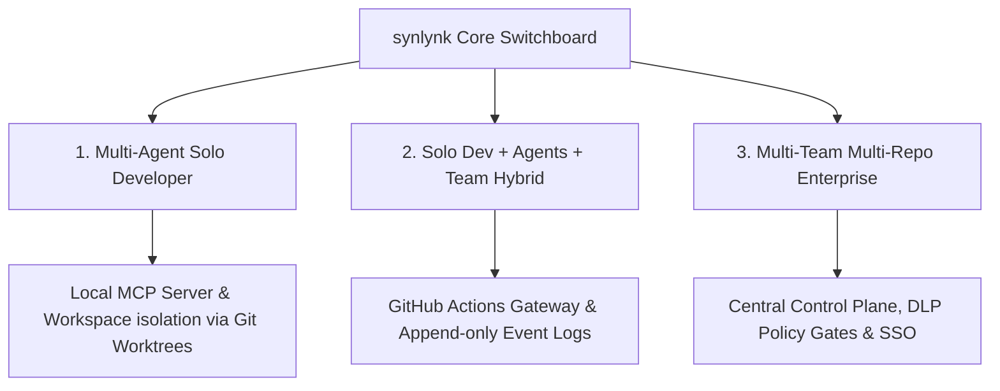

# synlynk: Opportunity Assessment & Architectural Review
**Date:** May 30, 2026  
**Author:** Antigravity (AI Coding Assistant)  
**Status:** Proposal / Architectural Review  

---

## Executive Summary

This document outlines the strategic opportunity and architectural roadmap for **synlynk**, a local-first context coordination and telemetry utility for AI-assisted software development. 

While the initial version (v0.2.2) successfully acts as a stateless session bridge for a single developer, the rapid rise of specialized, autonomous coding agents (such as Claude Code, Gemini CLI, and Codex) creates a significant market opportunity. By transforming synlynk from a simple command-line wrapper into a unified **context coordination engine**, we can bridge the state management gap across diverse AI tools, developer teams, and large enterprise environments.

---

## 1. Deep Repository Review

### A. Goals and Philosophy
* **Context Continuity:** AI tools are naturally stateless across separate CLI invocations or environment changes. synlynk preserves a durable, human-and-AI-readable source of truth in `/project-docs/` (roadmap, active tasks, memory/decisions, and costs) and compiles a machine-optimized context snapshot in `.synlynk/context.md` at session start.
* **Tool-Agnostic Coordination:** Rather than locking developers into a single IDE or provider, synlynk uses universal system prompts (`CLAUDE.md`, `GEMINI.md`, `.cursorrules`) to align multiple distinct AI tools behind a uniform task-checkpoint-and-cost protocol.
* **Local-First, Zero-Dependency Core:** Utilizing Python's standard library with zero external dependencies, synlynk provides a lightweight bootstrap model via `install.sh` that is highly portable, fast, and secure.
* **Cost and Safety Discipline:** Establishes budget constraints (USD limits and request count caps) and leverages a **Flatline Sentinel** to proactively identify repeated command failures (potential hallucination loops) before they consume excessive API quotas.

### B. Existing Functionality (v0.2.2)
Based on an audit of the Python codebase (`bin/synlynk.py`), the currently implemented feature set consists of:

* **`synlynk init [--force]`**: Bootstraps the local workspace files and context configurations (`.synlynk/config.json`) alongside custom AI instructions.
* **`synlynk exec <cmd>`**: Runs wrapped AI commands inside an interactive TTY, tracking execution durations, logging to telemetry, checking budgets, and running sentinel loop checks.
* **`synlynk checkpoint`**: Archives checked-off tasks (`[x]`) from `todo.md` to `project-docs/devlogs/<username>.md`, freshens context, and exports telemetry events.
* **`synlynk watch <start|stop|status>`**: A Unix-only daemon using double `os.fork()` that polls for project changes and dynamically updates the context snapshot.
* **`synlynk status [--json]`**: Renders an inspectable terminal status dashboard or machine-readable JSON structure detailing budgets, active tasks, and team states.
* **`synlynk upgrade`**: Verifies the current release against GitHub API tags and prompts updates.

### C. Future Roadmap (Articulated in Repo)
* **Horizon 1 (Solo Edition):** Real-time automatic token and cost scraping from tool outputs (removing manual logging), scoped context slices tailored per task, and improved shell completions.
* **Horizon 2 (Team Edition):** Append-only event serialization for conflict-free syncing, attribution tracking, and team budget roll-ups.
* **Horizon 3 (Enterprise Edition):** Organizational policy enforcement, centralized compliance logging, SSO, and self-hosted sync relays.

---

## 2. Specific Recommendations for Target User Segments

To fully capitalize on this opportunity, synlynk should expand its capabilities for the following three user profiles:



### Profile 1: Solo Developer Utilizing Multiple AI Agents
* **The Challenge:** Different agents (Claude Code, Gemini, Codex) specialize in different domains (e.g., architecture, frontend, unit tests). Running them concurrently in the same workspace leads to context collision, git conflicts, and redundant token usage.
* **Architectural Recommendations:**
  1. **Local Model Context Protocol (MCP) Server:** Integrate an MCP server directly into `synlynk watch`. This allows modern agents to query task status, architecture decisions, and code state natively using tool calls instead of reading massive raw markdown files.
  2. **Isolated Workspaces (Git Worktree Wrapper):** Introduce `synlynk start --agent <name> --task <id>`. Under the hood, synlynk creates a temporary, isolated Git Worktree (`.synlynk/worktrees/task-id`). This allows a testing agent (Codex) and a backend agent (Claude) to work simultaneously in clean, non-interfering directories.
  3. **Structured Agent Handoffs (`.synlynk/handoffs/`):** Standardize a transition protocol. When a developer switches from Claude to Codex, synlynk automatically compiles a handoff log highlighting edited files, compilation status, missing tests, and unresolved warnings.
  4. **Token Compaction & Scoped Slices:** Allow context generation to be dynamically scoped via `--file` or `--branch`, feeding agents only the lines of code and tasks relevant to the active feature rather than the whole codebase.

### Profile 2: Solo Developer + Agents working in a Hybrid Team
* **The Challenge:** A developer utilizing synlynk + agents works with other team members who do not use the utility. This creates risk for merge conflicts in markdown records (`todo.md`, `memory.md`) and causes asymmetrical tracking when non-adopting members push Git commits.
* **Architectural Recommendations:**
  1. **Append-Only Event Ledger (`events.jsonl`):** Replace raw markdown databases with an append-only JSONL event log. The daemon automatically generates readable markdown views (`todo.md`) from this event stream. This completely eliminates git merge conflicts during concurrent team pushes.
  2. **GitHub Actions Sync Gateway (`synlynk-ci-sync`):** Develop a standard GitHub Action that runs on PR merges. It automatically parses commit messages, PR descriptions, and issue updates from non-adopting teammates and translates them into completed task events and devlog summaries.
  3. **Decentralized Attribution Engine:** Enforce strict git signature mapping. If an agent writes a decision to `memory.md`, synlynk appends `[@git-author/agent-name]` to preserve an audit trail for code review.

### Profile 3: Multi-Team, Multi-Repository Enterprises
* **The Challenge:** Large enterprises need portfolio-level visibility, unified budget controls, compliance logging, and strict data leakage prevention (DLP) to prevent corporate IP from leaking to third-party LLMs.
* **Architectural Recommendations:**
  1. **Central Control Plane & Fleet Manager:** A web dashboard that aggregates local `telemetry.json` events from all corporate machines. Provides managers with centralized metrics on AI spend, velocity, and loop failure rates.
  2. **DLP Policy Gatekeeper:** Implement pre-flight context filters. Before code contexts are sent to an LLM, synlynk automatically scrubs passwords, API credentials, and proprietary code matching enterprise compliance patterns.
  3. **SSO & Corporate Identity Bindings:** Secure CLI credentials and database endpoints behind corporate Okta/Entra ID SSO configurations.
  4. **Enterprise Vector Registry:** A shared semantic search endpoint where developer agents can retrieve global company coding guidelines, compliance standards, and architectural blueprints across separate repositories.

---

## 3. Market Assessment, GTM, and Monetization Strategy

Releasing synlynk commercially requires a **"Developer-Led Open Core"** business model. The open-source CLI generates developer trust, while the paid SaaS tiers address coordination overhead for teams and security audits for enterprises.

```
                  ┌──────────────────────────────────────────────┐
                  │              ENTERPRISE TIER                 │
                  │   SSO, DLP Gates, Central Audit, Fleet Mgmt  │
                  └──────────────────────┬───────────────────────┘
                                         │
                  ┌──────────────────────┴───────────────────────┐
                  │                 TEAM TIER                    │
                  │    Event Log Sync, GitHub Action Gateway     │
                  └──────────────────────┬───────────────────────┘
                                         │
                  ┌──────────────────────┴───────────────────────┐
                  │                 SOLO TIER                    │
                  │   OS CLI, Local Daemon, MCP, Cost Tracking   │
                  └──────────────────────────────────────────────┘
```

### A. Market Assessment
* **The Context Gap:** Almost all venture funding is going into proprietary editors or agent frameworks. A highly valuable gap exists at the **coordination layer**. Developers want tool portability and quota flexibility; they do not want to be locked into a single IDE.
* **Cost Runaway:** Companies adopting developer AI are experiencing "token inflation" and runaway API billing. A local utility that manages context sizes and stops loop failures provides immediate financial ROI.
* **IP Governance:** Corporate legal teams are slowing AI adoption due to compliance concerns. An enterprise tool that filters context and audits agent actions will unlock widespread corporate adoption.

### B. Go-To-Market (GTM) Strategy
1. **Developer Open Source Core:** Focus GTM on the open-source CLI. Build stars, write custom prompt integrations, and index synlynk on registries like Smithery (MCP).
2. **Promoting "Loop Control":** Market the "Flatline Sentinel" features heavily. Developers hate wasting $50 on an agent stuck in a compile loop; synlynk solves this on day one.
3. **Bottom-Up Conversion:** Developers adopt the open-source CLI. When they work in teams, they naturally run into markdown conflicts, creating the perfect upgrade path to the Team (SaaS) sync tier.

### C. Monetization & Revenue Potential
* **Solo Tier (Free):** Open-source CLI, local daemon, MCP, cost logs.
* **Team Tier ($12 / user / month):** Append-only sync database, GitHub Action gateway, conflict resolution, teammate activity dashboard.
* **Enterprise Tier ($39 / user / month):** Multi-repo aggregation, DLP policy gatekeeper, corporate vector registry, SSO, SOC2 compliance logs.

#### Projections (Year 2):
With 50,000 active free users:
* **Team Conversions (1.5%):** 750 developers at $12/month = **$108,000 ARR**.
* **Enterprise Contracts:** 3 mid-market clients (average 150 seats each @ $39/month) = **$210,600 ARR**.
* **Total Projected ARR:** **~$318,600** with high gross margins (as compute and file processing are offloaded locally).

---

## 4. Product Feature Split Matrix

| Category | Feature | Solo (Free Core) | Team (Paid SaaS) | Enterprise (Paid SaaS) |
| :--- | :--- | :---: | :---: | :---: |
| **Context** | Local Markdown Engine (`context.md`) | **Yes** | **Yes** | **Yes** |
| | Scoped Task/File Slicing | **Yes** | **Yes** | **Yes** |
| | Local MCP Server Daemon | **Yes** | **Yes** | **Yes** |
| | Workspace / Git Worktree Management | **Yes** | **Yes** | **Yes** |
| | Multi-Repo Context Aggregator | No | No | **Yes** |
| **Workflow** | `checkpoint` & local devlogs | **Yes** | **Yes** | **Yes** |
| | Conflict-Free Replicated Event Log | No | **Yes** | **Yes** |
| | GitHub Action Auto-Sync Gateway | No | **Yes** | **Yes** |
| | Teammate Activity Status Dashboard | No | **Yes** | **Yes** |
| **Telemetry & Budget** | Local Telemetry (`telemetry.json`) | **Yes** | **Yes** | **Yes** |
| | Flatline Sentinel Loop Stopper | **Yes** | **Yes** | **Yes** |
| | Cloud Cost & Token Analytics Board | No | **Yes** | **Yes** |
| | Automated Organization Budget Caps | No | No | **Yes** |
| **Security & Admin** | Local Directory Config | **Yes** | **Yes** | **Yes** |
| | Shared Encrypted Organization Config | No | **Yes** | **Yes** |
| | Data Loss Prevention (DLP) Content Filter | No | No | **Yes** |
| | SSO / OIDC Authentication | No | No | **Yes** |
| | Unified Central Audit Log / SOC2 Compliance | No | No | **Yes** |
