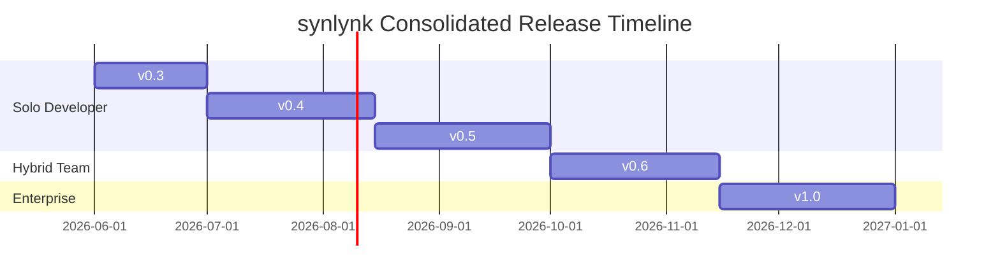

# synlynk: Consolidated Product & Architectural Roadmap
**Date:** May 30, 2026  
**Status:** Proposal / Consolidated Product Strategy  
**Sources:** `agy-synlynk-opportunity-arch-review.md`, `cross-repo-standards-distribution.md`, `rxcc-wow-observations.md`

---

## Executive Context

AI software development has evolved from a single developer chatting with a stateless model to highly complex, multi-agent hybrid workgroups. When developers run multiple specialized agents (such as Claude Code, Gemini CLI, and Codex) across multiple repositories, they encounter severe friction:
1. **Asymmetrical State & Context:** Loss of continuity when switching tools, leading to massive token costs and context reconstruction overhead.
2. **Agent Boundary Violations:** Specialized agents stepping on each other's branch work, overriding intentional code patterns, and bypassing human-in-the-loop controls.
3. **Distribution of Standards:** Difficulty propagating architectural rules, lint standards, and ways-of-working (WoW) constraints across multiple repos.
4. **CI/CD Instability & Loop Runaways:** Stale deployments, missing pre-push type validation, and infinite loops consuming API quotas.

This consolidated product roadmap addresses these challenges. It outlines a modular path to grow synlynk from a single-repo CLI wrapper into a **multi-repo, multi-agent orchestration fabric** across three customer segments:
* **Segment 1: Solo Developers** using multiple agent CLIs.
* **Segment 2: Hybrid Teams** consisting of solo devs, their agents, and non-adopting teammates.
* **Segment 3: Multi-Team Enterprises** managing compliance, spend, and multi-repo architectures.

---

## The Consolidated Release Journey

---

## Horizon 1: The Solo Developer (Core Local Utility)

Focuses on maximizing local workflow execution, safety boundaries, and context efficiency on a single workstation.

### Release v0.3: Trust & Safety Boundaries (Target: July 2026)
*Addresses branch conflicts and loop runaways observed in the S-037 worker CI crisis.*

* **Branch Ownership Enforcement (P0):**
  * Introduce a local branch-naming contract (`feat/claude/*`, `feat/gemini/*`, `test/codex/*`).
  * Enforce local pre-push checks where the synlynk wrapper rejects any commit or push from an agent executing on a branch owned by another agent.
* **Read-Only Reviewer Role Protocol (P0):**
  * Inject strict reviewer constraints into `CLAUDE.md` and `GEMINI.md`.
  * Ensure agents assigned as code reviewers are restricted to inline comments and are blocked from pushing fix commits to the PR author’s branch.
* **`synlynk doctor` Diagnostics (P1):**
  * A single-command troubleshooting tool analyzing shell aliases, PATH setups, git attributes, watcher states, and `.synlynk/config.json` errors.
* **Context size and Token Diagnostics (P1):**
  * Provide `synlynk status` command with approximate token and file-size estimation for `.synlynk/context.md` to prevent context bloating.
* **Structured Cost Insertion (`synlynk cost add` - P2):**
  * Resolves `costs.md` schema drift. Introduce a structured CLI command for adding manual spend records, maintaining strict tabular columns.

---

### Release v0.4: Cross-Repo Standards & Scoped Contexts (Target: August 2026)
*Establishes multi-repo propagation and context intelligence as outlined in the Standards Distribution Proposal.*

* **Global Standards Distribution Engine (P0):**
  * Establish a local substrate directory (`~/.synlynk/standards/`).
  * On every `synlynk exec` or daemon poll, synlynk automatically compiles global behavioral rules, repo-specific overrides, and agent-scoped directives into `CLAUDE.md`, `GEMINI.md`, and `.cursorrules`. No more manual copy-pasting across projects.
* **Observations Inbox Schema (P1):**
  * Create a standard inbox folder (`project-docs/observations-inbox/`). 
  * Permits agents to deposit raw observations and failures (e.g., *Works locally, fails in Docker*) without editing other domains. Synlynk processes this folder and updates global standards.
* **Scoped Context Slicing (P0):**
  * Introduce targeted context generation via `synlynk context --task <id>` or `--changed`. 
  * Slices and injects only files, branch histories, and decisions relevant to the active task, slashing LLM token costs and steering drift.
* **Repo Onboarding Bootstrap (`synlynk onboard` - P1):**
  * A single CLI command to instantly bootstrap any new repository with the necessary directory layout, global instruction mappings, and local watcher registration.

---

### Release v0.5: WIP Signaling & Workflow Automation (Target: October 2026)
*Bridges the gap of invisible agent work and monorepo type-checking.*

* **Live WIP Signals (P0):**
  * Upon running `synlynk start --issue <id>`, synlynk automatically posts a Work-in-Progress comment on the associated GitHub issue, alerting other agents and human developers.
* **Structured Devlog & Task Modifiers (P1):**
  * Provide `synlynk task add|done` and `synlynk devlog add` to let agents and humans modify markdown assets through validated CLI routines, preventing broken syntax.
* **" works locally, fails in Docker" Pre-Push Hook (P1):**
  * Generate automatic pre-commit and pre-push workspace validation checks, forcing monorepo typechecks and builds (e.g., generating Prisma/protobuf schemas) before code leaves the workstation.
* **Task Candidate Recommender (`synlynk next` - P2):**
  * Synthesizes roadmap statuses, blocked task logs, and active issues to recommend the next logical work item.

---

## Horizon 2: The Hybrid Team (Collaborative Cloud Sync)

Focuses on co-existence between high-velocity agents and human developers working across multiple machines.

### Release v0.6: Conflict-Free Logs & Asymmetric Gateways (Target: November 2026)
*Eliminates git-merge hell on markdown documents and integrates non-adopting human teammates.*

* **Append-Only Event Ledger (`events.jsonl` - P0):**
  * Shift the `project-docs/` datastore to an append-only JSONL transaction ledger.
  * Standard markdown files (such as `todo.md` and `memory.md`) become local views dynamically rendered by the synlynk watcher. Resolves merge conflicts on Git.
* **GitHub Actions Sync Gateway (`synlynk-ci-sync` - P0):**
  * Develop a GitHub Action that runs on pull requests.
  * Parses commit history, PR logs, and comments from human developers who do not use the synlynk CLI, converting their changes into sync events to keep the documentation ledger updated.
* **Agent-to-Agent Code Review & Auto-Merge (P1):**
  * Configure automated review pipelines. Claude reviews Gemini's UI PRs; if lint and unit tests pass, and Claude provides an LGTM, synlynk auto-merges minor changes without requiring human intervention.
* **Teammate Activity & WIP Registry (P1):**
  * Collects active branch names and WIP signals from the team, injecting a "Do Not Touch" list of files currently being modified by other agents into the active context window.

---

## Horizon 3: The Enterprise (Governance & Compliance)

Focuses on centralized management, fleet-wide compliance, policy execution, and intellectual property protection.

### Release v1.0: Enterprise Control Plane & DLP Gates (Target: January 2027)
*Unlocks secure, fleet-wide adoption for scale corporate networks.*

* **Data Loss Prevention (DLP) Prompt Gatekeeper (P0):**
  * Runs pre-flight scanning on all code context compiled for LLMs. 
  * Semantically scrubs hardcoded API keys, environment credentials, and proprietary code matching company privacy blocks before it reaches external model endpoints.
* **Central Enterprise Control Plane & Fleet Dashboard (P0):**
  * An administrative web console aggregating telemetry events from all local workstations.
  * Tracks developer velocity, overall API spend, agent success rates, and active loop alerts.
* **Unified SSO/OIDC Gateway & Roles (P1):**
  * Secures developer sessions, budget permissions, and repository contexts behind corporate Okta or Entra ID single sign-on.
* **Fleet-wide Deployment Contract Validator (P1):**
  * A CI/CD yaml linter that enforces secure IaC rules across all corporate repos:
    * Recreating task definitions rather than utilizing basic force deployments.
    * Enforcing pinned pnpm versions and Docker digests.
    * Post-deployment image SHA and curl health verification steps.
* **Shared Enterprise Vector Registry (P2):**
  * Enables agents to pull and search global corporate microservice interfaces, patterns, and style rules across disparate codebases.

---

## Product Pricing & Segment Features

| Segment | Tier | Target Customer | Focus Features |
| :--- | :--- | :--- | :--- |
| **Segment 1** | **Solo (Free Core)** | Individual developers, startup founders, hobbyists. | Local CLI, Local MCP Daemon, Scoped Slices, Branch Protection, Sentinel Loop Stopper, `synlynk doctor`. |
| **Segment 2** | **Team ($12/user/mo)** | High-velocity software teams, agencies, hybrid groups. | Append-Only `events.jsonl` Sync, GitHub Action CI Gateway, Agent Auto-Reviews, Teammate WIP Injection, Shared Budgets. |
| **Segment 3** | **Enterprise ($39/user/mo)**| Tech organizations, finance, healthcare, scale corporations. | Central Fleet Panel, DLP Prompt Filters, Fleet IaC Linter, SSO Integration, Global Vector Registry, SOC2 Auditing. |
