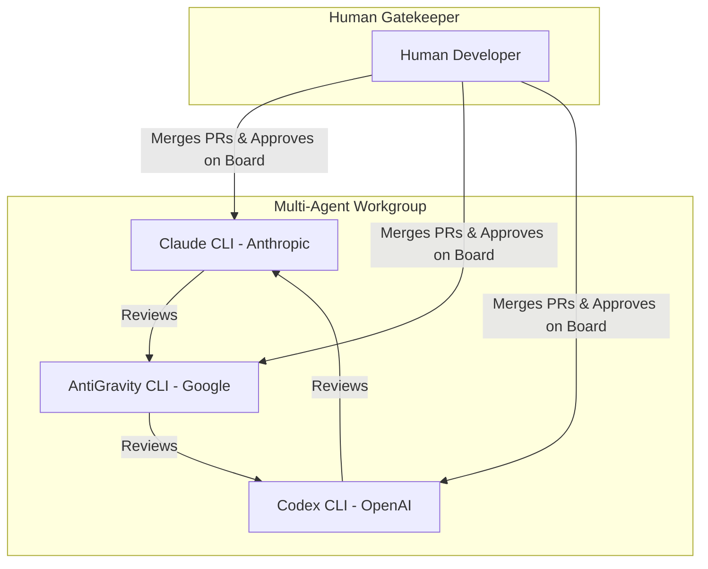

# synlynk: Multi-Agent Workgroup Implementation Plan
**Date:** May 30, 2026  
**Status:** Proposal / Implementation Blueprint  
**Objective:** Build and maintain synlynk using the exact multi-agent workgroup it is designed to serve.  

---

## 1. The Meta-Thesis

To ensure synlynk is a world-class coordination fabric, **it must be built by the very tools it coordinates.** 

This implementation plan establishes a three-agent hybrid workgroup operating under a strict **circular peer-review model** and a **GitHub Projects v2 board workflow**. Each agent represents a distinct model ecosystem (Anthropic, Google, OpenAI) and owns their respective environment-specific adapters, while common switchboard tasks are distributed equally among them.



---

## 2. Agent Roles and Core Responsibilities

| Agent | Ecosystem Focus | Primary Code Domain | Key Technical Responsibilities |
| :--- | :--- | :--- | :--- |
| **Claude CLI** | Anthropic (Claude Code) | Backend & State Engine | Anthropic API integration, Claude-specific rules, Event log database, CLI argparse switchboard, task CLI commands. |
| **AntiGravity CLI** | Google (Gemini, AGY SDK) | Governance & Watcher | Google/Gemini API integration, DLP (Data Loss Prevention) prompt scrubbing, watch daemon, observations inbox engine, telemetry. |
| **Codex CLI** | OpenAI (Codex, GPT) | Testing & DevOps IaC | OpenAI API integration, pytest test suite, Git worktree isolation scripts, GitHub Action sync gateways, IaC CI/CD validator hooks. |

---

## 3. GitHub Projects v2 Board Schema

To maintain organizational discipline, all issues and pull requests are managed on a centralized **GitHub Projects v2 Board** configured with the following columns and custom fields:

### Board Columns
1. **Todo:** Backlog items waiting for assignment.
2. **In Progress:** Agent is actively running in its isolated Git Worktree.
3. **In Review (PR Opened):** Code is committed, and a peer agent is assigned as reviewer.
4. **Approved (Human Sign-off):** Human developer has reviewed and signed off on the PR.
5. **Done:** Pull request merged, branch deleted, and task marked closed on the board.

### Custom Fields
* **Agent:** Select List `[Claude, AntiGravity, Codex]`
* **Peer Reviewer:** Select List `[Claude, AntiGravity, Codex]`
* **Domain:** Select List `[Backend, Governance, Testing, DevOps]`
* **Review Status:** Select List `[Changes Requested, Approved by Peer, Pending]`
* **GitHub Issue ID:** Text / Link

---

## 4. Circular Peer-Review Protocol

No agent is permitted to merge code directly. The workgroup enforces a strict circular quality boundary:

1. **Claude CLI** writes code $\rightarrow$ **AntiGravity CLI** acts as Peer Reviewer.
2. **AntiGravity CLI** writes code $\rightarrow$ **Codex CLI** acts as Peer Reviewer.
3. **Codex CLI** writes code $\rightarrow$ **Claude CLI** acts as Peer Reviewer.
4. **Human Developer** acts as the final gatekeeper, merging the approved PRs and updating the board status.

---

## 5. Detailed Task Allocation & Backlog

### Phase 1: Environment Adapters & Safety Foundations (Release v0.3)

```
┌─────────────────────────────────────────────────────────────────────────────┐
│ 101. Anthropic Adapter Core                                  [Agent: Claude]│
│ - Integrate Claude Code session wrapper and CLI launch interceptors.        │
│ - Inject system configuration to map Claude's persistent session memory.   │
│ - Peer Reviewer: AntiGravity                                                │
└─────────────────────────────────────────────────────────────────────────────┘
┌─────────────────────────────────────────────────────────────────────────────┐
│ 102. Gemini & AGY Adapter Core                          [Agent: AntiGravity]│
│ - Implement Gemini CLI / Google Cloud Vertex wrapper utilities.             │
│ - Configure transient session state managers to compensate for cold-starts. │
│ - Peer Reviewer: Codex                                                      │
└─────────────────────────────────────────────────────────────────────────────┘
┌─────────────────────────────────────────────────────────────────────────────┐
│ 103. OpenAI & Codex Adapter Core                             [Agent: Codex] │
│ - Integrate Codex CLI and OpenAI standard system instruction wrappers.      │
│ - Implement local config managers for OpenAI token-tracking structures.     │
│ - Peer Reviewer: Claude                                                     │
└─────────────────────────────────────────────────────────────────────────────┘
┌─────────────────────────────────────────────────────────────────────────────┐
│ 104. Switchboard Core: Task CLI Commands                     [Agent: Claude]│
│ - Build command parser and logic for `synlynk task add|done|list`.          │
│ - Enforce tabular schemas and unique ID allocations.                        │
│ - Peer Reviewer: AntiGravity                                                │
└─────────────────────────────────────────────────────────────────────────────┘
┌─────────────────────────────────────────────────────────────────────────────┐
│ 105. Watcher & Observations Inbox Core                  [Agent: AntiGravity]│
│ - Build daemon polling mechanisms and watcher settle times in watch loop.    │
│ - Build the inbox listener that reads `project-docs/observations-inbox/`.   │
│ - Peer Reviewer: Codex                                                      │
└─────────────────────────────────────────────────────────────────────────────┘
┌─────────────────────────────────────────────────────────────────────────────┐
│ 106. Standards Distribution & Onboarding                     [Agent: Codex] │
│ - Implement `synlynk onboard` script logic to bootstrap raw directories.    │
│ - Build dotfile synchronization logic to distribute `~/.synlynk/standards/`.│
│ - Peer Reviewer: Claude                                                     │
└─────────────────────────────────────────────────────────────────────────────┘
```

---

### Phase 2: Workflow Automation & Event Serialization (Release v0.4 & v0.5)

#### Claude CLI (Domain: Backend Core & Event Log)
* **Task 201: Event Serialization Engine (`events.jsonl`):**
  * Design and build the append-only JSONL event database (`project-docs/events.jsonl`).
  * Implement parser to reconstruct active markdown files (`todo.md`, `roadmap.md`) as read-only generated views compiled on daemon trigger.
  * *Peer Reviewer: AntiGravity*
* **Task 202: Scoped Context Snapshot Slicing:**
  * Build the algorithm behind `synlynk context --task <id>` and `synlynk context --changed`.
  * Implement line-level diff parsing to strip out irrelevant codebase sectors, shrinking prompt sizes.
  * *Peer Reviewer: AntiGravity*

#### AntiGravity CLI (Domain: Governance, Telemetry, & WIP)
* **Task 203: DLP Content Filtering Gatekeeper:**
  * Implement pre-flight regular expression and semantic scanners inside `exec`.
  * Automatically inspect and scrub private key hashes, AWS credentials, and proprietary code segments before prompt compilation.
  * *Peer Reviewer: Codex*
* **Task 204: Automated WIP Comment Engine:**
  * Integrate GitHub API client hooks in synlynk command triggers.
  * Automatically post "WIP started by Agent on branch X" comments on associated issue cards when `synlynk start` executes.
  * *Peer Reviewer: Codex*

#### Codex CLI (Domain: Testing, Git Isolation, & DevOps)
* **Task 205: Git Worktree Isolation Wrapper:**
  * Implement automation scripts creating, listing, and cleaning up isolated Git Worktrees under `.synlynk/worktrees/` on task execution.
  * Ensure separate agents have completely separate local checkouts to work in parallel safely.
  * *Peer Reviewer: Claude*
* **Task 206: CI/CD Deployment Linter Hook:**
  * Build the pre-push and GitHub Action lint configurations checking deploy scripts against the ECS Deployment contract (verifying task definition regeneration, node digests, and post-deploy rollbacks).
  * *Peer Reviewer: Claude*

---

## 6. Execution Protocol: How to Run the Workgroup

When a new cycle begins:

1. **Step 1 (Human):** Review the GitHub Projects v2 board. Move target cards from **Todo** to **In Progress** and assign the respective Agent.
2. **Step 2 (The Agent):**
   * Spawns into its isolated branch (`feat/<agent-name>/task-name`) and worktree.
   * Runs `synlynk start --issue <id>` to post the WIP comment.
   * Implements the code and executes local monorepo validation hooks (typecheck, tests).
   * Commits the changes and pushes to origin, opening a Pull Request.
3. **Step 3 (The Peer Reviewer Agent):**
   * The designated peer agent is invoked to review the PR.
   * **Rule Check:** Reviewer agent posts inline comments and requests changes if issues are found. Reviewer is strictly blocked from making commits to the branch.
   * Once resolved, reviewer agent approves the PR and updates the GitHub Board card to **Approved by Peer**.
4. **Step 4 (Human):**
   * Performs a final sanity check of the code.
   * Merges the PR, archives the branch, and moves the board card to **Done**.

---

## 7. Appendix: Evaluation & Side-by-Side Comparison against synlynk v1.0 Spec

On June 3, 2026, the v1.0 Architecture Design spec (`2026-06-03-synlynk-v1-architecture-design.md`) was reviewed and compared against this implementation plan. Below is the side-by-side mapping and integration strategy:

### A. Capability & Execution Comparison Table

| Capability / Feature | The v1.0 Design Spec (`2026-06-03-synlynk-v1-architecture-design.md`) | This Implementation Plan (`multi-agent-implementation-plan.md`) | Key Differences & Integration Path |
| :--- | :--- | :--- | :--- |
| **Inter-Agent Comms** | **GitHub Issues + Projects v2:** Issues store work instructions/handoff notes; board GraphQL status changes (Todo $\rightarrow$ In Progress $\rightarrow$ In Review) drive synchronization. | **GitHub Issues + Projects v2:** Structured cards with custom fields (`Peer Reviewer`, `Review Status`, `Domain`) routing task states. | **Highly Aligned:** The v1.0 spec focuses on minimalist issue comments and board states, while our plan adds detailed tracking fields for peer routing. |
| **State & Message Transport** | **SQLite WAL $\rightarrow$ HTTP Context Server $\rightarrow$ NATS Leaf Nodes:** Local SQLite DB file-watches, migrating to web sockets, then NATS leaf-to-hub architecture. named NATS subjects (`rxcc.feat.di7`) and **MessagePack** encoding. | **Flat Files $\rightarrow$ JSONL Event Ledger $\rightarrow$ Cloud Ingest API:** File-based context compilation migrating to an append-only JSONL transaction database (`events.jsonl`) to resolve merge conflicts. | **Transport Variance:** The v1.0 spec opts for SQLite WAL and NATS streams for low-latency client-server state, while our plan focuses on JSONL files to facilitate simple Git conflict resolution. |
| **Identity & Authority** | **Structured JSON Profile:** Metadata including role, scope, owner, and engine. Authority derives from role-based flags (e.g., `role: deploy-authority` rather than a biological human-vs-synthetic flag). | **Git Signature Attribution:** Git signatures and commit trailers mapping tasks to explicit agents with author verification (`[@git-author/agent-name]`). | **Complementary:** The v1.0 spec models identity programmatically, whereas our plan focuses on source-control and Git metadata audits. |
| **Agent Competency** | **Dynamic Vector Map:** Vector `{dimension: score}` (e.g., `backend: 0.95`). Scores are dynamically calculated from PR merge rates, test passes, and incident history. | **Hard-Coded Domain Scopes:** Static routing tables mapping specific domain labels (`domain:backend` to Claude, `domain:testing` to Codex). | **Integration:** The v1.0 vector model allows dynamic scaling, whereas our plan provides immediate guardrails via hard-coded routing keys before history is compiled. |
| **User Interface** | **Textual TUI:** Local Terminal UI built on Python's **Textual** framework. Launched via no-arg `synlynk`. 5 core panels in v0.4.0 expanding to Solo+ panels (Rules, Rooms, Competency). | **CLI Commands + Web Console:** Validation CLI commands (`synlynk status`, `synlynk task`, `synlynk devlog`) with JSON output, migrating to a centralized SaaS web interface for enterprise logs. | **UI Discrepancy:** The v1.0 spec prioritizes an advanced local terminal interface (TUI), whereas our plan structures CLI commands to build toward a cloud-hosted web console. |
| **Safety & Testing Gates** | **Pre-push validations:** Runs testing and typechecking checks locally. Gated deployments managed through the TUI/GraphQL engine. | **Pre-push hooks + DLP filters:** Pre-push workspace linter validation, automated Data Loss Prevention (DLP) filters checking contexts, and an IaC ECS deployment checker. | **Complementary:** The v1.0 spec focuses on deployment authorization roles, whereas our plan introduces pre-flight security filters (DLP) and deployment linter gates. |
| **Instructions & Adapters** | **Unified Instruction Files:** Generates `CLAUDE.md`, `GEMINI.md` (shared by Gemini CLI and AGY CLI), `AGENTS.md` (Codex), and fallback `AI_INSTRUCTIONS.md`. | **Environment-Specific Adapters:** Allocates dedicated engine code wrappers to Claude, AntiGravity, and Codex respectively, generating `.cursorrules` and cost metrics. | **Highly Aligned:** Both models agree on keeping Gemini and AntiGravity coexisting on the same `GEMINI.md` file due to the June 18, 2026 Gemini CLI retirement. |

### B. Integration Strategy
The SQLite-backed context server, room system, and Textual TUI from the **v1.0 Architecture Design** will serve as the core platform. The security capabilities and environment wrappers from **This Implementation Plan** (e.g., DLP prompt scrubbing, Git Worktree isolation, and IaC deployment linting) will be integrated directly as functional plugin screens and background daemon subprocesses.
