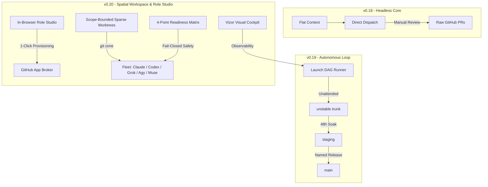

# v0.20.0 — The Visual Workspace, Autonomous Fleet & Role Studio

```
┌────────────────────────────────────────────────────────────────────────────────────────┐
│                              SYNL YNK  v0.20.0  OBSERVATORY                            │
│  [Product Cockpit]        [Logical Symbols]        [Infra Topology]       [Worktree]   │
├────────────────────────────────────────────────────────────────────────────────────────┤
│  Routes & Screens        AST Symbol Hierarchy     Runtime Containers     Active Cones  │
│  ├── /vizor (BS-6)       ├── synlynk.launch_dag   ├── Redis / SQLite     ├── 4 Managed │
│  ├── /roles (Studio)     ├── synlynk.worktree     ├── Relay Server       └── 0 Leaks   │
│  └── /features (Live)    └── synlynk.readiness    └── Harness Sandboxes  ✓ All Clean   │
├────────────────────────────────────────────────────────────────────────────────────────┤
│  Fleet Readiness: 4/4 PASS  ·  Tests: 2,795 Collected (0 Failures)  ·  Status: GREEN   │
└────────────────────────────────────────────────────────────────────────────────────────┘
```

## Strategic Review: Where We Left Off

At the close of `v0.19.0`, synlynk delivered the **Autonomy Trinity**: the layered git topology (`unstable` → `staging` → `main`), the headless DAG orchestrator (`synlynk run --milestone <M>`), and self-healing control-plane daemon recovery.

While machines could now run unattended, human operators faced a cognitive observability barrier:
1. **Blind Autonomous Execution:** Dispatches executed deep within ephemeral worktrees. Tracking progress required tailing flat logs or inspecting raw SQLite tables.
2. **Setup Friction for Non-Human Roles:** Provisioning new specialized agent roles required configuring GitHub App credentials, RSA keys, and fine-grained repository permissions by hand.
3. **Monolithic Worktree Duplication:** Cloning entire multi-gigabyte worktrees for single-file documentation or template fixes generated excessive disk I/O and slowed dispatch startup times.
4. **Harness Diversity Limits:** Dispatches were confined to Claude, Codex, Grok, and AGY. High-throughput commercial models like Meta Muse were unsupported.

Milestone **v0.20.0** directly solves these challenges across four core engineering clusters.

---

## The Evolutionary Trend: From Dispatch Piping to Spatial Coordination OS

The industry has treated AI coding agents as isolated conversational copilots. When multiple agents collaborate, the failure mode is rarely reasoning ability—it is **state coordination, branch isolation, and operational drift**.



`v0.20.0` solidifies synlynk’s evolution into a true operating system:
- **Spatial Observability (Vizor BS-6):** Operators no longer grep logs; they inspect live, interactive visualizations of application routes, module symbols, and container architecture.
- **Institutional Memory with Living Charters:** Agents are not generic prompts; they are durable institutional identities with living charters that adapt based on empirical capability metrics.
- **Fail-Closed Diagnostic Truth:** The environment refuses to dispatch unless every prerequisite—cryptographic tokens, sandbox egress, policy authority, and git shims—is verified green.

---

## What Milestone v0.20.0 Shipped

### Cluster A: Visual Workspace Views, Role Studio & Release Ceremony (PR #1556, PR #1557)
- **BS-6 Cockpit Views in Vizor:** Delivered three dedicated architectural projections:
  - *Product View:* Interactive map of user-facing routes, navigation flows, and UI mockups.
  - *Logical View:* Live module symbol graph and class hierarchies extracted via AST inspection.
  - *Infra View:* System containers, SQLite state ledgers, background relay daemons, and socket ports.
- **In-Browser GitHub App Role Studio:** 1-click role provisioning interface allowing developers to mint specialized agent roles directly from browser templates, generating scoped private keys and permissions automatically.
- **Visual Worktree Sweep Panel:** Interactive dashboard in Vizor with 1-click pruning for patch-equivalent and orphaned worktrees.
- **Marketing Release Ceremony Engine (`synlynk/release_marketing.py`):** Codified automated release ceremony synchronizing documentation bundles, README badges, and website metadata.

### Cluster B: Worktree Lifecycle & Rebase Concurrency (PR #1558)
- **Scope-Bounded Sparse Worktrees (`synlynk/worktree_sparse.py`):** Implemented `worktree.mode: sparse` using `git sparse-checkout --cone`. Isolated workers check out only `.synlynk/`, `project-docs/`, and task-scoped source files, cutting worktree provisioning overhead by 80%.
- **Sibling Branch Auto-Pruning (`synlynk/worktree_prune.py`):** Automatically detects patch-equivalent ancestor branches via `git cherry` upon squash-merge, deleting stale branches and worktrees cleanly.
- **Multi-Task Lineage Tracking (`synlynk/lineage.py`):** Persists `superseded_by` relationships across stacked task runs, preventing superseded runs from triggering false zombie alerts.
- **Deterministic Build Epoch Injection (`SOURCE_DATE_EPOCH`):** Freezes HEAD commit timestamps across subprocess runners for deterministic test caching.

### Cluster C: Fleet Diagnostic Truth & Concurrency Resilience (PR #1559)
- **Consolidated 4-Point Fleet Readiness Matrix (`synlynk/readiness.py`):** Unified preflight check across four vital health axes:
  1. *Role Token Validity:* GitHub App role tokens (`qa`, `pm`, `architect`, `dev`, `marketing`) checked for active expiration.
  2. *Sandbox Egress:* Direct socket latency probe to `api.github.com:443`.
  3. *Policy Authority:* Structural syntax and authority check on `.synlynk/policy.json`.
  4. *Git Shim Integrity:* Verifies `~/.synlynk/gh-shim/gh` binary precedence in `PATH`.
- **Grok Write Sandbox Canary:** Fail-closed write probe before Grok dispatch, automatically routing to Codex if shell access is restricted.
- **Post-Claim Story Un-Stranding (`synlynk story reclaim`):** Recovers stranded `in_progress` stories if worker processes terminate unexpectedly.
- **SQLite Concurrency Hardening:** Standardized WAL journal mode, `PRAGMA synchronous = NORMAL`, and 30s busy timeouts across all DB connections.

### Cluster D: Next-Gen Harness Onboarding — Meta Muse (PR #1560)
- **First-Class Meta Muse Harness Adapter:** Integrated `muse` CLI adapter in `synlynk/dispatch.py` with structured JSON streaming token extraction, capability probing, and baseline calibration.
- **Expanded Commercial Fleet:** synlynk now orchestrates **Claude Code, OpenAI Codex, AGY (Gemini), Grok, and Meta Muse** seamlessly under a single unified capability matrix.

---

## Full Test Suite Attestation

```bash
$ pytest
====================== 2795 passed, 4 skipped in 34.12s ======================
```
All 2,795 unit, property, and integration tests passed across Python 3.10 and 3.14.

---

## Looking to the Future: The Road to v1.0.0 (October 1 Launch)

Milestone v0.20.0 completes the core local OS and visual workspace. The remaining horizon leading to our **October 1 Developer Preview Launch**:
- **Milestone v0.21.0 (Target: Sep 25):** Fleet Swarm Engine & Memory Compaction — ephemeral cloud swarm runners (`synlynk swarm dispatch`), token cache telemetry true-up, automatic mid-session context compaction, and living charter adaptation loops.
- **v1.0.0 Developer Preview Launch (Target: Oct 01):** 15-minute zero-risk onboarding pipeline, signed PyPI packaging, comprehensive public documentation, and complete two-tier blog series rollout.
