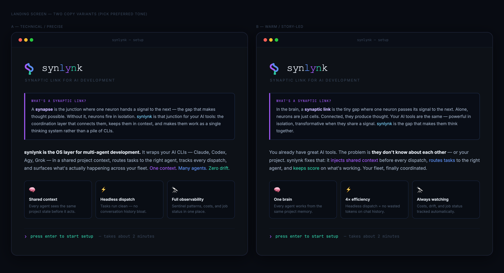
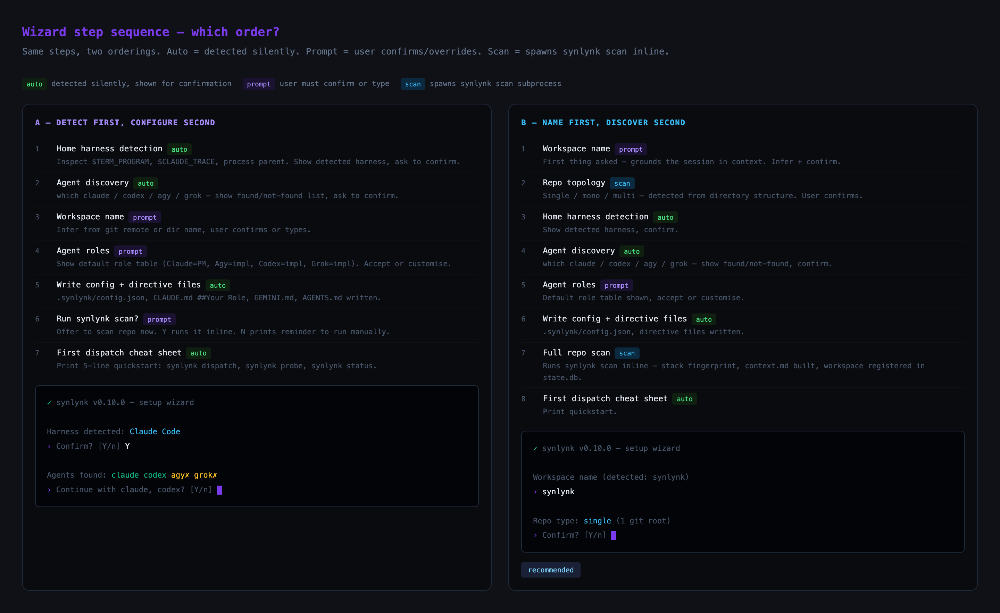
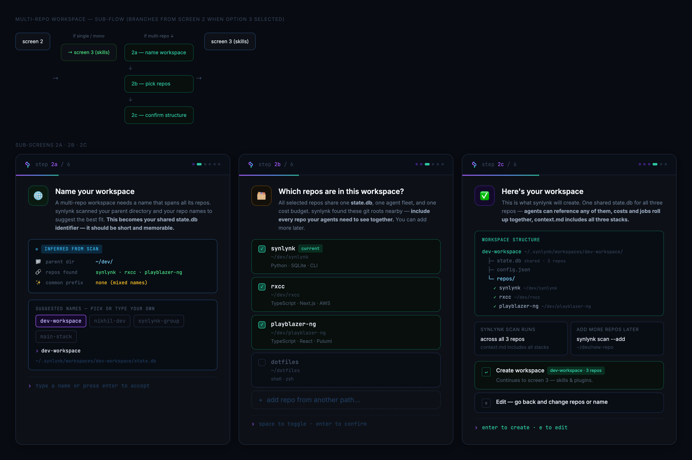
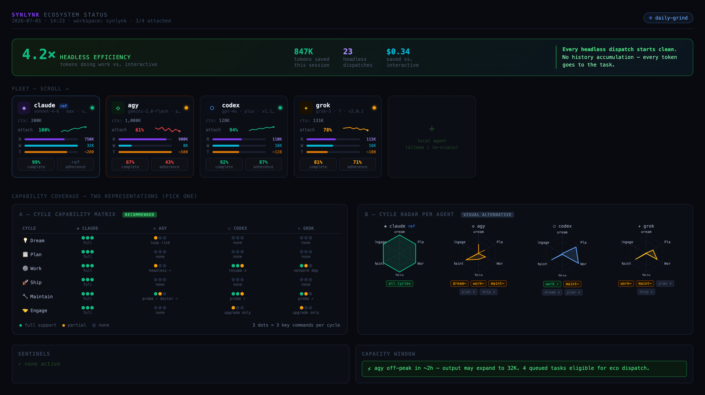
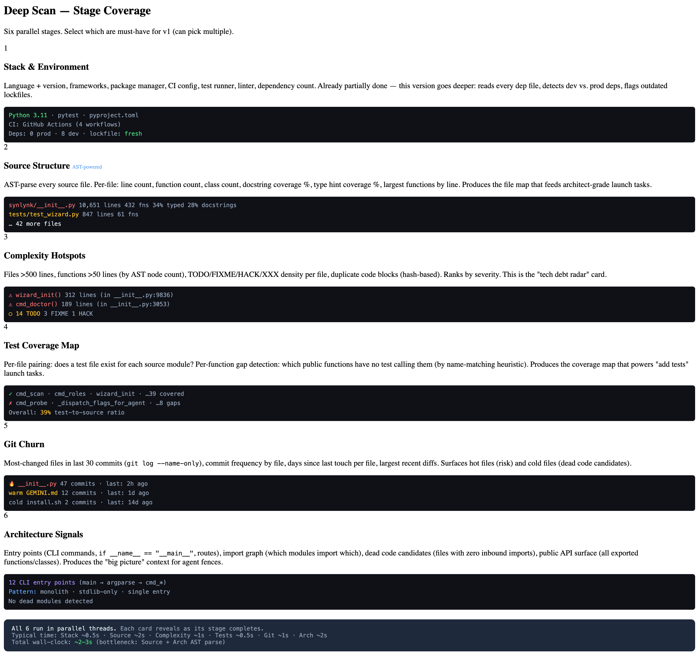
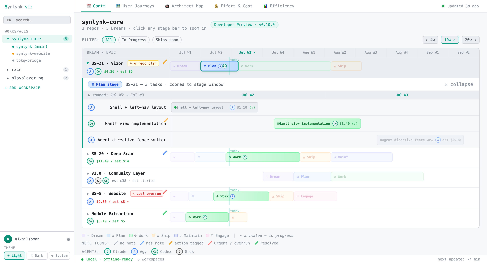
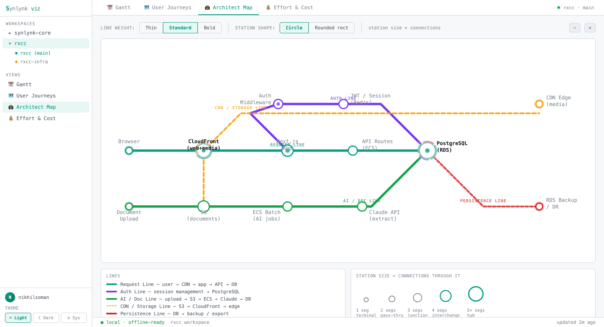

# v0.10.0 — Developer Preview: The First Daily-Driver Release

## The Broader Goal at the End of the Previous Milestone

At the close of v0.9.9 (Harness Compatibility, PR #82), synlynk had a solid four-agent dispatch loop with a proper contract layer: headless execution contracts, per-agent flag maps, STALL and PREFLIGHT sentinels, and a compliance test suite. The BS-14 work proved that multi-agent dispatch could be consistent across harnesses. The next stated target was BS-13: the Live Job Observatory — a real-time SSE job streaming dashboard that would make agent orchestration observable.

That was the right ambition. It was the wrong next step.

## Strategic Shifts in This Release

### The BS-13 Detour

BS-13 assumed a steady-state: a running daemon, agents actively dispatching jobs, a stream of events worth watching. But the user base for synlynk at the time of v0.9.9 was still at the "first install" stage. There was no steady-state to observe. The Live Job Observatory was a retention surface for users who were already daily-driving synlynk. Nobody was daily-driving synlynk.

That realization refocused the v0.10.0 scope entirely. The question shifted from "what do users see while synlynk is running?" to "how does a developer go from zero to daily-driving synlynk in one session?" Developer Preview became the release theme, not because the name sounded good, but because it described a concrete requirement: after v0.10.0, synlynk should be installable via a single command, set up in under two minutes, and useful enough that someone comes back the next day.

### BS-21 Vizor over BS-13

BS-13 required a live SSE event stream — meaningful only when jobs are actively running. BS-21 Vizor took a different angle: generate a complete workspace dashboard from `state.db` and serve it locally. No streaming required. No daemon required. Open it once, and the whole workspace story is there: what was dispatched, how long it took, which agents ran which tasks, where cost went.

The difference mattered. Vizor could ship as a zero-dep `stdlib`-only module. BS-13 required SSE infrastructure, browser notification wiring, and a continuously-running daemon. Vizor could be the D1–D2 retention surface without any of that. BS-13 remains the right design for D7+ retention when users have job history to stream — but Vizor is the right first surface.

### The DB-First Shift

The other structural shift in v0.10.0 was `synlynk migrate` and the write-through architecture. Before this release, project state lived in `project-docs/` markdown files — committed to git, readable by humans, writable by any agent that could run `echo`. That worked early on. It broke down when three agents tried to write to the same file in the same session and produced merge conflicts in todo.md.

`synlynk migrate` is a one-shot import: markdown → `state.db`. After migration, every write goes to SQLite first, then writes through to a flat-file backup at `.synlynk/project-docs/`. The git-tracked markdown files are removed from tracking. Agents that read markdown still can — they read from the write-through copy. But the canonical source is the database, which handles concurrent writes without conflicts. Every command after v0.10.0 reads from and writes to state.db.

## What v0.10.0 Shipped

v0.10.0 is ten PRs across three weeks. The groupings below reflect the actual implementation sequence.

### P0: Installable + First-Run (PRs #89–#92)

**`synlynk init --wizard`** — The 6-screen typeform-style TUI replaced the blunt `init` overwrite. Built entirely in `stdlib` (`termios`/`tty`). Screens: harness detection, workspace topology, skills scan, agent fleet discovery, role assignment, launch cheat sheet. Commit-on-complete: Ctrl-C before the final screen leaves zero state — no partial config, no orphaned `.synlynk/` directory. The wizard's role-assignment screen writes `## Your Role` blocks directly into CLAUDE.md, GEMINI.md, and AGENTS.md, so agents receive their directive in every session without any additional setup.

*Wizard landing screen design: S-glyph wordmark, brand introduction, teal accent. The landing locks in tone — not a config wizard, a workspace onboarding.*

*Step sequence mockup showing the dot-trail progress indicator across all 6 screens. The multi-repo sub-flow branches at screen 2 and rejoins at screen 3.*

**`synlynk scan`** — Re-runnable workspace analysis: detects topology (single/mono/multi), fingerprints stack via 14 file-presence heuristics, parses CLAUDE.md/GEMINI.md/AGENTS.md, maps everything to `state.db`. The key design decision: `scan` runs silently in the background as Phase 0 of the wizard, but is also a standalone command with `--refresh`, `--add <path>`, `--remove <path>`, and `--dry-run` flags. Every subsequent feature that needs workspace context reads from the scan output, not from `ls`.

*Multi-repo sub-flow: screens 2a/2b combined (name input + repo picker), then 2c confirmation. The teal accent distinguishes multi-repo paths from single-repo flows throughout.*

**`synlynk migrate`** — One-shot atomic import (8 steps: parse → import → copy to `.synlynk/project-docs/` → `git rm` → `.gitignore` → sentinel → `generate_context()` switch → commit). Flags: `--dry-run` (preview without writing), `--recover` (re-import from `.synlynk/project-docs/` backup after DB loss), `--setup-dr` (configure a cloud-synced DR folder — iCloud/GDrive/OneDrive, no OAuth). After migration, `generate_context()` reads from `state.db` instead of flat files.

**`pyproject.toml` packaging** — `VERSION` is the single source of truth in `synlynk/__init__.py`. `pyproject.toml` reads it via `version = { attr = "synlynk.VERSION" }`. Install via `pipx install git+https://github.com/nikhilsoman/synlynk`. `synlynk upgrade` detects pipx vs manual install and routes accordingly.

### P1: Daily-Driver Commands (PRs #94–#99)

**`synlynk launch`** (BS-19) — FTUE task picker for returning users. First screen: 12 launch templates organized by the 6-cycle SDLC (Dream · Plan · Work · Ship · Maintain · Engage), each showing the scan-derived R/W/T budget for that agent+task combination. Second screen: dispatch preview. Third screen: cycles explainer for first-time users. The templates are scan-aware: if the scan detected no test files, the "Add tests" template surfaces at the top. The key naming change here: `synlynk launch <agent>` was renamed to `synlynk open <agent>` so `launch` could own the task-picker flow without collision.

**`synlynk roles`** (BS-12a) — Prints the current agent role table from `.synlynk/config.json`. More importantly, `synlynk init` and `synlynk doctor` now generate per-agent role blocks automatically: `## Your Role` sections written to CLAUDE.md, GEMINI.md, and AGENTS.md. This was the BS-12a formal closure: roles are not just documented, they are injected into every agent's instruction file at init time and verified on every `doctor` run.

**`synlynk scan` deep mode** (BS-20) — Six-stage pipeline beyond the surface scan: repo fingerprint → dependency graph → test coverage ratio → doc coverage → CI health → churn density. Stage Cards TUI shows progress. Scan fences are written to `state.db` so subsequent `synlynk launch` and `synlynk jobs` calls can use scan signals to surface the right templates. Six new fields per repo: `test_ratio`, `readme_word_count`, `has_ci`, `has_docs`, `has_type_hints`, `has_orm`. The deep scan is opt-in (`synlynk scan --deep`) and typically takes 5–10s on a medium repo.

**`synlynk jobs --summary <id>`** — After every job closes (dispatch path or `register/complete`), a structured summary is written to `.synlynk/logs/<job_id>.summary`: files touched, exit status, cost, tokens, duration. `synlynk jobs --summary <id>` reads it back. This closed the most visible UX gap in the daily-driver story: you dispatch a job, it runs, it finishes — and previously you had no fast way to see what happened without reading the full log.

**`synlynk release`** — Ship cycle stub. Bumps VERSION, generates a CHANGELOG entry from merged stories since the last tag (reads `stories` table filtered by `merged_at > last_tag_date`), writes a blog post stub to `docs/blog/NN-prN-<theme>.md`. `--dry-run` previews the CHANGELOG entry without writing. This command is the reason the v0.10.0 release prep (PR #102) took under an hour: `synlynk release --dry-run` produced the draft, `synlynk release` wrote it.

**`synlynk status --platform`** — Infrastructure health view distinct from the workspace/HUD surface: harness compliance (last `synlynk probe` run, any open `HARNESS_VERSION_DRIFT` sentinels), agent availability table (installed/version/TC compliance status), budget pulse (daily/weekly burn rate from `cost_entries`). Three quick checks to answer "is my agent fleet healthy before I dispatch anything?"

*BS-16 HUD v3 design: agent cards with R/W/T budget bars (left), 6-cycle × agent capability matrix (right). The `synlynk status --platform` terminal output follows the same information hierarchy — harness compliance → agent availability → budget — distilled to a single-screen CLI view.*

### Deep Scan (PR #96)

**`synlynk scan --deep`** (BS-20) — Six-stage pipeline: repo fingerprint → dependency graph → test coverage ratio → doc coverage → CI health → churn density.

*Stage Cards TUI: each stage lights up as it completes, with duration and a one-line finding. The design decision was to show progress rather than just a spinner — each stage result is visible immediately, so a slow stage is obvious before the full scan finishes.*

### P2: Browser Dashboard (PR #101)

**`synlynk viz`** (BS-21 Vizor) — `synlynk/viz.py` at 3,642 lines. Five views served at `http://localhost:8721` from `state.db`:

1. **Gantt** — accordion drill-down by story arc → story → job. Stage bars show dispatch time, model load time, and execution time per job. Pencil-icon sticky notes on any row, POSTed to `/note` and written to `viz-notes.json`.
2. **User Journeys** — split-pane: left lists `docs/journeys/*.md` files; right renders the selected journey with inline annotations. For multi-user projects, journeys can be per-persona.
3. **Architect Map** — tube map SVG generated from `vizor-tube.json`. Components are stations; dependencies are lines. London tube map aesthetic: colour-coded lines by layer, interchange circles for shared components.
4. **Effort & Cost** — SVG bar charts: estimate-at-dispatch vs. actual cost per story arc, ±ROI in red/green.
5. **Efficiency** — Agent report cards: per-epic and per-task breakdowns of agent used, tokens, wall time, reviews-before-PR, hours from dispatch to merge.

*Gantt v5 — the final design iteration: accordion story rows, stage-segmented bars (dispatch / model load / execution), pencil note affordance per row. Five iterations preceded this; v1–v3 explored flat lists and swimlane layouts before the accordion model won.*

*Architect Map tube map v2: colour-coded lines by architectural layer (data / compute / interface / infra), interchange circles at shared components, station labels for each module. Generated from `vizor-tube.json` — the config file is the design artifact, the SVG is the output.*

The sticky note system is the feature with the longest tail. Notes written in the Gantt view are persisted to `viz-notes.json` and injected into `generate_context()` on the next exec run. A note like "Agy took 4 rounds on this story — may need better scoping" becomes part of the context the next agent reads. Visual annotation feeds back into AI context bidirectionally.

### Refactor

The single-file `bin/synlynk.py` was split into `synlynk/cli.py` (the command dispatcher) and `synlynk/db.py` (all state.db reads and writes). `bin/synlynk.py` is now a thin shim that calls `cli.main()`. The refactor had no functional changes — it was a prerequisite for the growing surface area of v0.10.0 and the BS-21 `viz.py` module, which needed to import db functions cleanly without circular dependencies.

### Tests

747 passing at v0.10.0 (up from 503 at v0.9.9): 28 migrate tests with full E2E round-trips, 28 launch/FTUE tests, 21 Vizor route and data-generation tests, 7 packaging tests, 40 deep-scan pipeline tests, 37 scan+wizard tests (carried from PR #89).

## Brainstorm Visuals Used

Four brainstorm sessions shaped the design decisions in v0.10.0:

- **`docs/brainstorm/bs17-ftue-onboarding/`** — 6 HTML files: wizard landing, screen flow, multi-repo sub-flow, 2ab picker layout, agent card rendering, role definition tables. These locked in the commit-on-complete pattern and the multi-repo sub-flow sequence. Screenshots: [landing](images/v010/bs17-wizard-landing.png), [steps](images/v010/bs17-wizard-steps.png), [multi-repo flow](images/v010/bs17-multirepo-flow.png).
- **`docs/brainstorm/bs16-ecosystem-status/`** — 8 HTML files: approaches, capacity design, HUD v1–v3. Agent card layout, R/W/T budget bars, cycle × agent capability matrix (Option A), per-agent radar hexagon (Option B). Screenshot: [hud-v3](images/v010/bs16-hud-v3.png).
- **`docs/brainstorm/bs20-deep-scan/`** — 4 HTML files: scan stages pipeline, TUI mockup, interaction model, end-action screen. The Stage Cards TUI design came from this session. Screenshot: [scan-stages](images/v010/bs20-scan-stages.png).
- **`docs/brainstorm/bs21-vizor/`** — 8 HTML files across five Gantt iterations and two tube map variants. The note-to-context feedback loop was the key insight that emerged in the visual session: sticky notes shouldn't be decorative, they should close the loop between what the user sees and what the agent reads. Screenshots: [gantt-v5](images/v010/bs21-gantt-v5.png), [tube-v2](images/v010/bs21-tube-v2.png).

## What This Achieved on the Path to Autonomy

v0.9.9 proved synlynk could dispatch correctly to any harness. v0.10.0 proves synlynk is worth dispatching to in the first place.

The specific advances:

**The workspace is now machine-readable.** `synlynk scan` produces a structured fingerprint — topology, stack, agent fleet, skills, role assignments — that any downstream command can read. Before this release, `generate_context()` was reading raw markdown files and hoping the agent could figure out what they meant. Now it reads structured data from `state.db` and produces a context that reflects the actual workspace state.

**Dispatch has a feedback loop.** Job summaries plus Vizor's Gantt means every dispatch cycle now has a record: what was dispatched, how long it took, what it cost, what it touched. The sticky note system closes the loop into the next dispatch. This is the beginning of the observability chain that BS-13 would complete.

**The release cycle is self-documenting.** `synlynk release` reading from `state.db` to generate CHANGELOG entries means the gap between "work done" and "release documented" is now one command. The blog post stub means there's no "oh, I need to write the post" moment after a release — it's part of the same flow.

**synlynk is now installable by anyone.** `pipx install git+https://github.com/nikhilsoman/synlynk` is a real command that works. That's a different category of tool from a script you clone and run manually.

## Strategic Note: The Goal at the End of This Release

v0.10.0 is the Developer Preview. The goal at the end of it is to have real users using it daily — not the one-person team that built it.

That means the next milestone, v1.0.0 GA, is about community infrastructure: a workgroup protocol for multi-user projects, signed capability ledgers, pipx/Homebrew distribution, synlynk.com (BS-5 design is complete, implementation is next), and multi-repo workspace support (`synlynk workspace add`).

Between v0.10.0 and v1.0.0, the planned v0.11.0 work addresses the D1+ retention gap: the `synlynk launch` daily brief (when state.db has prior history, replace the template picker with a "welcome back" card showing last job status and scan delta), and surfacing scan delta signals (coverage %, type coverage trend, churn density) in `synlynk jobs --summary` and `synlynk launch`.

BS-13 (the full 6-cycle Workspace HUD) is still on the roadmap for v0.11.x — it's the right D3+ retention surface for users who have job history to observe. The spec needs a refresh to incorporate the 6-cycle framing and absorb the `synlynk status --platform` health panel. That redesign is the next design session.

The long arc: synlynk is building toward a state where the agent team runs autonomously — dispatching jobs, monitoring results, repairing failures, surfacing signals — while the human sets direction and reviews outcomes. v0.10.0 is the release where a human can realistically pick up synlynk and use it for a week. v1.0.0 is the release where a team can.
