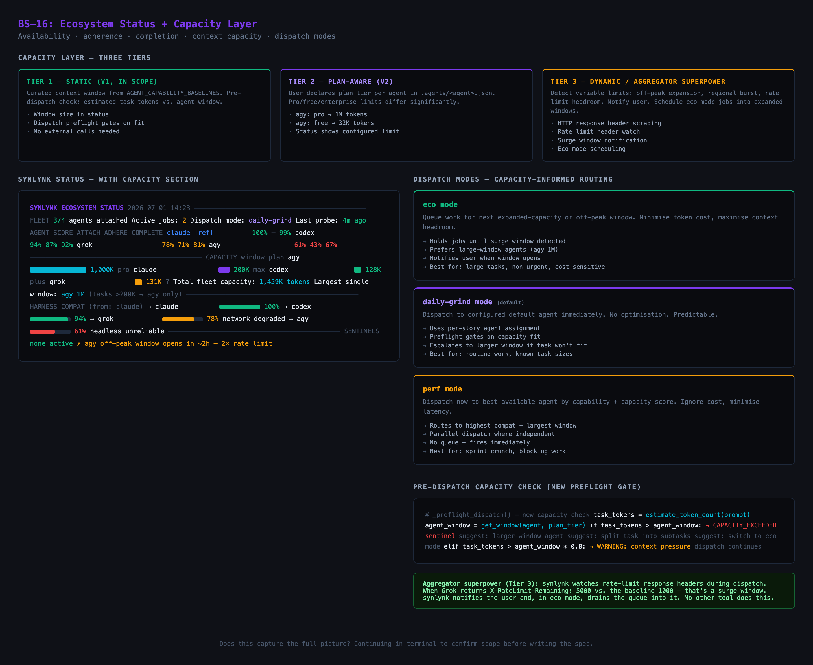
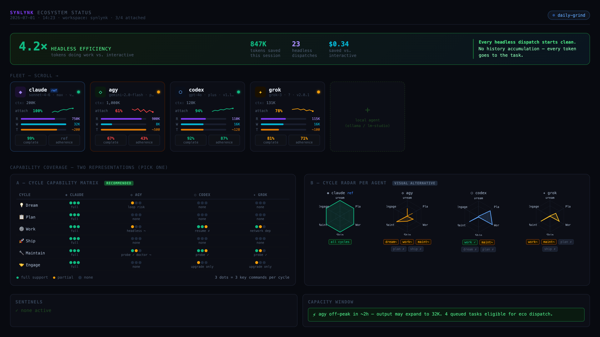

## The Broader Goal at the End of the Previous PR

At the close of PR #106 (Workspace HUD), synlynk had a functional terminal observer via `synlynk watch` and the beginning of a cycle-aware dispatch model (recording a `cycle` field on each job). However, the harness was still largely blind to the operational boundaries and capacity limits of its agent fleet. We had binary compliance scores, but lacked a formal way to measure whether an agent was capable of executing a specific phase of the 6-cycle SDLC (Dream, Plan, Work, Ship, Maintain, Engage) or if a proposed dispatch would overrun its context window or token limits. 

For the dispatch loop to be truly robust, the scheduler needed a detailed, capacity-aware routing engine that could validate dispatches *before* they booted up an agent process.

## Brainstorm Visuals Used

Design exploration for the ecosystem status HUD — capacity cards, cycle matrix, and compatibility scoring options:

Full brainstorm HTML: [`docs/brainstorm/bs16-ecosystem-status/`](../brainstorm/bs16-ecosystem-status/)

## Strategic Shifts in This PR

The core shift in BS-16 is moving from an execution engine to an **instrument panel**. In order to achieve autonomous multi-agent dispatch, the harness cannot treat guest agents (Claude, Agy, Codex, Grok) as opaque CLI wrappers. It must be self-aware of its own fleet's capabilities and current operating envelopes. 

By introducing preflight capacity gates and a structured capability matrix, synlynk begins to act as a true operating system kernel—preventing resource exhaustion, validating API limits, and directing agent execution based on empirical capacity data rather than static assumptions.

## What This PR Shipped

This PR introduced a new capacity reporting stack and telemetry-driven gates:

- **Ecosystem Status Command (`synlynk status`)**: A new CLI surface displaying attached fleet counts, active dispatch mode, agent version/drift alerts, capacity metrics (read/write/tool/context), and the cycle capability matrix.
- **Stable JSON Contract (`synlynk status --json`)**: Implemented a stable JSON output format for downstream consumers—specifically the Vizor web interface—to prevent parsing changes from breaking the dashboard.
- **Database Schema Upgrades (`synlynk/db.py`)**: Added two new tables to `state.db`:
  - `harness_status`: Tracks per-agent attach status, version details, token/tool budgets, and compliance test results.
  - `cycle_capability`: Aggregates the `harness_verb_map` to determine support status (`full`, `partial`, or `none`) for each of the 6 SDLC cycles.
- **The `synlynk/status.py` Module**: Implemented core logic for:
  - Token pressure estimation (`estimate_dispatch_tokens`): Simulates input size based on context and prompt word counts, and predicts output based on coarse task classification (`implement`, `plan`, `test`, etc.).
  - Headless efficiency ratio (`_headless_efficiency_ratio`): Computes the cost-benefit ratio of running headless dispatches versus interactive developer sessions.
  - Capability aggregation (`_compute_cycle_capability`): Translates verb mappings to cycle capabilities.
- **Preflight Capacity Gates (`synlynk/dispatch.py`)**: Implemented three new gates triggered during `_preflight_dispatch` to halt or warn before execution:
  - `CAPACITY_EXCEEDED_INPUT`: Rejects dispatches where estimated context size exceeds the agent's read budget.
  - `CAPACITY_EXCEEDED_OUTPUT`: Rejects dispatches where estimated task output exceeds the agent's write budget.
  - `TOOL_PRESSURE`: Triggers a sentinel warning if predicted tool usage exceeds 70% of the agent's capacity limit.

### Key Bug Fixes in PR #110
- **`db_conn=None` Preflight Bypass**: During the initial R1 code review, a critical bug was found: `dispatch_agent()` was passing `db_conn=None` to `_preflight_dispatch()`, which silently skipped all DB-backed capacity and telemetry checks. This was resolved by properly opening a connection via `_get_db()` before executing preflight, and adding a regression test.
- **Agy Write Budget Baseline**: Corrected Agy's `write_budget_tokens` from 8K to 65K. Because Agy operates in a persistent loop, the 8K limit represented a single-response barrier rather than its true multi-turn CLI session capacity.

## Test Approach

We verified the capacity engine and database migrations with 22 new tests in `tests/test_ecosystem_status.py`:
- Schema integrity tests ensuring the new tables exist and migrations are fully idempotent.
- Unit tests verifying the token pressure estimator under different task classifications and prompt contexts.
- Integration tests ensuring `_preflight_dispatch()` properly flags input/output overflows and raises `TOOL_PRESSURE` alerts.
- A regression test (`test_preflight_receives_real_db_conn`) to guarantee the database connection is never dropped during preflight routing.

## What This Achieved on the Path to Autonomy

Before PR #110, an agent running out of context window or hitting a token quota would simply crash mid-task after spending minutes of execution time and costing real dollars. 

With this PR, the harness is now **self-aware of its fleet's envelope**:
1. **Preventative Control**: The harness intercepts invalid dispatches before any API calls are made, preserving token budget and preventing headless lock-ups.
2. **Dynamic Routing**: By mapping verbs to the 6-cycle SDLC matrix, the scheduler can dynamically route tasks to the best-suited, compliant agent available for that specific phase of development.
3. **Observability Foundation**: Calculating the headless efficiency ratio and output velocities gives us concrete metrics to optimize the dispatch loops for cost, speed, and accuracy.

## Strategic Note: The Goal at the End of This PR

Now that the status data layer is locked in and exposed via `synlynk status --json`, the next goal is to surface this information graphically. We need to enrich the Vizor browser dashboard's **Efficiency** tab with this ecosystem status data, rendering capacity progress bars and the 6-cycle capability matrix visually to complete the PM instrument panel.
