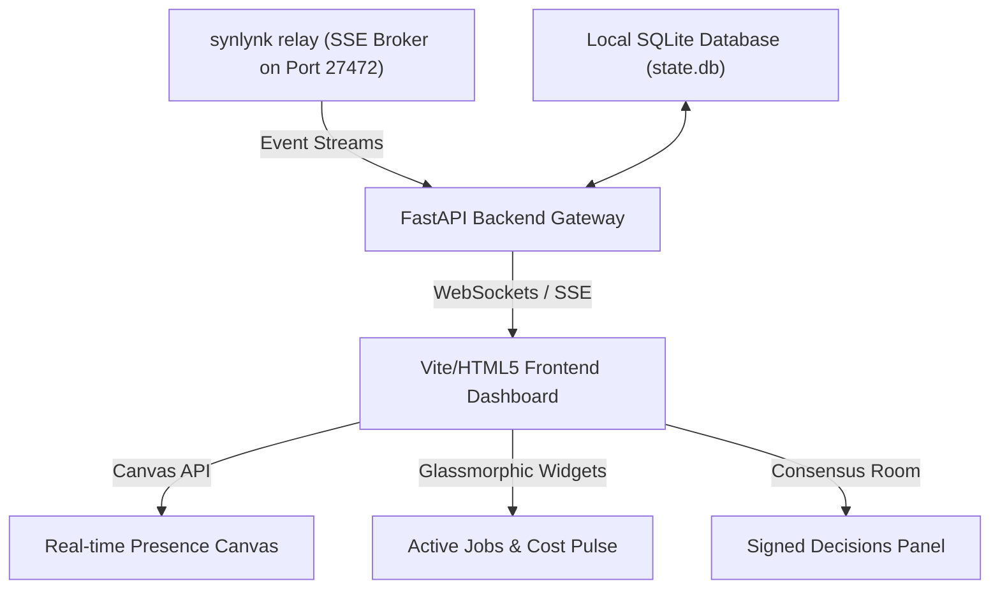

# End-to-End Product Build: PulseSpace

**PulseSpace** is an ambient, real-time collaboration canvas and team pulse dashboard designed for human-agent hybrid teams. It serves as a beautiful web-based interface that visualizes active work, team member presence (including dispatched agents), and cryptographic consensus events.

---

## Why this Product?
PulseSpace is the ultimate showcase for a multi-agent workgroup because:
1. **Real-Time Integration:** It consumes Synlynk’s SSE relay broker (`synlynk relay`) to stream live telemetry, job statuses, and consensus events directly to a web dashboard.
2. **Visual & Aesthetic Appeal:** It utilizes modern styling (glassmorphism, CSS grid layouts, smooth animations) to represent active work pulses.
3. **Cross-Discipline Skills:** It requires backend engineering (FastAPI, SQLite, SSE), frontend design (Vanilla JS, interactive Canvas, responsive charts), and rigorous QA (Playwright/E2E test suites).
4. **Authentic Team Play:** It exercises all agent roles (Architect, Backend Builder, Frontend Designer, QA Verifier, and Docs/Release Writer) in a highly coordinated, multi-session flow.

---

## System Architecture

---

## 6-Session Implementation Roadmap

This roadmap is designed to run over multiple workgroup sessions, switching branches, roles, and tools as the product takes shape.

### Session 1: strategic Architecture & Planning
* **Primary Agent:** Claude (Architect / PM)
* **Goal:** Establish the specification, schema, and API contracts.
* **Deliverables:**
  * System Design spec: `docs/superpowers/specs/pulsespace-architecture.md`.
  * Implementation Plan: `docs/superpowers/plans/pulsespace-session-plan.md`.
  * SQLite schema design for active workspaces and user sessions.

### Session 2: Backend Core & SSE Relay Gateway
* **Primary Agent:** Codex (Backend Builder)
* **Goal:** Spin up the FastAPI server, SQLite database, and integration with the Synlynk SQLite state.db.
* **Deliverables:**
  * Python FastAPI server with endpoints for workspaces, active tasks, and team members.
  * SSE Relay consumer that listens to Synlynk's event broadcaster (port 27472) and updates the local SQLite cache.

### Session 3: Visual Design & Responsive Frontend
* **Primary Agent:** Agy (Frontend Designer)
* **Goal:** Build a gorgeous, responsive single-page web dashboard using CSS glassmorphism, HSL custom colors, and CSS grid.
* **Deliverables:**
  * `index.html` and `style.css` following premium, dark-mode design standards.
  * Interactive SVG/Canvas workspace view showing connected human/agent nodes.
  * Real-time charts visualizing cost velocity (burn rate) and token counts.

### Session 4: Real-Time Event Integration
* **Primary Agent:** Codex & Agy (Hybrid Collaboration)
* **Goal:** Wire up the frontend components to consume the backend SSE streams, animating UI widgets in response to real-time agent dispatch events.
* **Deliverables:**
  * Javascript SSE subscriber hook updating active job cards and budget dials instantly when `synlynk dispatch` runs in the background.
  * Consensus Room overlay showing popups whenever `synlynk decide` triggers a vote.

### Session 5: QA, Test Automation & Sentinel Setup
* **Primary Agent:** Grok / Codex (QA Verifiers)
* **Goal:** Write unit and E2E integration tests to ensure data consistency, access rules, and responsive state logic.
* **Deliverables:**
  * Pytest test suite for FastAPI routers and database persistence.
  * Playwright/Selenium frontend verification tests.
  * Integration of a custom **Synlynk Sentinel check** that blocks pipeline deployment if UI accessibility audits score below 90%.

### Session 6: Handoff, Documentation & Launch
* **Primary Agent:** Claude (Docs Keeper / Marketing)
* **Goal:** Create the user documentation, setup instructions, and the release blog post.
* **Deliverables:**
  * Complete [README.md](file:///Users/nikhilsoman/dev/synlynk/README.md) updates.
  * Launch blog post in `docs/blog/` highlighting the team's cooperation.
  * Handoff manifest.

---

## How It Showcases Multi-Agent Cooperation

* **Strict Boundary Enforcement:** Agents work on designated branches (`feat/claude/*`, `feat/agy/*`, `feat/codex/*`). If Codex tries to push to Agy’s design branch, Synlynk raises a boundary violation alert.
* **Cryptographic Signatures:** During Session 4, when the team holds an arbitration vote on whether to use SQLite WAL mode, the agents sign their votes using their Ed25519 machine keys. The dashboard renders these signatures live as proof of consensus.
* **Tool-Agnostic Hand-offs:** Between Session 3 (Design) and Session 4 (Integration), the work transitions from design tools to code IDEs. Synlynk’s shared context files ensure the design rules, tokens, and active tasks transfer perfectly.
