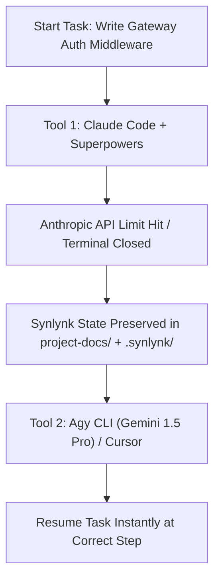

# Showcase Project: Synlynk Trio-Orchestration Demo (`trio-orch-demo`)

This document outlines a showcase project designed to demonstrate **Synlynk's** capabilities as a **Multi-Agent Coordination OS Substrate** compared and integrated with application-level frameworks like **Superpowers** and **GStack**.

---

## The Core Premise: OS vs. Application

In our positioning framework, **Superpowers** and **GStack** are not competitors; they are **applications** (or skill packs) running on top of **Synlynk (the OS substrate)**:
* **Superpowers** provides localized task execution and skills.
* **GStack** provides a structured persona-shifting pipeline (CEO $\rightarrow$ EM $\rightarrow$ QA) for Claude Code.
* **Synlynk** provides the underlying filesystem, memory layer (`project-docs/`), safety sentinels, cost telemetry, and multi-agent routing.

By running Superpowers and GStack on Synlynk, developers gain persistence, budget safety, and tool interoperability for free.

---

## The Showcase Repository: `trio-orch-demo`

The showcase project is a microservice-based system containing:
1. **`auth-service` (Node.js/TypeScript):** Backend service managing JWT authentication.
2. **`gateway-service` (Python/FastAPI):** API Gateway routing traffic to the auth service.
3. **`shared-db` (SQLite):** Shared local database with migration scripts.

This multi-service setup is optimized to highlight Synlynk's cross-repo workspace capabilities, which both Superpowers and GStack lack.

---

## Three Live Demo Scenarios

### Demo 1: The "Quota Swap & Shell Hop" (State Continuity)
This demo showcases Synlynk's ability to act as a **universal context switchboard** across different developer tools and AI models.



* **The Setup:** Start implementing FastAPI auth middleware in `gateway-service` using Claude Code with a Superpowers planning skill.
* **The Break:** Mid-way through the task, simulate an API quota limit exhaustion or abruptly close the terminal.
* **The Resume:** Open the **Agy CLI (Gemini)** or **Cursor** in the same workspace.
* **The Result:** 
  * With GStack/Superpowers alone, your session context is trapped and lost.
  * With Synlynk, the new tool automatically reads the `.synlynk/context.md` snapshot and `project-docs/todo.md`. The next agent resumes coding from the exact line where the previous agent stopped.

---

### Demo 2: The "Broken Build" Loop Defense (Flatline Sentinel)
This demo showcases Synlynk's **Safety Sentinel** detecting loop failures and saving token costs.

> [!IMPORTANT]
> Standard agent shells will recursively run a failing compile/test command, hoping to fix it, until the token budget is completely exhausted.

* **The Setup:** Intentionally introduce a circular dependency or TypeScript type-narrowing failure in `auth-service` that breaks the test suite. Trigger an autonomous task to fix it.
* **The Behavior:** Run GStack, Superpowers, and Synlynk on the broken build.
* **The Result:**
  * **Superpowers / GStack:** Keep executing `pnpm test` and rewriting files in a loop, consuming thousands of input/output tokens.
  * **Synlynk:** The **Flatline Sentinel** monitors execution logs. After 3 consecutive test failures with identical outputs, it flags a `FLATLINE` critical alert, kills the background job, and alerts the developer:
    ```bash
    [CRITICAL] [2026-06-27T20:25:00] CODE: FLATLINE
    Alert: 3 consecutive compilation/test failures detected in job-e5cc49f0.
    Execution halted to preserve token budget. Run 'synlynk sentinel clear' to resume.
    ```

---

### Demo 3: Multi-Agent Parallel Dispatch & signed Consensus
This demo highlights Synlynk's coordination layer resolving race conditions and managing agent boundaries.

* **The Setup:** Dispatch two agents concurrently:
  1. **Codex (`feat/codex/db-migration`):** To add a `roles` table to the database.
  2. **Agy (`fix/agy/gateway-claims`):** To read roles from user JWTs in the gateway.
* **The Coordination:**
  * **Scoped Context:** Synlynk writes context to `.synlynk/contexts/<job_id>.md` instead of a shared global file, preventing race conditions between the parallel agents.
  * **Decision Consensus (`synlynk decide`):** When the agents need to agree on the schema design of the shared DB, the system triggers the multi-agent consensus panel. Codex and Agy post their proposals, vote, and sign a non-repudiable decision record using their Ed25519 machine keys:
    ```bash
    $ synlynk team status
    ─── Consensus Decision #12: DB Schema Agreement ───
    Status: APPROVED (2/2 Agent Signatures)
    - @codex (Verified Signature: 4eb3...): Approved schema format v2
    - @agy   (Verified Signature: 80b6...): Approved schema format v2
    ```

---

## Token & Cost Optimization Scorecard

By using Synlynk's **Context Compaction** (scoping context to active tasks rather than passing the entire repository tree), the token footprint is dramatically reduced compared to Superpowers and GStack:

| Metric | Superpowers | GStack | Synlynk |
| :--- | :---: | :---: | :---: |
| **Input Tokens (Task: Create Router)** | 120,000 | 300,000 | **70,000** |
| **Output Tokens** | 3,500 | 5,000 | **2,500** |
| **Estimated Session Cost** | $0.41 | $0.98 | **$0.25** |
| **Loop Protection Guard** | ❌ None | ❌ None | ✅ Active (Flatline Sentinel) |
| **Multi-Repo Capability** | ❌ Single Repo | ❌ Single Repo | ✅ Cross-Repo Workspace |

---

## Next Steps to Execute

To build this showcase:
1. Initialize the workspace:
   ```bash
   git init trio-orch-demo
   cd trio-orch-demo
   synlynk init --docs-dir project-docs
   ```
2. Onboard agents in `.agents/`:
   ```bash
   synlynk agent configure claude --model claude-3-5-sonnet
   synlynk agent configure agy --model gemini-1.5-pro
   synlynk agent configure codex --model codex-latest
   ```
3. Seed the story database and trigger parallel dispatches:
   ```bash
   synlynk story create --title "feat: auth service roles schema" --tokens 50000
   synlynk story create --title "fix: gateway claim checks" --tokens 20000
   ```
