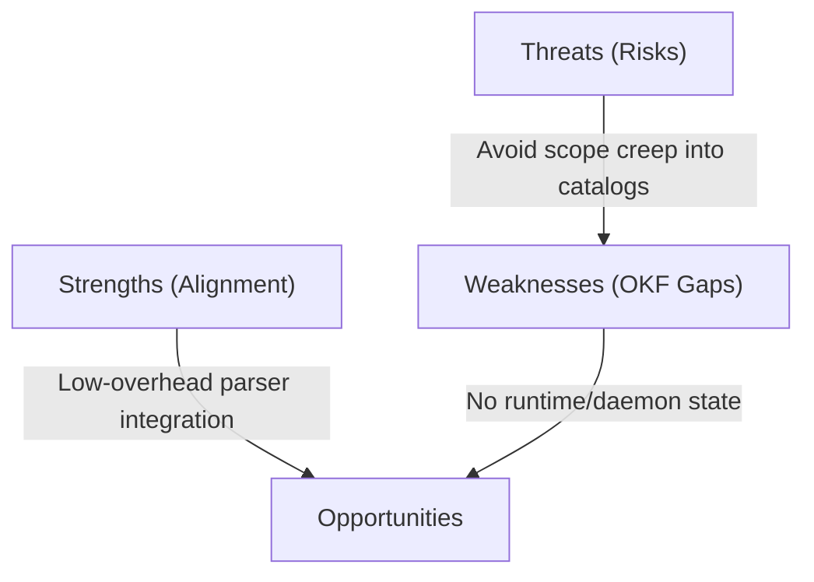

# Open Knowledge Format (OKF) SWOT Analysis & Assessment

**Date:** 2026-06-26  
**Subject:** Assessment of GCP's Open Knowledge Format (OKF) and its alignment with synlynk.

---

## 1. What is OKF?

The **Open Knowledge Format (OKF)** is a draft specification ($v0.1$) released by Google Cloud Platform for representing structural knowledge (like datasets, table schemas, APIs, business metrics, playbooks) as a directory tree of plain Markdown files with YAML frontmatter.

### Core Structure:
* **Directory Layout:** Standard files (`index.md` for navigation, `log.md` for history) alongside concepts grouped in subdirectories.
* **Concept Documents:** Markdown files with YAML frontmatter detailing a required `type` field, and optional fields (`title`, `description`, `resource`, `tags`, `timestamp`).
* **Links:** Standard Markdown relative links to form relationships between concepts (making it graph-shaped).

---

## 2. Comparison with synlynk

| Dimension | Google OKF | synlynk |
|---|---|---|
| **Primary Scope** | Static data and systems cataloging (metadata description). | Dynamic agent coordination, tasks, and devlog workflows. |
| **Philosophy** | Markdown + YAML frontmatter version-controlled in Git. | Markdown templates + SQLite DB for active tasks/ratings. |
| **Runtime Features** | None (pure format). | Daemon, HTTP context server, event relay, capability ledger. |
| **Write Coordination** | Relies on manual Git workflows. | SQLite WAL transaction checks, pull-before-write warnings. |
| **Attribution** | Git history. | Local devlogs and `memory.md` attributing with `[@username]`. |

---

## 3. SWOT Analysis

### Strengths (S)
* **High Philosophy Alignment:** Google's specification validates synlynk's core design choice—using human- and agent-readable Markdown files tracked in Git rather than proprietary metadata databases.
* **Format Simplicity:** Because it is just Markdown + YAML, parsing or generating it requires zero heavy dependencies.
* **Interoperability:** Conforming to OKF allows synlynk agents to leverage external enterprise data catalogs exported to OKF.

### Weaknesses (W)
* **No Runtime/State Coordination:** OKF does not address concurrency, live execution queues, budget management, or token limits. It is a document specification, not an engine.
* **No Team/Agent Shared Context:** As noted, OKF lacks any mechanism (like synlynk's daemon or SQL WAL engine) to sync execution state or manage agent consensus panels (`synlynk decide`).

### Opportunities (O)
* **Ingestion Source:** We can add a parser to synlynk that reads OKF directories. A coding agent can ingest OKF files (e.g. BigQuery schemas or API endpoints) to write precise code without hallucinating endpoints.
* **Output Standardization:** We can format certain synlynk artifacts (like decision records or agent capabilities) to be OKF-compliant, making them visible to external OKF visualizers.

### Threats (T)
* **Scope Creep:** Getting distracted by implementing data catalog features (validation, lineages, profiling) instead of focusing on synlynk's core mission: repository workflow orchestration and developer-agent collaboration.

---

## 4. Assessment & Recommendations

### Did Google beat us to a standard?
**Yes, but only on the cataloging/metadata front.**
Google's OKF is focused on *defining what resources are* (data catalogs, metrics, playbooks). Synlynk is focused on *collaborative software development execution* (tasks, active daemon jobs, consensus, cost telemetry, human developer integration). Our approaches are complementary: OKF is the static description of the world; synlynk is the dynamic engine that operates on it.

### Should we support it?
**Yes. We should support it as an ingestion format.**
Adding OKF support is low-risk and high-reward. We can introduce a light-weight reader that scans OKF directories and appends them to the context window under a `## System Reference Catalog` section.

### Proposed Action Items:
1. **Context Scanner Integration:** Enhance `synlynk/scan.py` to identify OKF-style subdirectories (directories with `index.md` and YAML frontmatter) and incorporate them into `generate_context()`.
2. **Attribution Layer:** When generating context from OKF files, preserve author attribution metadata matching synlynk's `[@username]` convention.
3. **No Database Alteration:** Keep synlynk's `state.db` as the authoritative execution engine; do not attempt to map static OKF directories into the active task engine.
