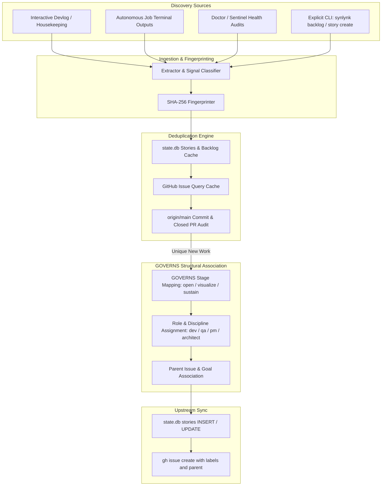

# GOVERNS Backlog Automation — Auto-Associate Discovered and Planned Work — Design

**Date:** 2026-08-31  
**Status:** In Review (Spec Brainstorm & Design Pass)  
**Author:** Agy (implementer / tester), brainstormed with Nikhil Soman  
**Issue:** Resolves #1203 (Parent Tracking: #1198 — Autonomous Operations Activation)  
**Tracking Story:** `story-governs-backlog-auto`  
**Linked Goals:** `goal-autonomous-ops`  

---

## 1. Motivation & Problem Statement

Across multi-agent and human-agent development in Synlynk, work is discovered dynamically during execution:
1. **Interactive harness sessions:** When an engineer or agent is working through a feature or fix in Herdr, ancillary gaps, tech debt, and adjacent improvements are uncovered.
2. **Dispatched autonomous jobs:** When an autonomous harness (Codex, Agy, Claude, Grok) executes a story, it discovers edge cases, missing test fixtures, or documentation drift outside its active task fence.
3. **Observability & Diagnostics:** `synlynk doctor`, sentinels, and capability sweeps surface regressions, quota trends, and health anomalies.

Currently, **no automated mechanism exists** to capture these discoveries into `state.db` and GitHub Issues. Discovered work either relies on manual human ticket filing, or gets recorded in ephemeral chat transcripts and lost.

Issue #1203 establishes the architecture for **GOVERNS Backlog Automation**: a deterministic, deduplicated, and lifecycle-aware subsystem that captures discovered work, maps it to the 7-stage GOVERNS taxonomy, and synchronizes it with GitHub Issues without spam or duplication.

---

## 2. Core Architectural Pillars



---

## 3. Detailed Specifications

### 3.1 What Counts as "Discovered Work" (Signal vs. Noise)

To prevent cluttering the backlog with transient debugging logs or unverified hypotheses, candidate items must satisfy specific qualification thresholds:

| Category | Qualification Criteria | Default Stage | Target Role |
| :--- | :--- | :--- | :--- |
| **Explicit Action Items** | Items under `### Discovered / Follow-up Work` in devlogs, marked with `<!-- discover: ... -->`, or passed via `synlynk story create`. | `open` | Inherited or `dev` |
| **Diagnostic & Health Gaps** | Persistent `FAIL` results from `synlynk doctor` that cannot be auto-fixed by `doctor --fix`. | `sustain` | `qa` / Support Engineer |
| **Out-of-Scope Task Findings** | Action items recorded in job completion summaries with tag `FOLLOWUP:` or `TECH-DEBT:`. | `open` | Assigned by capability classifier |
| **Instruction / Schema Drift** | Sentinels detecting drift between instruction files, configs, and runtime capabilities. | `sustain` | `architect` / `pm` |

**Explicit Filter (Noise Rejection):**
- Temporary debugging traces and stack traces from in-flight test runs.
- Duplicate mentions of existing open stories or GitHub issues.
- Vague notes without an actionable title, description, or acceptance criterion.

### 3.2 Ingestion Hooks & Triggers

Backlog automation activates through four deterministic trigger points:

1. **Session Boundary Hook (`synlynk checkpoint` / `synlynk session end`):**
   - Scans the session's devlog section for newly added follow-up items.
   - Extracts structured action items into `state.db` backlog staging.
2. **Job Lifecycle Completion Hook (`synlynk jobs --reconcile` / dispatch terminal event):**
   - Inspects the finished job's touched files and summary for explicit out-of-scope followups.
   - Emits a GOVERNS `work_discovered` event on the internal event bus (`synlynk/events.py`).
3. **Doctor & Audit Hook (`synlynk doctor --capture-backlog`):**
   - Converts unresolved diagnostic warnings into tracked technical debt stories.
4. **Direct CLI Ingestion:**
   - `synlynk backlog capture --title "<title>" --description "<desc>" --role <role> --stage <stage> [--sync-gh]`

### 3.3 Multi-Layered Deduplication & Anti-Spam Verification

Filing duplicate issues creates operational drag. The deduplication pipeline enforces a 4-layer check:

1. **Deterministic Fingerprint (Layer 1):**
   - Each item computes `fingerprint = SHA256(normalized_title + ":" + source_identifier)`.
   - Stored in a new column `fingerprint TEXT UNIQUE` in `state.db:stories`.
2. **Local Database & Cache Query (Layer 2):**
   - Checks `state.db` for existing stories with matching title slug or high token similarity.
3. **GitHub Issue Search (Layer 3):**
   - Queries `gh issue list --state open --json number,title,labels` and cached issue metadata.
   - Matches against existing open issue titles.
4. **Git Origin / Main Audit (Layer 4):**
   - Verifies against `git log origin/main` to ensure the work was not already resolved and merged by another branch or PR.

### 3.4 Correct GOVERNS Structural Association

Every auto-associated item is structured according to the 7-stage GOVERNS SDLC taxonomy:

* **GOVERNS Stage Mapping:**
  * `goal`: Broad architectural themes and epics.
  * `open`: Unrefined bugs, feature requests, and raw backlog discoveries.
  * `visualize`: Items requiring a design spec or architecture brainstorm.
  * `execute`: Refined implementation tasks with clear requirements and reproduction tests.
  * `release`: Deployment, packaging, and tagging tasks.
  * `notify`: Documentation, devlogs, changelogs, and blog posts.
  * `sustain`: Bug fixes, tech-debt, dependency updates, and maintenance.

* **GitHub Metadata Alignment:**
  * **Labels:** `governs:<stage>` (e.g. `governs:open`, `governs:sustain`), type label (`bug`, `tech-debt`, `enhancement`), and role label (`role:dev`, `role:qa`).
  * **Parent Association:** If created in the context of an epic or tracking issue (e.g. `#1198`), link via `parent: #1198` / GitHub sub-issue syntax.
  * **Milestone:** Attached to the current active milestone if configured.

---

## 4. Database Schema & Data Model Changes

In `synlynk/db.py` (Migration version bump to 4):
* Add `fingerprint TEXT UNIQUE` to `stories`.
* Add `source_type TEXT` (`devlog`, `doctor`, `job_output`, `manual`) to `stories`.
* Add `source_ref TEXT` (e.g. file path, job ID, or diagnostic check name) to `stories`.
* Add `governs_stage TEXT DEFAULT 'open'` to `stories`.
* Index `idx_stories_fingerprint` on `stories(fingerprint)`.

---

## 5. CLI & Command Surface

```bash
# Capture discovered work manually
synlynk backlog capture --title "Handle SQLite lock timeouts during batch sweeps"   --description "Add exponential backoff when opening dconn in dispatch."   --stage sustain --role dev --type tech-debt --sync-gh

# List pending and auto-associated backlog items
synlynk backlog list [--stage <stage>] [--unfiled]

# Sync staged discoveries to GitHub Issues
synlynk backlog sync [--dry-run] [--parent <parent_issue_number>]
```

---

## 6. Implementation Stages & Phased Delivery

1. **Stage 1 — Data Model & Ingestion Engine (`synlynk/backlog.py`, `synlynk/db.py`):**
   - Fingerprinting algorithm, schema migration version 4, and `state.db` CRUD for discovered items.
2. **Stage 2 — Extraction & Heuristics Parsers (`synlynk/backlog_extractor.py`):**
   - Devlog action-item parser, job summary parser, and doctor failure converter.
3. **Stage 3 — GitHub Association & Deduplication Pipeline (`synlynk/backlog_sync.py`):**
   - `gh issue` integration with `governs:*` labels, parent linking, and anti-duplicate guards.
4. **Stage 4 — CLI Subcommands & Hook Wiring (`synlynk/cli.py`, `synlynk/session.py`, `synlynk/dispatch.py`):**
   - Wire into `checkpoint`, `jobs --reconcile`, and expose `synlynk backlog` commands.
5. **Stage 5 — Comprehensive Test Suite & Documentation:**
   - Unit tests covering noise filtering, deduplication, stage mapping, and GitHub mock sync.

---

## 7. Verification & Sign-Off Criteria

- [ ] All 4 qualification categories accurately extract high-signal items while ignoring noise.
- [ ] Fingerprint deduplication prevents duplicate entries in `state.db` and GitHub issues.
- [ ] All 7 GOVERNS stages correctly label and structure auto-created backlog items.
- [ ] 100% of existing pytest test suite passes with zero regressions.
