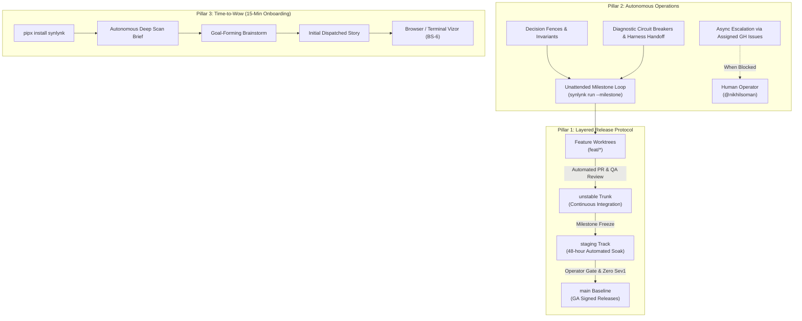
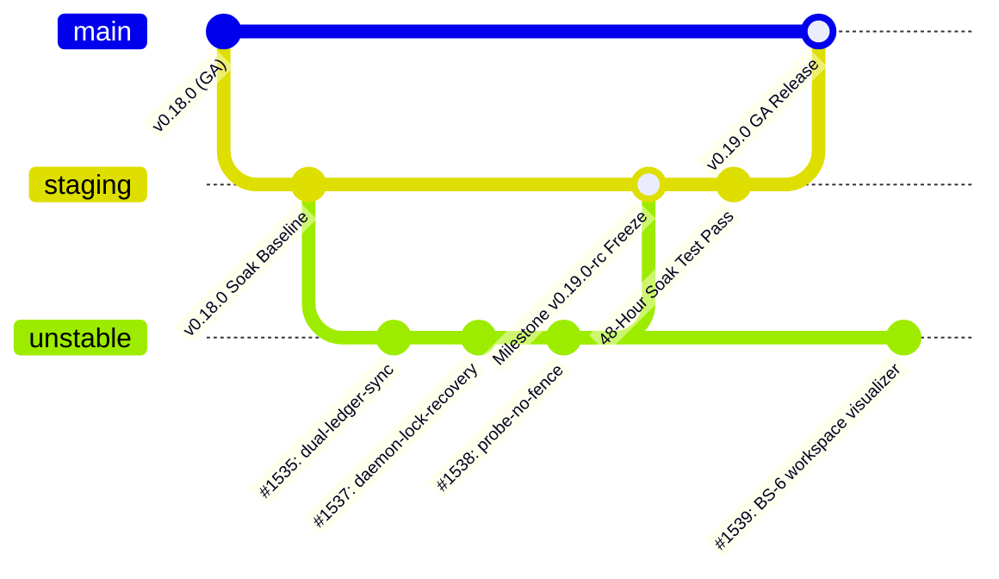
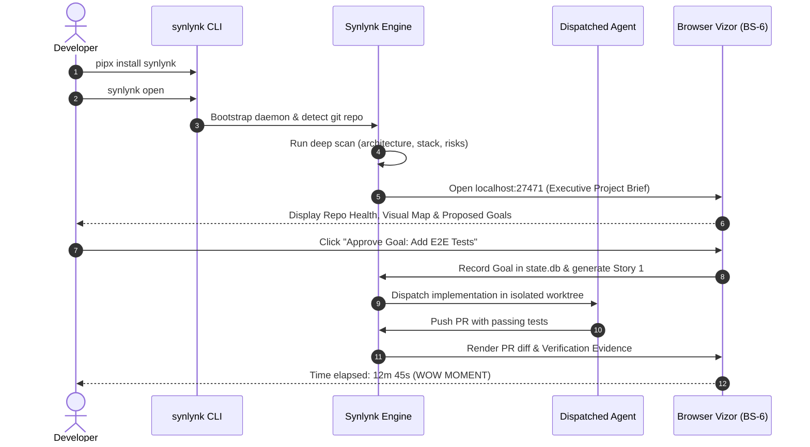

# Design Spec: Layered Release Protocol, Autonomous Operations & Time-to-Wow

- **Tracking Goals:** `goal-85656c82` (Developer Experience 1.0), `goal-8f64eff5` (Platform Health), `goal-bde24050` (State & Job Truth), `goal-90e73dfd` (GOVERNS Lifecycle)
- **Author:** Agy (Gemini) [@agy]
- **Collaborator / Approver:** Nikhil Soman [@nikhilsoman]
- **Date:** 2026-09-10
- **Status:** Draft (Proposed Architecture)
- **Target Milestone:** **v1.0.0 Developer Preview Launch (01 October 2026)**

---

## 1. Executive Summary & Problem Statement

### 1.1 The Operational Paradox
Synlynk was designed as a multi-agent autonomous engineering engine. However, in practice, human-agent sessions frequently devolve into **conversational pair-programming**:
1. **Interactive Turn-Taking Gravity:** Agents stop at every micro-step to request conversational confirmation ("Should I proceed?", "Should I commit?", "Are you okay with this fix?"), keeping the operator glued to the keyboard.
2. **Fragile Trunk Model:** Dispatched agents and automated QA bots merge PRs directly into `main`. Any test flake, semantic mismatch, or transient hallucination destabilizes the installable production baseline.
3. **Cognitive Harness Mismatch:** Treating all harnesses (Codex, Agy, Claude, Grok) as interchangeable peers ignores fundamental differences in context window geometry and training specialization. Codex excels at surgical code generation and unit testing, but suffers from token-compaction loops when forced to hold large global state as Home Conductor. Agy and Claude excel at systemic synthesis and state-machine orchestration.
4. **Fuzzy Autonomy Boundaries:** When goals lack explicit invariant bounds ("Freedom Within Fences"), agents either freeze out of caution or drift into uncontrolled architectural churn.

### 1.2 The Core Solution: The Autonomy Trinity
To achieve predictable, hands-off velocity before the **01 October 2026 Developer Preview Launch**, this specification formalizes three pillars:
1. **Layered Release Protocol:** A four-tier branching model (`feat/` → `unstable` → `staging` → `main`) featuring an automated 48-hour soak gate to insulate production from autonomous churn.
2. **Autonomous Operations Engine:** An unattended milestone execution loop with deterministic decision fences, cognitive harness specialization, diagnostic circuit breakers, and asynchronous human escalation via assigned GitHub issues.
3. **15-Minute Time-to-Wow User Journey:** A frictionless onboarding pipeline (`pipx install` → deep repo brief → goal brainstorm → first dispatched PR in under 15 minutes).



---

## 2. Pillar 1: Layered Release Protocol

### 2.1 Four-Tier Branching Topology

| Tier | Branch Pattern | Environment / Purpose | Commit Authority | CI / Gate Requirements |
| :--- | :--- | :--- | :--- | :--- |
| **Tier 1: Feature** | `feat/<agent>/<slug>`, `fix/...` | Ephemeral, isolated worktree sandboxes. | Dispatched Agent (`codex`, `agy`, `grok`, `claude`) | Local unit tests pass; branch pushed to origin. |
| **Tier 2: Autonomous Trunk** | `unstable` (or `develop`) | **The High-Velocity Multi-Agent Trunk.** All autonomous dispatches, automated QA merges, and continuous milestone tasks merge here. | Role QA App (`synlynk-synlynk-qa[bot]`) | Full CI test matrix (`EPUBCheck`, `test (3.10)`, `test (3.12)`, `qa-gate`). |
| **Tier 3: Release Candidate** | `staging` (or `release/vX.Y`) | **Soak & Stability Track.** Cut from `unstable` at milestone feature-freeze. No new features permitted. | Home Conductor / Architect App | **48-Hour Soak Gate:** Scheduled nightly runs, 0 open Sev1/Sev2 alerts, performance benchmarks green. |
| **Tier 4: General Availability** | `main` | **Production Baseline.** Installable by users via `pipx`. Represents verified stable releases (`v0.19.0`, `v0.20.0`, `v1.0.0`). | Human Operator Gate (`@nikhilsoman`) | Signed GitHub Release tag; clean CHANGELOG; human approval. |



### 2.2 The 48-Hour Automated Soak Gate
Before any code on `staging` is promoted to `main`:
1. **Endurance & Leak Sweep:** The daemon and scheduler run continuously for 48 hours in CI/cron, simulating continuous dispatches and reconciliations.
2. **Zero Sentinel Defect Rule:** Must produce **0 new Sev1** (critical correctness/data loss) and **0 new Sev2** (major degradation) sentinel alerts in `.synlynk/sentinel.md`.
3. **Performance Regression Check:** Test suite runtime must remain below **180 seconds**; `synlynk probe` latency must remain below **3 seconds**.
4. **Hotfix & Backport Flow:**
   - Critical production fixes (`hotfix/*`) branch directly from `main`.
   - Once verified, hotfixes merge to `main`, and are immediately back-merged downward into `staging` and `unstable` to prevent drift.

---

## 3. Pillar 2: Autonomous Operations Engine

### 3.1 Freedom Within Fences (Invariant Contracts)
To maximize autonomous speed without human micro-management, agents operate with complete latitude within rigid boundary fences:

#### Autonomous Decision Rights (Inside Fences):
* Create, manage, and prune feature worktrees.
* Refactor internal helper modules and implementation functions.
* Write unit tests, mock fixtures, and property-based tests.
* Open PRs against `unstable` and perform automated non-authoring peer reviews via role GitHub Apps (`qa`, `architect`).
* Squash-merge approved PRs into `unstable` upon passing all CI checks.
* Archive expired sentinel lines and stale cost entries.
* Update `state.db` task states (`ready` → `in_progress` → `done`).

#### Reserved Human Approval Gates (The Fences):
1. **Gate 1: Architectural Spec & Plan Sign-off** — Human approves specs in `docs/superpowers/specs/` before implementation begins.
2. **Gate 2: Milestone Commitment & Sequencing** — Human defines roadmap release targets and priorities.
3. **Gate 3: GA Release Cut** — Merging `staging` to `main` and cutting public release tags.
4. **Gate 4: Security, Credential & Policy Mutations** — Adding external network domains or altering role App permissions.

### 3.2 The Unattended Milestone Execution Loop
The execution loop runs headlessly via `synlynk run --milestone <version> --unattended`:

```
┌────────────────────────────────────────────────────────────────────────┐
│ UNATTENDED MILESTONE LOOP                                              │
│                                                                        │
│  1. Pick next Ready Story in Milestone DAG                             │
│  2. Create Dedicated Worktree (feat/<agent>/<story-slug>)              │
│  3. Formulate Plan & Test-Driven Verification Test                     │
│  4. Implement Fix / Feature & Pass Local Tests                         │
│  5. Push Branch & Open PR against `unstable`                           │
│  6. Dispatch Reviewer via Role App (`qa` / `architect`)                │
│  7. Wait for CI & Role Approval -> Squash-Merge to `unstable`          │
│  8. Delete Remote & Local Branch -> Prune Worktree                     │
│  9. Record Completion in state.db -> Advance to Next Story             │
└────────────────────────────────────────────────────────────────────────┘
```

### 3.3 Asynchronous Human Escalation via GitHub Issues
Agents must **never freeze the terminal** waiting for interactive chat input. If an unresolvable obstacle occurs:
1. **Identify the Block:** Ambiguous spec requirement, unresolvable test failure after 3 attempts, or external permission denial.
2. **File Assigned Issue:** Create a GitHub issue assigned to `@nikhilsoman` using `synlynk gh --role architect -- issue create`:
   - Title: `[ESCALATION] <Context>: <Specific Decision Required>`
   - Body: Summary of attempt, root cause, reproducing command, and 2–3 concrete options with agent recommendation.
   - Labels: `escalation`, `blocked-operator`.
3. **Mark and Skip:** Update the story state in `state.db` to `blocked (waiting: human_decision)` and immediately pick the next unblocked parallel story in the milestone.

### 3.4 Harness Specialization & Circuit Breakers
To prevent 48-hour diagnostic stalls like the recent Codex loop:

1. **Role Allocation Matrix:**
   - **Agy (`agy-2.x` / Gemini) & Claude:** Primary **Home Conductors & Architects**. Own `state.db`, multi-worktree orchestration, roadmap reconciliation, spec brainstorms, and holistic triage.
   - **Codex:** Primary **Away Worker & Code Reviewer**. Owns surgical implementation, TDD test suites, CLI plumbing, and strict code review gates.
   - **Grok:** Primary **Visualizer & Frontend Engine**. Owns BS-6 canvas, SVG diagrams, and JavaScript infrastructure.
2. **Diagnostic Circuit Breaker:**
   - If an agent performs **> 3 consecutive diagnostic turns** (reading files, running `git status`) without generating a code edit or writing a verification test:
   - The engine automatically pauses the worker, captures the context stack, logs a `DIAGNOSTIC_CHURN_DETECTED` sentinel, and invokes `synlynk jobs handoff` to transfer the task to a sibling harness.
3. **Deterministic Tool Contracts:**
   - All diagnostic CLI commands (`synlynk worktree audit --json`, `synlynk daemon status --json`, `synlynk probe --json`) must output machine-parseable JSON with explicit action recommendations (`SAFE_TO_PRUNE`, `ACTIVE_LOCK`, `DRIFT_DETECTED`).

---

## 4. Pillar 3: 15-Minute Time-to-Wow Developer Experience

### 4.1 The Frictionless Onboarding Contract
A developer downloading Synlynk for the first time must reach a demonstrable "wow moment" in under 15 minutes on a vanilla project:



### 4.2 The 5 Milestones of the 15-Minute Journey
1. **Minute 0–2 (Zero-Risk Install):** `pipx install synlynk` installs isolated binary without python version conflicts.
2. **Minute 2–5 (Autonomous Deep Scan):** `synlynk scan --deep` inspects the codebase and produces an evidence-backed project brief (architectural summary, tech stack, health risks).
3. **Minute 5–8 (Guided Goal-Forming Brainstorm):** Synlynk leads a bounded interactive brainstorm, proposing 2–3 high-value goals directly aligned with the scan evidence.
4. **Minute 8–12 (First Autonomous Dispatch):** Synlynk creates a worktree, writes a reproduction test, implements a scoped story, and verifies it.
5. **Minute 12–15 (Interactive Visual Handoff):** The browser Vizor pops open, displaying the active worktrees, story DAG, and a green PR ready to merge.

---

## 5. Recasting the Master Roadmap

The roadmap leading to **01 October 2026** is restructured to deliver this three-pillar architecture:

```mermaid
timeline
    title Restructured Roadmap Horizon (Target: 01 Oct 2026)
    section v0.19.0 (15 Sep 2026) : Foundation & Layered Release Engine
        Layered Branching Topology : unstable trunk, staging soak, main GA
        Control Plane Hardening : Dual-ledger sync #1535, daemon recovery #1537
        Probe Cleanliness : --no-fence flag #1538, worktree patch equivalence
    section v0.20.0 (22 Sep 2026) : Autonomous Operations & BS-6 Workspace Views
        Unattended Milestone Loop : synlynk run --milestone --unattended
        Async Escalation Engine : Issue filing assigned to @nikhilsoman
        BS-6 Visualizer : SVG diagram generator, terminal & browser canvas (#1539)
        Diagnostic Circuit Breakers : >3 turn churn detection & harness handoff
    section v1.0.0-rc1 (27 Sep 2026) : 15-Minute Time-to-Wow Field Trials
        Zero-Risk Packaging : pipx standalone distribution
        Deep Scan Project Brief : Autonomous codebase comprehension
        3-Repo Field Trials : Under 15-min verified user journey
        Test Suite Remediation : Sub-180s CI runtime (#1492)
    section v1.0.0 (01 Oct 2026) : Public Developer Preview Launch
        Production GA Cut : Signed release from staging to main
        Announcement Collateral : synlynk.com redesign, Show HN, Product Hunt (#1515)
        Book Excerpt : The Supervised Machine manifesto publication (#1514)
```

---

## 6. Verification & Acceptance Criteria

1. **Layered Release Verification:**
   - An automated PR merged to `unstable` does not affect `staging` or `main`.
   - `staging` requires 48 hours of clean CI with 0 Sev1 sentinels before promotion to `main`.
2. **Unattended Execution Verification:**
   - A 5-story milestone executes from start to finish without pausing for interactive terminal input.
   - When injected with an intentional spec contradiction, the agent files an assigned issue on GitHub, marks the story `BLOCKED`, and advances to the next story.
3. **Time-to-Wow Verification:**
   - A clean machine running `pipx install synlynk` on a fresh test repo completes the scan, brainstorm, and first dispatched PR within **15 minutes**.
4. **Harness Stability:**
   - Diagnostic stalls (> 3 turns of read-only bash) automatically trigger circuit breaker handoffs.
