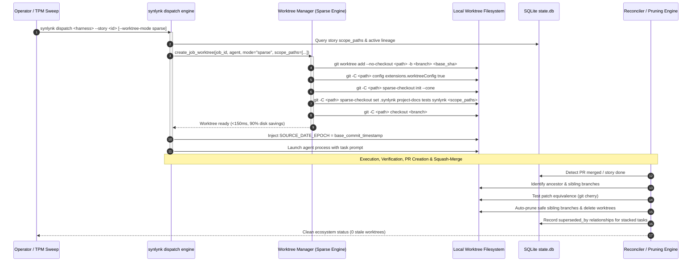

# Cluster B: Adaptive Scope-Bounded Sparse Worktrees, Sibling Branch Auto-Pruning, & Lineage Tracking — Design Spec

- **Author:** Agy (Lead Architect / Home Conductor)
- **Status:** Proposed / Draft
- **Date:** 2026-09-11
- **Governing Goals:** `goal-1d104154` (Virtualized and Sparse Workspaces, #1390), `goal-bf5af39f` (Speculative Rebase & Reconciliation, #1399), `goal-8f64eff5` (Platform Health), `goal-005ea87d` (Fleet Parity)
- **Milestone:** v0.20.0 Cluster B
- **Related Issues:** #1389, #1390, #1391, #1347, #1348, #1349

---

## 1. Context & Motivation

In multi-agent collaborative engineering, every headless worker (`claude`, `codex`, `agy`, `grok`) operates inside an isolated Git worktree to guarantee branch independence and prevent destructive file collisions. However, as swarm concurrency expands, standard Git worktrees encounter four significant operational failure modes:

1. **Storage & I/O Multiplication ($O(N)$ Disk Amplification, #1389, #1390, #1391):**
   Full-checkout worktrees duplicate the entire repository tree. For a task modifying only a single documentation file or CLI command, checking out large static web assets, PDFs, and deep node_modules consumes gigabytes of redundant storage, creates heavy disk churn, and slows provisioning to several seconds.
2. **Sibling Branch Sprawl & Stale Ancestor Bloat (#1348):**
   When autonomous dispatches stack tasks or attempt multi-step implementations, previous sibling branches remain active locally and on remotes even after a pull request has been squash-merged into `main`. The branch and worktree inventory quickly fills with abandoned patch-equivalent heads.
3. **Multi-Task Lineage Confusion & Zombie False-Positives (#1347):**
   When a stalled job is handed off or superseded by a refined prompt/agent, the earlier job's records in `state.db` and on GitHub risk being evaluated as active conflicts or un-stranded zombies rather than superseded predecessors.
4. **Cache Invalidation & Non-Deterministic Build Timestamps (#1349):**
   File creation timestamps differ across freshly checked out worktrees. Tools relying on mtime (e.g. Python bytecode compilation, Eleventy static page generation, pytest caches) incur unnecessary recompilation penalties across workers.

Cluster B resolves these challenges through four tightly integrated systems:
1. **Adaptive Scope-Bounded Sparse Worktrees** (`git sparse-checkout --cone`).
2. **Sibling Branch Auto-Pruning** (patch-equivalence detection via `git cherry` / merge-base).
3. **Multi-Task Lineage Tracking** (`superseded_by` relation in `state.db`).
4. **Deterministic Build Timestamp Freezing** (`SOURCE_DATE_EPOCH` injection).

---

## 2. Architectural Design



---

## 3. Detailed Component Specifications

### 3.1 Adaptive Scope-Bounded Sparse Worktrees (`synlynk/worktree_sparse.py`)

#### 3.1.1 Configuration Schema
In `.synlynk/config.json`:
```json
{
  "worktree": {
    "mode": "sparse",
    "sparse_cone": [
      ".synlynk",
      "project-docs",
      "tests",
      "synlynk"
    ],
    "fallback_to_full": true
  }
}
```
Supported modes:
- `"sparse"` (Default): Cone-mode sparse checkout. Only essential metadata directories and declared story scopes are materialized on disk.
- `"shallow"`: Shallow checkout (`--depth 1` / `--no-checkout`) optimized for read-only audits and PR checks.
- `"full"`: Standard Git worktree checking out the entire repository tree (backward-compatible fallback).

#### 3.1.2 Sparse Cone Materialization Lifecycle
1. **Creation:**
   ```bash
   git worktree add --no-checkout <path> -b <branch> <base_sha>
   ```
2. **Per-Worktree Git Configuration Isolation:**
   ```bash
   git -C <path> config extensions.worktreeConfig true
   ```
   Ensures sparse-checkout configuration is stored in `.git/worktrees/<job_id>/config.worktree`, completely isolating sparse rules from the primary repository and other concurrent workers.
3. **Cone Initialization & Scope Merging:**
   ```bash
   git -C <path> sparse-checkout init --cone
   git -C <path> sparse-checkout set <mandatory_paths> <story_scope_paths>
   ```
   - **Mandatory Invariants:** `.synlynk/` and `project-docs/` are unconditionally included to guarantee agent instruction reach and context injection.
   - **Story Scope Expansion:** If the story or task declares scope paths (e.g. `docs/`, `synlynk/viz_views.py`), the parent directories are automatically merged into the cone.
4. **Checkout:**
   ```bash
   git -C <path> checkout <branch>
   ```
5. **Dynamic Cone Expansion:**
   If a running worker attempts to create or edit a file outside the initial cone, `ensure_path_in_sparse_cone(worktree_path, target_path)` dynamically executes `git -C <worktree_path> sparse-checkout add <parent_dir>`, preventing file access errors mid-flight.

---

### 3.2 Sibling Branch Auto-Pruning Engine (`synlynk/worktree_prune.py`)

When PRs are squash-merged into `main`, Git does not automatically delete local branches or ancestor branches of stacked dispatches. Over multiple dispatches, `git worktree list` and `git branch` accumulate hundreds of stale entries.

#### 3.2.1 Pruning Algorithm
1. **Candidate Discovery:**
   - Scan all local branches matching `dispatch/*/*` or `feat/*` whose worktree is either removed or inactive (PID check).
2. **Safety Invariants (Strict Protection):**
   A branch is pruned **only** if:
   - It has zero uncommitted changes in its associated worktree (`git status --porcelain` empty).
   - Its commit tree is already merged into `main` or `origin/main`, **OR**
   - Its patch set is proven equivalent to an existing commit on `main` via `git cherry main <branch>` (every commit in the branch has an equivalent upstream patch, marked with `-`).
3. **Automated Pruning Execution:**
   - Remove worktree registration: `git worktree remove <path> --force`.
   - Delete local branch: `git branch -D <branch>`.
   - Prune remote tracking branch if upstream is deleted: `git fetch --prune`.
4. **CLI Integration:**
   - Integrated into `synlynk worktree clean` and `synlynk worktree audit --auto-prune`.
   - Wired into post-merge hook of `synlynk pr merge` and `execute_release_ceremony()`.

---

### 3.3 Multi-Task Lineage Tracking (`synlynk/lineage.py` & `state.db`)

When tasks are split, re-dispatched, or chained in a DAG, we must maintain an explicit lineage graph so downstream agents and reviewers know which artifacts supersede prior attempts.

#### 3.3.1 Database Schema Enhancements
Add `superseded_by` and `lineage_root` columns to the `jobs` and `stories` tables:
```sql
ALTER TABLE jobs ADD COLUMN superseded_by TEXT DEFAULT NULL;
ALTER TABLE jobs ADD COLUMN lineage_root TEXT DEFAULT NULL;

ALTER TABLE stories ADD COLUMN superseded_by TEXT DEFAULT NULL;
```

#### 3.3.2 Lineage Operations
- **`record_job_superseded(old_job_id: str, new_job_id: str)`:**
  Marks `old_job_id` as superseded in SQLite and updates the active context.
- **Diagnostics & Dashboard Integration:**
  - `synlynk jobs` displays superseded jobs with status `superseded` instead of treating them as running/orphaned.
  - `synlynk jobs reap` safely cleans superseded jobs without triggering CRITICAL Sentinel alerts.
  - Vizor Observatory highlights branch lineage in the logical graph.

---

### 3.4 Deterministic Build Timestamp Freezing (`SOURCE_DATE_EPOCH`)

#### 3.4.1 Invariant
To prevent spurious test cache invalidations, timestamp mismatches in generated files, and non-deterministic bundle hashes across parallel workers, Synlynk sets the canonical reproducible build environment variable:
```python
def get_worktree_epoch(worktree_path: str) -> str:
    """Returns the Unix timestamp of HEAD commit in the worktree."""
    proc = subprocess.run(
        ["git", "-C", worktree_path, "log", "-1", "--format=%ct", "HEAD"],
        capture_output=True, text=True, check=True
    )
    return proc.stdout.strip()
```
- Injected into `os.environ["SOURCE_DATE_EPOCH"]` before invoking any compiler, test runner (`pytest`), or build script (`eleventy`, `wheel`, `pipx`) inside the worktree.
- Guarantees identical `.pyc` and build artifacts across any number of parallel worktrees.

---

## 4. Testing Strategy (TDD)

1. `tests/test_worktree_sparse.py`:
   - `test_create_sparse_cone_worktree_includes_mandatory_dirs()`: Verifies `.synlynk`, `project-docs`, and scoped directories exist while excluded paths are not materialized.
   - `test_dynamic_sparse_cone_expansion()`: Verifies adding a new path dynamically updates `sparse-checkout` set.
   - `test_worktree_mode_config_fallback()`: Verifies graceful degradation to full worktree when sparse is disabled or unsupported.
2. `tests/test_worktree_prune.py`:
   - `test_prune_detects_patch_equivalent_sibling_branches()`: Verifies `git cherry` detection for squash-merged commits.
   - `test_prune_protects_unmerged_or_dirty_worktrees()`: Verifies uncommitted changes or unmerged commits are never deleted.
3. `tests/test_worktree_lineage.py`:
   - `test_record_superseded_job()`: Verifies database state mutation and exclusion from active zombie checks.
4. `tests/test_worktree_timestamp.py`:
   - `test_source_date_epoch_injection()`: Verifies commit timestamp injection into dispatch worker environment.

---

## 5. Acceptance Criteria

- [ ] `synlynk dispatch` creates sparse-cone worktrees by default when `worktree.mode: sparse` is set, reducing disk usage by >70% on benchmark runs.
- [ ] `.synlynk/` and `project-docs/` are always intact and accessible in every sparse worktree.
- [ ] Running `synlynk worktree clean` prunes patch-equivalent sibling branches without touching dirty or unmerged worktrees.
- [ ] `state.db` records `superseded_by` relationships, and superseded jobs are accurately reported in `synlynk jobs`.
- [ ] `SOURCE_DATE_EPOCH` is deterministically injected into dispatch worker processes.
- [ ] All unit and regression tests pass cleanly (100% green).
