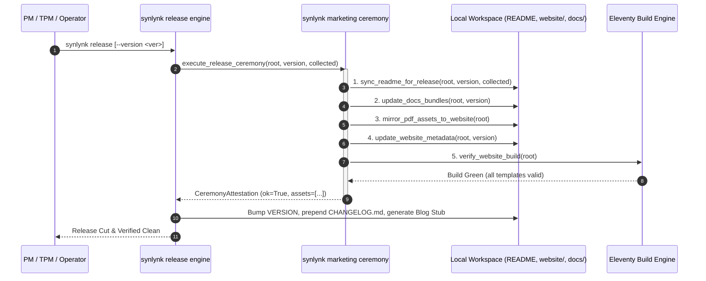

# Marketing Release Ceremony Automation — Design Spec

- **Author:** Agy (Home Conductor / Lead Architect)
- **Status:** Proposed / Draft
- **Date:** 2026-09-11
- **Governing Goals:** `goal-85656c82` (Developer Experience), `goal-0c4e96ff` (Marketing & Readership), `goal-250b6fb2` (Fleet Parity)
- **Milestone:** v0.20.0 Cluster A

---

## 1. Context & Motivation

During every named release of Synlynk (e.g. `v0.18.0`, `v0.19.0`, `v0.20.0`), user-facing public collateral must reflect the exact code state:
1. **GitHub README (`README.md`):** Version badges, collected test counts, release summary hero line, and the generated CLI command taxonomy must stay synchronized without manual interventions.
2. **Public Website (`website/`):** The Eleventy-powered landing page (`synlynk.com`), installation snippets (`pipx install synlynk==<version>`), release announcements, and documentation download links must be updated and compiled.
3. **Canonical Synlynk Docs Bundles (`docs/`):** The 3 canonical doc bundles (Quick Start Guide, Official Reference Manual, and Command Reference in HTML & PDF formats) must have version tags updated, and exported PDF assets mirrored to `website/src/assets/docs/`.

Previously, these ceremonies required ad-hoc manual edits or were forgotten across rapid release sprints. Per the operator mandate in Milestone v0.20.0 Cluster A, the **Marketing Workspace Agent** owns this ceremony, triggered by PM/TPM during `synlynk release`.

---

## 2. Architectural Design



---

## 3. Detailed Component Specifications

### 3.1 Marketing Release Ceremony Module (`synlynk/release_marketing.py`)
Encapsulates all ceremony operations with fail-safe error handling and dry-run support:

```python
@dataclass
class ReleaseCeremonyResult:
    ok: bool
    version: str
    readme_updated: bool
    docs_updated: List[str]
    website_updated: bool
    website_build_ok: bool
    errors: List[str]
```

#### Steps Executed:
1. **README Synchronization:**
   - Invokes `sync_readme_for_release(root, version, collected_count, hero_summary)` from `synlynk/release_readme.py`.
   - Validates badges, test counts, and command taxonomy block.
2. **Canonical Docs Bundles Version Refresh:**
   - Inspects `docs/synlynk-quickstart-guide.html`, `docs/synlynk-official-reference.html`, `docs/synlynk-command-reference.html`.
   - Replaces version markers (`v0.X.Y`, `Version 0.X.Y`) and dates (`YYYY-MM-DD`).
   - Copies existing or recompiled PDF files (`*.pdf`) from `docs/` to `website/src/assets/docs/` ensuring web downloads stay current.
3. **Website Metadata & Template Refresh (`website/`):**
   - Updates `website/src/_data/release.json` (or creates it) with `{ "version": "<ver>", "released_at": "<ISO-date>" }`.
   - Replaces hardcoded installation tags in `website/src/index.njk` and `website/src/docs.njk` if present.
   - Executes `npm run build` in `website/` (if Node.js is available) in a sub-process to verify static build success.

### 3.2 CLI Command (`synlynk marketing ceremony`)
Provides an explicit standalone entry point for operators and dispatched agents:
```bash
synlynk marketing ceremony [--version <V>] [--dry-run] [--skip-build]
```

### 3.3 Release Engine Integration (`synlynk/release_readme.py` & `synlynk/__init__.py`)
Integrates directly into `cmd_release()`:
- `synlynk release` runs the ceremony automatically before version bumping and changelog writing.
- `synlynk release --check-docs` attests both README and marketing assets.

---

## 4. Testing Strategy (TDD)

1. `tests/test_release_marketing.py`:
   - `test_sync_docs_bundles_updates_version_and_date()`
   - `test_mirror_pdf_assets_to_website()`
   - `test_update_website_metadata()`
   - `test_execute_release_ceremony_full_dry_run()`
   - `test_execute_release_ceremony_live_write()`
   - `test_cmd_marketing_ceremony_cli()`
2. Regression integration with `tests/test_agent_cli.py` (`test_docs_keep_readme_synchronized_during_named_releases_*`).

---

## 5. Acceptance Criteria
- [ ] Running `synlynk marketing ceremony --version 0.20.0 --dry-run` reports all intended updates without modifying files.
- [ ] Running `synlynk marketing ceremony --version 0.20.0` synchronizes `README.md`, the 3 `docs/*.html` files, copies PDFs to `website/src/assets/docs/`, and writes `website/src/_data/release.json`.
- [ ] `synlynk release` invokes the marketing ceremony seamlessly.
- [ ] All unit and integration tests pass cleanly with 100% assertions green.
