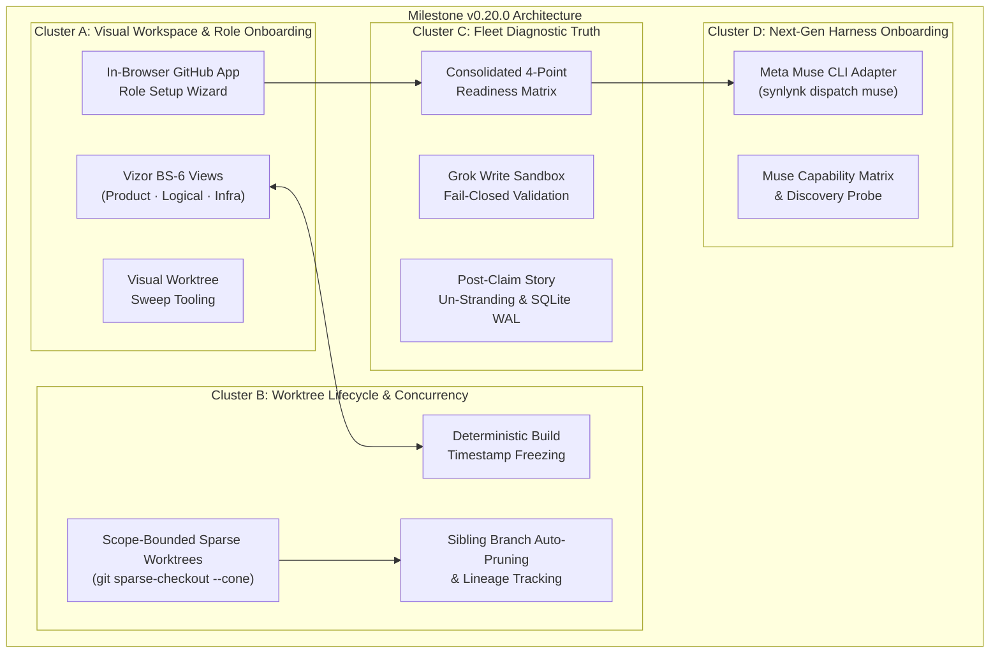
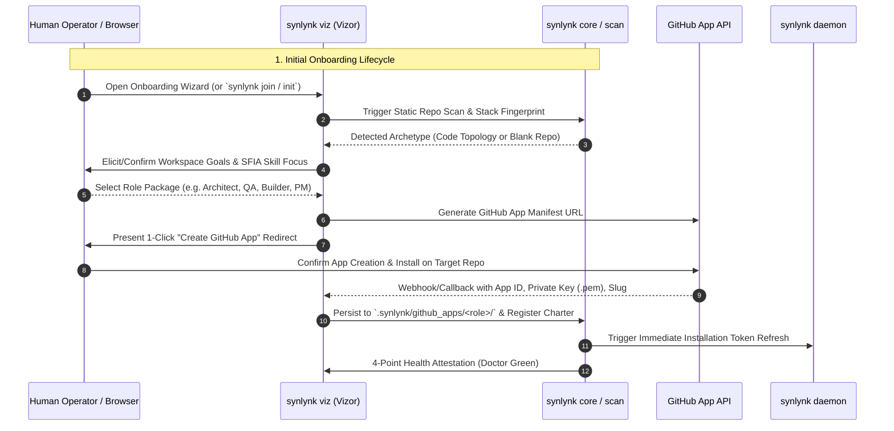
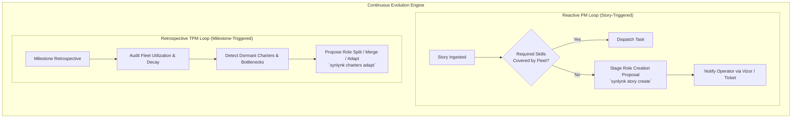
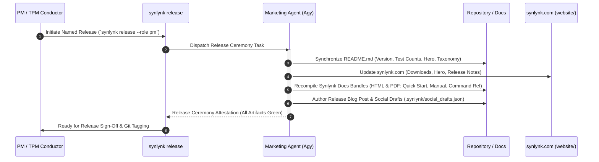
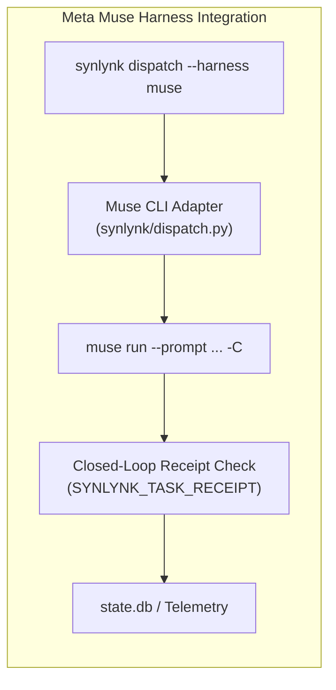
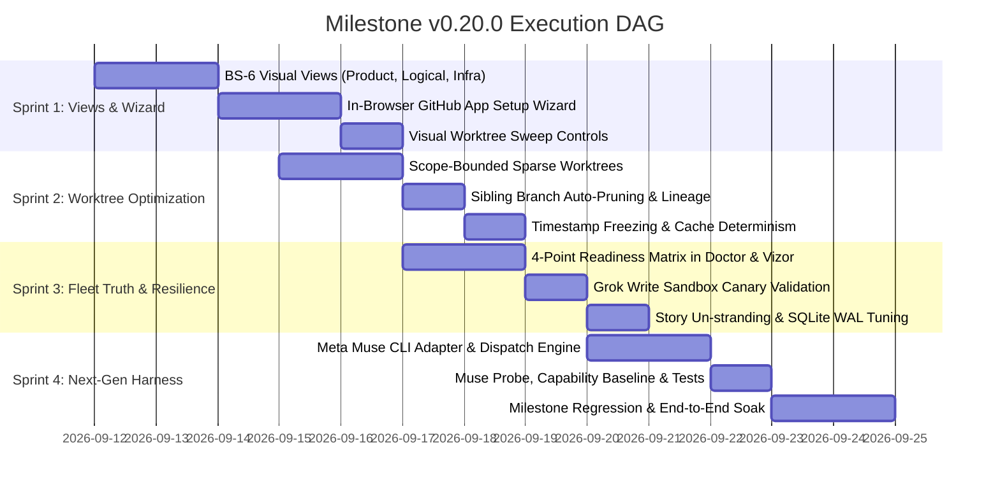

# Design Spec: Milestone v0.20.0 — Visual Workspace, Autonomous Onboarding & Fleet Resilience

- **Tracking Goals:** `goal-85656c82` (Developer Experience 1.0), `goal-8f64eff5` (Platform Health), `goal-bde24050` (State & Job Truth), `goal-90e73dfd` (GOVERNS Lifecycle), `goal-250b6fb2` (Fleet Parity)
- **Author:** Agy (Gemini) [@agy]
- **Collaborator / Approver:** Nikhil Soman [@nikhilsoman]
- **Date:** 2026-09-11
- **Status:** Proposed Architecture (Post-Brainstorm Consensus)
- **Target Milestone:** **v0.20.0 (Visual Workspace, Autonomous Onboarding & Fleet Resilience)**

---

## 1. Executive Summary & Architectural Motivation

Milestone `v0.19.0` established the foundational control plane and execution engine:
1. Multi-tier release topology (`feat/*` → `unstable` → `staging` → `main`).
2. Robust daemon lifecycle recovery, absolute App key resolution, and dual-ledger write-through.
3. Event-driven Launch DAG engine (`synlynk run --milestone <M> --unattended`) with asynchronous reserved-gate escalations.
4. High-velocity test isolation with `pytest-xdist`.

However, the user experience of workspace onboarding, visual comprehension, worktree disk economy, and harness breadth still retains friction identified in the 2026-09-04 Distinguished Engineer Architectural Review (`docs/reviews/2026-09-04-synlynk-architectural-review-and-muse-platform-fit.md`) and operator observations:
- **Terminal Archaeology:** A contributor or operator must navigate terminal files, ast-scan dumps, and git logs to comprehend the workspace. Vizor offers operational telemetry (Gantt, jobs, costs) but lacks mental-model formation (Product, Logical, Infra views per BS-6).
- **Manual Role Provisioning:** Provisioning new workspace agent identities requires manual GitHub App creation, downloading private keys to precise paths, and authoring raw charter YAML by hand.
- **Worktree Disk Bloat:** Every dispatched feature branch creates a full-clone worktree. On large repositories or parallel multi-agent swarms, this wastes gigabytes of disk and adds unnecessary creation latency.
- **Diagnostic Opacity:** Preflight readiness is fragmented across disparate checks, occasionally stranding claimed stories or failing closed silently when sandboxes deny writes.
- **Harness Scope Ceiling:** Meta Muse has emerged as a premier commercial code-generation model with a dedicated CLI, but lacks a first-class Synlynk adapter.

Milestone `v0.20.0` consolidates these imperatives into **4 tightly integrated clusters** anchored by an autonomous, SFIA-grounded Workspace Agent Creation & Charter Formation Flow.



---

## 2. Workspace Agent Creation & Charter Formation Flow

Workspace agents represent specialized project participants whose capabilities, authority, tools, and credentials match the domain of the workspace. A film production workspace requires directors, script supervisors, and continuity editors; a software SaaS workspace requires architects, security auditors, frontend engineers, and site reliability engineers.

This specification formalizes agent creation across two operational dimensions:
1. **Initial Onboarding Lifecycle:** Creating agents during workspace initialization.
2. **Continuous Fleet Evolution:** Durable PM and TPM loops dynamically proposing, adapting, and retiring agent roles as workspace requirements shift.



### 2.1 The Onboarding Lifecycle

1. **Repository Scanning & Archetype Detection:**
   - On execution of `synlynk init`, `synlynk join`, or opening `synlynk viz` in an uninitialized workspace, the engine executes `synlynk scan`.
   - **Populated Repositories:** Discovers languages, framework stacks, test runners, API boundaries, and documentation conventions.
   - **Blank / Fresh Repositories:** Detects empty root or minimal commits and presents a guided SFIA 9 (Skills Framework for the Information Age) domain elicitation template (e.g., *Full-Stack SaaS*, *Data/AI Pipeline*, *Creative Media/Content Production*, *Platform Infra*).

2. **Goal-Grounded Charter Synthesis:**
   - Roles are never generic placeholders; every charter is linked to established workspace goals (`GOVERNS` contract).
   - Charters specify:
     - `role`: Canonical role name (`architect`, `pm`, `qa`, `builder`, `secops`).
     - `description`: Scope of responsibility.
     - `durability`: `durable` (continuous monitoring) vs. `ephemeral` (task-dispatched).
     - `sfia_skills`: Grounded capability codes (e.g., `PROG`, `TEST`, `BURM`, `ITSP`).
     - `tools`: Whitelisted CLI tools and permissions.
     - `credentials`: Required GitHub App scopes and environment secrets.

3. **1-Click In-Browser GitHub App Creation Wizard (`synlynk viz`):**
   - Eliminates manual copying of RSA private keys and App IDs.
   - Vizor generates a standard GitHub App Manifest with required permissions (Repository: `issues:write`, `pull_requests:write`, `contents:write`, `metadata:read`).
   - The operator clicks **"Create GitHub App Role"**; GitHub redirects back to the local Vizor server (`http://localhost:27472/auth/callback`) with the authorization code.
   - Vizor converts the code into permanent credentials, writes:
     - `.synlynk/github_apps/<role>/<role>.app.json`
     - `.synlynk/github_apps/<role>/<role>.private-key.pem`
   - Immediately invokes `synlynk/github_app_auth.py:refresh_installation_token(role)` via daemon, writing `<role>.token.json`.
   - Attests readiness via `synlynk doctor --readiness` and renders a green status badge in Vizor.

### 2.2 Continuous Fleet & Charter Evolution

Workspaces evolve over time. An initial prototype requires rapid feature builders; a mature product requires compliance auditors, release managers, and performance profilers.



1. **Reactive PM Loop (Skill Gap Detection):**
   - During task intake (`synlynk story create` or GitHub issue ingestion), the PM role compares the required technical tags with active agent charters.
   - If an unrepresented skill requirement is detected (e.g., smart contract verification, 3D render pipelines), the PM stages an autonomous role proposal issue assigned to the operator (`@nikhilsoman` under label `reserved-gate`).
2. **Retrospective TPM Loop (Charter Hygiene & Fleet Audit):**
   - Executed automatically at milestone boundaries (`synlynk tpm sweep` / milestone freeze).
   - Audits:
     - Role dispatch frequency, turnaround latency, and failure rates.
     - Stagnant or obsolete charters (roles inactive for >30 days).
     - Overburdened roles causing sequential bottlenecks.
   - Generates an adaptation proposal via `synlynk charters adapt` recommending role splits, charter updates, or retirements.

### 2.3 Marketing Workspace Agent & Release Ceremony Lifecycle

A persistent pain point in multi-agent autonomous engineering is the **divergence between shipped code and public-facing documentation**:
1. **GitHub README Drift:** As features land and tests are added, the README version badges, collected test counts, hero highlights, and command reference blocks silently become stale unless manually refreshed.
2. **Public Documentation & Website Drift:** `synlynk.com` (`website/`) and the three canonical Synlynk Docs bundles in `docs/` (Quick Start Guide, Official Reference / Manual, Command Reference) require periodic manual compilation, leading to outdated PDFs and release mismatch.

To eliminate this manual friction, Milestone `v0.20.0` formalizes the **Marketing Workspace Agent** as a first-class participant in the autonomous lifecycle, with execution owned as a mandatory **Release Ceremony** dispatched by PM/TPM:



#### Core Charter Mandates for Marketing Agent:
- **GitHub README Maintenance:** Continually synchronizes `README.md` as changes land and on every named release. Updates:
  - Version badges (`badge/version-<ver>`)
  - Test count badges (`badge/tests-<count>%20collected`) and prose
  - Hero release summary line (`**v<ver>:** ...`)
  - Command taxonomy reference block (`scripts/generate_command_docs.py`)
- **Synlynk.com Website Maintenance:** Updates `website/` with new release binaries, updated documentation navigation, and landing page feature announcements.
- **Canonical Synlynk Docs Bundles Recompilation:** Maintains and exports the 3 canonical doc bundles:
  1. *Quick Start Guide* (`docs/synlynk-quickstart-guide.html` and `.pdf`)
  2. *Official Reference / Manual* (`docs/synlynk-official-reference.html` and `.pdf`)
  3. *Command Reference* (`docs/synlynk-command-reference.html` and `.pdf`)
- **Release Ceremony Execution:** Dispatched automatically by PM/TPM as part of the Unattended Milestone DAG before git tag creation and release publishing.

---

## 3. Cluster A: Visual Workspace Views, Role Setup Wizard & Marketing Release Ceremony

### 3.1 BS-6 Workspace Views Architecture (`synlynk viz`)
Implements the approved specification from `docs/superpowers/specs/2026-09-09-bs6-repo-workspace-visualization-design.md`, integrating three interconnected projections into the self-contained HTML Vizor interface:

```
┌────────────────────────────────────────────────────────────────────────┐
│ synlynk viz — Workspace Cockpit                                        │
├────────────┬─────────────┬─────────────┬───────────┬─────────┬─────────┤
│ Product    │ Logical     │ Infra       │ Onboard   │ Fleet   │ Cost    │
├────────────┴─────────────┴─────────────┴───────────┴─────────┴─────────┤
│                                                                        │
│  [Product: Screens & Routes]  ──>  [Logical: Python Modules]           │
│  • Landing (/): Hero, CTA          • synlynk.viz: Visualizer           │
│  • Dashboard (/dash): HUD          • synlynk.daemon: Background        │
│          │                                   │                         │
│          └─────────────────┬─────────────────┘                         │
│                            ▼                                           │
│                 [Infra: Deployables]                                   │
│                 • Container: synlynk-server (Port 27471)               │
│                 • CI Pipeline: .github/workflows/ci.yml                │
│                                                                        │
└────────────────────────────────────────────────────────────────────────┘
```

1. **Product View:**
   - Discovers routes, pages, and interactive UI components across web/frontend frameworks (FastAPI, Flask, Next.js, HTML/Jinja).
   - Renders interactive journey cards and navigation paths.
2. **Logical View:**
   - Visualizes internal module hierarchy, package relationships, and key exported symbols from `source_symbols` in `state.db`.
   - Replaces the flat file tree with a navigable architectural diagram.
3. **Infra View:**
   - Detects Dockerfiles, compose stacks, launchd daemons, Kubernetes manifests, and GitHub Actions CI pipelines.
   - Highlights deployment environments and runtime ports.
4. **Tri-Directional Cross-Linking:**
   - Selecting a node in the Product view highlights the backing Logical module and corresponding Infra deployment target.
   - Zero external CDN dependencies: all diagrams render via inline SVG / CSS.

### 3.2 Visual Worktree Sweep Tooling (#1346, #1350, #1479)
- Extends `synlynk viz` and `synlynk worktree audit` with an interactive worktree control panel.
- Displays all local worktrees with real-time status:
  - `ACTIVE` (worker currently running with live PID).
  - `SAFE` (PR merged or closed; 0 unpushed commits; safe to prune).
  - `NEEDS-REVIEW` (unpushed commits or uncommitted diff).
  - `DIRTY-ARTIFACT` (clean except for auto-generated assets like EPUB or test caches).
- Includes 1-click **"Clean Safe Worktrees"** and **"Force Prune Orphaned Registrations"** actions.

### 3.3 Marketing Release Ceremony Automation (README, Website & Synlynk Docs)
- **Automatic README Maintenance:** Integrates `sync_readme_for_release(root, version, collected_count, hero_summary)` directly into the release engine. When `synlynk release` runs, it auto-detects discrepancies between code changes and `README.md`, invoking the marketing agent's synchronization logic rather than raising an unassisted blocker.
- **Synlynk.com Website Refresh (`website/`):** Updates landing page copy, download links (`pipx`, shell script), and version release banners across the Astro/11ty site upon release tag generation.
- **Automated Compilation of Synlynk Docs Bundles:**
  1. *Quick Start Guide* (`docs/synlynk-quickstart-guide.html` and `.pdf`): Updates version tags, agent roster, and FTUE commands.
  2. *Official Reference / Manual* (`docs/synlynk-official-reference.html` and `.pdf`): Synchronizes 14-page architecture, SQLite schemas, relay topology, and changelogs.
  3. *Command Reference* (`docs/synlynk-command-reference.html` and `.pdf`): Refreshes command tables and options against `COMMAND_TAXONOMY`.
- **Release Ceremony Dispatch Gate:** PM/TPM DAG automatically creates and assigns a release ceremony worktree task to the marketing agent (`--role marketing`), ensuring public documentation and web assets are committed and deployed before GA release sign-off.

---

## 4. Cluster B: Worktree Lifecycle & Rebase Concurrency

### 4.1 Scope-Bounded Sparse Worktrees (#1389, #1390, #1391)
Full-checkout worktrees incur high disk overhead and initialization latency. Cluster B introduces an operator-configurable worktree mode:

- **Configuration:** `worktree.mode` in `.synlynk/config.json`:
  - `"sparse"`: (Default) Scope-bounded cone checkout.
  - `"shallow"`: Shallow depth-1 checkout for read-only or review tasks.
  - `"full"`: Traditional full git worktree checkout.
- **Sparse Checkout Mechanism:**
  ```bash
  git worktree add --no-checkout <worktree_dir> <branch>
  cd <worktree_dir>
  git sparse-checkout init --cone
  git sparse-checkout set .synlynk <scope_paths...>
  git checkout <branch>
  ```
- **Scope Invariants:**
  - `.synlynk/` and `project-docs/` are unconditionally included in the sparse cone to ensure context and instruction availability.
  - Declared `scope_paths` from the task story are added to the cone.
  - Reduces disk consumption by 70–90% on large multi-service codebases and speeds up worktree provisioning to under 200ms.

### 4.2 Sibling Branch Auto-Pruning & Lineage Tracking (#1347, #1348, #1349)
1. **Sibling Branch Auto-Pruning (#1348):**
   - When a PR is squash-merged into `unstable` or `main`, the reconciler identifies sibling branches created from the same parent ancestor.
   - If patch-equivalence is confirmed (`git cherry`), sibling tracking branches are pruned automatically.
2. **`superseded_by` Lineage Tracking (#1347):**
   - When multi-task dispatches stack successive PRs, `state.db` records `superseded_by: <pr_number>` relationships.
   - Prevents stale PR reviews on obsolete ancestors.
3. **Deterministic Build Timestamp Freezing (#1349):**
   - For isolated test execution, worktrees configure `SOURCE_DATE_EPOCH` matching the commit timestamp, preventing spurious cache invalidation and non-deterministic build artifacts.

---

## 5. Cluster C: Fleet Diagnostic Truth & Concurrency Resilience

### 5.1 Consolidated 4-Point Readiness Matrix (`synlynk doctor --readiness`, #1521)
Replaces fragmented health checks with a unified 4-point diagnostic attestation surfaced in both CLI and Vizor:

| Check | Diagnostic Target | Verification Logic | Auto-Remediation |
| :--- | :--- | :--- | :--- |
| **Point 1: Role Token Validity** | GitHub App Role Token (`qa`, `pm`, `architect`, `builder`) | Checks expiration timestamp; performs test query via `gh api user` or app slug. | Invokes `refresh_installation_token()` immediately via daemon. |
| **Point 2: Sandbox Egress** | Harness Outbound Connectivity | Tests socket connection to `api.github.com:443` under harness sandbox configuration. | Validates Codex `sandbox_workspace_write.network_access=true`. |
| **Point 3: Policy Authority** | Role Merge / Review Authority | Validates `.synlynk/policy.json` rules against active git branch and role identities. | Alerts on policy mismatch or unauthorized sign-off attempts. |
| **Point 4: Git Shim Integrity** | Environment Path Isolation | Checks presence and executable bit of `~/.synlynk/gh-shim` and PATH precedence. | Re-injects shim via `synlynk gh --shim-env`. |

### 5.2 Grok Write Sandbox Fail-Closed Guard (#1522)
- Grok's execution sandbox denies shell/bash execution in certain environments, causing silent no-ops where the job reports `exit 0` but touches 0 files.
- Preflight validation executes an immediate write canary test in the temporary sandbox before dispatching write-required tasks to Grok.
- If canary fails, dispatch fails closed and routes to Codex or Agy.

### 5.3 Post-Claim Story Un-Stranding (#1507)
- If an agent claims a story (`in_progress`) but terminates abnormally (process SIGKILL, crash, or machine reboot) without opening a PR or completing the task, the story becomes stranded.
- The reconciler detects orphaned claimed stories exceeding a 30-minute timeout with no active worker PID and reverts them to `ready` status with an explanatory audit note.

### 5.4 SQLite Concurrency & Busy Timeout Tuning (#1503)
- Sets standard SQLite pragmas across all database connections in `synlynk/state.py`:
  ```python
  conn.execute("PRAGMA journal_mode = WAL;")
  conn.execute("PRAGMA busy_timeout = 30000;")  # 30-second timeout
  conn.execute("PRAGMA synchronous = NORMAL;")
  ```
- Eliminates `sqlite3.OperationalError: database is locked` exceptions during concurrent multi-agent dispatches and background probe cycles.

---

## 6. Cluster D: Next-Gen Harness Onboarding — Meta Muse Integration

### 6.1 Meta Muse CLI Harness Architecture (#1508, DE Review §3.1)
The 2026-09-04 Distinguished Engineer Review highlighted Meta Muse as a potent commercial model with exceptional code synthesis capabilities and a dedicated CLI. Cluster D adds Meta Muse as a first-class supported execution harness on par with Claude, Codex, Agy, and Grok.

*(Note: DeepSeek integration is explicitly deferred until local harness maturation per operator instruction.)*



### 6.2 Adapter Specification
1. **Invocation Pattern:**
   ```bash
   muse run --prompt "<formatted_prompt>" -C <worktree_dir> --non-interactive
   ```
2. **Capability Matrix Mapping:**
   - Primary Roles: `["builder", "verifier", "architect"]`.
   - Strengths: High-speed surgical refactoring, complex algorithmic synthesis, automated unit testing.
   - Cost Tracking: Parses token usage from Muse CLI JSON output and logs to `project-docs/costs.md` and `state.db`.
3. **Discovery & Doctor Integration:**
   - `synlynk probe muse` checks binary availability (`which muse`), version attestation, and API key authentication.
   - Registered in `synlynk/taxonomy.py` and `synlynk/constants.py`.

---

## 7. Implementation Sequence, Testing Strategy & Acceptance Criteria

Milestone `v0.20.0` will be executed across 4 sequential sprints via the Autonomous Launch DAG (`synlynk run --milestone v0.20.0 --unattended`):



### 7.1 Acceptance Criteria
1. **Cluster A:**
   - Opening `synlynk viz` renders Product, Logical, and Infra views populated with live repository nodes.
   - Clicking through the Onboarding Wizard provisions a GitHub App and successfully generates a validated installation token.
2. **Cluster B:**
   - `synlynk dispatch` on a repo with `worktree.mode: sparse` creates a cone-restricted worktree checking out only `.synlynk/` and scoped paths.
   - Squash-merging a PR auto-deletes patch-equivalent sibling branches.
3. **Cluster C:**
   - `synlynk doctor --readiness` outputs a consolidated 4-point table with 100% accurate pass/fail statuses.
   - Concurrent dispatches execute without SQLite lock errors under 30s busy timeout.
4. **Cluster D:**
   - `synlynk dispatch --harness muse` successfully executes a coding task, returns closed-loop receipt, and captures tokens in `costs.md`.
5. **Quality Gate:**
   - All tests pass (`pytest -n auto`).
   - 0 new Sev1/Sev2 alerts produced during the 48-hour soak track on `staging`.
