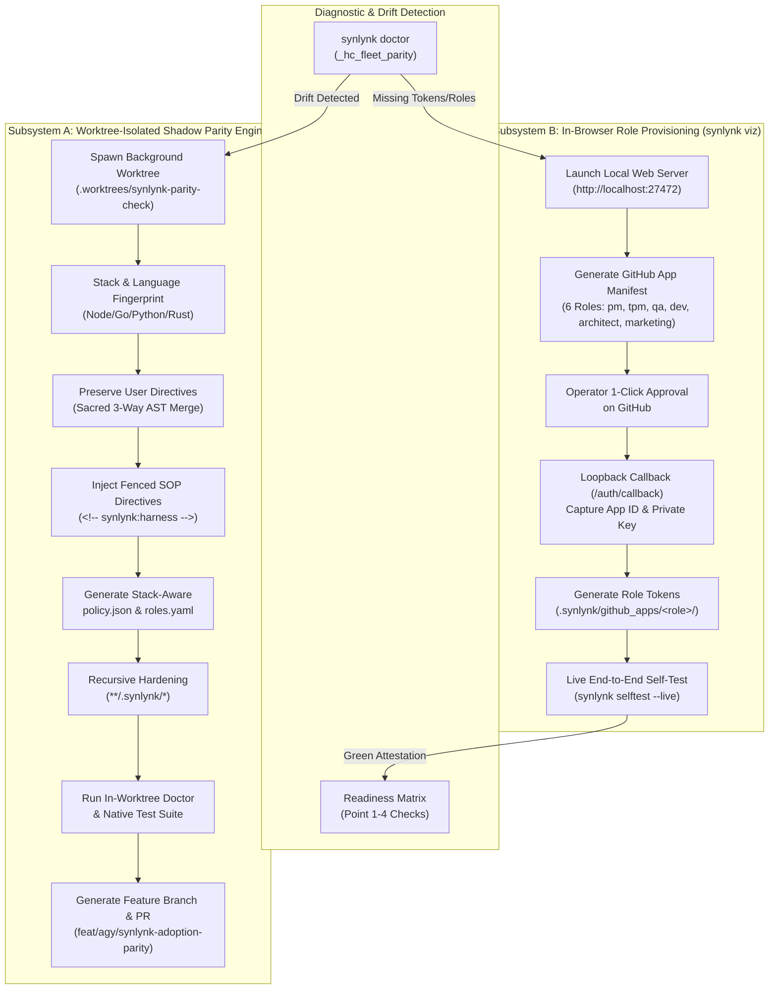
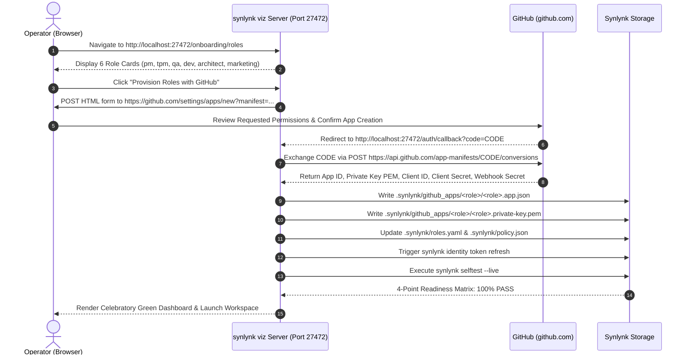

# Architectural Design Specification: Safe Fleet Parity Migration Engine & In-Browser Role Provisioning Wizard

- **Tracking Goals:** `goal-250b6fb2` (Dynamic Home Harness Orchestrator Parity), `goal-8f64eff5` (Durable Platform Health & Performance), `goal-85656c82` (Developer Experience 1.0)
- **Authors:** AGY (Gemini) [@agy], Nikhil Soman [@nikhilsoman], Codex [@codex]
- **Date:** 2026-09-12
- **Status:** Approved Architecture / Ready for Implementation Planning
- **Target Milestone:** **v0.20.1 (Safe Fleet Parity & Autonomous Web Onboarding)**

---

## 1. Executive Summary & Problem Context

Following the initial adoption parity intervention on `Dialify/rxcc` (PR #1149 merged) and a systematic multi-repository ecosystem audit across 8 local workspaces (`synlynk`, `rxcc`, `cc-videoreframing`, `hitchcock`, `playblazer-ng`, `ccmyca`, `symphony`, `bhrt`), two systemic architectural bottlenecks were identified:

1. **Fleet Drift & Fragile Upgrade Pathways:**
   Early adopter repositories drifted from modern Synlynk v0.20.0+ standards. When operators attempt to update these repositories, existing commands (`synlynk join`, `synlynk migrate`, `synlynk instructions update`) risk overwriting user-authored domain steering rules, injecting unwanted Python-specific branch protection rules into non-Python repositories, or leaking untracked `.synlynk` files from subdirectories into git.
2. **Role Provisioning & Verification Friction:**
   Configuring autonomous workspace agent roles (`pm`, `tpm`, `qa`, `dev`, `architect`, `marketing`) via raw terminal commands requires tedious manual setup of multiple GitHub Apps, key copying, and token resolution. When credentials fail or policies drift, the diagnostic matrix was clouded by bugs (such as the Point 3 Policy Authority mismatch in `synlynk/readiness.py`).

This specification establishes a robust, dual-subsystem solution:
- **Subsystem A:** The **Worktree-Isolated Shadow Parity Engine (`synlynk heal --parity`)**, an automated, stack-aware, non-destructive migration engine that executes all parity operations inside an isolated background worktree and validates them before presenting a PR.
- **Subsystem B:** The **`synlynk viz` In-Browser Role Provisioning Wizard**, an interactive local web UI that generates GitHub App Manifests for all 6 canonical workspace roles, captures OAuth callbacks, writes credentials to `.synlynk/github_apps/`, configures `.synlynk/roles.yaml` and `.synlynk/policy.json`, and runs a live 4-point readiness self-test.



---

## 2. Review Findings: Verification of RxCC & Core Fixes

Claude's post-repair verification of `rxcc` and our deep inspection of the Synlynk core codebase surfaced three critical insights:

### 2.1 The Point 3 Policy Authority Bug (Resolved)
- **Issue:** In `synlynk/readiness.py:check_point_3_policy_authority()`, the validator inspected `.synlynk/policy.json` exclusively for top-level authority keys (`task_allocation`, `*_authority`). However, modern 2-tier workspace policies produced by Synlynk wrap overrides within an `"overrides"` dictionary. Consequently, valid repositories (including `synlynk` itself) triggered a false-positive `WARN: policy.json contains no task_allocation or authority rules`.
- **Resolution:** `readiness.py` now inspects both top-level and `"overrides"`-nested keys for `dev_authority`, `task_allocation`, `merge_authority`, etc., and verifies `schema_version`. All 12 tests in `tests/test_readiness_matrix.py` now pass cleanly.

### 2.2 Subpackage `.gitignore` Leakage
- **Issue:** In multi-package or monorepo repositories (e.g. `apps/`, `infra/`, `packages/`), `.gitignore` files containing `.synlynk/*` only anchor to the root directory. Nested `.synlynk/` state folders created during subagent dispatches leak into `git status` as untracked files.
- **Specification:** The parity engine enforces recursive gitignore syntax:
  ```gitignore
  # synlynk state & secret stores
  **/.synlynk/*
  !**/.synlynk/config.json
  !**/.synlynk/policy.json
  !**/.synlynk/roles.yaml
  !**/.synlynk/instructions.json
  !**/.synlynk/model_rates.json
  ```

### 2.3 Project-Docs Mirror Staleness & Alias Normalization
- **Issue:** Repositories with custom documentation naming (e.g., `rxcc_memory.md`, `rxcc_costs.md`) failed standard sync scripts that looked only for `project-docs/memory.md`.
- **Specification:** Migration playbooks must map repository-scoped document aliases into standard Synlynk canonical tracking while preserving local file references.

---

## 3. Subsystem A: Worktree-Isolated Shadow Parity Engine (`synlynk heal --parity`)

### 3.1 Guiding Invariants
1. **Sacred User-Authored Content:** Code and documentation outside explicit `<!-- synlynk:start -->` and `<!-- synlynk:harness -->` boundaries must never be overwritten, modified, or truncated.
2. **Worktree Isolation (Approach A):** All remediation changes (fences, configs, policies, profiles) are executed in a temporary git worktree (`.worktrees/synlynk-parity-check`). The working tree of the user's active branch is never dirtied during the parity run.
3. **Stack-Aware Policy Generation:** The engine identifies the project's native build and test tooling:
   - Node / TS (`package.json`, `pnpm-lock.yaml`, `bun.lockb`): Configures Vitest/Jest/Fastify checks; assigns frontend/CSS to `agy`, API/canvas to `grok`, core logic/review to `codex`.
   - Go (`go.mod`): Configures `go test ./...` and `golangci-lint`.
   - Python (`pyproject.toml`, `setup.py`): Configures `pytest` and `ruff`/`mypy`.
   - Pulumi / Terraform / Infra: Configures preview/validation checks.
   Never injects Python branch-protection matrix defaults into non-Python repositories.
4. **Deterministic Closed-Loop Verification:** The worktree must successfully pass `synlynk doctor` and the repo's native test suite before committing and opening a Pull Request.

### 3.2 CLI Command & Doctor Integration
- **CLI Invocations:**
  - `synlynk heal --parity [--dry-run] [--branch <name>]`
  - `synlynk doctor --parity`: Runs diagnostic check `_hc_fleet_parity`. If drift is detected, outputs:
    ```
    [WARN] FLEET_PARITY_DRIFT: Repository lacks modern TC-5 SOP fences or policy.json.
    Run `synlynk heal --parity` to create a verified, worktree-isolated migration PR.
    ```

### 3.3 Parity Remediation Step Sequence
1. **Preflight Check:** Verify clean git status or warn operator; check that git worktree capability is available.
2. **Worktree Creation:** `git worktree add .worktrees/synlynk-parity-check -b feat/agy/synlynk-adoption-parity`.
3. **Language & Framework Fingerprinting:** Read workspace files to determine ecosystem, package manager, and test runner.
4. **Directive Fencing:**
   - Detect existing directive files (`CLAUDE.md`, `GEMINI.md`, `AGENTS.md`, `GROK.md`).
   - Create missing directive files (e.g. `GROK.md` if absent).
   - Inject or update `<!-- synlynk:start version="0.20.1" tool="..." -->` and `<!-- synlynk:harness -->` SOP blocks (PR Review Discipline, Herdr Workspace Protocol, Brainstorm-First Policy, Design->Plan->Build sequence, Capability Matrix).
   - Preserve all user-authored headers, domain guidance, and architecture rules intact.
5. **Policy & Role Configuration:**
   - Generate `.synlynk/policy.json` tailored to detected tech stack.
   - Generate `.synlynk/roles.yaml` and `.agents/` profiles (`claude.json`, `agy.json`, `codex.json`, `grok.json`).
   - Populate `.synlynk/model_rates.json` with standard cost baseline.
6. **Gitignore Hardening:** Inject `**/.synlynk/*` rules with whitelist exceptions.
7. **In-Worktree Verification:**
   - Execute `synlynk doctor` in the worktree.
   - Execute native test command (e.g. `npm test`, `go test`, or `pytest`).
8. **PR Generation:** Commit changes with proper trailers (`Co-Authored-By: AGY <noreply@antigravity.dev>`), push branch, and emit PR link.

---

## 4. Subsystem B: In-Browser Role Provisioning Wizard (`synlynk viz`)

### 4.1 Motivation & User Journey
Setting up GitHub Apps for multiple autonomous roles (`pm`, `tpm`, `qa`, `dev`, `architect`, `marketing`) is the highest barrier to entry for unattended fleet operations. The `synlynk viz` Web Wizard automates this entirely using GitHub's **App Manifest Flow**.



### 4.2 Automatic Trigger Points
The `synlynk viz` wizard triggers automatically under the following conditions:
1. **Interactive CLI Commands:** When the operator runs `synlynk init`, `synlynk join`, or `synlynk heal --parity` in a terminal, if role credentials are missing, Synlynk prompts:
   ```
   [ACTION] Role credentials missing for 6 workspace roles.
   Launching synlynk viz in your browser to complete 1-click GitHub App provisioning:
   --> http://localhost:27472/onboarding/roles
   ```
2. **Doctor Suggestion:** When `synlynk doctor` or `synlynk doctor --readiness` detects Point 1 failure (missing role tokens), it outputs a direct clickable link to open the Vizor setup screen.
3. **Standalone Web Access:** Visiting `http://localhost:27472` in any workspace lacking credentials automatically displays a banner: `Workspace Roles Not Configured — Start Provisioning Wizard`.

### 4.3 GitHub App Manifest Specification
Each role app is provisioned with scoped permissions:
- **`qa` Role:**
  - Name: `synlynk-qa-[repo-name]`
  - Permissions: `pull_requests: write`, `issues: write`, `checks: write`, `contents: write`, `metadata: read`
  - Events: `pull_request`, `pull_request_review`
- **`dev` / `architect` / `marketing` / `pm` / `tpm` Roles:**
  - Standardized per-role manifests generated dynamically with unique names, redirect URLs (`http://localhost:27472/auth/callback`), and specific permission sets matching the role charter.

### 4.4 Live Self-Test Verification (`synlynk selftest --live`)
Upon capturing credentials, the wizard executes a live verification sequence:
1. **Point 1 (Role Tokens):** Verifies that private keys can generate valid GitHub installation tokens (`refresh_installation_token`).
2. **Point 2 (Sandbox Egress):** Verifies outbound HTTPS connectivity to `api.github.com:443`.
3. **Point 3 (Policy Authority):** Validates `.synlynk/policy.json` rules and authority mappings using the updated `readiness.py`.
4. **Point 4 (Git Shim):** Verifies that `~/.synlynk/gh-shim/gh` is active and takes precedence.

The results are streamed via Server-Sent Events (SSE) or WebSockets directly to the browser UI, displaying real-time green checkmarks.

---

## 5. Fleet Remediation Playbook: Target Repositories

The local fleet audit identified three primary drifted repositories requiring parity intervention:

### 5.1 Repository 1: `cc-videoreframing` (Python / Video ML)
- **Current State:** Tier 2 (Partial/Drifted).
- **Gaps:** Missing `agy` in `config.json` `workgroup_agents`, `CLAUDE.md` missing `<!-- synlynk:start -->` and `## Herdr Workspace Protocol`, missing `policy.json`.
- **Playbook:**
  1. Launch `synlynk heal --parity` in `/Users/nikhilsoman/dev/cc-videoreframing`.
  2. Detect Python / ML stack (PyTorch, OpenCV).
  3. Inject `agy` into `workgroup_agents`.
  4. Inject modern SOP fences and Herdr protocol into `CLAUDE.md`, `GEMINI.md`, `AGENTS.md`.
  5. Generate `policy.json` with Python test commands.
  6. Run `pytest tests/` in shadow worktree.
  7. Submit and merge PR.

### 5.2 Repository 2: `playblazer-ng` (Go / TypeScript)
- **Current State:** Tier 1 (Legacy Fences Only).
- **Gaps:** Missing all `<!-- synlynk:harness -->` SOP blocks across directives, missing `policy.json`, missing `roles.yaml`.
- **Playbook:**
  1. Launch `synlynk heal --parity` in `/Users/nikhilsoman/dev/playblazer-ng`.
  2. Detect Go / TypeScript dual stack.
  3. Non-destructively inject modern SOP fences into all instruction files.
  4. Generate `policy.json` mapping Go backend to `codex`, TypeScript frontend to `agy`/`grok`.
  5. Run `go test ./...` in shadow worktree.
  6. Submit and merge PR.

### 5.3 Repository 3: `hitchcock` (Python / Node / Electron)
- **Current State:** Tier 2 (Partial/Drifted).
- **Gaps:** Missing `policy.json`, missing `roles.yaml`, unconfigured capability roles.
- **Playbook:**
  1. Launch `synlynk heal --parity` in `/Users/nikhilsoman/dev/hitchcock`.
  2. Detect Electron / Python desktop application stack.
  3. Generate `policy.json` with Electron/Node and Python authority rules.
  4. Add recursive `**/.synlynk/*` gitignore rules.
  5. Run test suite in shadow worktree.
  6. Submit and merge PR.

---

## 6. Implementation Architecture & Deliverables

The implementation will be executed in four structured phases:

1. **Phase 1: Core Parity Engine (`synlynk/parity.py` & CLI `heal --parity`)**
   - Implement `synlynk/parity.py` with stack detection, AST/fence parser, worktree orchestrator, and test runner.
   - Wire `cmd_heal_parity()` into CLI and register in `synlynk/taxonomy.py`.
   - Add `_hc_fleet_parity` check to `synlynk doctor`.
   - Add comprehensive unit tests in `tests/test_parity.py`.

2. **Phase 2: `synlynk viz` Role Provisioning Web Flow**
   - Extend `synlynk/viz.py` and web server with `/onboarding/roles` route and `/auth/callback` handler.
   - Implement GitHub App Manifest generation and conversion logic.
   - Integrate live self-test SSE/WebSocket streaming to the browser.
   - Add tests in `tests/test_viz_onboarding.py`.

3. **Phase 3: Integration & Interactive Triggering**
   - Wire automatic browser launch into `synlynk init`, `synlynk join`, and `synlynk heal --parity` when roles are unconfigured.
   - Verify non-destructive fence injection preserves user domain knowledge across real repositories.

4. **Phase 4: Fleet Remediation Execution**
   - Execute `synlynk heal --parity` across `cc-videoreframing`, `playblazer-ng`, and `hitchcock`.
   - Provision roles via `synlynk viz` and verify all repositories pass `synlynk doctor --readiness`.

---

## 7. Lifecycle Checkpoint & Next Steps

In accordance with Synlynk lifecycle directives, this approved architectural specification should be linked to an explicit GOVERNS goal:
```bash
synlynk goal create \
  --outcome "Safe Declarative Fleet Parity Migration Engine & In-Browser Role Provisioning Wizard" \
  --criterion "synlynk heal --parity safely upgrades drifted repos in isolated worktrees, synlynk viz provisions all 6 workspace roles via browser manifest flow, and target repos (cc-videoreframing, playblazer-ng, hitchcock) achieve full Tier 3 parity."
```
Once created, an execution plan (`writing-plans`) will be drafted to begin phased implementation.
