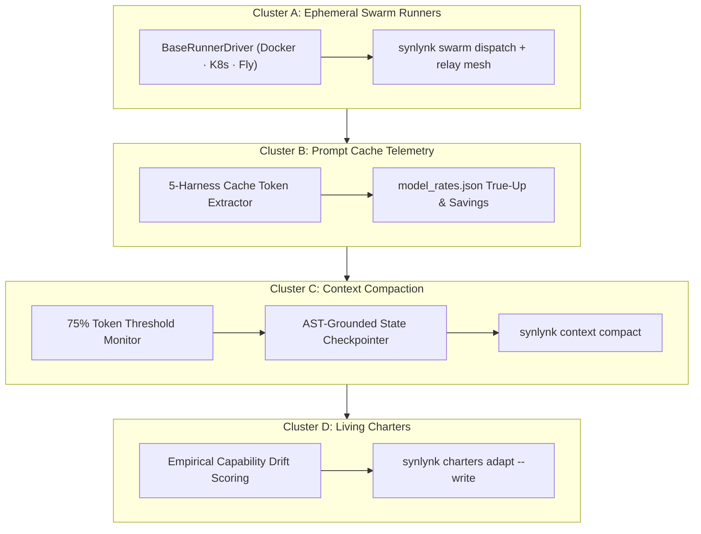

# Design Spec: Milestone v0.21.0 — Fleet Swarm Engine & Memory Compaction

- **Tracking Goals:** `goal-85656c82` (Developer Experience 1.0), `goal-8f64eff5` (Platform Health), `goal-bde24050` (State & Job Truth), `goal-005ea87d` (Fleet Parity), `goal-abecd18c` (Containerized & Cloud Execution)
- **Author:** Agy (Gemini) [@agy]
- **Collaborator / Approver:** Nikhil Soman [@nikhilsoman]
- **Date:** 2026-09-12
- **Status:** Proposed Architecture (Post-Brainstorm Consensus)
- **Target Milestone:** **v0.21.0 (Fleet Swarm Engine & Memory Compaction)**
- **Target Horizon:** 25 September 2026 (Pre-GA milestone leading to v1.0.0 Launch on 01 October 2026)

---

## 1. Executive Summary & Architectural Motivation

Milestone `v0.20.0` delivered visual comprehension (Vizor BS-6 views), automated GitHub App role provisioning, scope-bounded sparse worktree isolation, fail-closed diagnostic validation, Meta Muse next-gen harness integration, and the comprehensive LIVE-12 marketing surface remediation.

As Synlynk prepares for the **01 October 2026 Public Developer Preview Launch (v1.0.0)**, multi-agent fleet operations face four fundamental scaling constraints:

1. **Local Host Exhaustion under Swarm Fan-Out:** Running 5–20 parallel agent dispatches concurrently on a local developer machine saturates CPU, RAM, and disk I/O, frequently stalling local dev environments. Swarm workloads require offloading to on-demand, disposable containerized cloud runners (Docker, Kubernetes Jobs, Fly.io Machines) with automated TTL self-destruction.
2. **Prompt Cache Invisibility & Margin Distortion:** Modern frontier LLM harnesses (Gemini, Claude, OpenAI) offer aggressive prompt caching (up to 90% cost and latency reductions). While Synlynk records `cache_read_tokens` in SQLite, the cost engine, telemetry dashboards (`synlynk status`), and quota budgets still calculate costs unevenly across harnesses, distorting actual financial burn rates.
3. **Mid-Session Context Degradation & Amnesia:** Long-running agent orchestration sessions (especially interactive home conductors or complex refactorings) inevitably accumulate massive token contexts (100k–500k+ tokens), resulting in model hallucination, slow turnaround times, and catastrophic context-window overflow. We require a proactive, automated context compaction engine that detects threshold proximity (75%), writes a structured AST-grounded state checkpoint, and compacts conversation context safely.
4. **Static Role Charter Stagnation:** While agent charters define domain boundaries and capability baselines, agents frequently adapt or drift dynamically in real projects. Without continuous charter adaptation, static markdown charters become dead documentation. We must wire `synlynk charters adapt` to calculate empirical capability drift from telemetry and auto-propose living charter amendments.

Milestone `v0.21.0` unifies these capabilities into **4 tightly integrated clusters**:



---

## 2. Detailed Technical Specification

### Cluster A: Ephemeral Swarm Execution Infrastructure (#1341)

#### A.1 Pluggable Runner Driver Contract (`synlynk/runners/base.py`)
All swarm execution backends adhere to an abstract driver interface:

```python
from abc import ABC, abstractmethod
from typing import Dict, Any, List, Optional, Generator

class BaseRunnerDriver(ABC):
    """Abstract interface for disposable, isolated swarm execution runners."""

    @abstractmethod
    def provision(self, job_spec: Dict[str, Any]) -> str:
        """Provisions and launches an isolated execution runner. Returns unique runner_id."""
        pass

    @abstractmethod
    def get_status(self, runner_id: str) -> Dict[str, Any]:
        """Returns runner lifecycle status: pending, running, completed, failed, destroyed."""
        pass

    @abstractmethod
    def stream_logs(self, runner_id: str) -> Generator[str, None, None]:
        """Yields execution logs in real-time from the runner."""
        pass

    @abstractmethod
    def collect_artifacts(self, runner_id: str, target_dir: str) -> List[str]:
        """Transfers produced git patches, commits, and logs back to the local repository."""
        pass

    @abstractmethod
    def destroy(self, runner_id: str, force: bool = False) -> bool:
        """Terminates runner and destroys underlying cloud compute resources."""
        pass
```

#### A.2 Multi-Cloud Runner Implementations
1. **Local Container Driver (`synlynk/runners/docker.py`):**
   - Spawns isolated Docker containers from `synlynk-worker:latest` with dedicated cgroups, restricted memory (e.g. `--memory 4g`), non-root user, and read-only host mounts except for the scoped worktree.
2. **Kubernetes Job Driver (`synlynk/runners/k8s.py`):**
   - Deploys single-replica Kubernetes `Batch/v1 Job` specs to a configured namespace (local k3s, Minikube, or remote cluster).
   - Configures `ttlSecondsAfterFinished: 120` to guarantee zero dangling cloud resources upon job completion or termination.
3. **Fly.io Machine Driver (`synlynk/runners/fly.py`):**
   - Uses lightweight REST API requests to create ephemeral microVMs in closest geographical regions.
   - Configures `auto_destroy: true` and a hard timeout (e.g. 15 minutes) ensuring fail-safe destruction.

#### A.3 Swarm CLI & Relay Event Mesh
- **Command:** `synlynk swarm dispatch --driver <docker|k8s|fly> --batch-size <N> --task "<prompt>"`
- Emits real-time progress events over `synlynk relay` with event type `runner_progress` and status tracking in `state.db:swarm_runners`.
- **Destruction Guard:** `synlynk swarm destroy [--all | <runner-id>]` safely reaps orphaned instances.

---

### Cluster B: Prompt Cache Telemetry True-Up & Analytics

#### B.1 Cache Token Extraction Parity
Ensure all 5 harnesses record prompt caching metrics uniformly into `costs.py` and `db.py`:
- **Agy / Gemini:** Extracts `cached_content_token_count` from `usage_metadata`.
- **Claude:** Extracts `cache_read_input_tokens` and `cache_creation_input_tokens` from Anthropic usage response.
- **Codex / OpenAI:** Extracts `prompt_tokens_details.cached_tokens`.
- **Grok:** Fallback normalized parser matching structured JSON stdout tokens.
- **Meta Muse:** Extracts `cached_prompt_tokens` from standard CLI execution summaries.

#### B.2 Cost Model True-Up
In `.synlynk/model_rates.json`, define explicit tier pricing for cached reads:
```json
{
  "gemini-2.5-pro": { "input": 0.00125, "output": 0.00500, "cache_read": 0.0003125 },
  "claude-3-5-sonnet": { "input": 0.00300, "output": 0.01500, "cache_read": 0.0003000 },
  "gpt-4o": { "input": 0.00250, "output": 0.01000, "cache_read": 0.0012500 }
}
```
Compute precise financial savings:
$$\text{Savings USD} = \frac{\text{cache\_read\_tokens}}{1000} \times (\text{Rate}_{\text{input}} - \text{Rate}_{\text{cache\_read}})$$

#### B.3 Status & Telemetry Visualization
- Update `synlynk status` and Vizor Cockpit to display:
  - Cache Hit Ratio: `[Cache Efficiency: 84.2% · $42.18 saved this week]`
  - Real-time token breakdown in `project-docs/costs.md`.

---

### Cluster C: Autonomous Context Compaction Engine

#### C.1 Token Threshold Detection
Implement active session token monitoring in `synlynk/context_compactor.py`:
- Tracks estimated active context window usage against harness-specific context limits:
  - Claude 3.5 Sonnet: 200,000 tokens
  - Codex / GPT-4o: 128,000 tokens
  - Gemini Pro: 1,000,000 tokens
- When context reaches **75% of context window**:
  - Automatically raises a warning alert in `.synlynk/sentinel.md` (`CONTEXT_BUDGET_WARNING`).
  - Injects `⚠️ Compaction imminent` rescue checklist into active devlogs.

#### C.2 AST-Grounded State Checkpointer
Prior to context compaction, the engine executes an atomic snapshot:
1. Gathers all open PRs, active story IDs, modified files, and recent test results.
2. Parses key symbol changes via Tree-sitter / AST analysis.
3. Generates a dense, highly structured Markdown resumption ledger:
   ```markdown
   <!-- SYNLYNK_CONTEXT_COMPACTION_RESUME -->
   ## Resumption Milestone: Task 3 of BS-22
   - Active Branch: `feat/codex/swarm-k8s`
   - Verified Passing: 142/142 tests
   - Next Action: Wire K8s volume mount in synlynk/runners/k8s.py:L124
   ```
4. Appends snapshot to `project-docs/devlogs/<agent>.md` and updates `state.db:session_checkpoints`.

#### C.3 Safe Memory Compaction Pipeline
- **CLI:** `synlynk context compact [--threshold 0.75] [--dry-run]`
- Truncates historical conversational noise while preserving:
  - Role charter and project rules.
  - Active session authority and constitutional precedence banner.
  - The latest structured resumption milestone ledger.

---

### Cluster D: Living Charter Adaptation Loops (`synlynk charters adapt`)

#### D.1 Empirical Capability Drift Scoring
`synlynk/charters.py` calculates divergence between an agent's declared charter and its actual empirical dispatch history over the preceding 30 days:
1. Gathers all completed jobs from `jobs` table filtered by `agent_role`.
2. Extracts domain touches (e.g. `cli`, `web`, `infra`, `testing`) and test pass rates.
3. Compares empirical distributions against declared charter keywords and tools using Euclidean distance:
   $$\text{Drift Score} = \sqrt{\sum_{i} (p_{\text{empirical}, i} - p_{\text{charter}, i})^2}$$

#### D.2 Automated Charter Amendment Proposals
When `Drift Score > 0.25`:
- Generates a candidate charter patch in `docs/charters/proposals/YYYY-MM-DD-<role>-amendment.md`.
- Formulates specific proposed updates:
  - Expanded tool permissions (e.g. adding `run:shell` or `run:network` if empirical work repeatedly required it).
  - Updated domain tags (e.g. adding `infra` to `Agy` or `web` to `Codex`).
  - Adjusted capability baselines in `docs/harness-capability-baseline.md`.

#### D.3 Interactive & Unattended Promotion
- `synlynk charters adapt`:
  - Default: Dry-run mode displaying drift analysis table and pending proposals.
  - `--write-proposals`: Commits proposal files to git.
  - `--approve <role>`: Automatically increments charter revision number in `state.db:agent_charters` and updates active agent profiles.

---

## 3. Sprint & Cluster Rollout Plan

| Sprint | Focus | Primary Deliverables | Target Gate |
| :--- | :--- | :--- | :--- |
| **Sprint 1** | **Cluster A (Swarm Infrastructure)** | `BaseRunnerDriver`, `DockerDriver`, `K8sJobDriver`, `synlynk swarm dispatch`, `synlynk swarm destroy`. | 10 parallel swarm workers execute and report via relay with zero host lockup. |
| **Sprint 2** | **Cluster B (Prompt Cache True-Up)** | 5-harness cache token parser, pricing ledger true-up, `synlynk status` cache savings readout. | Verified cache hit reporting across test dispatches; zero cost discrepancy. |
| **Sprint 3** | **Cluster C (Context Compaction)** | Context threshold sentinel, AST state snapshotter, `synlynk context compact` pipeline. | Simulated 80% context session compacts cleanly without losing active task threads. |
| **Sprint 4** | **Cluster D (Living Charters)** | Drift calculation engine, charter proposal generator, `synlynk charters adapt --write-proposals`. | Live drift analysis on real repo history generates valid SFIA-compliant charter updates. |
| **Sprint 5** | **Milestone v0.21.0 Release Ceremony** | `synlynk release --version v0.21.0`, docs PDF/EPUB recompile, website features matrix update. | 100% CI pass rate (2,800+ tests), green EPUBCheck, clean QA approval. |

---

## 4. Verification & Testing Strategy

1. **Unit & Contract Testing:**
   - `tests/test_runners.py`: Mock provision/destroy lifecycle for Docker, Kubernetes, and Fly drivers.
   - `tests/test_prompt_cache_telemetry.py`: Verify token parsing and cost calculation across simulated provider payloads.
   - `tests/test_context_compaction.py`: Verify AST state snapshot generation, threshold triggers, and preservation of resumption ledgers.
   - `tests/test_charters_adaptation.py`: Verify drift calculation math and charter proposal formatting.
2. **Integration & Preflight Testing:**
   - Full `pytest tests/ -v -n 4` test execution under Python 3.10 and 3.12.
   - `synlynk doctor` attestation ensuring new runner drivers and cache configs pass with zero regressions.
   - `synlynk pr check` attestation before every PR merge.

---

## 5. Risk Assessment & Mitigations

| Risk | Impact | Probability | Mitigation |
| :--- | :--- | :--- | :--- |
| **Dangling Cloud Swarm Runners** | High ($ cost leak) | Medium | Hard fail-safe TTL (`ttlSecondsAfterFinished` in K8s, `auto_destroy` in Fly) enforced at runner creation time regardless of daemon state. |
| **Premature Context Truncation** | High (Lost task context) | Low | Multi-stage confirmation: state snapshot written to disk before memory compaction is allowed to alter session prompt. |
| **Erroneous Charter Drift Alerts** | Low (Noise) | Medium | Minimum sample size threshold (requires $\ge 5$ completed jobs in 30 days before calculating drift). |
| **Provider Token Schema Variance** | Medium (Telemetry drift) | Low | Defensive token extractor falling back to regex parsing on raw stdout if structured JSON payload omits cache keys. |
