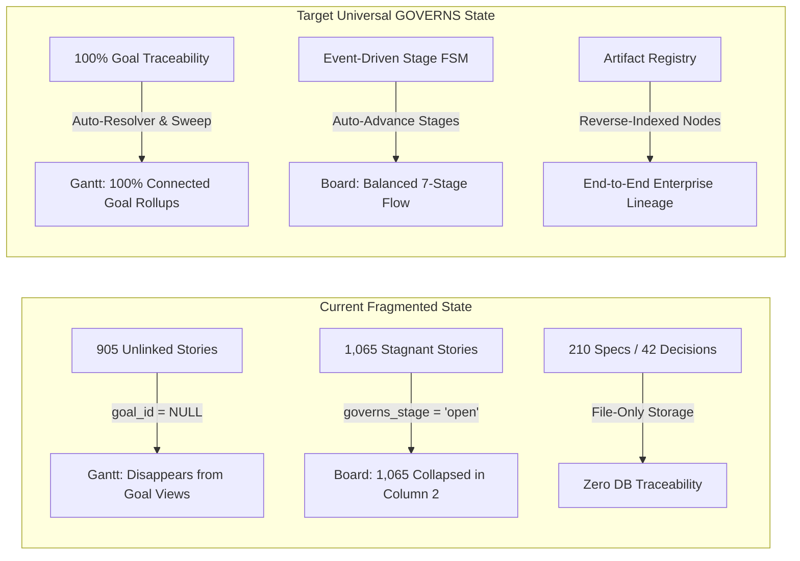
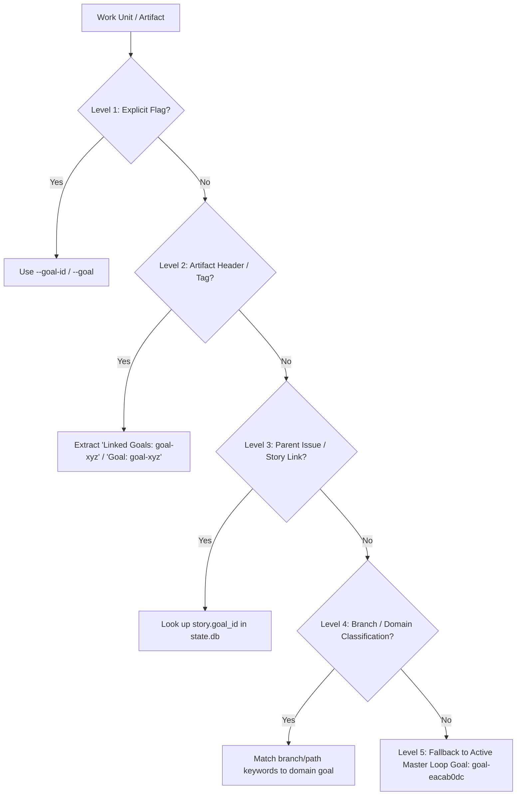
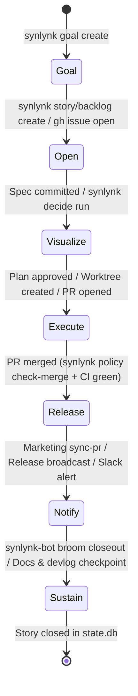

# Universal GOVERNS Lifecycle Auto-Association, Stage Progression & Vizor Reconciliation — Architectural Design Spec

**Date:** 2026-09-26  
**Status:** In Review (Drafted for User Sign-Off)  
**Author:** Agy (Home Conductor & Lead Architect), reviewed with Nikhil Soman  
**Governing Master Goal:** `goal-eacab0dc` (*Universal GOVERNS enforcement: every prompt/action in a synlynk-managed workspace belongs to something above it and triggers something below it*)  
**Related Goals:** `goal-e3840370` (*Vizor Control Plane*), `goal-bc0011cd` (*PR Check GOVERNS Enforcement*), `goal-90e73dfd` (*Lifecycle Directives*), `goal-8f64eff5` (*Durable Platform Health*)  
**Active Tracking Stories:** `story-adb0f757` (Issue #1792), `story-governs-universal-engine`  

---

## 1. Executive Summary & Problem Statement

In the Synlynk autonomous engineering ecosystem, all work is structured around the **7-stage GOVERNS lifecycle**:
$$\text{GOVERNS} = \mathbf{G}\text{oal} \longrightarrow \mathbf{O}\text{pen} \longrightarrow \mathbf{V}\text{isualize} \longrightarrow \mathbf{E}\text{xecute} \longrightarrow \mathbf{R}\text{elease} \longrightarrow \mathbf{N}\text{otify} \longrightarrow \mathbf{S}\text{ustain}$$

### 1.1 Empirical Audit Findings (Current State)
A deep scan of the canonical state database (`state.db`), codebase, and documentation repositories reveals three critical systemic gaps:

1. **85% Goal Unlinkage (905 / 1,066 Stories Unlinked):**
   - `Total Stories: 1,066 | Linked to Goal: 161 (15.1%) | Unlinked: 905 (84.9%)`
   - While 210 specs and 180 plans exist in `docs/superpowers/`, only 39 specs explicitly declare a parent `goal-*`.
   - Stories and issues minted during interactive sessions or discovered during background jobs frequently omit `--goal-id`.
2. **99.9% Stage Stagnation (1,065 / 1,066 Stories Stuck at `open`):**
   - `GOVERNS Stage Distribution: open: 1,065 | sustain: 1`
   - Even though 147 stories have `status = 'done'` and dozens of PRs have been merged, the database `governs_stage` attribute is never systematically transitioned across lifecycle milestones.
3. **Artifact Disconnection:**
   - Artifacts generated during user sessions (brainstorm specs, architecture plans, `synlynk decide` records in `project-docs/decisions/`, PRs, and scratch diagrams) exist purely on the filesystem without reverse-indexed registration in `state.db`.
4. **Degraded Vizor Visibility:**
   - **Vizor Board (`board.html`):** Renders a 7-column kanban by `governs_stage`. Because 99.9% of items are `open`, 1,065 cards collapse into the "Open" column while "Visualize", "Execute", "Release", "Notify", and "Sustain" remain empty.
   - **Vizor Dual-Pivot Gantt (`gantt.html`):** In Goal-First Pivot, unlinked stories disappear entirely from goal rollups.



---

## 2. Core Architectural Pillars

To guarantee **100% GOVERNS adherence** across all work units without imposing manual ceremony on engineers or AI agents, this architecture introduces four interconnected systems:

1. **Goal Kinds & Dual-Track Model (`loop` vs `feature`):**
   - Establishes persistent operating goals (e.g. `goal-eacab0dc` Universal GOVERNS, `goal-8f64eff5` Durable Health) vs finite feature goals.
2. **Deterministic Context Auto-Resolver (`synlynk/governs_resolver.py`):**
   - Multi-tier zero-friction heuristic that resolves parent goals from headers, branch naming, issue trackers, and workspace context.
3. **Event-Driven Lifecycle State Machine (FSM):**
   - Automatically advances `stories.governs_stage` in response to workspace events (`spec committed`, `plan approved`, `PR open`, `PR merged`, `sentinel cleared`, `checkpoint saved`).
4. **Artifact-to-GOVERNS Registry & One-Command Sweep (`synlynk governs sweep`):**
   - Discovers, links, and indexes all specs, plans, decisions, issues, and PRs, reconciling `state.db` to 100% integrity.

---

## 3. Detailed Specifications

### 3.1 Goal Architecture: `feature` vs `loop` Goals

In accordance with Issue #1792, `state.db` `goals` schema is extended to support goal types:

```sql
ALTER TABLE goals ADD COLUMN kind TEXT NOT NULL DEFAULT 'feature';
-- Values: 'feature' | 'loop'
```

| Goal Kind | Lifecycle Behavior | Termination Condition | Example Goals |
| :--- | :--- | :--- | :--- |
| **`feature`** | Finite milestone arc. Advances from `active` $\rightarrow$ `done` when all linked stories complete. | All acceptance criteria satisfied. | `goal-e3840370` (Vizor Control Plane), `goal-c7113f58` (Strategic Expansion) |
| **`loop`** | Persistent operating loop. Never marked `done`; remains `active` until explicitly `superseded`. Requires $\ge 1$ live operating loop story. | Superseded by architectural mandate. | `goal-eacab0dc` (Universal GOVERNS), `goal-8f64eff5` (Durable Platform Health) |

---

### 3.2 Deterministic Goal Auto-Resolver (`synlynk/governs_resolver.py`)

When any work unit (story, issue, spec, plan, decision, or PR) is created or modified, the `GovernsResolver` determines its parent `goal_id` via a deterministic 5-level fallback waterfall:



#### Resolution Heuristics:
1. **Level 1 (Explicit Argument):** `--goal-id <id>` passed to CLI.
2. **Level 2 (Artifact In-Band Metadata):** Scans file top 30 lines for `Linked Goals:`, `Governing Goal:`, or frontmatter `goal: goal-xyz`.
3. **Level 3 (Parent Entity Inheritance):** If referencing an issue (e.g. `#1787`), lookup issue/story's existing `goal_id`.
4. **Level 4 (Domain & Branch Semantic Heuristic):**
   - Paths matching `synlynk/viz*`, `board.html`, `gantt.html`, `tube.html` $\longrightarrow$ `goal-e3840370` (Vizor Master Control Plane).
   - Paths matching `docs/book/` $\longrightarrow$ `goal-0c4e96ff` (Book Manuscript).
   - Paths matching `synlynk/testbed*`, `tests/` $\longrightarrow$ `goal-9011307c` (Frontier QA Testbed).
   - Paths matching `synlynk/models*`, `synlynk/quota*` $\longrightarrow$ `goal-c75ff209` (Model Catalog & Quota).
5. **Level 5 (Default Master Goal):** Defaults to master loop goal `goal-eacab0dc` (*Universal GOVERNS Enforcement*).

---

### 3.3 Event-Driven 7-Stage Lifecycle State Machine (FSM)

The lifecycle stage transitions deterministically based on verified workspace events:



| GOVERNS Stage | Entry Trigger Events | Associated Artifacts & Commands | `state.db` Mutations |
| :--- | :--- | :--- | :--- |
| **1. `goal`** | `goal_created` | `synlynk goal create`, `project-docs/roadmap.md` | `INSERT INTO goals` |
| **2. `open`** | `story_created`, `backlog_captured`, `issue_opened` | `synlynk story create`, `synlynk backlog capture`, `gh issue create` | `INSERT INTO stories (governs_stage='open')` |
| **3. `visualize`** | `spec_committed`, `decide_recorded`, `diagram_rendered` | `docs/superpowers/specs/*.md`, `synlynk decide`, `project-docs/decisions/` | `UPDATE stories SET governs_stage='visualize'` |
| **4. `execute`** | `plan_approved`, `worktree_added`, `pr_opened` | `docs/superpowers/plans/*.md`, `git worktree add`, `gh pr create` | `UPDATE stories SET governs_stage='execute'` |
| **5. `release`** | `pr_merged`, `qa_gate_passed` | `gh pr merge --squash`, `synlynk policy check-merge` | `UPDATE stories SET governs_stage='release'` |
| **6. `notify`** | `marketing_synced`, `broadcast_emitted` | `synlynk marketing sync-pr`, `synlynk relay broadcast` | `UPDATE stories SET governs_stage='notify'` |
| **7. `sustain`** | `closeout_completed`, `devlog_checkpoint_saved` | `synlynk job closeout`, `synlynk checkpoint`, `synlynk doctor` | `UPDATE stories SET governs_stage='sustain', status='done'` |

---

### 3.4 In-Session Artifact Registration & Reverse Indexing

All user-agent collaboration artifacts are automatically registered in `state.db`:

1. **`synlynk decide` Decision Records:**
   - Extend `decisions` table in `state.db` with `goal_id` and `story_id`.
   - On `synlynk decide --record`, auto-resolve parent `goal_id`, insert record, and emit `visualize` stage event.
2. **Brainstorm Specs & Implementation Plans:**
   - Extend `synlynk checkpoint` and git pre-commit hooks to scan newly staged `docs/superpowers/specs/*.md` and `docs/superpowers/plans/*.md`.
   - Auto-mint or update matching stories in `state.db` with direct links to file paths.
3. **PR Check Gating (`synlynk pr check`):**
   - Upgrades `goal-bc0011cd`: `synlynk pr check` checks that the active branch's story has a valid `goal_id`.
   - If unlinked, attempts JIT auto-resolution; if impossible, raises a warning or block depending on `--strict` flag.

---

### 3.5 One-Command Fleet Reconciliation (`synlynk governs sweep`)

A purpose-built CLI command to eliminate historical debt and maintain continuous 100% adherence:

```bash
synlynk governs sweep [--dry-run] [--strict] [--verbose]
```

#### Sweep Execution Workflow:
1. **Story Backfill Sweep:**
   - Scans all 1,066 stories in `state.db`.
   - For stories with `goal_id IS NULL`:
     - Checks linked GitHub issue labels and milestones.
     - Checks matching spec/plan files in `docs/superpowers/`.
     - Analyzes domain keywords (`viz`, `harness`, `testbed`, `book`, `mesh`).
     - Backfills resolved `goal_id`.
2. **Stage Progression Sweep:**
   - For stories marked `done` $\longrightarrow$ advance `governs_stage` to `sustain` (or `release`).
   - For stories with open PRs $\longrightarrow$ advance `governs_stage` to `execute`.
   - For stories with committed specs but no PR $\longrightarrow$ advance `governs_stage` to `visualize`.
3. **Artifact Harvesting Sweep:**
   - Scans all 210 specs, 180 plans, and 42 decision records.
   - Registers unindexed artifacts into `state.db` stories and contributions ledger.
4. **Vizor Cache Regeneration:**
   - Emits SSE update and regenerates `board.html` and `gantt.html` projections so all cards immediately populate across all 7 columns.

---

## 4. Vizor Control Plane Impact & User Experience

```mermaid
graph TD
    subgraph Vizor Board (board.html)
        C1[Column 1: Goal<br/>35 Goals Active/Done]
        C2[Column 2: Open<br/>Backlog & Unscheduled]
        C3[Column 3: Visualize<br/>Specs & Decision Panels]
        C4[Column 4: Execute<br/>In-Flight PRs & Worktrees]
        C5[Column 5: Release<br/>Merged PRs & Attested Builds]
        C6[Column 6: Notify<br/>Release Notes & Broadcasts]
        C7[Column 7: Sustain<br/>Pruned & Healthy Stories]
    end

    subgraph Vizor Dual-Pivot Gantt (gantt.html)
        P1[Pivot: Goal-First<br/>100% Story Association]
        P2[Pivot: Role-First<br/>Agent Fleet Workload]
    end
```

- **Interactive Kanban Flow:** Cards flow dynamically across all 7 columns instead of piling into Column 2.
- **Goal Rollups on Gantt:** The Goal-First pivot displays accurate progress bars ($N/M$ stories done, token spend, and delivery trajectory) for every active goal.
- **Deep-Linked Artifact Cards:** Clicking a card in the "Visualize" or "Execute" column links directly to its underlying Markdown spec, plan, decision record, or GitHub PR.

---

## 5. Implementation Roadmap & Milestones

| Task # | Scope | Key Files | Verification Test |
| :--- | :--- | :--- | :--- |
| **Task 1** | **Goal Kinds & DB Schema Extension** (`loop` vs `feature`) | `synlynk/db.py`, `synlynk/__init__.py` | `tests/test_goals_kinds.py` |
| **Task 2** | **Context Auto-Resolver (`GovernsResolver`)** | `synlynk/governs_resolver.py` | `tests/test_governs_resolver.py` |
| **Task 3** | **Event-Driven Lifecycle State Machine & Stage Transitions** | `synlynk/events.py`, `synlynk/db.py`, `synlynk/jobs.py` | `tests/test_governs_fsm.py` |
| **Task 4** | **Artifact Auto-Harvesting & `synlynk decide` Goal Binding** | `synlynk/team.py`, `synlynk/context.py` | `tests/test_artifact_harvesting.py` |
| **Task 5** | **`synlynk governs sweep` CLI Reconciliation Command** | `synlynk/governs_cli.py`, `synlynk/cli.py` | `tests/test_governs_sweep.py` |
| **Task 6** | **Vizor Board & Gantt Live Projection Validation** | `synlynk/board.py`, `synlynk/uxcore.py`, `synlynk/viz.py` | `tests/test_viz_governs_board.py` |

---

## 6. Verification & Acceptance Criteria

1. **Database Integrity:**
   - 0 stories in `state.db` have `goal_id IS NULL` after `synlynk governs sweep`.
   - `governs_stage` distribution accurately reflects real lifecycle states across all 7 columns.
2. **Deterministic Auto-Association:**
   - Any new story, spec, decision, or PR created in a session automatically binds to its parent goal without manual intervention.
3. **Vizor Rendering:**
   - `board.html` renders cards across all 7 columns.
   - `gantt.html` Goal-First pivot displays 100% of workspace stories mapped to their goals.
4. **Zero-Token Local Execution:**
   - All parsing, AST resolution, and SQLite updates execute locally in $< 500\text{ms}$ at $\$0.00$ token cost.
