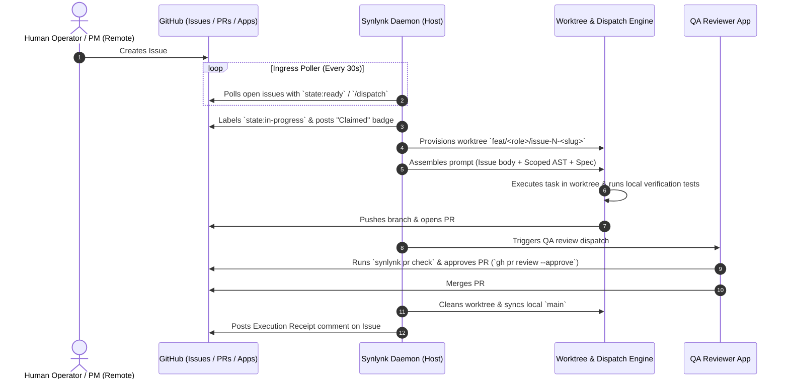

# GitHub Primary Control Surface, Autonomous Fleet Ingress & Historical Issue Enrichment — Architectural Design Spec

**Date:** 2026-09-27  
**Status:** Approved for Early Post-Review Execution (Targeting Oct 1 Milestone `goal-d3333441`)  
**Author:** Agy (Home Conductor & Lead Architect), with Nikhil Soman  
**Primary Milestone Goal:** `goal-d3333441` (*Control-plane trust and closure: every finished job is believed, and a unit of work can merge, update board/goal state, and clean up without a human holding the last step · Deadline: 2026-10-01*)  
**Governing Master Loop:** `goal-eacab0dc` (*Universal GOVERNS lifecycle enforcement: every prompt/action in a synlynk-managed workspace belongs to something above it and triggers something below it*)  
**Related Goals:** `goal-e3840370` (*Consolidated Vizor Master Control Plane*), `goal-f424fc4c` (*Build TPM Agent*), `goal-8f64eff5` (*Durable Platform Health & Sovereign Remote Operations*)  
**Execution Priority:** Slated as early execution immediately following Architecture Council & Business Reviews, provided no higher-severity blockers emerge.  
**Active Tracking Stories:** `story-gh-control-surface`, `story-issue-enrichment-engine`  

---

## 1. Executive Summary & Problem Statement

In the Synlynk autonomous engineering ecosystem, the local host machine (macOS/Linux workstation or CI server) runs the persistent daemon, SQLite `state.db` WAL, worktrees, and execution harnesses. However, **GitHub is our sole remote access and control surface** for human operators, mobile oversight, and external integrations.

```
┌────────────────────────────────────────────────────────────────────────┐
│                   GitHub (Sole Remote Control Surface)                 │
│        Issues (Work Orders)  ·  PRs (Review Gates)  ·  Projects v2      │
└──────────────────────────────────┬─────────────────────────────────────┘
                                   │
              ┌────────────────────┴────────────────────┐
              ▼ (Ingress & State Sync)                  ▼ (Egress & Artifacts)
┌────────────────────────────────────────┐┌──────────────────────────────┐
│       Synlynk Background Daemon        ││    Role-Scoped GitHub Apps   │
│  (launchd / systemd / watch poller)   ││   (dev, qa, architect, tpm)  │
└───────────────────┬────────────────────┘└──────────────┬───────────────┘
                    │                                    │
                    ▼                                    ▼
┌────────────────────────────────────────────────────────────────────────┐
│                        Local Host Workspace                            │
│    state.db (WAL) · Git Worktrees · Multi-Harness Dispatch (Codex/Agy)  │
└────────────────────────────────────────────────────────────────────────┘
```

### 1.1 Empirical Audit Findings (Current State)
A forensic review of the 456 GitHub issues in `nikhilsoman/synlynk` and the local codebase reveals five systemic blockers preventing GitHub from acting as a true primary control surface:

1. **Thin & Truncated Issue Descriptions (68% of Issues < 150 characters):**
   - Out of 456 issues, more than 310 contain only 1–2 sentences or simply repeat the title (e.g., `Auto-created from discovered work (manual: )` from `synlynk/backlog.py`).
   - While hand-crafted incident tickets (e.g., `[LIVE-13]`, `[LIVE-16]`) and major specs (e.g., `#1527`, `#1787`) are comprehensive, programmatically created issues lack context, architectural rationale, and acceptance criteria.
2. **Schema Blindspot in `state.db`:**
   - The SQLite `stories` table schema (`synlynk/db.py`) stores metadata columns (`story_id`, `title`, `engg_domain`, `discipline`, `org_domain`, `role`, `stage`, `priority`) but **has no `description`, `acceptance_criteria`, or `scoped_paths` column**.
   - Consequently, `state.db` cannot retain or export rich markdown descriptions.
3. **No Closed-Loop Remote Triggering (Inbound Ingress Gap):**
   - The background daemon (`synlynk/daemon.py`) watches local files and refreshes tokens, but does not poll GitHub for remote trigger signals (e.g., label `state:ready`, comments with `/dispatch`, or new issues).
   - An engineer outside the local shell cannot trigger an autonomous worktree dispatch purely from GitHub.
4. **Missing Execution Receipts (Outbound Resolution Gap):**
   - When a story is completed and merged into `main`, `governs_fsm` and `synlynk story done` update `state.db`, but no structured **Execution Receipt** (PR link, commit SHA, touched files diff, test verification logs, and token/dollar costs) is posted back to the GitHub issue upon closure.
5. **Historical Drift Across 450+ Legacy Issues:**
   - Past issues lack lineage links to the GOVERNS goals, PR numbers, test evidence, and telemetry that are recorded in devlogs and commit logs.

---

## 2. Core Architectural Pillars

To establish GitHub as the **first-class remote execution and visibility surface**, this architecture introduces four foundational pillars:

```mermaid
flowchart TD
    subgraph Pillar 1: Standardized Issue Schema
        A1[Machine-Readable Metadata Header] --> A2[Human-Rich Markdown Body]
        A2 --> A3[TDD Acceptance Criteria & Scope]
    end

    subgraph Pillar 2: Bidirectional Daemon Ingress Loop
        B1[GitHub Issue / Label / Comment] -->|Poll / Webhook| B2[Daemon Ingress Poller]
        B2 --> B3[Worktree Dispatch & Execution]
    end

    subgraph Pillar 3: Post-Execution Receipt Engine
        C1[PR Merge & FSM Closeout] --> C2[Generate Execution Receipt]
        C2 --> C3[Post Issue Comment & Close Issue]
    end

    subgraph Pillar 4: Retrospective Enrichment Backfill
        D1[Harvest Historical Devlogs/PRs/DB] --> D2[Synthesize Structured Markdown]
        D2 --> D3[Idempotent Batch Backfill Engine]
    end

    Pillar 1 --> Pillar 2 --> Pillar 3
    Pillar 4 -.-> Pillar 1
```

1. **Standardized Issue & Receipt Schema:** A uniform specification ensuring every issue answers *What* and *Why* before execution, and *How it went* upon completion.
2. **Autonomous Daemon Ingress Poller:** A resilient background loop in `synlynk/daemon.py` that claims `state:ready` issues or `/command` comments, provisions isolated worktrees, and orchestrates fleet execution.
3. **Automated GOVERNS Closeout Receipts:** Event-driven write-through in `governs_fsm.py` posting verified receipts (PR, commit SHA, diff, test results, cost) directly to GitHub issues.
4. **Retrospective Enrichment Engine (`synlynk issue enrich`):** An automated backfill pipeline that correlates historical PRs, devlogs, and telemetry to enrich all existing legacy issues.

---

## 3. Standardized Issue & Receipt Specification

### 3.1 Pre-Execution Issue Schema (The "What" and "Why")
Every issue created by Synlynk (CLI, TPM bot, Backlog Sync, or Human) must follow this machine-readable + human-rich markdown standard:

```markdown
<!-- synlynk:issue schema="v1" goal="goal-e3840370" role="dev" harness="codex" tier="pro" priority="p1" stage="open" -->

## Objective & Problem Statement (The "Why")
Detailed description of the problem, motivation, and expected user/system impact. Explains why this work is needed now.

## Technical Scope & Architecture (The "What")
- **Target Modules & Scoped Paths:** `synlynk/viz.py`, `synlynk/viz_views.py`, `tests/test_viz*.py`
- **AST Dependencies & Impact Radius:** Key symbols called/modified, community cluster boundaries.
- **Architectural Invariants:** Zero-SaaS host locality, air-gapped security, backward compatibility.

## Acceptance Criteria (Definition of Done)
- [ ] Feature / fix implemented per specification.
- [ ] Dedicated unit & regression tests added in `tests/test_*.py`.
- [ ] 100% test suite passing across supported Python matrix (3.10, 3.12).
- [ ] `synlynk pr check` and `qa-gate` verified green.

## Linked Artifacts & Lineage
- **Governing Goal:** `goal-e3840370` (*Consolidated Vizor Master Control Plane*)
- **Spec:** [`docs/superpowers/specs/2026-09-27-...md`](file:///docs/superpowers/specs/...)
- **Plan:** [`docs/superpowers/plans/2026-09-27-...md`](file:///docs/superpowers/plans/...)
- **Decisions:** [`project-docs/decisions/2026-09-27-...md`](file:///project-docs/decisions/...)
```

### 3.2 In-Flight Execution Status
When the daemon claims an issue for execution, it automatically adds the `state:in-progress` label and posts an execution dispatch badge:

```markdown
> 🚀 **Dispatched to Autonomous Fleet**  
> **Job ID:** `job-836e13a4` · **Branch:** `feat/codex/issue-1800-vizor-views`  
> **Assigned Role:** `dev` (`synlynk-dev[bot]`) · **Harness:** `codex` (Model Tier: `pro`)  
> **Started:** 2026-09-27 10:30:00 IST
```

### 3.3 Post-Execution Resolution Receipt (The "How It Went")
Upon PR merge and verification, the daemon transitions the issue to `closed` and appends the final execution receipt:

```markdown
### 🏁 Resolution & Execution Receipt — PR #1800

- **Pull Request:** [#1800](https://github.com/nikhilsoman/synlynk/pull/1800) (Squashed & merged to `main` at `ee8dee44`)
- **Assigned Agent:** `@agy` (Harness: `gemini-2.5-pro`)
- **Reviewer:** `@qa` (`synlynk-qa[bot]`) via `synlynk pr check`
- **Code Changes:** `+2,568 / -48 lines` across 13 files
- **Verification Evidence:** 179/179 `tests/test_viz*.py` passing (35.44s), 3,311 matrix tests green on CI
- **Resource Accounting:** 160,000 in / 25,000 out tokens · **Total Cost:** zsh.8550
- **Architectural Learnings:** Python 3.10 lacks stdlib `tomllib` (requires fallback parser in packaging tests).
```

---

## 4. Autonomous Remote Execution Architecture

To allow GitHub to drive the entire engineering lifecycle remotely, the architecture links GitHub Events with our host-local execution machinery:



### 4.1 Inbound Remote Command Trigger Lexicon
Remote operators can control the fleet by posting comments on any GitHub issue:

| Comment Trigger | Role Assigned | Action Executed by Host Daemon |
| :--- | :--- | :--- |
| `/dispatch [harness]` | `dev` | Claims issue, provisions worktree, and runs implementation. |
| `/brainstorm` | `architect` / `pm` | Initiates interactive spec drafting and posts candidate spec. |
| `/plan` | `architect` | Reads spec and generates step-by-step TDD implementation plan. |
| `/review` | `qa` | Runs full static analysis, test suite, and `synlynk pr check`. |
| `/sweep` | `tpm` | Triggers a sweep over all `state:ready` stories. |
| `/reclaim` | `synlynk-bot` | Reclaims orphaned or stalled jobs older than 30 minutes. |

---

## 5. Database Schema & Data Model Extensions

To persist rich issue descriptions and receipts locally in `state.db`, the `stories` table schema is updated:

```sql
-- Migration: Add description, criteria, and execution receipt fields to stories
ALTER TABLE stories ADD COLUMN description TEXT;
ALTER TABLE stories ADD COLUMN acceptance_criteria TEXT;
ALTER TABLE stories ADD COLUMN scoped_paths TEXT;
ALTER TABLE stories ADD COLUMN spec_path TEXT;
ALTER TABLE stories ADD COLUMN plan_path TEXT;
ALTER TABLE stories ADD COLUMN resolution_receipt TEXT;

CREATE INDEX IF NOT EXISTS idx_stories_gh_issue ON stories(gh_issue);
```

### 5.1 Auto-Migration & Backward Compatibility
- Handled transparently inside `synlynk/db.py:migrate_state_db_if_needed()`.
- If older databases lack these columns, `ALTER TABLE` runs dynamically without interrupting live workloads.

---

## 6. CLI & Tooling Upgrades

### 6.1 Upgrading `synlynk story create`
```bash
synlynk story create   --title "Dynamic Centrality LOD Zoom for Knowledge Graph"   --description "Replace static degree thresholds with dynamic percentile rank calculation..."   --criteria "L0 shows top 10% modules, Test filter default-off, 100% tests green"   --spec "docs/superpowers/specs/2026-09-25-lod-design.md"   --role dev   --goal goal-e3840370
```

### 6.2 Upgrading `synlynk backlog sync`
- Replaces 1-line generation with the full **Standardized Issue Markdown Template** (§3.1).
- Injects linked goal, acceptance criteria, and scoped paths directly into the minted GitHub issue.

---

## 7. Retrospective Enrichment Engine (`synlynk issue enrich`)

To upgrade all 456 existing issues without manual editing, we introduce the autonomous enrichment engine:

```
┌────────────────────────────────────────────────────────────────────────┐
│                   Retrospective Enrichment Pipeline                    │
├────────────────────────────────────────────────────────────────────────┤
│ 1. Harvest Context:                                                    │
│    • Linked PRs (commits, diffstat, files touched)                     │
│    • Devlogs (project-docs/devlogs/*.md entries mentioning Issue #N)   │
│    • Specs & Plans (docs/superpowers/ matching Issue #N)               │
│    • Telemetry (state.db costs & daemon_jobs for task)                 │
│                                                                        │
│ 2. Synthesize Rich Content:                                            │
│    • If Issue Body is thin (< 150 chars): Synthesize Objective, Scope, │
│      and Acceptance Criteria from PR & spec context.                   │
│    • If Closed & Missing Receipt: Generate Post-Execution Receipt.     │
│                                                                        │
│ 3. Idempotent Write-Through:                                           │
│    • gh issue edit <N> --body "..." (via role GitHub App token)        │
│    • gh issue comment <N> --body "..." (Resolution Receipt)            │
└────────────────────────────────────────────────────────────────────────┘
```

### 7.1 CLI Interface for Enrichment
```bash
synlynk issue enrich --issue 1725               # Test single issue
synlynk issue enrich --all --dry-run            # Preview all changes without writing
synlynk issue enrich --all --batch-size 20       # Run throttled fleet backfill
```

---

## 8. Security, Rate Limits & Governance

1. **Role-Scoped GitHub App Authentication:**
   - All GitHub API operations (reads, issue edits, comments, reviews, merges) use dedicated GitHub App installation tokens minted via `synlynk/github_app_auth.py`.
   - Host `gh` keyring is never required or exposed.
2. **Conditional Requests & ETag Caching:**
   - The daemon ingress poller uses `If-None-Match` / `ETags` to eliminate GitHub API rate limit consumption when no issues have changed.
3. **Reserved Approval Gates:**
   - Critical operations (breaking schema migrations, release deployments, major architectural shifts) pause and require an explicit human label `approved:human` before execution.

---

## 9. Verification & Acceptance Criteria

- [ ] **Schema Migration:** `stories` table updated with `description`, `acceptance_criteria`, `scoped_paths`, and `resolution_receipt`.
- [ ] **Standardized Minting:** `synlynk story create` and `synlynk backlog sync` generate structured markdown bodies with goal lineage.
- [ ] **Daemon Ingress Loop:** `synlynk daemon` automatically detects `state:ready` issues and `/dispatch` comments and executes them in isolated worktrees.
- [ ] **Automated Closeout Receipts:** Merging a PR automatically posts a structured execution receipt comment to the linked GitHub issue.
- [ ] **Retrospective Enrichment:** `synlynk issue enrich --all` backfills rich context and resolution receipts across historical issues #1–#456 without hitting rate limits.
- [ ] **Regression Suite:** 100% of test suite passing cleanly across Python 3.10 and 3.12.
