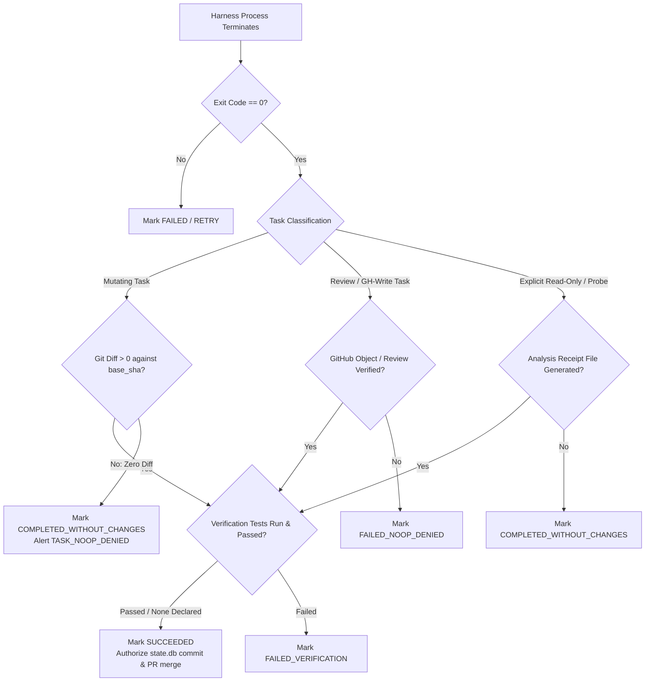

# Invariant 1: Effect-Verified Completion Contract — Design Spec

- **Status:** Approved (via Round 1 Consensus `dec-20260927-round-1`)
- **Primary Goal:** `goal-5be4eb8b` (*v1.0.0 Dev Preview Mandatory Architectural Invariants*)
- **Governing Loop:** `goal-eacab0dc` (*Universal GOVERNS*)
- **Tracking Story:** `story-2effe49d` (Issue #1805)
- **Target Release:** v1.0.0 Developer Preview (October 1, 2026)

---

## 1. Executive Summary & Problem Statement

In multi-agent execution runtimes, **process exit code 0 is an untrusted assertion**.

Across production telemetry and incident history (e.g. `LIVE-8/#1166`, `job-status` false-negatives `#1377`, Grok sandbox `bash` denial, Codex DNS-blocked read-only sandbox), agent harnesses frequently terminate with returncode `0` while performing zero mutations, touching zero files, and failing to execute the requested instructions. 

Prior to this specification, `synlynk/jobs.py` and `synlynk/dispatch.py` marked any job that exited with `rc == 0` as `status: "succeeded"`. This caused:
1. **Silent False-Positive Task Closure:** The autonomous loop or human operator believed work was complete when nothing changed on disk.
2. **Untracked Financial Burn:** High token costs were recorded for jobs that delivered zero value.
3. **Broken Milestone Cascades:** Dependent DAG tasks launched against unmodified bases, causing cascading downstream test failures.

---

## 2. The Effect-Verified Completion Invariant

A dispatched job **MAY ONLY** transition to `status = "succeeded"` if all three of the following conditions hold simultaneously:

$$\text{Succeeded} \iff (\text{rc} == 0) \land \text{EffectVerified}(\text{Job}) \land \text{VerificationPassed}(\text{Job})$$

---

## 3. Detailed Architectural Components

### 3.1 Task Intent Classification
Every dispatch task is deterministically classified into one of three effect classes:
1. **`MUTATING` (Default):** Code generation, refactoring, bugfixes, migrations, doc edits. Expects filesystem modifications on the worktree branch.
2. **`REVIEW` / `GH_WRITE`:** Pull request reviews, issue commenting, board updates, merge gates. Expects remote GitHub effects or receipt tokens.
3. **`READ_ONLY` / `ANALYSIS`:** Security audits, codebase scans, spike research, architecture probes. Expects structured output artifacts or log receipts.

### 3.2 Effect Verification Engine (`synlynk/verify.py` & `synlynk/jobs.py`)
At job finalization (`_finalize_job()`):
1. **Filesystem Diff Inspection:** Execute `git diff --name-only base_sha..HEAD` in the job worktree. 
   - If `len(files_touched) == 0` for a `MUTATING` task, effect verification **FAILS**.
2. **GitHub Effect Verification:** If `--requires-gh-write` or `--gh-write-expect` is set, query GitHub API via `gh` to confirm the expected object (review, comment, issue, PR) was created or updated with timestamp $\ge$ `job.started_at`.
3. **Receipt Verification:** If an analysis task declared an output receipt path, verify file existence and non-zero byte size.

### 3.3 Status Taxonomy & Invariant States
Extend `JobStatus` in `synlynk/jobs.py` to distinguish truthful execution states:
- `succeeded`: Exit 0 + Verified git diff / GitHub effect + Verified test execution.
- `completed_without_changes`: Exit 0 + Zero diff on mutating task (or zero artifacts on analysis task). Distinct from `succeeded`.
- `failed_noop_denied`: Exit 0 + Zero GitHub effect on an explicit `--requires-gh-write` dispatch.
- `failed_verification`: Exit 0 + Non-empty diff, but explicit verification tests failed or were skipped.
- `failed`: Process exited with non-zero exit code.
- `timed_out` / `cancelled`: Killed by watchdog or operator.

### 3.4 Autonomous Failover Protocol
When running in unattended milestone mode (`synlynk run --milestone`):
- A job transitioning to `completed_without_changes` or `failed_noop_denied` is treated as a **structural execution failure**.
- The milestone runner automatically triggers **harness failover** (e.g. falling back from Grok to Codex or Claude) up to `MAX_FAILOVER_ATTEMPTS = 2`.
- Sentinel alert `TASK_NOOP_DENIED` is raised with high priority.

---

## 4. File Changes & Interfaces

### Modified Files:
1. `synlynk/jobs.py`:
   - Add `JobStatus` constants: `STATUS_COMPLETED_WITHOUT_CHANGES`, `STATUS_FAILED_NOOP_DENIED`, `STATUS_FAILED_VERIFICATION`.
   - Update `_finalize_job()` to enforce the 3-part invariant before stamping `status`.
   - Update `_reconcile_jobs()` and `_record_job_result()` to persist verified status.
2. `synlynk/dispatch.py`:
   - Integrate `verify_job_effects()` in the post-dispatch return path.
   - Fail closed if expected diffs or GitHub effects are absent.
3. `synlynk/sentinel.py`:
   - Add alert trigger for `TASK_NOOP_DENIED` with harness attribution.
4. `synlynk/status.py` & `synlynk/viz_views.py`:
   - Render `completed_without_changes` with dedicated amber pill badge (`[NO-OP]`), ensuring it never masquerades as green `[DONE]`.

---

## 5. Acceptance Criteria & Test Plan

- [ ] **Test 1:** Mutating task exiting 0 with zero git diff receives status `completed_without_changes`, never `succeeded`.
- [ ] **Test 2:** Mutating task exiting 0 with non-empty git diff receives status `succeeded`.
- [ ] **Test 3:** Explicit review dispatch exiting 0 without posting GitHub review/comment receives `failed_noop_denied`.
- [ ] **Test 4:** Task with declared verification command that fails tests receives `failed_verification`.
- [ ] **Test 5:** Milestone runner auto-fails over to secondary harness upon receiving `completed_without_changes`.
- [ ] **Test 6:** 100% of existing test suite (3,310+ tests) remains green.
