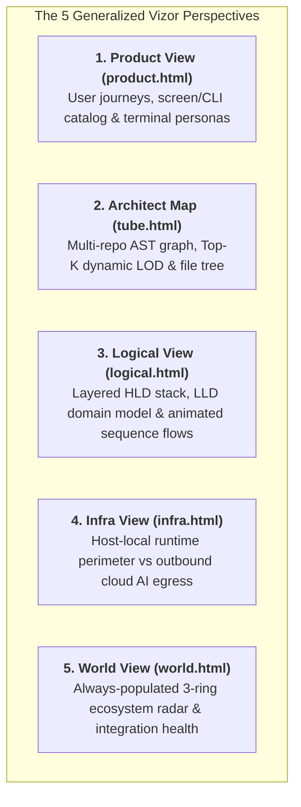
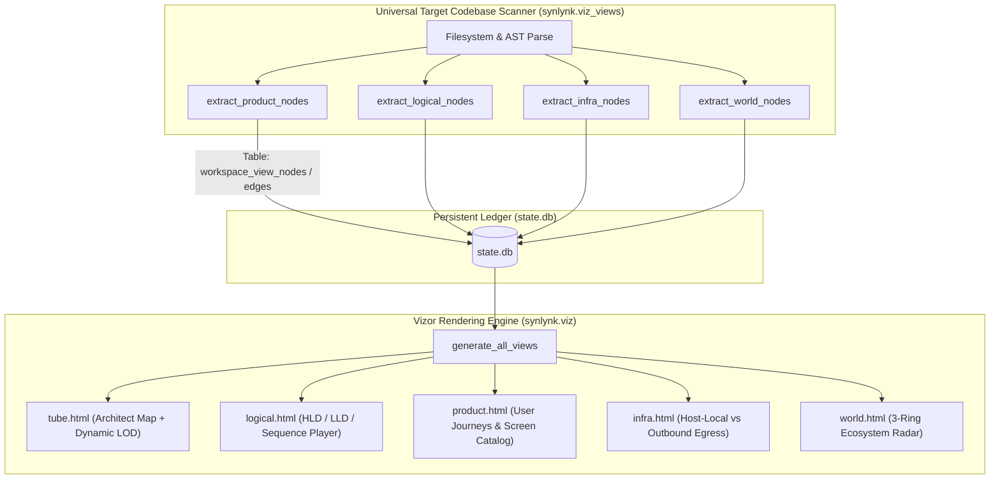
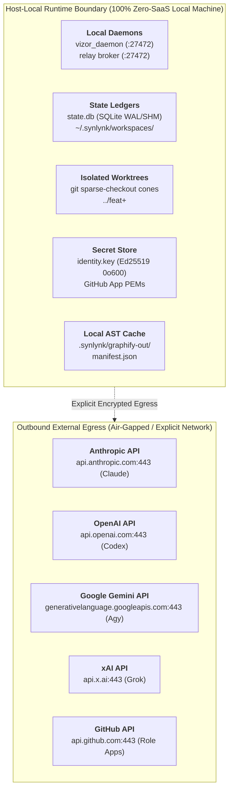
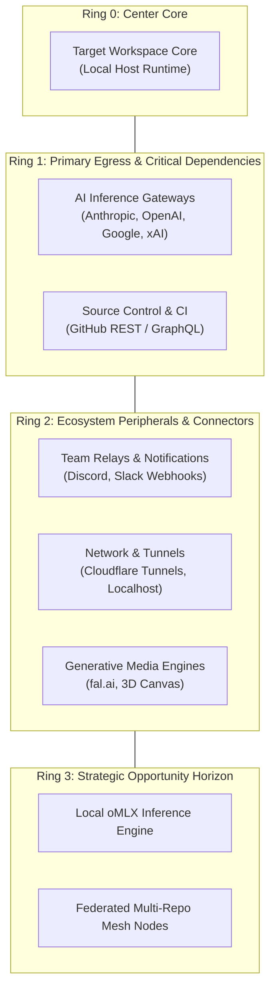

# Design Spec: Generalized Vizor BS-6 Architectural Views, Dynamic Centrality LOD & Deep Interactive UX

**Date:** 2026-09-27  
**Status:** Approved  
**Governing Goal:** `goal-e3840370` (*Consolidated Vizor Master Control Plane: Unified Interactive Web HUD, GOVERNS Lifecycle Board, Architectural Views, Onboarding Journey, and Hosted Fleet Radar*)  
**Associated Stories:** `story-3cddd9d2` (Issue #1787), `story-503a76f2` (Issue #1790), `story-bs6-views-gen`  
**Authors:** @nikhilsoman, @agy  

---

## 1. Executive Summary & Universal Design Mandate

Vizor's BS-6 Architectural Views (Product, Architect Map, Logical, Infra, and World) provide an intuitive, multi-dimensional visual control plane for modern software systems.

### 1.1 Universal Target Repository Mandate
As with all Synlynk capabilities, the extraction and rendering pipeline must be **fully generalized across any target codebase** where `synlynk init` / `synlynk scan` is run (Python, TypeScript/JavaScript, Go, Rust, Java, polyglot microservices, and AI agent frameworks), rather than hardcoded to the Synlynk repo itself.

### 1.2 Core Issues Addressed



1. **L0–L3 Dynamic Centrality & LOD Granularity:** Replaces static `degree >= 3` thresholds with dynamic **top-percentile centrality rankings** so Level 0 (Macro Core) thins out clutter to show strictly top ~10–15 primary architectural anchors, with test suites toggled off by default at L0/L1.
2. **Architect Map vs. Logical View Separation:** Differentiates the **Physical/Structural AST code graph** (`tube.html`) from the **Semantic/Behavioral System Design** (`logical.html`), providing layered HLD stacks, LLD component models, and an interactive step-by-step sequence diagram player.
3. **Product View (`product.html`):** Renders interactive user journey flows, discovered routes/APIs/screens, and interactive terminal personas (Claude, Codex, Agy, Grok).
4. **Infra View (`infra.html`):** Clearly partitions the host-local zero-SaaS execution environment (local daemons, SQLite ledgers, isolated Git worktrees, Ed25519 key store) from outbound cloud AI inference and API egress points with visual security and privacy badges.
5. **World View (`world.html`):** Replaces empty fallbacks with an **always-populated 3-ring Concentric Ecosystem Radar** reflecting the target workspace's AI providers, VCS, and integrations.

---

## 2. End-to-End System Architecture



---

## 3. Subsystem A: Dynamic Centrality & Percentile LOD Engine

### 3.1 The Problem with Static Degree Thresholds
In codebases with hundreds of symbols, simple helper functions frequently have degree 3, causing static `degree >= 3` L0 filters to display 70–80% of all nodes.

### 3.2 Dynamic Percentile & Top-K Centrality Model
For any target repository, the LOD filtering engine computes relative centrality percentiles across all active nodes:

$$\text{Centrality Score}(v) = w_1 \cdot \text{deg}(v) + w_2 \cdot \text{betweenness}(v) + w_3 \cdot \text{depth\_penalty}(v)$$

```javascript
// Dynamic LOD Threshold Computation
function calculateDynamicLODTiers(nodes, edges) {
  if (!nodes || nodes.length === 0) return [0, 0, 0, 0];
  
  // Exclude test nodes from macro baseline unless explicitly enabled
  const codeNodes = nodes.filter(n => (n.file_type || n.kind) !== 'Test Suite');
  const degrees = codeNodes.map(n => n.degree || 0).sort((a, b) => b - a);
  
  // Percentile Cutoffs:
  // L0: Top 10% (capped at max 12-15 nodes for clean executive view)
  const l0Threshold = degrees[Math.min(degrees.length - 1, Math.max(10, Math.floor(degrees.length * 0.10)))] || 6;
  // L1: Top 30% (Subsystem boundaries & primary service orchestrators)
  const l1Threshold = degrees[Math.min(degrees.length - 1, Math.floor(degrees.length * 0.30))] || 4;
  // L2: Top 65% (Component modules and handlers)
  const l2Threshold = degrees[Math.min(degrees.length - 1, Math.floor(degrees.length * 0.65))] || 2;
  // L3: All symbols (0 threshold)
  const l3Threshold = 0;

  return [l0Threshold, l1Threshold, l2Threshold, l3Threshold];
}
```

### 3.3 Default Filter State
- At **L0 (Macro Core)** and **L1 (Subsystems)**: `Test Suite` kind chips are **unchecked by default**, eliminating noisy call graphs and preserving clean architectural structure.
- At **L2 (Components)** and **L3 (Micro)**: Tests become available for deep-dive test verification mapping.

---

## 4. Subsystem B: Architect Map (`tube.html`) vs. Logical View (`logical.html`)

### 4.1 Architect Map (`tube.html`): Structural & Physical Code Graph
- **Focus:** Physical filesystem structure, multi-repo boundaries, AST call edges, community clustering, and `/api/source` live code inspection drawer.
- **Components:**
  - Multi-repo clustered bounding boxes (`synlynk`, `synlynk-agent-claude`, etc.).
  - Graphify interactive canvas with dynamic LOD degree zoom bar (+, -, L0-L3, Fit).
  - 1-hop Ego network isolate & progressive multi-click neighbor growth (`grow-ego-network`).
  - Sliding syntax-highlighted source code drawer (`.kg-source-drawer`).
  - Physical file tree explorer.

### 4.2 Logical View (`logical.html`): Semantic, Behavioral & Sequence Flow Model
- **Focus:** System design patterns, layered architecture stacks, component relationships, and interactive execution flowcharts.
- **Tab 1: Layered High-Level Design (HLD) Stack:**
  - Interactive SVG/HTML presentation displaying the target workspace's architectural tiers:
    1. **Presentation & CLI/API Surface:** Routes, CLI commands, HTTP handlers, Webhooks.
    2. **Orchestration & Business Logic:** Workflow engines, autonomous dispatchers, state machine controllers.
    3. **Domain Services & Processing Core:** Context pack generators, impact analysis, AST indexers.
    4. **Persistence & Cryptographic Store:** SQLite ledgers, Ed25519 key storage, Git working trees.
    5. **Network & External Egress:** Sandboxed subprocess runners, AI inference adapters, SSE relays.
- **Tab 2: Low-Level Design (LLD) Component Architecture:**
  - Domain class diagrams and interface contracts (`GovernsResolver`, `StateDB`, `PolicyEngine`, `RelayBroker`, `DoctorRunner`).
- **Tab 3: Interactive Sequence Flow Player:**
  - Animated, step-by-step sequence diagrams for core lifecycles:
    1. *Unattended Autonomous Milestone Execution Flow* (Task Selection → Plan Generation → Parallel Worktree Dispatch → Test Verification → QA Review Gate → Squash Merge).
    2. *AST Drift & Knowledge Graph Lifecycle* (HEAD Watch → Background Extract → Manifest Stamp → Live Cache Invalidation).
    3. *Universal GOVERNS Auto-Association* (Artifact Creation → 5-Tier Waterfall Resolution → FSM Stage Transition → Sentinel Sweep).
    4. *Real-Time SSE Event Relay* (Agent Event Publish → Broker Multiplexing → Web HUD Push).
    5. *Target Workspace Request/Data Pipeline* (Generalized flow generated from target repo's entrypoints to data stores).

---

## 5. Subsystem C: Product View (`product.html`) — User-Visible Journeys & Screen Catalog

### 5.1 Universal Product Extraction
For any target repository, `extract_product_nodes()` scans:
- **Web Applications:** Discovered pages, routes, endpoints, and templates (React, Vue, HTML, Next.js, Django, FastAPI).
- **CLI Utilities & Developer Tools:** Root commands, subcommands, arguments, and interactive flags (Click, Argparse, Cobra).
- **Multi-Agent Orchestrators (Synlynk):** Autonomous developer workflows, terminal personas, and governance boards.

### 5.2 Product View UI Sections
1. **Interactive User Journey Mapper:**
   - **Journey 1: Zero-Friction Onboarding:** `synlynk init` → `synlynk scan --deep` → `synlynk launch`.
   - **Journey 2: Interactive Home Harness Pairing:** Developer in Claude/Agy/Codex/Grok terminal → Real-time context snapshot → Mid-session anti-amnesia checkpoints → Sentinel monitor.
   - **Journey 3: Headless Autonomous Fleet Operations:** Spec brainstorm → SDD implementation plan → Parallel worktree dispatch across 4 harnesses → QA merge gate.
   - **Journey 4: Control Plane & Governance:** Managing goals, board stages, and dual-pivot timelines.
2. **Vizor Screen Catalog & Live Previews:**
   - Interactive gallery highlighting the 7 core screens: GOVERNS Board, Gantt Timeline, Architect Map, Logical Engine, Infra Topology, Product Journeys, and Fleet Observatory.
3. **Supported Harness Terminal Personas:**
   - Interactive terminal mockups for **Claude Desktop/CLI**, **Codex TUI**, **Agy CLI**, and **Grok Composer** showcasing command syntax, hotkeys, and prompt mechanics.

---

## 6. Subsystem D: Infra View (`infra.html`) — Host-Local vs. Outbound Egress

### 6.1 Target Workspace Infrastructure Classification
For any target repository, `extract_infra_nodes()` categorizes infrastructure elements into two distinct security and execution perimeters:



### 6.2 Trust & Security Verification Badges
The topbar displays real-time security attestation badges:
- 🔒 **100% Host-Local Primary Ledger** (Zero external database dependencies).
- 🛡️ **Zero Cloud Telemetry** (No vendor tracking or telemetry beacons).
- ⚡ **No Third-Party Relay** (Host-local SSE broker on localhost).
- 🌐 **Explicit Egress Scoping** (Only declared AI harness endpoints allowed).

---

## 7. Subsystem E: World View (`world.html`) — Concentric Ecosystem Radar

### 7.1 Multi-Ring Concentric Radar Architecture
The World View represents the target repository's position within its broader software ecosystem using 3 concentric radar rings:



### 7.2 Always-Populated Fallback Extraction
To guarantee the World Radar is never blank:
1. `extract_world_nodes()` immediately inspects:
   - Target repo package manifests (`pyproject.toml`, `package.json`, `Cargo.toml`, `go.mod`).
   - Active harness profiles in `.agents/*.json` and `.synlynk/config.json`.
   - Environment variable templates (`.env.example`, `.env`).
2. Even in a freshly cloned target repo without prior deep scans, the engine auto-populates configured AI providers, VCS endpoints, and local runtime boundaries with pulsing status indicator dots (`Connected`, `Configured`, `Offline`).

---

## 8. Verification & Testing Matrix

| Test Suite | Target Coverage |
|:---|:---|
| `tests/test_viz_dynamic_lod.py` | Dynamic percentile LOD thresholds, Top-K macro anchor isolation, test-filter default-off |
| `tests/test_viz_logical_view.py` | HLD layered architecture rendering, LLD domain component graph, sequence player animations |
| `tests/test_viz_product_view.py` | User journey flows, screen/CLI catalog extraction, terminal persona previews |
| `tests/test_viz_infra_view.py` | Host-local runtime boundary vs outbound cloud AI egress partitioning, security badges |
| `tests/test_viz_world_radar.py` | 3-ring concentric radar rendering, always-populated fallback extraction on generic repos |
| `tests/test_viz_generic_scanner.py` | Multi-language target repo extraction (Python, Node/TS, Go, generic CLI/web app) |

---

## 9. Rollout & Readiness Plan

1. **Implementation Plan:** Created in `docs/superpowers/plans/2026-09-27-vizor-bs6-generalized-views-and-deep-ux.md`.
2. **Worktree-Isolated Autonomous Execution:** Dispatched across fleet harnesses (Agy/Codex/Claude/Grok).
3. **Verification:** 100% test pass rate across all 3,300+ tests and live Vizor validation.
4. **Architecture Council & Business Review:** Ready for demonstration on September 28 ahead of October 1st RC1 release.
