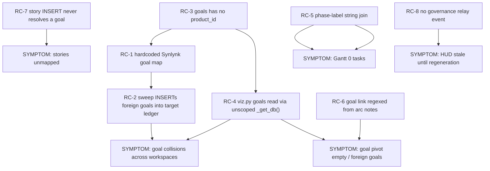
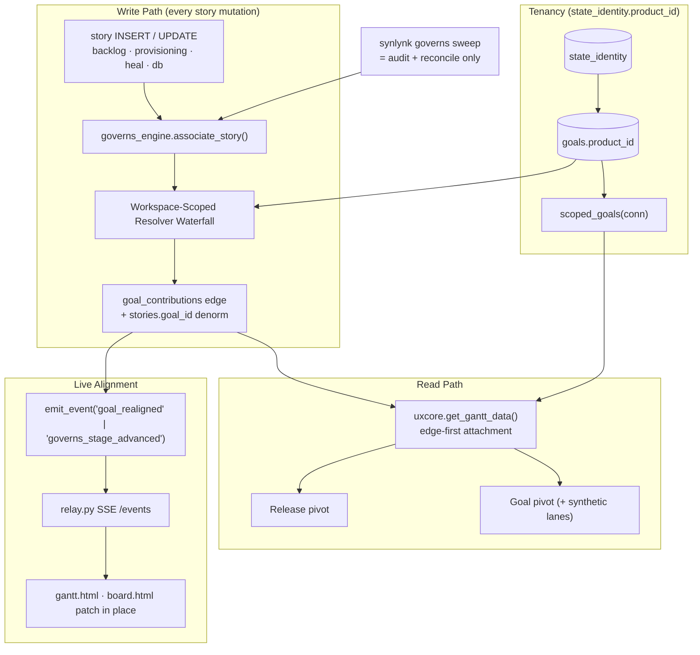

# Design Spec: Living GOVERNS Goal Resolution & Alignment Engine (Spec 3)

**Date:** 2026-09-30
**Status:** In Review
**Governing Goal:** `goal-e3840370` (*Consolidated Vizor Master Control Plane: Unified Interactive Web HUD, GOVERNS Lifecycle Board, Architectural Views, Onboarding Journey, and Hosted Fleet Radar*)
**Story:** `story-b67bce1b`
**Sub-Project:** 3 of 5 (Synlynk V2 Platform Architecture)
**Predecessors:**
- Spec 1 — [`2026-09-30-vizor-workspace-scoped-routing-design.md`](2026-09-30-vizor-workspace-scoped-routing-design.md) (`/w/<slug>/api/...`, `WorkspaceContext`, no `os.getcwd()`)
- Spec 2 — [`2026-09-30-vizor-repo-truth-purge-and-native-hud-shells-design.md`](2026-09-30-vizor-repo-truth-purge-and-native-hud-shells-design.md) (repo-truth projection, zero-404 HUD shells)
- Related — [`2026-09-26-universal-governs-auto-association-and-reconciliation-design.md`](2026-09-26-universal-governs-auto-association-and-reconciliation-design.md) (the resolver waterfall this spec makes workspace-safe and continuous)

---

## 1. Executive Summary

Spec 1 made Vizor's *transport* workspace-scoped. Spec 2 made Vizor's *projection views* repo-truthful. **Defect 2 is the remaining hole: the GOVERNS data layer itself is neither scoped nor continuously reconciled.**

Three user-visible symptoms, one shared cause — goal identity is a free-floating string with no workspace anchor and no enforced write path:

| Symptom | Where it shows up |
| :--- | :--- |
| Stories unmapped to any workspace goal | `board.html` cards with no goal pill; `synlynk governs sweep` coverage < 100% |
| Gantt renders releases with **0 tasks**, goal pivot renders "No releases linked to this goal yet" | `gantt.html` (`renderRelease()` `taskCount === 0`, `renderByGoal()` empty branch) |
| Goal collisions across workspaces — `rxcc`'s Vizor shows Synlynk's goals; a foreign `state.db` grows phantom `goal-e3840370` rows | `viz.py` goals query; `governs_cli.cmd_governs_sweep()` |

This spec defines the **Living GOVERNS Engine**: goal identity anchored to `state_identity.product_id`, deterministic auto-association on every story write (not only on an operator-invoked sweep), a dual-pivot Gantt projection that no longer depends on a fragile phase-label string join, and SSE relay events so the HUD reflects re-alignment live instead of at next full regeneration.

### Core Invariants

- **Invariant 1 (Goal Tenancy).** Every `goals` row belongs to exactly one workspace `product_id`. No code path may create, read, or link a goal belonging to another workspace's ledger. A goal ID resolved from a heuristic that does not exist *in this workspace* is a resolution **failure**, never an auto-create.
- **Invariant 2 (Continuous Association).** Association happens at story write time and is re-verified on read. `synlynk governs sweep` becomes a *reconciliation audit*, not the only place mapping ever happens.
- **Invariant 3 (Projection Completeness).** Every non-archived story reaches the Gantt through at least one deterministic edge (`goal_contributions` → `roadmap_phases` → `roadmap_arcs`, or the synthetic goal lane). "0 tasks" on a release that owns stories is a bug, not an empty state.
- **Invariant 4 (Live Alignment).** A goal re-link, stage advance, or reconciliation emits a relay event; open Vizor HUDs patch in place.

---

## 2. Root Cause Analysis — Defect 2

### 2.1 RC-1: `_DOMAIN_GOAL_MAP` hardcodes Synlynk's own goal IDs

[`synlynk/governs_resolver.py`](../../../synlynk/governs_resolver.py) Tier 4 matches free text against a module-level constant table of **Synlynk's** goal IDs, and Tier 5 falls back to `DEFAULT_MASTER_GOAL = "goal-eacab0dc"`:

```python
_DOMAIN_GOAL_MAP = [
    (re.compile(r"(?:viz|vizor|canvas|hud|graphify|board|gantt|...)"), "goal-e3840370", "vizor_control_plane"),
    (re.compile(r"(?:docs[/-]book|manuscript|...)"),                    "goal-0c4e96ff", "book_manuscript"),
    ...
]
DEFAULT_MASTER_GOAL = "goal-eacab0dc"
```

This is the exact defect class Spec 2 purged from `viz_views.py`, one layer deeper. A story titled "Add board view" in **any** workspace resolves to Synlynk's `goal-e3840370`. The table is a hardcoded fleet assumption masquerading as a heuristic.

### 2.2 RC-2: the sweep *manufactures* foreign goals in the target ledger

`cmd_governs_sweep()` applies the resolver result unconditionally:

```python
conn.execute(
    "INSERT OR IGNORE INTO goals (goal_id, outcome, criterion) VALUES (?, ?, ?)",
    (r_gid, f"GOVERNS Goal: {r_gid}", "Auto-reconciled during GOVERNS sweep"),
)
```

So running `synlynk governs sweep` inside `rxcc` writes placeholder rows named `GOVERNS Goal: goal-e3840370` into `rxcc`'s `state.db`. Cross-workspace contamination is not merely *displayed* — it is **persisted**, and it back-fills a fake goal that then satisfies every later "is this goal real?" check. This is the single highest-severity finding in this analysis.

### 2.3 RC-3: `goals` has no tenancy column

[`synlynk/db_schema.py`](../../../synlynk/db_schema.py):

```sql
CREATE TABLE IF NOT EXISTS goals (
    goal_id TEXT NOT NULL UNIQUE, outcome TEXT NOT NULL, criterion TEXT NOT NULL,
    deadline TEXT, status TEXT NOT NULL DEFAULT 'active', kind TEXT NOT NULL DEFAULT 'feature', ...
);
```

There is no `product_id` / workspace column, so there is nothing to filter on even if a caller wanted to. `state_identity.product_id` (written by `state_registry.identity_metadata()`) already exists as the per-ledger anchor and is currently unused by GOVERNS.

### 2.4 RC-4: Vizor's goals query bypasses the scoped connection

[`synlynk/viz.py`](../../../synlynk/viz.py) patches `uxcore._get_db` to the resolved read-only workspace `db_path` for releases/costs/fleet — then reads goals through the **unscoped** default:

```python
uxcore._get_db = lambda: _open_state_db(db_path=db_path, read_only=True)
...
dreams_typed = uxcore.get_gantt_data()      # scoped ✅
...
conn = _get_db()                            # UNSCOPED ❌
goal_rows = conn.execute("SELECT goal_id, outcome, ... FROM goals WHERE status='active' ...")
data["goals"] = goals
```

Under the Spec 1 daemon (CWD `/`) this either raises — silently yielding `goals = []`, which is why `renderByGoal()` prints "No active goals defined" — or resolves to the host's own ledger, which is why a foreign workspace's Gantt shows Synlynk's goals. **Both reported goal-pivot symptoms trace to this single line.**

### 2.5 RC-5: Gantt task attachment is a string join on `stories.phase`

[`synlynk/uxcore.py`](../../../synlynk/uxcore.py) `get_gantt_data()` attaches tasks to a stage two ways only:

```python
stories_by_phase.setdefault((phase or "").strip().lower(), []).append(task)
...
if story_id and story_id in stories_by_id: matched.append(stories_by_id[story_id])   # 1:1 only
matched.extend(stories_by_phase.get(phase_key.lower(), []))                          # label join
```

1. `roadmap_phases.story_id` is a **single** column — one story per phase, maximum.
2. The label join requires `stories.phase` to equal `roadmap_phases.phase_title` case-folded. `stories.phase` defaults to `'build'` (`db_schema.py`), while phase titles are GOVERNS stage names (`goal`/`open`/`visualize`/`execute`/`release`/`notify`/`sustain`). **The join essentially never matches.**
3. `goal_contributions` — the actual story↔goal edge table — is **never read** by `get_gantt_data()`. The sweep never writes it either (only `backlog.py` and `db.py:3018` do), so the one authoritative edge is both under-written and unread.

Result: releases render with `taskCount === 0` while their stories sit in the same ledger.

### 2.6 RC-6: goal-pivot linkage is inferred from arc *notes* free text

`get_gantt_data()` derives a release's `goal_id` by regexing `roadmap_arcs.notes`:

```python
g_match = re.search(r"\bgoal-([a-zA-Z0-9_-]+)\b", arc_notes)
```

`renderByGoal()` then filters `releases.filter(r => r.goal_id === goal.id || r.goal_outcome === goal.outcome)`. A goal whose stories exist but whose arc notes lack a literal goal ID renders the empty branch. Worse, matching on `goal_outcome` string equality means two workspaces with the same outcome text collide.

### 2.7 RC-7: association is invoked on four paths, and none of them is story creation

`resolve_parent_goal()` callers: `context.py` (spec/plan/decision harvest), `db.py:2693` (`cmd_decision_record`), `governs_cli.py` (the sweep). **No `INSERT INTO stories` path calls it** — `backlog.py:653/842`, `db.py:2832/2879`, `heal_cycles.py:106`, `story_provisioning.py:155` all accept a caller-supplied `goal_id` or `NULL`. `db.py:2832` inserts only `(story_id, title, status)`. Stories are therefore born unmapped by default, and stay that way until someone remembers to sweep.

### 2.8 RC-8: no alignment event on the relay

`RELAY_EVENT_TYPES` in [`synlynk/events.py`](../../../synlynk/events.py) is `agent_started`, `task_progress`, `artifact_published`, `review_requested`, `steering_injected`, `agent_completed`. Nothing represents *governance* state change, so the SSE stream served by `relay.py` (`text/event-stream`, `RelayHandler.do_GET`) cannot tell a HUD that a story was re-linked. Vizor only sees new linkage after full page regeneration.

### 2.9 Causal chain



---

## 3. Architecture — The Living GOVERNS Engine



### 3.1 New module: `synlynk/governs_engine.py`

The resolver stays a pure function; the engine owns tenancy, persistence, and eventing. Keeping them separate preserves the existing `test_governs_resolver.py` contract for the pure waterfall.

```python
@dataclasses.dataclass(frozen=True)
class GoalResolution:
    goal_id: str | None
    reason: str            # explicit_argument | in_band_header | parent_story_link |
                           # workspace_alias | workspace_keyword | workspace_default | unresolved
    product_id: str        # tenancy anchor this resolution was made under
    confidence: str        # certain | inferred | none

def workspace_product_id(conn) -> str: ...
def scoped_goals(conn, *, status: str | None = None) -> list[dict]: ...
def associate_story(conn, story_id, *, title=None, issue=None, branch=None,
                    explicit_goal=None, emit=True) -> GoalResolution: ...
def reconcile(conn, *, repo_root, dry_run=False) -> dict: ...
```

### 3.2 Workspace-scoped resolver waterfall (replaces `_DOMAIN_GOAL_MAP`)

The candidate set is **always** `scoped_goals(conn)` — goals that exist in *this* ledger under *this* `product_id`. No tier may return an ID outside that set, and no tier may create a goal.

| Tier | Source | Determinism |
| :--- | :--- | :--- |
| 1 | `explicit_goal` argument — validated against `scoped_goals`; unknown ID → `RuntimeError` (fail closed, per Invariant 3 of the fail-closed-routing spec) | certain |
| 2 | In-band header (`**Governing Goal:** goal-xxxx` in a spec/plan/decision) — validated against `scoped_goals` | certain |
| 3 | Parent inheritance — `goal_contributions` of a linked story, or the goal of a story sharing this `gh_issue` | certain |
| 4 | **Workspace goal aliases** — `goal_aliases` rows the workspace itself declared (`synlynk goal alias <goal-id> <pattern>`), matched against title/path/branch. Longest-pattern-wins, then lowest `goal_id` lexicographically, for a stable tie-break | inferred |
| 5 | **Derived keyword match** — tokens from each scoped goal's own `outcome`/`criterion` text (stop-worded, ≥4 chars) matched against the story corpus; requires ≥2 distinct token hits to fire | inferred |
| 6 | Workspace default goal — the single `status='active'`, `kind='master'` goal *if exactly one exists*; otherwise no default | inferred |
| 7 | **`unresolved`** — `goal_id = None`, recorded in `goal_contributions` as `link_status='unresolved'` with `skip_reason` (both columns already exist per `db.py:716-726`) | none |

Tier 4/5 replace a hardcoded fleet table with data the workspace supplies or already owns. Tier 7 replaces the `goal-eacab0dc` fallback: **a wrong mapping is worse than a visible gap**, because a wrong mapping is invisible in the HUD while a gap renders as an actionable "N unmapped stories" chip.

`DEFAULT_MASTER_GOAL` and `_DOMAIN_GOAL_MAP` are deleted. Synlynk's own eight mappings are migrated into its own `goal_aliases` rows by the migration in §3.3, so Synlynk's behaviour is preserved *as workspace data* rather than as product code.

### 3.3 Schema changes (additive, idempotent, in `db.py` migration style)

```sql
ALTER TABLE goals ADD COLUMN product_id TEXT;            -- backfilled from state_identity
CREATE INDEX IF NOT EXISTS idx_goals_product ON goals(product_id, status);

CREATE TABLE IF NOT EXISTS goal_aliases (
    id         INTEGER PRIMARY KEY AUTOINCREMENT,
    goal_id    TEXT NOT NULL REFERENCES goals(goal_id),
    pattern    TEXT NOT NULL,           -- case-insensitive regex, workspace-authored
    product_id TEXT NOT NULL,
    created_at TIMESTAMP DEFAULT CURRENT_TIMESTAMP,
    UNIQUE(goal_id, pattern)
);

-- goal_contributions already carries link_status / skip_reason (db.py:716-726).
-- Add the reason + tenancy provenance the engine records per association:
ALTER TABLE goal_contributions ADD COLUMN resolution_reason TEXT;
ALTER TABLE goal_contributions ADD COLUMN resolved_at TIMESTAMP;
```

Backfill rules, run once per ledger:
1. `UPDATE goals SET product_id = (SELECT product_id FROM state_identity LIMIT 1) WHERE product_id IS NULL`.
2. If `state_identity` is absent (pre-registry ledger), leave `product_id` NULL and treat NULL as "belongs to this ledger" — a read-compatibility escape hatch so `scoped_goals()` is `WHERE product_id IS NULL OR product_id = ?`. This keeps every existing single-workspace install working unchanged.
3. Quarantine, do not delete, previously manufactured phantom goals: `UPDATE goals SET status='quarantined' WHERE criterion = 'Auto-reconciled during GOVERNS sweep' AND goal_id NOT IN (SELECT goal_id FROM goal_contributions)`. Deleting would break FK references; quarantine drops them out of `scoped_goals(status='active')` and surfaces them in `synlynk governs doctor`.
4. Seed `goal_aliases` from the retired `_DOMAIN_GOAL_MAP` **only** for goal IDs that already exist in the ledger being migrated. In `rxcc` this seeds zero rows — which is the correct outcome and the migration-level proof that RC-1/RC-2 are closed.

### 3.4 Deterministic auto-association at write time (closes RC-7)

Every story INSERT path calls `governs_engine.associate_story()` in the same transaction as the insert:

| Call site | Change |
| :--- | :--- |
| `backlog.py:653`, `backlog.py:842` | replace caller-passed `goal_id` with `associate_story(...)` result when caller passes none |
| `db.py:2832` (`story_id, title, status` only) | add association call post-insert |
| `db.py:2879` (`cmd_story_create`) | add association call post-insert |
| `story_provisioning.py:155` | add association call post-insert |
| `heal_cycles.py:106` | add association call post-insert |

Determinism requirements:
- **Idempotent.** Re-running over an already-associated story is a no-op returning the same `GoalResolution` (`UNIQUE(goal_id, story_id)` plus an explicit read-before-write).
- **Order-independent.** Two stories inserted in either order produce the same mapping; no tier reads mutable global state or `os.getcwd()`.
- **Transaction-safe.** Association shares the caller's connection and the caller's commit — never opens a second connection and never commits mid-caller-transaction. This is a direct consequence of the uncommitted-transaction CI cascade (PR #1205) and Invariant 4 (single-writer WAL, leased locks).
- **Never creates a goal.** The `INSERT OR IGNORE INTO goals` in the sweep is deleted outright.

`associate_story()` writes both edges: the authoritative `goal_contributions` row (with `resolution_reason`) and the denormalized `stories.goal_id` mirror that existing queries already read. The denorm column stays for read compatibility; `goal_contributions` is the source of truth on any disagreement, and `governs doctor` reports divergence.

### 3.5 Workspace-scoped filtering (closes RC-3, RC-4)

1. `viz.py`'s goals block stops calling bare `_get_db()`. It reuses the already-resolved read-only workspace handle:
   ```python
   with _open_state_db(db_path=db_path, read_only=True) as gconn:
       data["goals"] = governs_engine.scoped_goals(gconn, status="active")
   ```
   When `db_path` is None (unregistered/minimal case), `data["goals"] = []` and the HUD renders the Spec 2 glassmorphic empty shell — never another workspace's goals.
2. `/w/<slug>/api/board` and the new `/w/<slug>/api/goals` resolve goals through `WorkspaceContext.db_path` only. Any handler reading goals without a `WorkspaceContext` is a test failure (§4.4 grep guard).
3. `cmd_governs_sweep()` scopes every query to `workspace_product_id(conn)` and refuses to run if `state_identity` names a different canonical path than the CWD-resolved repo root.

### 3.6 Dual-pivot Gantt projection (closes RC-5, RC-6)

`uxcore.get_gantt_data()` gains an edge-first attachment order. Each rule is tried in sequence; a story attaches at the first rule that matches, guaranteeing exactly-once placement:

| Rank | Edge | Purpose |
| :--- | :--- | :--- |
| 1 | `roadmap_phases.story_id` (direct) | explicit operator intent |
| 2 | `goal_contributions` → goal → arcs governed by that goal | **the edge that was never read** |
| 3 | `stories.phase` ⟷ `phase_title` case-folded | legacy compatibility, demoted from primary to last resort |

**Release pivot** — unchanged shape; rule 2 is what makes `taskCount` non-zero.

**Goal pivot** — rebuilt as a first-class projection instead of a filter over release rows:

```
for goal in scoped_goals(status='active'):
    stories = goal_contributions[goal.goal_id]
    arcs    = { roadmap arc of each story, where one exists }
    lanes   = [ release lane per arc ]  +  synthetic "Unscheduled" lane for stories with no arc
```

- Matching is by `goal_id` **only**. The `goal_outcome` string-equality fallback in `renderByGoal()` is removed (RC-6 collision vector).
- A goal with stories but no arc renders a **synthetic lane** carrying those stories, replacing today's "No releases linked to this goal yet."
- A goal with genuinely zero stories renders the Spec 2 HUD shell with a copyable `synlynk goal alias <goal-id> <pattern>` action.
- An **"Unmapped" lane** renders `link_status='unresolved'` stories with their `skip_reason`, making Invariant 2 gaps visible rather than silently absorbed. This lane is the UI counterpart of deleting the master-goal fallback.
- `roadmap_arcs.notes` regexing is retained **only** as a migration-time hint for populating `goal_contributions`, then never consulted at render time.

### 3.7 SSE relay event integration (closes RC-8)

Two additions to `RELAY_EVENT_TYPES` in `events.py`:

```python
RELAY_EVENT_TYPES = (
    ..., "agent_completed",
    "goal_realigned",           # story ↔ goal edge created / changed / unresolved
    "governs_stage_advanced",   # governs_stage transition
)
```

`goal_realigned` payload:

```json
{
  "story_id": "story-b67bce1b",
  "product_id": "<state_identity.product_id>",
  "workspace_slug": "synlynk",
  "from_goal": null,
  "to_goal": "goal-e3840370",
  "reason": "workspace_alias",
  "confidence": "inferred"
}
```

Flow: `associate_story()` → `emit_event()` → `relay.RelayBroker.publish()` → existing `text/event-stream` in `RelayHandler.do_GET` → Vizor HUD.

Consumption rules:
- The HUD subscribes through the Spec 1 workspace-scoped route and **drops any event whose `product_id` does not match the page's `WorkspaceContext`**. Tenancy is enforced at both emit and consume — `relay.py`'s broker is machine-wide and fans out across workspaces, so a consume-side filter is mandatory, not defensive.
- `gantt.html` patches the affected lane in place (move the task card, update `taskCount`, decrement the Unmapped lane) without a full `renderTimeline()`.
- `board.html` updates the card's goal pill.
- Events are advisory: a dropped or missed event degrades to "stale until next regeneration" — never to a wrong mapping. `emit=False` is available for bulk reconciliation so a sweep over 1,100 stories does not flood the broker; it emits one `reconcile_completed` summary instead.

---

## 4. TDD Verification Plan

Test-first, per `superpowers:test-driven-development`: each test below is written red against current behaviour before the corresponding implementation lands. Root-cause IDs are cited so a failing test names the defect it guards.

### 4.1 `tests/test_governs_engine_tenancy.py` (RC-1, RC-2, RC-3)

| Test | Assertion |
| :--- | :--- |
| `test_no_hardcoded_goal_ids_in_source` | `grep` of `synlynk/governs_resolver.py` + `governs_engine.py` matches **zero** `goal-[0-9a-f]{8}` literals; `DEFAULT_MASTER_GOAL` no longer importable |
| `test_scoped_goals_excludes_foreign_product` | ledger with goals under `product_id` A and B → `scoped_goals()` under A returns only A's |
| `test_scoped_goals_treats_null_product_as_local` | pre-migration ledger (no `state_identity`) still returns its goals |
| `test_sweep_never_inserts_goal_rows` | reconcile over a ledger with zero goals → `SELECT COUNT(*) FROM goals` stays 0; all stories land `link_status='unresolved'` |
| `test_explicit_unknown_goal_fails_closed` | `associate_story(explicit_goal='goal-notmine')` raises, does not create |
| `test_migration_quarantines_phantom_goals` | seeded `criterion='Auto-reconciled during GOVERNS sweep'` orphan → `status='quarantined'`, absent from `scoped_goals('active')`, row still present (no FK break) |
| `test_migration_seeds_aliases_only_for_present_goals` | Synlynk-shaped ledger seeds 8 aliases; `rxcc`-shaped ledger seeds **0** |

### 4.2 `tests/test_governs_auto_association.py` (RC-7, determinism)

| Test | Assertion |
| :--- | :--- |
| `test_waterfall_tier_order` | one case per tier 1–7, each asserting both `goal_id` and `reason` |
| `test_alias_longest_pattern_wins` | two overlapping aliases → longer pattern wins; equal length → lowest `goal_id` (stable tie-break) |
| `test_derived_keyword_requires_two_token_hits` | single weak token hit → `unresolved`, not a guess |
| `test_association_is_idempotent` | twice over the same story → identical `GoalResolution`, one `goal_contributions` row |
| `test_association_is_insertion_order_independent` | stories A,B and B,A produce identical mapping sets |
| `test_association_uses_caller_transaction` | association inside an open transaction, caller rolls back → zero rows persist (PR #1205 guard) |
| `test_story_create_paths_associate` | parametrized over `backlog`, `db.cmd_story_create`, `story_provisioning`, `heal_cycles` — every path yields a `goal_contributions` row or an explicit `unresolved` row, never silent NULL |
| `test_unresolved_records_skip_reason` | `link_status='unresolved'` carries a non-empty `skip_reason` |

### 4.3 `tests/test_gantt_dual_pivot.py` (RC-5, RC-6)

| Test | Assertion |
| :--- | :--- |
| `test_contribution_edge_attaches_tasks` | arc + phase + 3 stories linked only via `goal_contributions` → `taskCount == 3` (**red today: 0** — the headline Defect 2 symptom) |
| `test_phase_label_join_still_works` | legacy `stories.phase == phase_title` rows still attach (no regression) |
| `test_story_attaches_exactly_once` | story matching rules 1, 2 **and** 3 appears once |
| `test_multiple_stories_per_phase` | phase with 4 contribution-linked stories returns all 4 (RC-5's single-`story_id` ceiling) |
| `test_goal_pivot_synthetic_lane` | goal with stories but no arc → synthetic lane holding those stories, not the empty branch |
| `test_goal_pivot_ignores_outcome_string_match` | two goals, identical `outcome` text, different IDs → no cross-assignment |
| `test_unmapped_lane_lists_unresolved` | `unresolved` stories appear in the Unmapped lane with `skip_reason` |
| `test_arc_notes_regex_not_used_at_render` | arc notes naming a foreign goal ID with no contribution edge → that goal does not appear in the projection |

### 4.4 `tests/test_vizor_goal_scoping.py` (RC-4)

| Test | Assertion |
| :--- | :--- |
| `test_goals_read_through_scoped_db_path` | two ledgers A/B; `collect_data(db_path=B)` returns **only** B's goals (**red today** — bare `_get_db()`) |
| `test_no_unscoped_get_db_in_goal_paths` | AST scan of `viz.py`: no `_get_db()` call inside the goal-collection block; guards the exact regression shape |
| `test_missing_db_path_yields_empty_not_foreign` | `db_path=None` → `data["goals"] == []`, HUD empty shell |
| `test_scoped_goals_api_route` | `GET /w/<slug>/api/goals` returns that slug's goals; unregistered slug → 404 (Spec 1 contract) |
| `test_daemon_cwd_root_does_not_leak` | daemon `chdir('/')` → scoped read still correct, no fallback to host ledger |

### 4.5 `tests/test_governs_relay_events.py` (RC-8)

| Test | Assertion |
| :--- | :--- |
| `test_goal_realigned_envelope_valid` | `EventEnvelope(event_type='goal_realigned')` constructs; unknown type still raises |
| `test_association_emits_on_change_only` | new link and changed link emit; idempotent re-run emits nothing |
| `test_emit_false_suppresses` | `associate_story(emit=False)` publishes nothing |
| `test_bulk_reconcile_emits_single_summary` | reconcile over 50 stories → 1 `reconcile_completed`, not 50 events |
| `test_sse_stream_delivers_event` | broker subscriber receives the `goal_realigned` frame over `text/event-stream` |
| `test_consumer_drops_foreign_product_id` | event stamped product A, HUD context B → dropped (tenancy at consume side) |

### 4.6 Multi-workspace test matrix

Fixture `multi_workspace` builds three independent registry-backed ledgers, each with its own `state_identity.product_id`. Every row runs under **all three** and against the daemon with CWD `/`.

| # | Workspace shape | `goals` state | Expected association | Expected Gantt | Tenancy assertion |
| :-- | :--- | :--- | :--- | :--- | :--- |
| M1 | Synlynk-like: arcs, phases, 8 goals, aliases seeded | populated | tiers 4/5 hit | release + goal pivots populated, `taskCount > 0` | 0 foreign goal IDs |
| M2 | `rxcc`-like: stories, **zero** goals, zero aliases | empty | **all** `unresolved` | Unmapped lane only; zero goal lanes | `goals` table still **empty** after reconcile (RC-2 proof) |
| M3 | Greenfield: no stories, no goals, no arcs | empty | n/a | Spec 2 empty HUD shell, zero 404s | no writes to any ledger |
| M4 | Two workspaces, **same** goal ID string, different `product_id` | both populated | each resolves within its own tenancy | no cross-lane leakage | A's story never links B's goal row |
| M5 | Two workspaces, different IDs, **identical** `outcome` text | both populated | no outcome-string collision | goal pivots disjoint | RC-6 guard |
| M6 | Pre-migration ledger: no `state_identity`, NULL `product_id` | populated | legacy goals resolve | pivots populated | NULL treated as local, nothing quarantined |
| M7 | Ledger polluted with phantom `GOVERNS Goal: goal-*` rows | polluted | phantoms never resolved | phantoms absent from pivots | quarantined, rows retained |
| M8 | Concurrent: association in A while reading B | both | both succeed | both correct | no WAL contention, no cross-writes (Spec 1 Invariant 4) |

### 4.7 Non-regression set

Must stay green unchanged: `test_governs_resolver.py` (pure-waterfall contract — updated only where it asserts the deleted hardcoded map), `test_governs_sweep.py` (rewritten: audit semantics, **no** goal creation), `test_governs_fsm.py`, `test_goals.py`, `test_goals_kinds.py`, `test_goal_tag_parsing.py`, `test_viz_goals.py`, `test_vizor_goals_panel.py`, `test_viz_governs_board.py`, `test_uxcore_reads.py`, `test_uxcore_writes.py`, `test_viz.py`, `test_viz_nav_restructure.py`.

`test_governs_sweep.py` **intentionally changes contract** — today it asserts the sweep links a story to Synlynk's `goal-e3840370` in an arbitrary tmp ledger and manufactures the goal row. That asserted behaviour *is* RC-1/RC-2. The rewritten test asserts: pre-seeded scoped goals → linkage via alias/keyword; no pre-seeded goals → `unresolved` and an unchanged `goals` table. Per the standing memory that *dispatched job tests can encode their own bug*, this contract change is called out explicitly here for reviewer sign-off rather than quietly edited.

### 4.8 Verification commands

```bash
pytest tests/test_governs_engine_tenancy.py tests/test_governs_auto_association.py \
       tests/test_gantt_dual_pivot.py tests/test_vizor_goal_scoping.py \
       tests/test_governs_relay_events.py -q
pytest tests/test_governs_resolver.py tests/test_governs_sweep.py tests/test_governs_fsm.py \
       tests/test_goals.py tests/test_viz_goals.py tests/test_vizor_goals_panel.py \
       tests/test_uxcore_reads.py -q
pytest -q                                   # full suite, no new failures
synlynk governs sweep --dry-run --strict     # coverage report, zero mutations
```

Live acceptance (manual, post-merge): with the daemon supervised at CWD `/`, load `/w/synlynk/gantt.html` and `/w/rxcc/gantt.html` side by side — both pivots populated with own-workspace goals only, no release showing 0 tasks while owning stories, and a `synlynk story create` in one workspace patching only that workspace's HUD.

---

## 5. Implementation Sequence

| Step | Scope | Gate |
| :--- | :--- | :--- |
| 1 | Schema migration + backfill + quarantine + alias seeding | §4.1 green |
| 2 | `governs_engine.py`: tenancy, `scoped_goals`, waterfall; delete `_DOMAIN_GOAL_MAP` / `DEFAULT_MASTER_GOAL` | §4.1, §4.2 green |
| 3 | Wire `associate_story()` into all 6 story-write paths; rewrite sweep as audit-only | §4.2 green |
| 4 | `uxcore.get_gantt_data()` edge-first attachment + goal-pivot projection | §4.3 green |
| 5 | `viz.py` scoped goals read + `/w/<slug>/api/goals` | §4.4 green |
| 6 | Relay event types, emit points, HUD consumers with product filter | §4.5 green |
| 7 | Multi-workspace matrix + full suite | §4.6, §4.7 green |

Steps 1–5 are independently shippable and each closes a distinct reported symptom; step 6 is additive polish that does not gate correctness.

## 6. Risks & Mitigations

| Risk | Mitigation |
| :--- | :--- |
| Deleting the master-goal fallback drops coverage from ~100% to real coverage | Intended. Unmapped lane + `governs sweep --strict` make the true number visible; `goal_aliases` is the operator's lever to close it |
| Synlynk's own eight mappings regress | Migrated to `goal_aliases` rows; M1 asserts tiers 4/5 still hit |
| Association hook slows hot story-insert loops | Bounded scoped-goal candidate set, no extra connection, single indexed lookup; `emit=False` for bulk paths |
| Denormalized `stories.goal_id` diverges from `goal_contributions` | Both written in one transaction; `governs doctor` reports divergence; edge table wins |
| Migration on the 288MB / 1145-story canonical ledger | Additive `ALTER`s + indexed `UPDATE`s only; backup per the standing `state-<ts>.db` convention before first run |

## 7. Open Questions for Sign-Off

1. **Unresolved visibility:** should `synlynk governs sweep --strict` fail CI on any `unresolved` story, or only report? (Spec assumes report-only until coverage stabilizes.)
2. **Alias authoring UX:** is `synlynk goal alias <goal-id> <pattern>` the right surface, or should aliases be declared in `.synlynk/config.json` so they are version-controlled with the repo?
3. **Cross-workspace goals:** does a future Team/Enterprise tier need a goal spanning workspaces? If yes, `goals.product_id` becomes a join table and that should be decided now rather than migrated twice.
