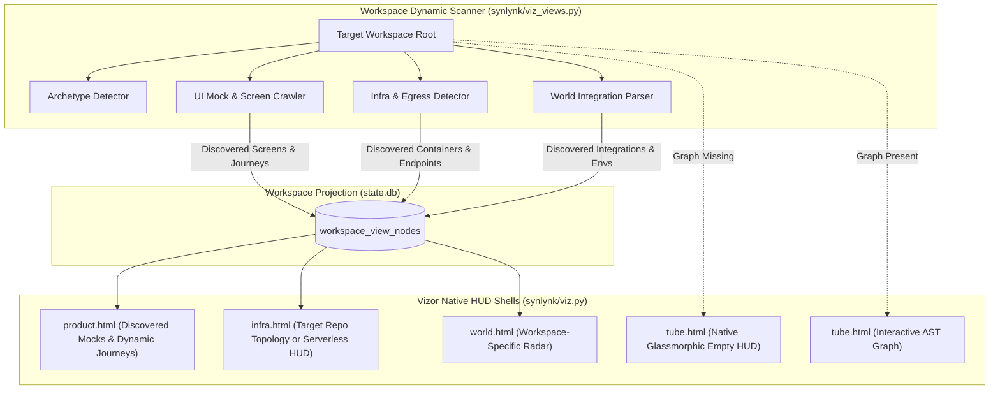

# Design Spec: Vizor Repo-Truth Purge & Native View HUD Shells (Spec 2)

**Date:** 2026-09-30  
**Status:** In Review  
**Governing Goal:** `goal-e3840370` (*Consolidated Vizor Master Control Plane: Unified Interactive Web HUD, GOVERNS Lifecycle Board, Architectural Views, Onboarding Journey, and Hosted Fleet Radar*)  
**Associated Stories:** `story-b24ec68c` (Spec 1), `story-vizor-spec2` (Spec 2)  
**Authors:** @nikhilsoman, @agy  

---

## 1. Executive Summary & Core Invariant

In Spec 1, Vizor established strict workspace-scoped URL routing (`/w/<slug>/...`), decoupling daemon state from the host process CWD and ensuring multi-workspace isolation. 

However, deep inspection of the offline projection views (`product.html`, `tube.html`, `logical.html`, `infra.html`, `world.html`) in `synlynk/viz_views.py` and `synlynk/viz.py` uncovered pervasive cross-repo data leakage and brittle fallbacks:
1. **Infra View (`infra.html`) Data Leakage:** Hardcodes Synlynk's internal daemon services (Vizor Server `:8721`, SSE Relay Broker `:27472`, StateDB SQLite Ledger, Keystore, Graphify AST Cache) and outbound LLM egress points (Claude, Codex, Gemini, Grok, GitHub API) into *every* workspace. Viewing `rxcc` in Vizor erroneously displays Synlynk's private daemons and API keys.
2. **Product View (`product.html`) Hardcoding:** Explicitly opens `synlynk/cli.py` and falls back to Synlynk-specific onboarding and governance journeys ("Zero-Friction Onboarding", "Interactive Home Harness Pairing", "GOVERNS Board"). It fails to discover local UI prototypes or application screens in non-Synlynk codebases.
3. **Architect Map (`tube.html`) 404 Error:** When an unindexed repo (such as `rxcc`) is viewed, `tube.html` loads an `<iframe>` pointing to `.synlynk/graphify-out/graphify.html`. Because the file does not exist, the browser renders an ugly HTTP 404 error page inside the main HUD.
4. **World View (`world.html`) Hardcoding:** Hardcodes Synlynk environment variables (`GH_TOKEN`, `GEMINI_API_KEY`, `ANTHROPIC_API_KEY`) pointing to `synlynk/` source paths.

### Core Product Invariants:
- **Invariant 1 (Repo Truth):** Vizor must render exclusively what exists in the active workspace's repository. No host-agent daemon, private database, or foreign toolchain may ever leak into another workspace's views.
- **Invariant 2 (Zero 404s / Graceful HUD Shells):** Vizor views must never render broken iframes or 404 error pages. Unindexed or absent data must present an integrated glassmorphic HUD shell explaining the status with a clear 1-click action.
- **Invariant 3 (Universal Archetype Discovery):** Project topology, UI mocks, entrypoints, and services must be dynamically discovered across polyglot ecosystems (Python, TypeScript monorepos, Go, Rust).

---

## 2. Architecture & Subsystems

---

## 3. Detailed Specifications

### 3.1 Subsystem A: Dynamic UI Mock & Journey Discovery (`product.html`)

Instead of hardcoding Synlynk journeys and CLI commands:
1. **Monorepo & Package Discovery:**
   - Detect `pnpm-workspace.yaml`, `lerna.json`, `package.json` (`workspaces`), or multi-package directories (`apps/*`, `packages/*`).
   - Extract apps, frontends, APIs, and microservices into first-class system components.
2. **Local UI Mock & Prototype Discovery:**
   - Search `.superpowers/brainstorm/*/content/*.html` and `.superpowers/brainstorm/ux-screenshots/` for HTML/CSS prototypes and mockups.
   - Search `docs/ux/`, `assets/`, `mockups/` for visual assets.
   - For each discovered mockup, register a `screen` node with an embedded preview URL (`/w/<slug>/raw/<path>` or interactive modal preview).
3. **Dynamic User Journey Extraction:**
   - Parse `docs/journeys/*.md` if present.
   - If absent, synthesize journeys based on detected architecture:
     - For Web Apps: "Visitor Landing → Authentication → Dashboard Operations → Settings / Profile".
     - For Monorepos (`rxcc`): "Admin Console Workflow", "Public API Intake", "Validation Pipeline".
     - For Libraries / CLI: "Installation & Setup → Configuration → Core Invocation → Output Export".

### 3.2 Subsystem B: Native Glassmorphic Empty HUD Shell for Architect Map (`tube.html`)

When `.synlynk/graphify-out/graphify.html` or `graph.json` is missing:
1. **Eliminate 404 Iframe:** Remove raw `<iframe>` fallback pointing to non-existent files.
2. **Native HUD Shell:** Render a responsive, glassmorphic HUD:
   - **Visual State:** Dark obsidian backdrop with subtle pulsing geometric lattice.
   - **Status Badge:** `STATUS: AWAITING_AST_INDEXING`.
   - **Diagnostic Message:** "AST Code Graph has not yet been generated for workspace `<name>`. Run Graphify or the deep scanner to index symbols, communities, and dependency topology."
   - **Interactive Action:** "Run AST Code Scan" trigger button dispatching `POST /w/<slug>/api/scan` with real-time SSE progress bar, alongside the copyable CLI command: `synlynk scan --deep`.

### 3.3 Subsystem C: Repo-Truth Infrastructure & Egress Discovery (`infra.html`)

Completely purge hardcoded Synlynk internal daemons (`Vizor Server (:8721)`, `SSE Relay Broker (:27472)`, etc.) and outbound AI egress lists from `extract_infra_nodes()`:
1. **Container & Orchestration Scan:**
   - Parse `docker-compose*.yml` and `compose*.yaml`: Extract declared services, ports, images, and container networks.
   - Parse `Dockerfile*` in root and `apps/*`: Extract exposed ports and base images.
   - Parse `infra/`, `k8s/`, `terraform/` directories for declared infrastructure resources.
2. **Database & Data Store Scan:**
   - Detect Prisma schemas (`prisma/schema.prisma`), SQLAlchemy models, Alembic migrations, Django settings, or SQLite files.
3. **Outbound Egress & API Scan:**
   - Scan `.env.example`, `.env.template`, and configuration files for external API hosts and third-party integrations (e.g. AWS, Stripe, Twilio, OpenAI, Redis Cloud).
4. **Clean Fallback for Zero-Infra Codebases:**
   - If no containers, databases, or daemons are detected, display an elegant "Host-Local / Zero-Cloud Dependencies" or "Serverless Architecture" layout. Under no circumstances may another workspace's daemons be displayed.

### 3.4 Subsystem D: Dynamic World View & Integration Radar (`world.html`)

1. **Purge Synlynk Source Paths:** Remove all references to `synlynk/gh.py`, `synlynk/dispatch.py`, `synlynk/media.py` in `extract_world_nodes()`.
2. **Workspace Egress Radar:** Populate Ring 1 (Internal), Ring 2 (Core Integrations), and Ring 3 (Ecosystem & Partners) strictly from the target repository's detected dependencies and environment variables.

---

## 4. Test & Verification Plan

1. **Unit Tests (`tests/test_vizor_repo_truth.py`):**
   - Verify `extract_infra_nodes()` on an arbitrary dummy repository produces 0 Synlynk daemons.
   - Verify `extract_product_nodes()` on an arbitrary dummy monorepo (with `apps/web` and `apps/api`) extracts the monorepo apps and no Synlynk journeys.
   - Verify `extract_product_nodes()` discovers `.superpowers/brainstorm/*/content/*.html` UI prototypes.
2. **Architect Map HUD Tests (`tests/test_vizor_architect_hud.py`):**
   - Verify `tube.html` contains the native glassmorphic HUD when `graphify-out/` is absent.
   - Verify no 404 iframe request is generated.
3. **Live Multi-Workspace Validation (`tests/test_vizor_rxcc_truth.py`):**
   - Run projection extraction against `/Users/nikhilsoman/dev/rxcc` (if present) and verify all views render clean, authentic `rxcc` data with zero cross-contamination.

---

## 5. Implementation Roadmap

- **Task 1 (TDD):** Create `tests/test_vizor_repo_truth.py` asserting that arbitrary workspaces do not leak Synlynk infrastructure or journeys.
- **Task 2:** Refactor `synlynk/viz_views.py` `extract_infra_nodes()` to discover docker-compose, Dockerfile, and database schemas dynamically, purging hardcoded Synlynk services.
- **Task 3:** Refactor `synlynk/viz_views.py` `extract_product_nodes()` to discover monorepo packages, UI brainstorm mockups, and dynamic journeys.
- **Task 4:** Refactor `synlynk/viz.py` `tube.html` generator to render the native glassmorphic HUD shell when code graphs are unindexed.
- **Task 5:** Refactor `synlynk/viz_views.py` `extract_world_nodes()` to parse workspace-specific environment variables and integrations.
- **Task 6:** Multi-workspace regression testing and verification across `synlynk` and `rxcc`.
