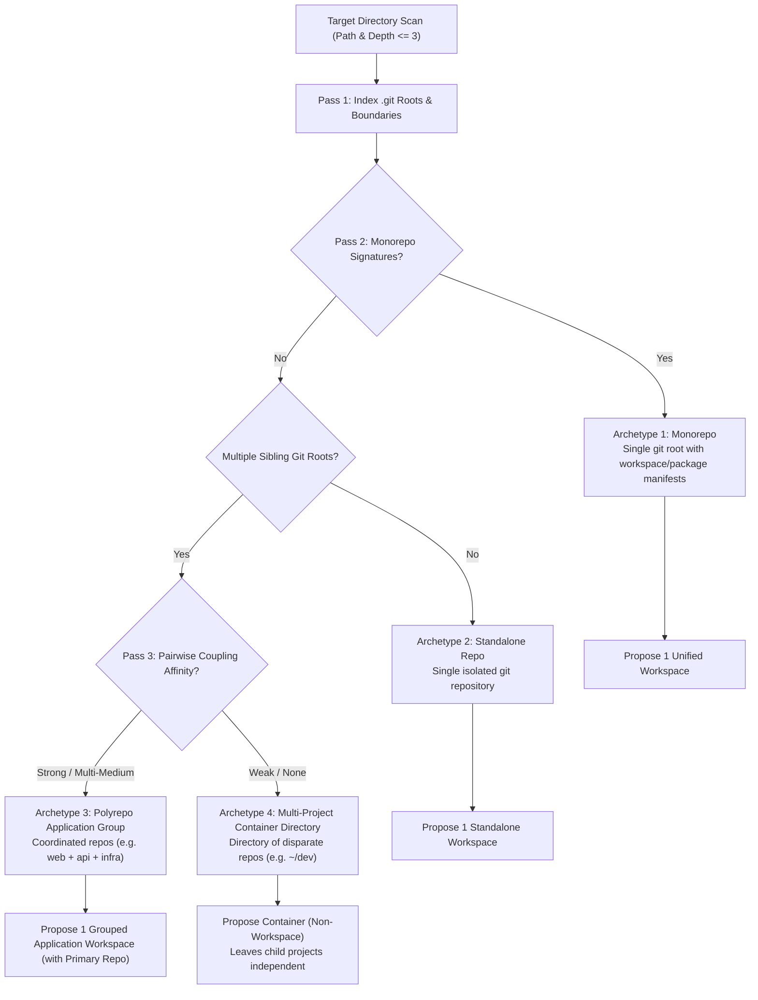
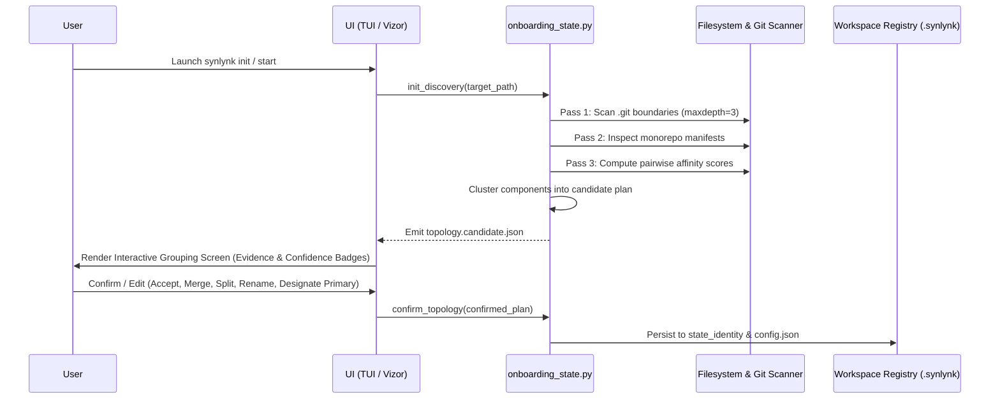
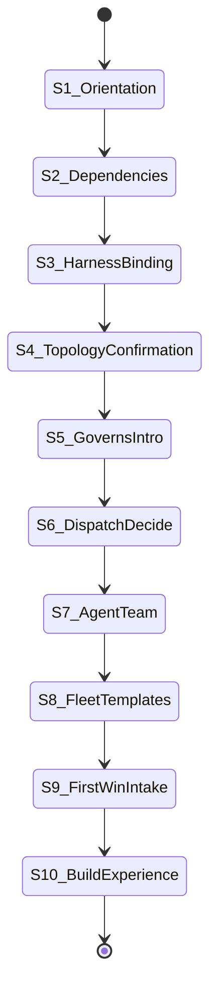

# Unified Onboarding Journeys & Self-Updating Lifecycle Engine Design

- **Date:** 2026-10-01
- **Status:** Proposed (Approved by DECIDE Panel `dec-00b401f2` & `dec-2026-10-01-phase-2`)
- **Authors:** Agy (Gemini), Claude Sonnet, Codex, Grok
- **Governing Goals:** `goal-e3840370` (Vizor Control Plane), `goal-3b45a961` (Fleet Parity)
- **Target Branch:** `feat/agy/vizor-onboarding-engine`

---

## 1. Executive Summary & Intent

Synlynk's Developer Preview requires a unified, resilient, and truthful onboarding experience that eliminates initial setup friction across both terminal (**CLI / TUI**) and browser (**Vizor HUD**) surfaces. Currently, onboarding primitives are fragmented across `coldstart.py`, `wizard.py`, `install.py`, and `viz.py`, leading to state drift, ambiguous directory handling, and inconsistent harness configuration.

This design unifies all onboarding, environment discovery, dependency binding, and lifecycle maintenance into **one canonical, headless, resumable state machine** (`synlynk/onboarding_state.py`) rendered identically by the CLI/TUI and Vizor. 

### Core Architectural Tenets
1. **One Engine, Two Skins:** All business logic, topology classification, dependency probes, and step transitions reside in the headless state machine persisted in `state.db`. Neither CLI/TUI nor Vizor owns onboarding logic; both consume and emit structured JSON events.
2. **Conservative, Evidence-Scored Topology Discovery:** Discovers four distinct structural archetypes (Container Directory, Monorepo, Polyrepo App Group, Standalone Repo). *A false merge is worse than a false split*—heuristics strictly default to independent workspaces unless strong coupling signals exist. Discovery is strictly read-only; topology is persisted only upon explicit user confirmation.
3. **Probe-Verified 1-Click Binding:** Harness and dependency bindings require an active round-trip probe (`synlynk probe`) testing authentication, execution sandbox bounds, and token rate limits. Green status labels alone are never treated as evidence.
4. **The First-Win Loop *Is* the Orientation:** Conceptual framework lectures are replaced by an immediate, live, zero-risk micro-cycle: Goal $\rightarrow$ Arc $\rightarrow$ Plan $\rightarrow$ Dispatch $\rightarrow$ Test $\rightarrow$ Non-Author QA Review $\rightarrow$ Merge $\rightarrow$ Experience in Vizor. Success requires a verifiable code diff or artifact.
5. **Dev Preview Auto-Upgrade Safety:** Ambient, background cross-workspace daemon mutations are forbidden to prevent SQLite WAL contention and instruction drift. Upgrades run via an explicit, opt-in command (`synlynk upgrade --all`) equipped with preflight dry-run diffs, per-workspace version stamps, and automated rollback snapshots.

---

## 2. Problem Statement & Root Cause Analysis

### 2.1 Fragmented Onboarding Logic (Split-Brain Vulnerability)
- **Current State:** `synlynk/coldstart.py` defines a 5-stage FTUE; `synlynk/wizard.py` implements an 8-screen curses TUI; `synlynk/viz.py` renders static HTML views at `/onboarding` and `/onboarding/roles`.
- **Failure Mode:** Any change to harness flags, role permissions, or dependency checks must be duplicated across three separate codebases. In practice, they drift immediately (e.g. #1228 worktree-relative path errors, #884/#899 stale reverts).

### 2.2 Ambiguous Multi-Repo & Container Directory Handling
- **Current State:** `_detect_cold_start_mode()` assumes the working directory is either a single new project or a single existing repo.
- **Failure Mode:** When run from a common development root like `~/dev` (which contains dozens of unrelated repositories like `synlynk`, `rxcc`, etc.), the system either fails to identify boundaries or threatens to treat `~/dev` as a monolithic workspace, risking cross-workspace state contamination.

### 2.3 Blind Harness Assignment & Flaky Auth
- **Current State:** Harnesses are selected based on static PATH presence.
- **Failure Mode:** A CLI binary on PATH does not guarantee working auth, valid API tokens, or non-exhausted rate quotas (e.g., Grok session expiry, Agy timeouts, 402 out-of-quota errors). Dispatched jobs fail on first execution rather than during onboarding.

### 2.4 Uncontrolled Drift & Version Fragmentation Across Teams
- **Current State:** Users in a team can run divergent versions of `synlynk` against shared repositories, leading to schema drift in `state.db` and conflicting prompt templates.

---

## 3. The 4 Structural Topology Archetypes

When launched in any target path, the discovery engine scans filesystem and VCS boundaries to classify the workspace into one of four archetypes:



### Archetype Definitions & Detection Signatures

| Archetype | Definition | Detection Signatures | Default Proposed Workspace Mapping |
| :--- | :--- | :--- | :--- |
| **1. Monorepo** | Single `.git` root containing multiple coordinated subprojects or packages. | `pnpm-workspace.yaml`, `package.json` with `workspaces`, `go.work`, `Cargo.toml` with `[workspace]`, `turbo.json`, `nx.json`. | 1 Unified Workspace covering all packages. Never split. |
| **2. Standalone Repo** | Single `.git` root containing one self-contained project. | Exactly 1 `.git` directory at target root, no sibling project relationships detected. | 1 Workspace directly mapped to the repository. |
| **3. Polyrepo App Group** | Multiple independent `.git` roots that form a single logical application. | **Strong Signals:** Shared `docker-compose.yml`, shared orchestrators, cross-repo OpenAPI client imports, inter-repo relative path references, shared `.env` contracts.<br/>**Medium Signals:** Shared GitHub remote org + name prefix (`app-web`, `app-api`), correlated commit timestamps, shared CI workflows. | 1 Grouped Application Workspace with a designated Primary Repo. |
| **4. Multi-Project Container** | A directory containing disparate, unrelated repositories (e.g. `~/dev` or `~/projects`). | Multiple sibling `.git` roots with only **Weak Signals** (common parent directory, filesystem mtime proximity) and no strong coupling edges. | **Non-Workspace Container.** Does not create a parent workspace; offers independent onboarding for individual member repos. |

---

## 4. Multi-Pass Topology Discovery Pipeline

Discovery is strictly **read-only**, deterministic, and bounded:



### Discovery Passes:
1. **Pass 1 — VCS Boundaries:** Recursively identifies all git repository roots up to depth 3. Excludes `node_modules`, `vendor`, `.cache`, and active `.synlynk/worktrees`.
2. **Pass 2 — Monorepo Signatures:** Checks candidate roots for monorepo declarations. If present, the candidate is locked as a Monorepo archetype.
3. **Pass 3 — Pairwise Affinity Scoring:**
   - Evaluates pairs of sibling roots $(R_A, R_B)$:
     $$\text{AffinityScore}(R_A, R_B) = \sum w_{\text{strong}} \cdot S + \sum w_{\text{medium}} \cdot M + \sum w_{\text{weak}} \cdot W$$
   - A cluster proposal requires:
     $$\text{AffinityScore} \ge \text{Threshold} \quad (\ge 1 \text{ strong signal OR } \ge 2 \text{ matching medium signals})$$
   - Weak signals (e.g. shared parent directory) are scored with weight 0 for clustering and act only as tie-breakers.
4. **Pass 4 — Candidate Proposal Emission:** Writes `topology.candidate.json` (unpersisted to `state.db`).
5. **Pass 5 — User Confirmation & Override Gate:** Both CLI and Vizor display the candidate tree. Users can:
   - `Accept`: Confirm the proposed clustering.
   - `Merge`: Select 2+ standalone repos and group them into a polyrepo workspace.
   - `Split`: Separate a grouped workspace into independent standalone workspaces.
   - `Designate Primary`: Choose which repository in a polyrepo group acts as the anchor root.
   - `Rename`: Customize the workspace slug.
   - `Ignore`: Exclude scratch / experimental repos from Synlynk.
6. **Pass 6 — Idempotent Persistence:** Confirmed topology is stored in the workspace registry. Subsequent scans only detect **diffs** (new repos added) and never overwrite user-confirmed groupings.

---

## 5. The 10-Stage Unified Onboarding Journey

The unified state machine moves through 10 deterministic stages:



### Stage Details

#### Stage 1: Orientation & Philosophy
- **Message:** What Synlynk is and what it isn't.
- **Core Concept:** An autonomous multi-agent engineering operating system. Specialized roles (`dev`, `qa`, `pm`, `architect`) working asynchronously in git worktrees against a shared SQLite WAL ledger, governed by clear policies.
- **Anti-Patterns Clarified:** Not a single-chat autocomplete; not a code generator that writes directly to `main` without review.

#### Stage 2: Dependency Discovery & 1-Click Repair
- Probes system tools: `git >= 2.38`, `python >= 3.10`, `gh` CLI, `node`/`npm`, `pytest`, `graphify`.
- Renders visual chips (Green check / Red cross / Yellow warning).
- Offers 1-click installation commands (`brew install gh`, `pip install graphify`).

#### Stage 3: Harness Probing & OAuth Connect
- Probes installed AI harnesses on PATH: `claude`, `codex`, `agy`, `grok`, `local/oMLX`.
- Executes round-trip probe (`synlynk probe <harness>`):
  - Validates API key / session token.
  - Validates sandbox network egress.
  - Verifies token rate & quota health.
- Displays interactive OAuth connection cards in Vizor (`/onboarding`) and CLI login commands.

#### Stage 4: Topology & Repo Binding
- Executes the multi-pass topology discovery pipeline (§4).
- If Greenfield (no `.git`): guides `git init`, initial branch `main`, initial commit, and `gh repo create <name> --private --push`.
- Confirms workspace slugs and repository bindings.

#### Stage 5: Introduction to GOVERNS
- Visualizes the 5-stage compressed GOVERNS model:
  $$\text{Plan} \longrightarrow \text{Build} \longrightarrow \text{Verify} \longrightarrow \text{Ship} \longrightarrow \text{Sustain}$$
- Explains living alignment: every story is continuously mapped to an active business goal with zero phantom goal leakage (Specs 1–3).

#### Stage 6: Dispatch vs. DECIDE Governance
- Differentiates daily routine from architectural consensus:
  - **`synlynk dispatch`:** Day-to-day autonomous task execution in isolated git worktrees.
  - **`synlynk decide`:** Multi-agent panel consensus (Claude, Codex, Agy, Grok) for architecture reviews, tradeoffs, and milestone planning before writing code.

#### Stage 7: Meet Your Agent Fleet
- Introduces default functional roles:
  - `pm` (Claude) — Spec & milestone definition.
  - `architect` (Claude / Agy) — Technical design & constraint validation.
  - `dev` (Codex / Agy / Grok) — Test-driven implementation.
  - `qa` (Codex / Claude) — Non-author review, CI verification, and merge authority.

#### Stage 8: Industry/Domain Fleet Templates
- Offers 1-click agent matrices customized for industry verticals:
  - **SaaS / Web App:** Full-stack dev, QA reviewer, PM, Stitch/UX designer.
  - **Fintech / Payments:** Security specialist, Compliance auditor, Backend ledger dev, Testbed QA.
  - **Healthcare / MedTech:** HIPAA auditor, Reliability engineer, Clinical data dev.
  - **DeepTech / AI Infra:** ML engineer, Model benchmarking QA, Distributed infra specialist.
  - **DevOps / Platform:** Cloud architect, Kubernetes dev, SRE Sentinel monitor.
- Automatically scaffolds `.agents/` and `.synlynk/config.json`.

#### Stage 9: First-Win Project Intake ("What do you want us to build for you?")
- Interactive intake prompt for the user's initial feature request, bug fix, or documentation goal.

#### Stage 10: The Full First-Win Micro-Cycle (Effect-Verified)
- Runs a real, zero-risk micro-cycle:
  1. Creates Goal 1 via `synlynk goal create`.
  2. Opens staged roadmap arc.
  3. Generates 1 well-scoped story.
  4. Dispatches task to role agent in an isolated worktree (`worktrees/feat-...`).
  5. Executes automated tests.
  6. Dispatches non-author QA review.
  7. Validates `synlynk policy check-merge --role qa`.
  8. Squash-merges to branch/main and reflects live in Vizor.

---

## 6. Self-Updating Lifecycle & Version Standardization

### 6.1 Automated GA Release Updates
- `synlynk-daemon` periodically checks for newer GA releases from PyPI / GitHub releases.
- When an update is detected, `synlynk` displays a non-intrusive notification:
  `⚡ Synlynk update available: 0.23.0 → 0.24.0. Run 'synlynk upgrade' to apply.`
- Active running agent jobs and worktrees are never interrupted.

### 6.2 Team Version Negotiation & Pinning (Dev Preview)
- To prevent version drift across team members, `.synlynk/config.json` supports explicit version pinning:
  ```json
  {
    "version_policy": {
      "min_version": "0.23.0",
      "target_version": "0.24.0",
      "enforcement": "warn_and_prompt"
    }
  }
  ```
- When a developer pulls a repository where `target_version` is higher than their installed CLI, `synlynk` warns and offers an automatic upgrade prompt (`synlynk upgrade`), ensuring all developers and agents operate on identical schema migrations and prompt templates.

### 6.3 Local Speed + Stateless Relay Sync for State DB
- **Local Autonomy:** Local CLI commands and local Vizor instances always read and write directly to local SQLite WAL (`state.db`) for instantaneous sub-millisecond execution.
- **Stateless Relay Sync:** A lightweight relay client transmits event envelopes and snapshot summaries to the relay server. Remote viewers (`synlynk.com/<git_user_id>/<workspace>/`) read from the relay cache without accessing the user's local filesystem directly.

### 6.4 Automatic Graphify Pipeline
- `graphify` is wired into git `post-commit` and `post-merge` hooks:
  - On commit/merge, `graphify` incrementally updates the local code graph (`graphify-out/`).
  - Vizor Logical and Knowledge Graph views remain continuously synchronized with repository reality.

---

## 7. Verification & Test Matrix

| Test Suite | Scenario | Invariant Verified |
| :--- | :--- | :--- |
| `test_onboarding_topology.py` | Greenfield folder detection | Proposes `git init` + GitHub remote creation; persists nothing until confirmed. |
| `test_onboarding_topology.py` | Multi-project container (`~/dev`) | Treats parent folder as non-workspace container; preserves independence of child repos. |
| `test_onboarding_topology.py` | Monorepo detection (`pnpm-workspace.yaml`) | Maps all packages to 1 unified workspace; never splits. |
| `test_onboarding_topology.py` | Polyrepo application group (shared compose / OpenAPI) | Computes affinity score $\ge \text{threshold}$; proposes 1 grouped workspace with primary repo. |
| `test_onboarding_state.py` | Resumable state machine transitions | Resumes interrupted onboarding at exact same stage; dual-surface parity (CLI $\leftrightarrow$ Vizor). |
| `test_harness_probe.py` | Probe-verified binding | Rejects broken tokens / offline harnesses; validates auth, network egress, and token rates. |
| `test_first_win_cycle.py` | First-win build loop | Rejects green exit with zero code changes; requires verifiable diff, non-author review, and clean merge. |
| `test_upgrade_engine.py` | Version negotiation & rollback | Validates `synlynk upgrade --all` dry-run diffs, migration stamps, and automated rollback snapshots. |

---

## 8. Rollout Plan & Milestones

1. **Milestone 1:** Headless Onboarding State Machine (`synlynk/onboarding_state.py`) & Topology Scanner.
2. **Milestone 2:** Probe-Verified Harness & Dependency Binding (`synlynk probe` + OAuth cards).
3. **Milestone 3:** TUI (`wizard.py`) & Vizor (`/w/<slug>/onboarding`) Dual-Surface Renderers.
4. **Milestone 4:** Automated First-Win Build Loop with Effect Verification.
5. **Milestone 5:** Fleet Domain Templates & Version Negotiation Engine (`synlynk upgrade --all`).
6. **Milestone 6:** End-to-end verification on a second non-synlynk workspace (`rxcc`).
