# Design Spec: Zero-Risk Packaging & Standalone Distribution Engine

**Status:** Draft / Pending Sign-Off  
**Date:** 2026-10-01  
**Author:** Agy (Gemini) with Decide Panel Consensus (`claude`, `codex`, `agy`)  
**Decision Ref:** `dec-f77e216e` (`project-docs/decisions/2026-10-01-zero-risk-packaging-standalone-distribut.md`)  
**Target Milestone:** v1.0.0-rc1 Developer Preview  

---

## 1. Executive Summary & Core Invariants

The primary point of failure and user drop-off for developer CLI tools is the installation and distribution experience. On modern macOS (Homebrew Python 3.12+) and Linux (Ubuntu 24.04+, Debian 12+), direct `pip install` fails with PEP 668 ("externally managed environment"), while global installations risk corrupting system packages or user virtualenvs.

Rather than making the fragile marketing claim of "impossible to fail", this architecture establishes the operational guarantee: **"Never Leaves You Broken"**.
1. **Zero Runtime External Dependencies:** Synlynk's runtime relies strictly on the Python 3.10+ standard library (`sqlite3`, `http.server`, `urllib`, `dataclasses`, `shutil`, `pty`, `subprocess`). Zero C-extensions, zero wheel compilation, zero dependency conflict surface.
2. **Resilient 4-Tier Distribution Ladder:** Cascades through modern isolated package managers (`uv tool` → `pipx` → consent-gated `pipx` bootstrap → stdlib `venv` baseline).
3. **Atomic Upgrades & Offline Rollback:** Tier 4 maintains versioned release directories (`~/.synlynk/releases/<version>`) with an atomic `current` symlink.
4. **Single Provenance Manifest:** Every tier writes to `~/.synlynk/install.json`, enabling `synlynk upgrade`, `synlynk rollback`, `synlynk doctor`, and repair to behave identically regardless of how Synlynk was installed.
5. **Decoupled Ecosystem Provisioning:** Auxiliary tools (`gh`, `graphify`, `superpowers`) are strictly decoupled from the install transaction; their absence or failure never impedes core Synlynk operation.

---

## 2. 4-Tier Installation Pipeline Architecture (180-Column Wide Flowchart)

```mermaid
flowchart LR
    %% Entry & Preflight
    Start(["curl -fsSL https://synlynk.com/install.sh | sh"]):::entryPoint
    PrereqGate{"Prerequisites Gate:<br/>Python >= 3.10<br/>& Git >= 2.38?"}:::decision
    PrereqFail(["❌ Exit 1: Actionable remediation message<br/>(System Python or Git below requirements)"]):::failNode

    %% Package Manager Probes
    CheckUv{"Tier 1 Probe:<br/>Is uv present<br/>on $PATH?"}:::decision
    CheckPipx{"Tier 2 Probe:<br/>Is pipx present<br/>on $PATH?"}:::decision
    AutoInstallPipx{"Tier 3 Consent Gate:<br/>Interactive prompt or --allow-bootstrap?<br/>(brew / apt-get / dnf / pacman)"}:::decision

    %% Execution Tiers
    ExecTier1["<b>Tier 1: uv Fast Execution</b><br/><code>uv tool install synlynk</code><br/>• High-speed isolated tool virtualenv<br/>• Managed Python fallback if host is stale"]:::tierNode
    ExecTier2["<b>Tier 2: pipx Native Execution</b><br/><code>pipx install synlynk</code><br/>• Isolated virtualenv in ~/.local/pipx/venvs<br/>• Clean binary symlink in ~/.local/bin"]:::tierNode
    ExecTier4["<b>Tier 4: Guaranteed Stdlib Venv Baseline</b><br/><code>python3 -m venv ~/.synlynk/releases/vX.Y.Z</code><br/>• 100% Python stdlib isolated environment<br/>• Atomic symlink ~/.synlynk/releases/current<br/>• Symlinks binary to ~/.local/bin/synlynk"]:::tierNode

    %% Post-Install Health Gate
    HealthGate{"Core Health Gate:<br/>Run <code>synlynk doctor --preflight</code><br/>& verify ~/.local/bin on $PATH"}:::decision
    PathFix["PATH Remediation:<br/>Print non-destructive export command<br/>(export PATH=$HOME/.local/bin:$PATH)"]:::warnNode

    %% Decoupled Ecosystem Provisioning
    EcosystemGate{"Ecosystem Extension:<br/>Run <code>synlynk doctor --provision</code>?<br/>(graphify, superpowers, gh)"}:::decision
    InstallTools["<b>Ecosystem Provisioner</b><br/>• graphify AST Knowledge Graph<br/>• superpowers skill packs<br/>• gh GitHub CLI"]:::toolNode
    SkipTools["Skip Ecosystem Provisioning<br/>(Advisory notice: run <code>synlynk doctor --provision</code> anytime)"]:::warnNode

    Success(["✓ Zero-Risk Installation Verified & Operational"]):::successNode

    %% Wire Left-to-Right
    Start --> PrereqGate
    PrereqGate -- "Missing Requirements" --> PrereqFail
    PrereqGate -- "Satisfied" --> CheckUv

    CheckUv -- "uv Available" --> ExecTier1
    CheckUv -- "uv Absent" --> CheckPipx

    CheckPipx -- "pipx Available" --> ExecTier2
    CheckPipx -- "pipx Absent" --> AutoInstallPipx

    AutoInstallPipx -- "Consented" --> ExecTier2
    AutoInstallPipx -- "Declined / Headless Pipe" --> ExecTier4

    ExecTier1 --> HealthGate
    ExecTier2 --> HealthGate
    ExecTier4 --> HealthGate

    HealthGate -- "~/.local/bin missing from PATH" --> PathFix
    HealthGate -- "PATH valid & Doctor green" --> EcosystemGate
    PathFix --> EcosystemGate

    EcosystemGate -- "Interactive Confirm / --with-tools" --> InstallTools
    EcosystemGate -- "Skipped / Default" --> SkipTools

    InstallTools --> Success
    SkipTools --> Success

    classDef entryPoint fill:#1e293b,stroke:#38bdf8,stroke-width:2px,color:#f8fafc;
    classDef decision fill:#0f172a,stroke:#f59e0b,stroke-width:2px,color:#f8fafc;
    classDef tierNode fill:#022c22,stroke:#10b981,stroke-width:2px,color:#f8fafc;
    classDef toolNode fill:#1e1b4b,stroke:#818cf8,stroke-width:2px,color:#f8fafc;
    classDef warnNode fill:#451a03,stroke:#f97316,stroke-width:2px,color:#f8fafc;
    classDef failNode fill:#450a0a,stroke:#ef4444,stroke-width:2px,color:#f8fafc;
    classDef successNode fill:#064e3b,stroke:#34d399,stroke-width:3px,color:#f8fafc;
```



---

## 3. Tier Specifications & Detailed Mechanics

### Tier 1: `uv` Fast Tool Environment
- **Trigger:** `command -v uv` succeeds.
- **Action:** `uv tool install git+https://github.com/nikhilsoman/synlynk.git` (or PyPI wheel).
- **Advantages:** Sub-second installs, managed Python fetching if host interpreter has issues, automatic shim generation in `~/.local/bin`.
- **Upgrade Command:** `uv tool upgrade synlynk`.

### Tier 2: `pipx` Isolated Application Environment
- **Trigger:** `command -v pipx` succeeds.
- **Action:** `pipx install git+https://github.com/nikhilsoman/synlynk.git` (or PyPI wheel).
- **Advantages:** Standard Python community tool manager; creates dedicated virtualenv in `~/.local/pipx/venvs/synlynk` and shims in `~/.local/bin`.
- **Upgrade Command:** `pipx upgrade synlynk` or `pipx install git+... --force`.

### Tier 3: Consent-Gated `pipx` System Bootstrap
- **Trigger:** Neither `uv` nor `pipx` found, but host has supported package manager (`brew`, `apt-get`, `dnf`, `pacman`).
- **Gate:** Interactive prompt `pipx is recommended. Attempt auto-install via system package manager? [y/N]` or `--allow-bootstrap` flag. If running headless in a pipe (`curl ... | sh`), this tier is automatically bypassed to Tier 4 without blocking.
- **Action:** Runs `brew install pipx` or `apt-get install -y pipx`, runs `pipx ensurepath`, then proceeds to Tier 2.

### Tier 4: Guaranteed Standalone Stdlib `venv` Baseline
- **Trigger:** Default fallback when no third-party package manager is available or desired.
- **Requirements:** Only standard `python3` (>=3.10) with built-in `venv` module. Zero internet access required beyond wheel download.
- **Directory Structure:**
  ```text
  ~/.synlynk/
  ├── releases/
  │   ├── v0.23.0/
  │   │   ├── bin/python
  │   │   └── bin/synlynk
  │   ├── v0.24.0/
  │   │   ├── bin/python
  │   │   └── bin/synlynk
  │   └── current -> ~/.synlynk/releases/v0.24.0
  ├── bin/
  │   └── synlynk -> ~/.synlynk/releases/current/bin/synlynk
  └── install.json
  ```
- **Atomicity:** Installs the release wheel into a new directory `~/.synlynk/releases/v<new_version>`. Once verified with `--version`, updates `current` symlink atomically via `ln -sfn`.
- **Launcher Symlink:** Symlinks `~/.local/bin/synlynk` (or `~/.synlynk/bin/synlynk`) to `~/.synlynk/releases/current/bin/synlynk`.

---

## 4. Install Provenance Manifest Schema (`~/.synlynk/install.json`)

To eliminate split-brain behavior across update and repair paths, all tiers write and update a unified manifest:

```json
{
  "version": "0.24.0",
  "method": "uv",
  "python_executable": "/opt/homebrew/bin/python3.12",
  "python_version": "3.12.2",
  "environment_path": "/Users/user/.local/share/uv/tools/synlynk",
  "binary_path": "/Users/user/.local/bin/synlynk",
  "install_spec": "git+https://github.com/nikhilsoman/synlynk.git",
  "installed_at": "2026-10-01T22:45:00Z",
  "rollback_target": {
    "version": "0.23.0",
    "path": "/Users/user/.synlynk/releases/v0.23.0"
  },
  "ecosystem_tools": {
    "graphify": {"installed": true, "binary": "/Users/user/.local/bin/graphify"},
    "superpowers": {"installed": true, "path": "/Users/user/.gemini/antigravity-cli/skills/superpowers"},
    "gh": {"installed": true, "version": "gh version 2.45.0"}
  }
}
```

---

## 5. Unified Lifecycle Parity: Upgrade, Rollback & Repair

### `synlynk upgrade`
1. Reads `~/.synlynk/install.json`.
2. Checks GitHub release API or PyPI for latest version.
3. If new version exists:
   - **`uv`:** Executes `uv tool upgrade synlynk`.
   - **`pipx`:** Executes `pipx install <spec>@v<latest> --force`.
   - **`venv`:** Builds `~/.synlynk/releases/v<latest>`, installs wheel, verifies sanity, updates `install.json` with previous as rollback target, and atomically switches `current` symlink.
   - **`editable`:** Detects local git repository checkout; alerts user: `Active development checkout detected. Use git pull && synlynk migrate instead.`

### `synlynk rollback`
1. Reads `~/.synlynk/install.json` rollback target.
2. Reverts the launcher symlink to previous release (instantaneous and offline in Tier 4) or runs pinned downgrade command.
3. Restores database schema via `synlynk rollback`.

### `synlynk doctor` Diagnostic & Repair
- Checks interpreter version against `>=3.10`.
- Validates that `binary_path` matches `which synlynk`.
- Detects if `~/.local/bin` is missing from `$PATH` and generates exact shell config exports (`.zshrc`, `.bashrc`).
- Verifies ecosystem tools health independently and offers `synlynk doctor --provision` for missing dependencies.

---

## 6. Decoupled Ecosystem Tools Provisioning

Ecosystem dependencies are optional accelerators, not runtime gates:
1. **`graphify`:** AST Knowledge Graph generation (`uv tool install graphifyy` / `pipx install graphifyy`).
2. **`superpowers`:** Documentation, brainstorming, and SDD skill pack templates (linked into agent skill directories).
3. **`gh`:** GitHub CLI for PR reviews and repository automation (`brew install gh` / system package manager).

User Customization in `.synlynk/config.json`:
```json
{
  "ecosystem_tools": {
    "required": ["gh", "graphify", "superpowers"],
    "custom": {
      "ripgrep": {"binary": "rg", "install_methods": ["brew", "apt"]}
    }
  }
}
```

---

## 7. Package Standards & Metadata Hardening

1. **`pyproject.toml` Alignment:**
   - Change `requires-python = ">=3.9"` to `requires-python = ">=3.10"`.
   - Ensure `classifiers` reflect Python 3.10, 3.11, 3.12, 3.13.
2. **PEP 561 Compliance:**
   - Create empty `synlynk/py.typed` marker file.
3. **Entry Point Verification:**
   - Ensure `[project.scripts] synlynk = "synlynk:main"` cleanly passes arguments to `synlynk.cli:main(argv)`.

---

## 8. Verification Matrix & Test Strategy

Before claiming "never leaves you broken", an automated test suite `tests/test_zero_risk_packaging.py` must run across:
- **Clean macOS runner:** No pre-installed pipx, testing fallback venv creation.
- **Ubuntu 24.04 runner:** Strict PEP 668 environment, testing `uv` and `pipx` paths.
- **Hermetic Wheel Sandbox Test:**
  1. Build `.whl` package in clean directory (`python3 -m pip wheel --no-deps .`).
  2. Install into isolated temporary venv outside repository root.
  3. Execute `synlynk --version`, `synlynk doctor`, `synlynk scan` from a blank directory.
  4. Assert zero `ModuleNotFoundError`, zero foreign files written, and zero runtime dependencies beyond standard library.
