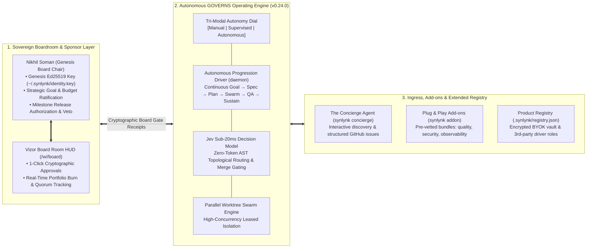
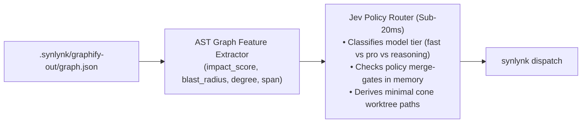

# Autonomous Platform Architecture, Sovereign Board Governance, Swarm Engine & The Concierge

## 1. Executive Summary & Paradigm Shift

This specification establishes the architectural foundation for Synlynk's transformation into a **self-managing, autonomous engineering product organization sponsored and governed by a Human Board of Directors**. 

Rather than requiring manual operator steering for every dispatch, feature proposal, and maintenance chore, Synlynk operates as a sovereign, host-local autonomous enterprise. The platform self-orchestrates under the **GOVERNS** lifecycle (`Goal → Open → Visualize → Execute → Release → Notify → Sustain`), while providing developers with an ergonomic **Tri-Modal Autonomy Dial** (`manual`, `supervised`, `autonomous`).

**Nikhil Soman** serves as the **Founding Board Member, Sponsor, and Executive Champion**, holding the Genesis cryptographic seat with exclusive appointment and veto authority over strategic product gates.



---

## 2. The Tri-Modal Autonomy Dial

To guarantee complete user sovereignty, Synlynk provides a first-class **Autonomy Dial** that dictates the runtime execution posture across the CLI, configuration, and Vizor HUD:

| Autonomy Mode | Autonomous Capabilities Enabled | Required Human Checkpoints | Ideal Persona & Use Case |
|:---|:---|:---|:---|
| **1. `manual`** | Zero ambient dispatches. Dispatches execute strictly on manual command. Testing and review must be explicitly run. | Every stage transition requires direct user intervention. | Ultra-conservative teams, security audits, and strict offline pairing. |
| **2. `supervised`** *(Default)* | Agents autonomously draft specs, plans, and branch PRs in background. Non-author QA reviews run automatically. | Stage transitions (e.g. Plan $\rightarrow$ Execute, PR $\rightarrow$ Merge) pause for a 1-click human confirmation. | Daily driver for professional developers collaborating with an AI co-pilot fleet. |
| **3. `autonomous`** | Full self-management. Continuous progression through all 7 GOVERNS stages. Agents auto-dispatch, auto-review, effect-verify, and merge passing code. | Halts *only* at the 4 explicit Board Approval Gates (New Goals, Budget Overruns, Public Release Tags, Board Appointments). | Unattended overnight feature builds, autonomous issue burndown, and sponsored self-governing products. |

### Configuration Surfaces:
- **CLI:** `synlynk config set autonomy_mode [manual | supervised | autonomous]` or flag override: `synlynk dispatch --mode autonomous`.
- **Vizor HUD:** A responsive 3-way glassmorphic toggle in the top-level navigation header with instant live SSE state update.
- **Config Store:** Persisted in `.synlynk/config.json` under `"autonomy_mode": "supervised"`.

---

## 3. Sovereign Board Governance Protocol (Sponsor & Board Chair)

### 3.1 Cryptographic Genesis Seat & Identity
- **Genesis Key:** Bound to `~/.synlynk/identity.key` (Ed25519 private key) and recorded in `.synlynk/policy.json`.
- **Genesis Authority:** Nikhil Soman holds 100% initial governance weight and permanent unilateral veto power over any proposal.
- **Appointment Authority:** No additional sponsor, investor, or board member can be admitted to the workspace governance layer without a signed `BoardAdmissionProposal` verified against the Genesis Key.

### 3.2 Strategic Board Approval Gates
When operating in `autonomous` mode, the fleet runs freely on daily execution stories, but hard-stops for cryptographic Board sign-off at four explicit checkpoints:
1. **Gate 1: Master Goal Inception:** Ratifying new multi-week product goals, architectural scopes, and budget allocations.
2. **Gate 2: Foundational Spec Ratification:** Signing off on major design specifications in `docs/superpowers/specs/`.
3. **Gate 3: Milestone & Public Release Authorization:** Authorizing external release tags, version bumps, and package publishing.
4. **Gate 4: Budget & Token Treasury Top-Up:** If autonomous swarms hit their allocated vault limit ($90 baseline + allocated API reserve), execution pauses until the Board signs a top-up.

### 3.3 Dual-Channel Board Interaction
1. **Vizor Board Room HUD (`/w/<slug>/board`):**
   - Executive overview of all active portfolios (Tracks 1–4).
   - Real-time token burn and dual-ledger subscription amortization display.
   - 1-Click Cryptographic Action buttons (`Approve`, `Request Revisions`, `Reject`) that sign proposals using the host identity key.
2. **Session Interactive Conversational Steering:**
   - The autonomous TPM role formats structured **Board Briefs** directly in pair-programming sessions and commits auditable markdown records to `project-docs/board/YYYY-MM-DD-board-brief.md`.

---

## 4. Executable Agent Charters & Authority Matrix (Track 3 Core)

### 4.1 Machine-Readable Charter Schema
Static markdown descriptions are replaced by validated JSON schema definitions in `.synlynk/charters/<role>.json`:

```json
{
  "$schema": "https://synlynk.dev/schemas/charter-v1.json",
  "role": "architect",
  "harness_bindings": ["claude", "codex"],
  "mandate": "Systemic architecture integrity, invariant compliance, and topology discovery",
  "autonomous_authorities": [
    "draft_spec",
    "run_spike",
    "classify_repo_topology",
    "recommend_goal_split"
  ],
  "escalation_triggers": [
    "invariant_violation_detected",
    "budget_exceeded",
    "api_breaking_change"
  ],
  "behavioral_weights": {
    "verbosity": "concise",
    "risk_tolerance": "conservative",
    "architectural_style": "modular_hexagonal"
  }
}
```

### 4.2 Fleet Role Matrix for v0.24.0:
- **`tpm` (Claude):** Drives roadmap velocity, milestone scheduling, and authors Board Briefs.
- **`architect` (Claude / Codex):** Authors design specs, audits invariant compliance, and guides AST cones.
- **`dev` (Codex / Agy / Grok):** Implements code in isolated worktrees with TDD verification.
- **`qa` (Independent Role):** Non-author review, test suite verification, and effect attestation (Invariant 1).
- **`maintainer` (Background Daemon Role):** Continuous issue burndown, dependency drift remediation, and sentinel cleanup.
- **`concierge` (Interactive Guide Role):** User discovery interview and GitHub issue synthesis.

---

## 5. Jev Sub-20ms AST Decision Model (#1712)

### 5.1 Architecture & Fast-Path Inference
The Jev decision model provides sub-20ms, zero-token typed routing and policy evaluation for the autonomous fleet, operating as a System 1 heuristic engine before invoking expensive frontier LLMs:



### 5.2 Deterministic Outputs:
- **Model Tier Classification:** Automatically assigns simple one-line doc/lint fixes to `fast` ($0.50/500k), multi-file refactors to `pro` ($2.50/2M), and complex architectural changes to `reasoning` ($15/5M).
- **Merge-Gate Policy Acceleration:** `synlynk policy check-merge` evaluates AST blast radius in <20ms, preventing high-risk changes from bypassing review.

---

## 6. Parallel Worktree Swarm Engine

### 6.1 Concurrency Architecture
To accelerate output without compromising reliability, the Swarm Engine orchestrates concurrent worker jobs across isolated Git worktrees:
- **Worktree Leases (`worktree_leases` table):** Workers obtain an atomic, leased worktree with an active heartbeat.
- **Non-Colliding Branch Topology:** Each swarm worker operates on `dispatch/<role>/swarm-<uuid>`, branched directly from the current base SHA.
- **Atomic Train Merge:** When multiple swarm stories complete, the TPM role verifies that their modified file sets are orthogonal before squashing them into the feature branch. If file overlap occurs, Jev triggers an automated merge reconciliation task.

---

## 7. The Concierge Agent (Feature Ingress & Proposal Synthesizer)

### 7.1 User Interaction Flow
1. User invokes `synlynk concierge` in terminal or clicks the **Concierge** button in Vizor.
2. The Concierge conducts an empathetic, structured requirements interview:
   - *Core Need:* What problem are you solving?
   - *Scope:* What components are touched?
   - *Criteria:* How do we know it's working (acceptance criteria)?
3. **Synthesis & Ingress:**
   - **Local Workspace Flow:** Generates a new Goal and draft Spec in `docs/superpowers/specs/`, ready for GOVERNS execution.
   - **Upstream Synlynk Proposal Flow:** If the user is requesting a new capability for Synlynk itself, the Concierge packages the conversation into a compliant GitHub Issue markdown draft and offers to submit it directly to `nikhilsoman/synlynk` via `gh issue create`.

---

## 8. Turnkey Plug & Play Add-ons Engine (`synlynk addon`)

### 8.1 Add-on Architecture
Synlynk installs and configures pre-vetted developer tooling bundles into local project virtual environments or project-scoped caches:
- `synlynk addon list`: Displays available, installed, and active add-ons.
- `synlynk addon install <bundle>`:
  - `bundle:quality`: Installs and configures Ruff, ESLint, Biome, and Prettier with pre-tested sensible defaults.
  - `bundle:security`: Configures Gitleaks pre-commit hooks, Semgrep SAST scans, and Trivy dependency checks.
  - `bundle:observability`: Installs Graphify AST knowledge graph and Mermaid CLI rendering.
  - `bundle:mobile`: Configures iOS CocoaPods/SPM bridges and Android Gradle linting.

---

## 9. Extended BYOK Product Registry & 3rd-Party Driver Agents

### 9.1 Registry Architecture (`.synlynk/registry.json`)
The registry provides a unified surface to enable or disable cloud and database integrations:

```json
{
  "integrations": {
    "supabase": { "enabled": true, "auth_type": "byok", "vault_key": "SUPABASE_ACCESS_TOKEN" },
    "vercel": { "enabled": true, "auth_type": "byok", "vault_key": "VERCEL_TOKEN" },
    "openrouter": { "enabled": true, "auth_type": "byok", "vault_key": "OPENROUTER_API_KEY" },
    "fal_ai": { "enabled": false, "auth_type": "byok", "vault_key": "FAL_KEY" }
  }
}
```

### 9.2 BYOK Credential Vault
- Stored locally in `.synlynk/secrets/` with macOS Keychain integration.
- Injected strictly into subprocess environments for driver roles (`@supabase-migrator`, `@vercel-deployer`), with global regex redaction active on all logging streams.

---

## 10. Autonomous Maintainer & Zero-Issue Burndown

### 10.1 Issue Triage & Remediation Pipeline
The **Autonomous Maintainer** role executes an continuous background loop:
1. **Audit & Sweep:** Scans open GitHub issues (starting with the 117 currently open).
2. **Ghost Issue Closure:** Cross-references open issue descriptions against recent merged commits (PRs #1807, #1808, #1810, #1812, #1814, #1903, #1905, #1906). If the issue is already remediated, post a verification comment and close the issue.
3. **Autonomous Bugfix Dispatches:** For legitimate open bugs, generate a reproduction test in an isolated worktree, dispatch a fix to Codex/Grok, verify passing tests, and open a PR with non-author review.

---

## 11. Verification & Testing Strategy

To validate `v0.24.0` readiness:
1. **Autonomy Dial Verification:** Test all 3 modes (`manual`, `supervised`, `autonomous`) in integration tests; verify that `manual` rejects unprompted dispatches and `supervised` pauses at stage gates.
2. **Board Governance Verification:** Validate that cryptographic Ed25519 signatures from `~/.synlynk/identity.key` are strictly required to unblock Gate 1–4 proposals.
3. **Jev Routing Latency Benchmark:** Benchmark Jev AST decisioning: assert that graph feature extraction and routing take <20ms.
4. **Swarm Concurrency Test:** Dispatch 4 concurrent workers across 4 separate worktrees; verify zero `index.lock` collisions and 100% clean reconciliation.
5. **Concierge E2E Test:** Execute a simulated interactive interview; assert valid GitHub Issue markdown generation.
6. **Add-on Installation Test:** Run `synlynk addon install bundle:quality`; verify Ruff and Prettier execute and pass on target code.

---

## 12. Rollback & Release Gate

- **Backward Compatibility:** All existing CLI commands, flags, and `policy.json` structures remain fully supported. External users default to `autonomy_mode: "supervised"` and standard local governance.
- **Rollback Safety:** If any regression occurs, `synlynk rollback` reverts the workspace state to the pre-dispatch checkpoint without touching untracked files.
