# Autonomous Repo Intelligence & Goal-Forming Engine Design

**Milestone:** `v1.0.0-rc1` (15-Minute First Win Field Trials & Zero-Risk Onboarding)  
**Date:** 2026-10-02  
**Author:** Lead Architect / PM  
**Status:** Approved for Implementation  
**Directives:** Adheres to Brainstorm-First Policy, Zero-Risk Packaging Mandate, Universal Substrate Protocol, and LIVE-21 Remediation.

---

## 1. Executive Summary & Goals

### 1.1 Problem Statement
When a developer runs `synlynk` for the first time, they face two distinct challenges:
1. **Adoption Friction & Hesitancy:** Developers are understandably cautious about pointing autonomous multi-agent execution swarms at complex production codebases on minute one. They need a zero-risk sandbox with immediate, tangible utility to experience the system's capabilities.
2. **Context Window & Direction Churn:** Autonomous agents cannot effectively deliver value without durable, evidence-backed goals. Without an initial discovery phase that anchors work to real repository signals, agents drift or require repetitive manual prompting.
3. **The LIVE-21 Hard-Block Defect (Issue #1901):** On a fresh installation, `dispatch_agent()` hard-blocks with `RuntimeError: Dispatch blocked — preflight failed: no probe data for agent` because `harness_records` is only ever populated by `synlynk probe`, which was never called during `synlynk init` or onboarding wizards.

### 1.2 Core Objectives
- **Dual-Axis Repo Intelligence:** Support both **Greenfield** projects (empty or minimal directories) and **Brownfield** repositories (existing codebases), offering a tailored path based on discovered signals at the install root.
- **The Welcome Fork:** On first run in an existing codebase, allow the developer to choose between accelerating the current codebase or spinning up a zero-risk Greenfield personal agent project in a clean directory.
- **Curated High-Value Greenfield Blueprints:** Provide production-ready blueprints for:
  - *Personal Dotfiles Manager & Auditor* (drift detection, symlink orchestration).
  - *Personal Assistant & Digital Native Agent Mesh* (OAuth Google/Workspace connector, MCP tool integrations, and specialized agent charters for Bills, Expenses, Document Management, Shopping, Health, and Nutrition).
- **Universal Substrate Separation:** Maintain complete universal decoupling between the AI harnesses (Claude, Codex, Agy, Grok) and repository charters. Zero repo-specific prompt engineering or instructions for harnesses; workspace scope is purely domain data and charters.
- **Memorable Vizor Port Hunting:** Standardize Vizor's local browser dashboard on `http://localhost:33333` with repeating 5-digit fallbacks (`33333` → `44444` → `55555` → `22222` → `11111`).
- **LIVE-21 Resolution:** Automatically run `probe_all_configured_harnesses()` during onboarding and include a defensive inline auto-probe in `dispatch_agent()` so the first dispatch never hard-fails.
- **First-Session Delivery (<15 Minutes):** Formulate 3–5 durable, prioritized goals, commit them to `state.db` and `project-docs/roadmap.md`, and execute the first verified action in session 1.

---

## 2. High-Level Architecture & Lifecycle Flow

```mermaid
flowchart LR
    A["synlynk init / brainstorm"] --> B["Install Root Scan\n(synlynk/repo_classifier.py)"]
    B --> C{"Codebase Detected?"}
    C -->|"Brownfield Evidence"| D["Welcome Fork:\n1. Accelerate Existing\n2. Spin up Greenfield Blueprint"]
    C -->|"Clean / Empty Dir"| E["Direct to Greenfield Blueprints"]
    D -->|"Option 1: Existing"| F["Deep Scan Evidence Extractor\n(AST, Test Coverage, Git Drift)"]
    D -->|"Option 2: Greenfield"| E
    E --> G["Blueprint Configurator\n(Dotfiles OR Personal Assistant + Charters)"]
    F --> H["Deterministic Goal Synthesizer\n(Generates 3–5 Structured Goals)"]
    G --> H
    H --> I{"Harness Available?"}
    I -->|"Online"| J["Ambient 1-Shot Enrichment\n(Refines AST targets & criteria)"]
    I -->|"Offline"| K["Use Deterministic Goals\n(Zero-latency fallback)"]
    J --> L["Dual-Surface Review\n(Interactive TUI & Vizor :33333)"]
    K --> L
    L --> M["Developer Approves & Commits"]
    M --> N["Write state.db, brief.md, roadmap.md"]
    N --> O["Auto-Probe Configured Harnesses (LIVE-21 Fix)"]
    O --> P["Ready for Session 1 Dispatch (<15 mins)"]
```



---

## 3. Detailed Component Architecture

### 3.1 Repo Classifier (`synlynk/repo_classifier.py`)
Inspects the installation root directory to classify the environment without modifying files:
- **Signals Inspected:**
  - `manifests`: Detection of `pyproject.toml`, `setup.py`, `package.json`, `Cargo.toml`, `go.mod`, `pom.xml`, `Gemfile`, `Makefile`.
  - `code_files`: Recognized source extensions (`.py`, `.ts`, `.js`, `.rs`, `.go`, etc.), excluding `.git`, `node_modules`, `.venv`, and `dist`.
  - `git_depth`: Output of `git rev-list --count HEAD` (safe fallback to 0 if uninitialized).
  - `test_files`: Count of files matching test conventions (`tests/`, `test_*.py`, `*.spec.ts`, etc.).
- **Decision Logic:**
  - `GREENFIELD`: `code_files == 0` OR (`code_files < 3` AND `manifests == 0` AND `git_depth <= 2`).
  - `BROWNFIELD`: Any package manifest present OR `code_files >= 3` OR `git_depth > 2`.
- **The Welcome Fork:**
  - If `BROWNFIELD` is detected, the CLI displays the discovered stack fingerprint and prompts:
    1. *Accelerate this codebase* (Deep scan, test coverage audit, feature & tech debt goals).
    2. *Spin up a low-risk Greenfield project* (Create a personal assistant or dotfiles sandbox in a clean subfolder or path).

### 3.2 Curated Greenfield Blueprint Catalog (`synlynk/greenfield_blueprints.py`)

#### Blueprint 1: Personal Dotfiles Manager & Auditor
- **Purpose:** Centralized, git-tracked management of local developer configuration (`~/.zshrc`, `~/.gitconfig`, aliases, scripts).
- **Core Features:**
  - Non-destructive automated symlink creation to `~/.dotfiles`.
  - Local configuration drift auditor.
  - Secret scanning pre-commit hook preventing token leakage.
- **Synthesized Goals:**
  - Goal 1 (P0): Dotfiles Scaffolding & Symlink Map.
  - Goal 2 (P0): Drift Detection CLI & Baseline Audit.
  - Goal 3 (P1): Secret Leakage & Hygiene Verification Gate.

#### Blueprint 2: Personal Assistant & Digital Native Agent Mesh *(Flagship)*
- **Purpose:** Autonomous personal operations mesh connecting to user accounts via OAuth and MCP servers, deploying specialized agents with distinct charters.
- **Extensible Provider Hub:**
  - Google Workspace / Gmail OAuth Connector (Gmail threads, Google Calendar events, Google Drive documents, Google Tasks/Keep).
  - Designed with an abstract provider interface (`BaseProviderConnector`) enabling Microsoft 365, Notion, and Apple iCloud extensions.
- **Specialized Digital Native Agent Charters (User Toggled):**
  - 🧾 **Bills & Invoices:** Scans bills, payment receipts, flags overdue notices, generates calendar reminders.
  - 💼 **Reimbursements & Expenses:** Identifies business expenses, tallies deductible items, prepares monthly claim reports.
  - 🗄️ **Document & Knowledge:** Organizes incoming Drive files, categorizes receipts, indexes documents for semantic search.
  - 🛒 **Shopping & Pantry:** Tracks order tracking numbers, replenishment intervals, and grocery lists.
  - 🏃 **Health & Fitness:** Logs activity records, syncs workout goals with open calendar slots.
  - 🥗 **Diet & Nutrition:** Meal planning suggestions, grocery list auto-generation, nutrition tracking.
- **First-Session Goals (P0 Deliverable):**
  - Goal 1 (P0): Provider OAuth Hub & MCP Transport (Secure token storage in OS Keychain / `~/.synlynk/keys`).
  - Goal 2 (P0): Agent Charters & Sandboxed Role Permissions (Register selected charters into `state.db`).
  - Goal 3 (P1): Autonomous Ingestion & Extraction Loop (Daily sweep of unread receipts/bills).
  - Goal 4 (P2): Multi-Agent Summary Digest & Desktop Alerts.

### 3.3 Brownfield Deep Scan Evidence Extractor (`synlynk/scan.py --deep`)
Analyzes existing repositories using language-agnostic AST parsing and git metadata:
- **Stack & Toolchain:** Languages, framework dependencies, package manager versions.
- **Quality Surface:** Test-to-source file ratio, detected test runner (`pytest`, `jest`, `cargo test`, `go test`).
- **Code Health & Drift:** Untyped code percentage, uncommitted modifications, open GitHub issues and pull requests via `gh` CLI.
- **Structural Hotspots:** Top 3 largest files and complex modules with zero test coverage.

### 3.4 Deterministic Goal Synthesizer (`synlynk/goal_synthesizer.py`)
Converts evidence into 3–5 structured goals adhering to the standard schema:
```python
class BusinessGoal:
    id: str                   # e.g. "goal-oauth-provider-hub"
    title: str                # Action-oriented summary
    category: str             # "foundation" | "charter" | "quality" | "feature"
    priority: str             # "P0", "P1", "P2"
    rationale: str            # Evidence-backed justification
    acceptance_criteria: list # List of verifiable checklist strings
    target_milestone: str     # Linked milestone in roadmap.md
```
- **Ambient Fleet Enrichment:**
  - If a harness (`claude`, `codex`, `agy`) is active and authenticated, Synlynk executes a fast 1-shot prompt to refine goal titles and ground acceptance criteria in exact discovered file paths.
  - **Fail-Safe Invariant:** If the call times out (>4s), fails, or the environment is offline, the deterministic goals are used directly.

### 3.5 Universal Substrate Invariant
- **No Repo-Specific Harness Instructions:** Harness orchestration is 100% universal across all repositories. `AI_INSTRUCTIONS.md` and `synlynk dispatch` remain uniform.
- **Workspace Scope = Pure Data Charters:** Specializations (Bills, Reimbursements, QA) are stored as domain configurations in `state.db` / `.synlynk/config.json`. The universal dispatch loop dynamically injects the active charter into `.synlynk/context.md` at runtime (`--role <charter>` / `--as-agent <charter>`).

### 3.6 Memorable Vizor Port Hunting (`synlynk/viz.py`)
To prevent port collisions and eliminate arbitrary port numbers, Vizor adopts a repeating 5-digit sequence:
```python
MEMORABLE_VIZOR_PORTS = [33333, 44444, 55555, 22222, 11111]
```
- Vizor attempts `33333` first. If occupied, it probes `44444`, `55555`, `22222`, and `11111` in sequence, falling back to `8721` only if all 5 are bound.
- The active URL is clearly printed in the terminal: `✨ Vizor live dashboard: http://localhost:33333`.

### 3.7 LIVE-21 Remediation (Zero-Friction First Dispatch)
1. **Onboarding Auto-Probe:**
   - As the concluding step of `synlynk init` and the onboarding wizard, Synlynk executes `probe_all_configured_harnesses()`.
   - Populates `harness_records` with `compliance_status='ok'` (or `unavailable` if CLI is missing).
2. **Defensive Inline Auto-Probe in `dispatch_agent()`:**
   - In `synlynk/dispatch.py`, if the TC-2 preflight checks an agent with no row in `harness_records`, it automatically triggers an inline probe of that agent rather than immediately raising `RuntimeError`.
   - If the inline probe succeeds, dispatch proceeds transparently.

---

## 4. Canonical State Persistence & Artifact Generation

1. **`state.db` (`goals` table):**
   - Stores all approved goals with `status="active"`.
2. **`project-docs/brief.md`:**
   - Saved as the permanent executive brief documenting the repository profile, discovered health metrics, and strategic goals.
3. **`project-docs/roadmap.md`:**
   - Synchronized using Synlynk's canonical roadmap generator, embedding the active goals under the appropriate milestone.

---

## 5. Verification & Testing Strategy

### 5.1 Unit Tests
- `tests/test_repo_classifier.py`:
  - Verify classification across empty directories, minimal single-file repos, git repos with 1 commit, and full-stack projects.
  - Verify Welcome Fork trigger logic.
- `tests/test_greenfield_blueprints.py`:
  - Verify Personal Dotfiles and Personal Assistant blueprint synthesis (OAuth hub, charters, goals).
- `tests/test_brownfield_synthesizer.py`:
  - Feed mock AST metrics and test counts to verify deterministic 3–5 goal outputs.
- `tests/test_vizor_memorable_ports.py`:
  - Test port hunting across `[33333, 44444, 55555, 22222, 11111]` with mocked socket bindings.
- `tests/test_onboarding_autoprobe.py` (LIVE-21):
  - Assert that `init()` populates `harness_records`.
  - Assert that `dispatch_agent()` executes an inline probe when encountering an unprobed agent.

### 5.2 Integration & E2E Tests
- `tests/test_autonomous_goal_forming_e2e.py`:
  - Run end-to-end tests in pristine temporary directories simulating both Greenfield and Brownfield journeys.
  - Verify `project-docs/brief.md` is generated, `state.db` contains active goals, and `roadmap.md` is updated.
  - Verify that offline runs complete with 0 network calls and 0 errors.

---

## 6. Implementation Task Breakdown

1. **Task 1: Repo Classifier & Welcome Fork Engine (`synlynk/repo_classifier.py`)**
   - Implement heuristics and Welcome Fork prompt.
2. **Task 2: Greenfield Blueprints (Dotfiles & Personal Assistant Mesh) (`synlynk/greenfield_blueprints.py`)**
   - Implement blueprint metadata, charter definitions, and goal templates.
3. **Task 3: Brownfield Evidence & Deterministic Goal Synthesizer (`synlynk/goal_synthesizer.py`)**
   - Implement AST evidence mapping, 3–5 goal rules, and ambient 1-shot refinement with offline fallback.
4. **Task 4: Executive Brief Generator & Dual-Surface Review (`synlynk/brief.py` & `synlynk/wizard.py`)**
   - Implement `brief.md` generation, interactive terminal TUI review, and Vizor SSE event.
5. **Task 5: Memorable Vizor Port Hunting Ladder (`synlynk/viz.py`)**
   - Update Vizor to cycle through `33333` → `44444` → `55555` → `22222` → `11111`.
6. **Task 6: LIVE-21 Remediation (Onboarding & Defensive Auto-Probe)**
   - Wire `probe_all_configured_harnesses()` into `init()` and inline probe in `dispatch_agent()`.
7. **Task 7: CLI Integration & E2E Test Suite**
   - Wire `synlynk init`, `synlynk brainstorm`, and `synlynk brief` commands; execute full verification suite.
