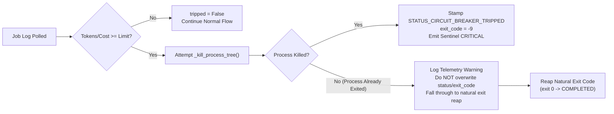

# Design Specification: LIVE-19 & LIVE-20 Remediation

**Title:** Circuit Breaker Clean-Exit Preservation (LIVE-19) & Quad-Harness Subscription Dual-Ledger Amortization (LIVE-20)  
**Date:** 2026-10-02  
**Status:** PROPOSED  
**Issues:** #1896 (LIVE-19, Sev-2), #1897 (LIVE-20, Sev-2)  
**Author:** Agy (Home Conductor)  
**Reviewer:** Nikhil Soman  

---

## 1. Executive Summary & Problem Context

During recent fleet dispatches and high-volume tasks leading to the `v1.0.0-rc1` release candidate, two critical Sev-2 defects were surfaced in the job execution and accounting layers:

1. **LIVE-19 (#1896): Circuit Breaker False-Negative on Clean Job Completion**  
   - **Symptom:** Dispatched worker jobs (e.g., `job-c7c39464` and earlier Codex jobs) complete all assigned work, run full test suites, approve PRs, and squash-merge branches, but `synlynk jobs --all` stamps them as `FAILED (exit -9)` with status `circuit_breaker_tripped`.
   - **Root Cause:** In `synlynk/circuit_breaker.py` (`evaluate_job_circuit_breaker()`) and `synlynk/jobs.py` (`_reconcile_jobs_unlocked()`, `_reconcile_daemon_jobs()`), when a job's cumulative tokens or cost exceed the ceiling, `_kill_process_tree()` is called. If the worker process had already completed naturally (e.g. exit 0) before the circuit breaker evaluated it, `_kill_process_tree()` returns `killed = False`. However, the evaluator unconditionally overwrites `job["status"] = "circuit_breaker_tripped"` and `job["exit_code"] = -9`, writes a critical Sentinel alert, and bypasses natural exit code reaping.
   - **Observer Effect:** Because `_reconcile_jobs_unlocked()` runs on every CLI invocation, even a read-only command like `synlynk jobs` or `synlynk status` triggers circuit breaker evaluation on a just-completed process, creating an observer-effect corruption of job terminal state.

2. **LIVE-20 (#1897): Subscription vs Pay-As-You-Go Dual-Ledger Cost Reporting Gap**  
   - **Symptom:** Although the dual-ledger amortization engine exists in `synlynk/costs.py` and `state.db`, every cost entry logged in `project-docs/costs.md` displays raw API-token rates with no subscription vs pay-as-you-go split.
   - **Root Cause:**
     - **Gap 1:** `.synlynk/config.json` had an unpopulated `harness_billing: {}` block. Every harness silently defaulted to `mode: "pay_as_you_go"`, forcing `actual_usd == api_equivalent_usd`.
     - **Gap 2:** `synlynk/db.py::_generate_costs_md()` only selects `total_cost_usd` and formats a single `Cost` column, omitting `api_equivalent_usd`, `actual_usd`, and `payment_mode`.
   - **Clarified Business Fact:** All 4 Core harnesses operate on fixed monthly subscriptions:
     - **Claude:** Claude Pro/Max subscription ($20.00/month)
     - **Codex:** ChatGPT Plus/Pro subscription ($20.00/month)
     - **Agy:** Google AI Pro subscription ($20.00/month)
     - **Grok:** SuperGrok subscription ($30.00/month)
     - **Total Baseline Fee:** $90.00/month.

---

## 2. Architecture & Design Decisions

### 2.1 LIVE-19: Clean-Exit Preservation & Ceiling Tuning



#### Decision 1: Strict Check on `process_killed`
- A circuit breaker's purpose is to terminate a runaway process. If the process is already dead or exited before the circuit breaker's kill attempt, the process was *not* terminated by the circuit breaker.
- `evaluate_job_circuit_breaker()` will only stamp `job["status"] = STATUS_CIRCUIT_BREAKER_TRIPPED` and `job["exit_code"] = -9` if `killed is True`.
- If `killed is False`, it returns `CircuitBreakerResult(tripped=False, process_killed=False, reason=reason, ...)` with an informational telemetry event (`circuit_breaker_post_exit_threshold_exceeded`), allowing `_reconcile_jobs_unlocked()` and daemon reconciliation to reap the process's real exit code via `os.waitpid()` or process polling.

#### Decision 2: Call-Site Guarding in `synlynk/jobs.py`
- Both `_reconcile_jobs_unlocked()` (CLI path) and `_reconcile_daemon_jobs()` (daemon path) will check:
  ```python
  if cb_res.tripped and cb_res.process_killed:
      # Truly killed by circuit breaker
      ...
      continue
  # Otherwise: fall through to natural exit handling
  ```
- This completely eliminates the observer-effect race where running `synlynk jobs` overwrote clean job completions.

#### Decision 3: Realistic Production Ceiling Calibration
- Modern LLM agent dispatches on synlynk routinely consume 500k–2.5M prompt tokens for full-codebase context packs.
- Adjust defaults in `synlynk/circuit_breaker.py`:
  - `DEFAULT_MAX_JOB_COST_USD = 15.00` (up from $5.00)
  - `DEFAULT_MAX_JOB_TOKENS = 5_000_000` (up from 500k)
  - `DEFAULT_ZERO_FILE_TOKEN_THRESHOLD = 500_000` (up from 150k)
  - Tier Overrides:
    - `fast`: `max_job_tokens: 500_000`, `max_job_cost_usd: 2.00`
    - `pro`: `max_job_tokens: 3_000_000`, `max_job_cost_usd: 10.00`
    - `reasoning`: `max_job_tokens: 5_000_000`, `max_job_cost_usd: 15.00`
- Configurable via `.synlynk/config.json` under `"circuit_breaker": {"max_job_cost_usd": ..., "max_job_tokens": ...}`.

---

### 2.2 LIVE-20: Quad-Harness Subscription Dual-Ledger Architecture

#### Decision 4: Quad-Harness `harness_billing` Configuration
Populate `.synlynk/config.json` with the confirmed user subscription structure:
```json
{
  "harness_billing": {
    "claude": {
      "payment_mode": "subscription",
      "monthly_base_fee_usd": 20.0,
      "billing_cycle_day": 1,
      "projected_monthly_tokens": 10000000,
      "allow_extra_usage": false,
      "extra_usage_cap_usd": null
    },
    "codex": {
      "payment_mode": "subscription",
      "monthly_base_fee_usd": 20.0,
      "billing_cycle_day": 1,
      "projected_monthly_tokens": 10000000,
      "allow_extra_usage": false,
      "extra_usage_cap_usd": null
    },
    "agy": {
      "payment_mode": "subscription",
      "monthly_base_fee_usd": 20.0,
      "billing_cycle_day": 1,
      "projected_monthly_tokens": 10000000,
      "allow_extra_usage": false,
      "extra_usage_cap_usd": null
    },
    "grok": {
      "payment_mode": "subscription",
      "monthly_base_fee_usd": 30.0,
      "billing_cycle_day": 1,
      "projected_monthly_tokens": 10000000,
      "allow_extra_usage": false,
      "extra_usage_cap_usd": null
    }
  }
}
```

#### Decision 5: Backwards-Compatible Markdown Generation (`_generate_costs_md`)
- Existing tests (`test_migrate.py`, `test_payment_models.py`) and parsers (`parse_costs_md`) require:
  1. The table header must retain: `| Date | Agent | Model | Tokens In | Tokens Out | Cost | Source | Story | Notes |`.
  2. `parse_costs_md()` splits on space: `parts[6].split(" ", 1)[0]`.
- For subscription-mode rows, format the `Cost` cell as:
  `$X.XXXX [sub] (API: $Y.YYYY)`
  where `$X.XXXX` is the amortized `actual_usd`, and `$Y.YYYY` is `api_equivalent_usd`.
  For pay-as-you-go rows, format as `$X.XXXX`.
- `parse_costs_md()` extracts `$X.XXXX` with zero parser failure.
- Add an active monthly summary section at the bottom of `project-docs/costs.md`:
  ```markdown
  ## Subscription Amortization & Dual-Ledger Summary
  | Month | Harness | Plan | Monthly Base | Projected Tokens | Actual Amortized | API Equivalent | Net Savings |
  ```
  Providing immediate visual evidence of true spend vs API list-price value.

#### Decision 6: CLI Command `synlynk cost billing`
- Add subcommand `synlynk cost billing` to `synlynk/costs.py` and `synlynk/cli.py`.
- Displays an ASCII table of registered harnesses, their payment mode (`subscription` vs `pay_as_you_go`), monthly fee, projected tokens, and year-to-date amortized actual vs API value.

---

## 3. Data Integrity & Verification Contract

1. **LIVE-19 Invariant:** A worker that exits naturally with exit code 0 shall *never* have its status changed to `circuit_breaker_tripped` or exit code overwritten to `-9`, regardless of cumulative tokens or spend.
2. **LIVE-20 Invariant:** All 4 Core harnesses (`claude`, `codex`, `agy`, `grok`) shall record dual-ledger entries in `cost_entries` (`api_equivalent_usd`, `actual_usd`, `payment_mode = 'subscription'`), and `project-docs/costs.md` shall clearly reflect both amortized actual and API equivalent figures.
3. **No Regressions:** All existing 51 test suites, `parse_costs_md()`, and `synlynk cost true-up` shall pass with 100% green status.

---

## 4. Next Step

Upon Nikhil's sign-off on this design spec, we proceed to author `docs/superpowers/plans/2026-10-02-live-19-live-20-circuit-breaker-and-dual-ledger-remediation.md` and dispatch the bite-sized implementation tasks across the fleet.
