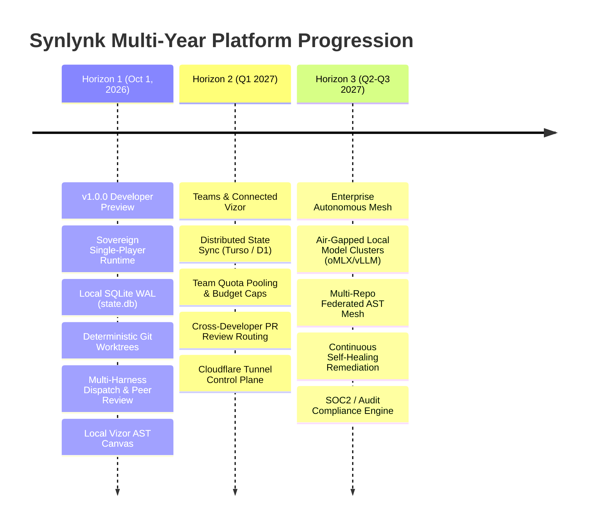

# Round 3: Firm Roadmap Articulation & The Case For/Against Tokq — Panel Synthesis & Decision Record

## Executive Synthesis

### 1. Horizon Architecture & Deliverables (v1.0.0 through v2.0+)

The panel unanimously established a three-horizon architectural progression, anchoring every phase to concrete engineering invariants:

#### Horizon 1: Developer Preview v1.0.0 (Target: October 1, 2026) — *The Sovereign Single-Player Runtime*
- **Core Invariant:** 100% Host-Local Zero-SaaS Sovereignty with zero telemetry leakage and zero remote dependencies.
- **Mandatory Inclusions:**
  1. *Effect-Verified Dispatch:* Jobs succeed only with verified git diffs/GitHub PRs and passing test runs.
  2. *Hard In-Flight Token Circuit Breakers:* Immediate kill switches for runaway jobs before token budgets blow up.
  3. *Fail-Closed Capability Probing:* Strict verification of harness capabilities (shell, network, gh-write) before queueing.
  4. *Deterministic Git Worktree Lifecycle:* Leased worktree locking, atomic creation, and automatic reaping.
  5. *Local Vizor Dashboard:* Full AST tube map, 5-tier logical architecture, product user journeys, dual-zone infra map, and ecosystem radar (ports `:8721`, `:27472`).
  6. *Non-Author PR Review & Merge Gates:* Programmatic enforcement that authoring agents cannot approve or merge their own code.
- **Strictly Deferred:** Multi-tenant cloud databases, remote tunnel daemons, SaaS login, credit-card billing, and commercial memory marketplaces.

#### Horizon 2: Connected Vizor & Teams Collaboration (Target: Q1 2027) — *Multi-Developer Fleet Coordination*
- **Core Invariant:** Seamless multi-seat state synchronization without introducing centralized SaaS vendor lock-in.
- **Key Deliverables:**
  - Distributed state engine backed by embedded replicated SQLite (Cloudflare D1 / Turso) or self-hosted Postgres.
  - Team-wide quota pooling, unified budget caps, and multi-key load balancing.
  - Cross-developer agent review routing (e.g., Alice's Claude reviewing Bob's Codex PR).
  - Web-accessible Vizor canvas secured via full-duplex Cloudflare Access tunnels.
  - Headless CI/CD triggers and webhook ingress for GitHub Actions / GitLab.

#### Horizon 3: Enterprise Fleet & Autonomous Mesh (Target: Q2-Q3 2027) — *The Autonomous Enterprise*
- **Core Invariant:** Air-gapped on-premise enterprise compliance and multi-repository federated intelligence.
- **Key Deliverables:**
  - Local model cluster orchestration (oMLX, vLLM, DeepSeek-R1) for zero-egress regulated environments (finance, healthcare, defense).
  - Multi-repo federated AST graph mesh with cross-repository call-graph impact analysis.
  - Continuous self-healing loops (`synlynk heal` fleet-wide) that detect import cycles, security vulnerabilities, and architectural drift autonomously.
  - Immutable SOC2, HIPAA, and GDPR audit logging.

---

### 2. Quantitative Adoption Signals as Horizon Gates

To prevent speculative over-engineering and premature expansion, advancing between horizons is strictly gated on concrete quantitative metrics:

| Metric Category | Horizon 1 → Horizon 2 Gate (Dev Preview → Teams) | Horizon 2 → Horizon 3 Gate (Teams → Enterprise) | Measurement Surface |
|:---|:---|:---|:---|
| **Community Interest** | ≥ 3,000 GitHub Stars, ≥ 200 Forks | ≥ 10,000 GitHub Stars, ≥ 1,000 Forks | GitHub Public Repository |
| **Active Workspaces (WAW)** | ≥ 350 Weekly Active Workspaces | ≥ 2,500 Weekly Active Workspaces | Host-local anonymous opt-in ping / telemetry |
| **Week-2 Retention** | ≥ 35% weekly recurring active usage | ≥ 50% weekly recurring active usage | Workspace activity timestamps in state.db |
| **Dispatch Success Rate** | ≥ 85% clean completions (verified diff + passing tests) | ≥ 95% clean completions across multi-repo mesh | Telemetry execution logs |
| **Community Contributions** | ≥ 15 non-maintainer PRs merged | ≥ 50 non-maintainer PRs merged | GitHub Pull Requests |
| **Dogfooding Singularity** | ≥ 50 consecutive multi-agent feature dispatches on Synlynk with 0 human code intervention | ≥ 250 consecutive autonomous dispatches across multi-repo mesh | Internal Synlynk commit history |

---

### 3. In-Depth Strategic Analysis & Verdict on Tokq

#### What is Tokq?
Tokq was envisioned as a marketplace for curated agent memory packs, domain ontologies, AST context slices, skill DAGs, and fine-tuned harness behavioral profiles.

#### Comprehensive Evaluation

| Dimension | The Case FOR Tokq | The Case AGAINST Tokq (Critical Risks) |
|:---|:---|:---|
| **Cold-Start Acceleration** | Pre-packaged domain context packs (e.g. Django, Next.js, Rust/Tokio) could bootstrap new workspaces instantly. | **Context Window Obsolescence:** Frontier models with 2M–10M+ token windows and real-time AST extractors (Graphify) render static memory packs obsolete within seconds. Dynamic code AST extraction is always 100% fresh and exact. |
| **Network Effects & Flywheel** | Creates a marketplace where developers earn revenue publishing high-quality agent instructions. | **Prompt Injection & Supply-Chain Poisoning:** Malicious packs can inject hidden prompt exploits, hijack agent git write permissions, exfiltrate IP, or introduce covert backdoors. Sandboxing memory packs is an unsolved security nightmare. |
| **Monetization** | High-margin SaaS take-rate on memory pack transactions. | **Marketplace Slop & Moderation Overhead:** Open prompt marketplaces rapidly devolve into low-effort SEO prompt spam, creating massive human moderation burden that drains engineering bandwidth. |
| **Strategic Focus** | Expands the platform into a multi-sided developer ecosystem. | **Premature Optimization & Distraction:** Building a marketplace before establishing an indispensable core orchestration substrate risks fatal fragmentation. |

#### Architectural Alternatives
1. **Git-Backed Open Registry (Homebrew / Cargo Model):** Community skill packs and prompt templates distributed as plain Git repositories (e.g. `synlynk tap <org>/<repo>`), inspectable via standard diffs with zero centralized proprietary marketplace infrastructure.
2. **Dynamic Just-In-Time AST Synthesis:** Generating memory on-the-fly via `synlynk scan` and Graphify directly from target codebases, guaranteeing 100% fresh, deterministic context without static artifacts.
3. **Signed Local Memory Bundles:** Exportable, Ed25519-signed project memories for teams without commercial exchange overhead.

#### Definitive Verdict: **DEFER (with Open Git Registry Fallback)**
- **Decision:** Do NOT build a proprietary commercial Tokq marketplace in Horizon 1 or Horizon 2.
- **Revival Condition:** Revisit a commercial marketplace ONLY in Horizon 3 if and when paying enterprise customers demand secure, private, team-internal memory sharing hubs with cryptographically signed provenance.

---

### 4. Public Launch & Communication Strategy

- **What We Promise Publicly on October 1 (v1.0.0 Dev Preview):**
  - "The Host-Local Multi-Agent Fleet Operating Substrate."
  - 100% Zero-SaaS data sovereignty (BYOK, code never leaves your machine).
  - Deterministic Git worktree isolation with parallel workers.
  - Heterogeneous multi-harness orchestration (Claude, Codex, Agy, Grok).
  - Enforced peer review gates (no agent self-approval).
  - Rich local Vizor AST canvas.
- **What We Keep Internal:**
  - Distributed Turso/D1 state schemas, cloud tunnels, and enterprise sales motions.
- **Communication Principle:** *Proof by Dogfooding.* Win developer trust by publishing commit histories, devlogs, and benchmark telemetry demonstrating that Synlynk is built, tested, and maintained entirely by its own multi-agent fleet.

---

## Complete Panel Submissions

### CLAUDE Panel Submission

Producing a rigorous analytical panelist submission for Round 3 based on the architecture and history already established in this repo.

## Section 1: Firm Roadmap Horizons

### Horizon 1 — Developer Preview v1.0.0 (Oct 1, 2026)

**Thesis:** prove the single-developer, host-local loop end-to-end, hardened enough that a stranger can `init` → `dispatch` → `pr check` → merge without hand-holding.

**Must include (invariants that define "done"):**
- Zero-SaaS execution path: `init`, `exec`, `dispatch` work fully offline against BYOK harness credentials — no synlynk-operated backend in the critical path.
- Worktree isolation is unconditional — every dispatched job gets its own worktree; no shared-branch races.
- Non-author review + merge-authority enforcement (`policy check-merge`) is load-bearing, not advisory — this is the one differentiator competitors (Devin, Cursor background agents) don't have at this layer.
- `state.db` (SQLite/WAL) as the single source of truth for goals/epics/stories/telemetry, with `synlynk status`/`doctor`/`checkpoint` stable and idempotent.
- At least 3 of the 4 harnesses (Claude/Codex/Agy/Grok) working reliably for implement+review, with the capability baseline doc (`docs/harness-capability-baseline.md`) reflecting *measured*, not assumed, reliability.
- Vizor as a local-only, read-only AST visualization — no multi-repo mesh, no auth, no hosted component.
- `doctor`, `audit-docs`, `worktree audit/clean` — the self-diagnosis surface — must be solid, because this is what an unassisted external user hits first.

**Must strictly defer:**
- Any multi-seat/shared-state concept (Section 2 concerns) — no D1/Turso/Postgres, no remote tunnel.
- Tokq in any form (see Section 3) — zero marketplace surface.
- Local model clustering (oMLX/vLLM) beyond the existing `local doctor` stub.
- Cross-repo federated mesh (`synlynk mesh`) — ship the primitive if already built, but don't market it as supported.
- GitHub Projects v2 board sync as a hard dependency — nice-to-have, not gating.
- Anything requiring a synlynk-hosted service (telemetry aggregation, quota calibration across users) — quota/cost tracking stays fully local.

The organizing principle: **v1.0.0 is a proof that one developer's machine can run a fleet safely.** Every deferred item above requires trust in *someone else's* state (a teammate, a marketplace author, a shared cluster) — that's categorically the next horizon, not a stretch goal for this one.

### Horizon 2 — Connected Vizor & Teams (Q1 2027)

**Thesis:** move from "my machine orchestrates my agents" to "our team shares state without giving up host-local sovereignty for code/secrets."

- Shared *state*, not shared *execution*: sync `state.db` deltas (goals/stories/telemetry, not source code or secrets) to a lightweight backend — Turso (libSQL, WAL-compatible with existing schema) is the better fit over Cloudflare D1 or Postgres specifically because it's SQLite-wire-compatible, minimizing schema/query divergence from the v1 local engine. This avoids a rewrite of the persistence layer.
- Quota pooling across a team's BYOK keys — needs a broker, not a proxy: synlynk should never see or route through customer API keys, only report/aggregate usage counters.
- Cross-developer PR review: extend today's non-author-review logic from "another harness" to "another harness OR another human teammate" — same policy engine, wider identity pool.
- Remote tunnel management (for a shared Vizor instance) is the one piece that's a genuine SaaS-shaped component — gate it explicitly behind opt-in, self-hostable-first (a `docker-compose` you run on your own box beats us hosting it, at this stage).
- Explicit non-goal: no enterprise SSO, no RBAC beyond "team member," no compliance surface. That's Horizon 3.

### Horizon 3 — Enterprise Fleet & Autonomous Mesh (Q2–Q3 2027)

- Air-gapped on-prem model clustering (oMLX/vLLM) — this is the "no internet egress at all" enterprise ask, distinct from Horizon 1's "no synlynk backend" — full network isolation including harness APIs.
- Multi-repo federated AST mesh (`synlynk mesh` promoted from primitive to product) — this only makes sense once there are enough *connected, multi-seat* workspaces (Horizon 2) generating graphs worth federating.
- Compliance/audit trails — immutable ledger export, SOC2-shaped evidence generation off `state.db` + telemetry.
- Continuous self-healing loops (`synlynk heal` promoted from opt-in remediation to always-on) — only defensible once dogfooding has produced a long track record of `heal` *not* making things worse (see Section 2 gate).

**Why this ordering, architecturally:** each horizon adds exactly one trust boundary crossing — H1 trusts your own machine, H2 trusts your team's shared state, H3 trusts autonomous action without a human in the loop and trusts an air-gapped/offline model fleet. Sequencing any other way (e.g., building the marketplace or autonomous mesh before team state-sync exists) means building trust infrastructure for a a population of users you don't have yet.

## Section 2: Quantitative Adoption Signals as Horizon Gates

The purpose of numeric gates is to stop roadmap decisions from being made on founder conviction alone — a real risk here given the CLAUDE.md's pattern of proactive feature dispatch. Thresholds below are calibrated to be *hard enough to be real evidence*, not vanity-metric-shaped.

| Signal | Gate: H1→H2 | Gate: H2→H3 |
|---|---|---|
| GitHub Stars | 500 | 3,000 |
| Forks | 40 | 250 |
| Weekly Active Workspaces (WAW) | 75 | 400 |
| WAW retention (week-4 vs week-1 cohort) | ≥35% | ≥45% |
| Dispatched jobs/week (fleet-wide, external users) | 500 | 5,000 |
| Multi-harness completion success rate | ≥85% (measured via direct verification, not job-status — per the LIVE-issue precedent of not trusting status labels) | ≥92% |
| External (non-maintainer) contributors | 8 distinct | 40 distinct |
| External non-maintainer PRs merged | 15 | 150 |
| Dogfooding: consecutive autonomous dispatches, zero human intervention | 25 | 150 |

**Gate Decision Matrix:**

- **Authorized to start H2 work** only when **all** of: WAW ≥75 AND retention ≥35% AND completion rate ≥85% AND external contributors ≥8. Stars/forks are directional signals, not gating by themselves — they measure curiosity, not usage, and this project's own history (30 stale worktrees from unreviewed automation) shows vanity metrics don't catch operational rot.
- **Authorized to start H3 work** only when **all** H2 thresholds plus: WAW ≥400 AND dogfooding streak ≥150 AND zero open Sev1 LIVE-issues for 60 consecutive days. The Sev1-clean requirement is the real gate here — H3 is explicitly about *removing* the human from the loop (autonomous self-healing, enterprise audit trails); shipping that on top of an unstable base compounds exactly the kind of failure mode this repo has already lived through (job-status false negatives, uncommitted-transaction cascades).
- **Regression clause:** if completion success rate drops below gate threshold for 2 consecutive weeks after a horizon has started, freeze new horizon-scoped work and return to stabilization until the metric recovers — this prevents "we already started, might as well finish" sunk-cost continuation.

## Section 3: The Case For and Against Tokq

### 3.1 Arguments FOR

- **Cold-start problem is real and specific to this architecture.** A fresh `synlynk init` on an unfamiliar codebase produces a fleet with zero domain context — no charter tuned to "this is a Django monorepo with a legacy ORM," no accumulated memory of past decisions. Tokq-style packs could shortcut the first several dispatch cycles that would otherwise be spent on agents rediscovering conventions.
- **Network effects are plausible but not proven** — a marketplace of harness behavior profiles (e.g. "Codex's known dispatch-sandbox quirks," codified as a shareable pack) could in principle let one team's hard-won capability-baseline findings (this repo's own `harness-capability-baseline.md` is a working example of exactly this artifact) benefit every other synlynk user instead of each team rediscovering the same Grok-sandbox-denies-bash finding independently.
- **Contributor monetization** gives non-maintainer contributors a reason to invest beyond goodwill PRs — relevant given Horizon 2/3's dependency on external contributor growth (Section 2 gates).

### 3.2 Counterarguments, Risks, Failure Modes AGAINST

- **Prompt injection / security risk is not hypothetical here — it's structurally worse than in a normal marketplace.** A "memory pack" or "skill DAG" downloaded and injected into agent context is executable-adjacent: it shapes what an autonomous agent with `run:shell`, `gh` write, and merge-adjacent capability *decides to do*. A malicious or merely careless pack author doesn't need a supply-chain exploit in the traditional sense — a crafted context slice that nudges an agent toward `--admin` merges or leaking secrets into commit messages is a first-class attack surface unique to agent-memory marketplaces, worse than npm/PyPI package risk because the "package" is natural language, not auditable bytecode.
- **Context window expansion is a genuine obsolescence threat, not fear-mongering.** Static, curated context slices exist to compensate for small/expensive context windows. As frontier model context windows and cheap long-context retrieval improve (already true generation-over-generation), the value of a hand-curated "AST context slice" pack decays toward zero — you're building a marketplace around a constraint that the underlying models are actively erasing. This is the single strongest argument against BUILD: it risks becoming infrastructure for a problem that solves itself.
- **Marketplace slop/decay** — this repo's own devlog is full of examples of stale/decayed *internal* artifacts (stale worktrees, GEMINI.md reverting twice, capability baselines going stale) even with a single maintainer team paying close attention. A public marketplace multiplies staleness risk by however many uncurated contributors submit packs, with no equivalent of this project's own dogfooding discipline to catch drift.
- **Strategic distraction is the most concrete risk right now.** Horizon 1 isn't shipped yet (target Oct 1, 2026, ~4 days out per today's date). Every hour spent on marketplace architecture, trust/security model, or monetization plumbing is an hour not spent hardening the host-local core that the entire roadmap in Section 1 depends on. The Default Agent Role split in this repo's own CLAUDE.md ("Claude's role is PM/roadmap/review only") exists precisely because context and attention are the scarcest resource — Tokq is a second product, not a feature.

### 3.3 Viable Architectural Alternatives

- **Pure Git-based open skill registry** (a `synlynk-skills` GitHub org/repo pattern, analogous to how `superpowers` skills already work in this very session) — no marketplace infrastructure, no payment rails, no trust-broker liability. Versioning, review, and provenance come for free from git/GitHub's existing trust model (stars, PR history, maintainer reputation). This is the lowest-risk option and is *already partially proven* — the skill-loading mechanism used throughout this conversation is architecturally identical to what Tokq proposes, minus the marketplace/commerce layer.
- **On-the-fly AST graph extraction** (leaning on Vizor's own AST engine) — instead of shipping *static* pre-baked context slices, generate the equivalent context dynamically per-repo at dispatch time. This directly sidesteps the "context window expansion obsoletes static packs" risk because it never produces a static artifact to obsolete — it's always freshly derived from the current repo state.
- **Decentralized P2P/IPFS memory sync** — technically interesting but solves a problem synlynk doesn't have yet (no evidence of demand for censorship-resistant or infrastructure-independent pack distribution) and adds substantial operational complexity for zero validated user pull. Reject for now; revisit only if a centralized registry faces a concrete takedown/censorship pressure that doesn't currently exist.

### 3.4 Definitive Strategic Verdict: **DEFER**

Not "kill" — the cold-start problem and contributor-monetization angle are real enough to not foreclose permanently — but there is no case for building Tokq before Horizon 2's adoption gates are met, and even then the recommended first move is the minimal-viable alternative, not the full marketplace.

**Trigger conditions to revisit (not before all of):**
1. Horizon 2 gates are met (Section 2) — Tokq presupposes a population of teams/contributors large enough to make network effects real; below that threshold it's a registry with no listings.
2. At least 20 independent teams have organically asked for a way to share harness charters/context packs (a demand signal collected via GitHub issues, not assumed) — this project has direct precedent for the cost of assumption-driven scope (`docs/superpowers/specs/2026-08-09-synlynk-agent-roles-charters-design.md`'s roles work only shipped after concrete gaps were identified, not speculatively).
3. A concrete prompt-injection threat model and sandboxing story exists for *executing* untrusted context (even read-only context injection needs a taint-tracking or provenance-labeling answer) — do not ship distribution before ship safety.

**Minimal viable architecture if/when triggered:** start with the pure Git-based registry alternative (3.3, option 1) — a curated GitHub org, signed commits for provenance, no payment rails, no hosted marketplace UI. This validates demand and surfaces the injection-risk problem in a low-stakes setting before any commercial/monetization layer is built. Only add Tokq-as-marketplace (payments, curation ranking, contributor payouts) if the free registry demonstrably outgrows what git-native tooling can support — i.e., graduate to BUILD only after PARTNER/community-registry has proven the demand is real and recurring.

## Section 4: Public vs. Internal Roadmap Strategy

**Public (README, website, Show HN):**
- State Horizon 1 concretely and *only* Horizon 1 with a date: "v1.0.0 Developer Preview — host-local multi-agent fleet orchestration, zero-SaaS, BYOK, out Oct 1 2026." Concrete, falsifiable, near-term.
- Describe Horizon 2/3 only as **direction, not commitment** — "we're exploring team collaboration and enterprise deployment as natural next steps" with no dates, no feature lists, no Tokq mention at all. Naming Tokq publicly before Section 3's trigger conditions are met invites exactly the security-scrutiny and "vaporware marketplace" skepticism that damages credibility on Show HN, where technical audiences are quick to smell over-promising.
- Lead with the differentiators that are *already true and demonstrable*: worktree isolation, non-author review enforcement, host-local sovereignty. These are verifiable by anyone who runs the CLI — the strongest possible form of trust-building because it doesn't require taking synlynk's word for it.
- Publish the Gate Decision Matrix's *philosophy* (adoption-gated roadmap, not a fixed feature-date grid) without publishing the exact numeric thresholds — the concept ("we advance horizons based on measured usage, not a calendar") is a credibility signal; the specific numbers are internal planning detail that invites bikeshedding and gaming.

**Internal only:**
- The full three-horizon table with dates, the numeric gate matrix, and the entire Tokq analysis including the DEFER verdict and trigger conditions.
- Harness-specific reliability findings (capability baseline specifics) — useful internally for routing, but publicizing "Grok's sandbox denies bash execution" externally is a liability without context and invites harness-vendor friction for no upside.
- Any Sev1 LIVE-issue history — internal accountability tool, not public collateral.

**Trust-building mechanism:** the single highest-leverage public commitment is a standing changelog discipline (already required by this repo's Named Release Policy) — shipping small, dated, honestly-scoped named releases on a visible cadence builds more durable trust than a roadmap document, because it's falsifiable in real time rather than a promise to evaluate later.

---

### CODEX Panel Submission

# Section 1: Firm Roadmap Horizons

The roadmap should be treated as a sequence of architectural proofs, not a feature calendar:

1. Prove that one developer can run a trustworthy host-local agent fleet.
2. Prove that several developers can share state and authority without weakening isolation.
3. Prove that enterprises can operate the system continuously, privately, and audibly.

The dates should remain targets, not promises. A horizon should not open merely because its calendar date has arrived.

## Horizon 1: Developer Preview v1.0.0 — target October 1, 2026

### Product thesis

Synlynk v1.0 is a reliable local control plane for one developer operating multiple heterogeneous agent harnesses against one or more Git repositories.

It is not yet a hosted collaboration product, enterprise scheduler, marketplace, or general-purpose autonomous software company.

### Required architectural deliverables

- Durable SQLite WAL state engine for goals, epics, stories, jobs, telemetry, costs, and lifecycle status.
- Deterministic Git worktree creation and cleanup per task.
- Branch and worktree isolation that survives failed, interrupted, and retried jobs.
- Explicit harness capability routing across Claude, Codex, Agy, Grok, and local agents.
- Dispatch lifecycle with:
  - preflight validation;
  - permission and capability checks;
  - bounded execution;
  - heartbeat and stall detection;
  - terminal-state reconciliation;
  - token, cost, files-touched, and verification reporting.
- A reliable non-author review and merge-authority workflow.
- Local Vizor as an observability and control surface, including:
  - jobs;
  - lifecycle board;
  - architectural views;
  - AST/knowledge graph exploration;
  - task and workspace deep links.
- Host-local sovereignty by default:
  - no mandatory SaaS account;
  - BYOK;
  - local state;
  - explicit network permissions;
  - redaction of credentials and secrets.
- A stable CLI and machine-readable output suitable for scripts and CI.
- Recovery semantics for:
  - interrupted jobs;
  - stale process markers;
  - partial commits;
  - failed migrations;
  - corrupted or stale reconciliation state.
- Export/import and backup of the local ledger.
- Documentation for installation, first run, worktree behavior, dispatch, review, recovery, and data boundaries.
- A repeatable self-test suite that validates the complete lifecycle, not just individual Python functions.

### Core invariants

These should be treated as release-blocking invariants:

1. No agent may write outside its assigned worktree without explicit authorization.
2. No job may be reported successful unless its terminal state, output, Git state, and verification result agree.
3. A failed or abandoned agent cannot silently corrupt the ledger or leave an apparently successful task.
4. Secrets must not appear in job logs, state exports, Vizor, or child-process arguments.
5. A retry must be idempotent or clearly identified as a new execution.
6. The local ledger remains authoritative even when a harness, process, or network endpoint disappears.
7. A user can understand why a job ran, what it changed, who reviewed it, and whether it is safe to merge.
8. Every autonomous action has a bounded scope and an auditable record.

The repository’s existing history of stale terminal summaries, silent harness exits, token bloat, and preflight failures is precisely why these invariants matter. Those are not merely bugs to fix around the edges; they are evidence that reliability must be the central v1 product feature.

### Strictly deferred

Defer the following from v1:

- hosted multi-user state;
- cross-developer identity and quota pools;
- remote tunnel orchestration;
- enterprise SSO, SCIM, and compliance dashboards;
- autonomous continuous self-healing loops;
- federated multi-repository graph synchronization;
- a public memory-pack marketplace;
- billing, revenue sharing, and creator payouts;
- unbounded swarm scheduling;
- opaque background agents that act without explicit local policy;
- broad “AI employee” positioning.

v1 should be narrow enough that a developer can trust it with a real repository.

---

## Horizon 2: Connected Vizor and Teams Collaboration — target Q1 2027

### Product thesis

Synlynk becomes a small-team coordination layer while preserving the host-local execution model where possible.

The key architectural change is not “add a cloud database.” It is introducing shared coordination without making source code, prompts, credentials, or model traffic SaaS-dependent.

### Required deliverables

- A pluggable state backend:
  - local SQLite;
  - Cloudflare D1, Turso, or Postgres adapter;
  - explicit consistency and conflict semantics.
- Shared workspace and project membership model.
- Multi-seat identity and role-based authorization.
- Shared quota pools with:
  - per-user limits;
  - per-project budgets;
  - harness-specific limits;
  - emergency stops;
  - cost attribution.
- Cross-developer review flows with non-author reviewer enforcement.
- Remote job and tunnel management, with local execution remaining possible.
- Secure event synchronization and replay.
- Conflict-safe state replication.
- Team-level audit history.
- Hosted Vizor with a clear separation between:
  - metadata and coordination state;
  - source code;
  - secrets;
  - model prompts and outputs.
- Offline-first behavior for local operators.
- Migration and downgrade paths between local-only and connected modes.
- Team onboarding, invitation, revocation, and recovery procedures.

### New invariants

- A connected control plane must never silently become the sole copy of a developer’s source or task state.
- Loss of connectivity must degrade gracefully to local operation.
- Team synchronization must be monotonic and replayable; last-write-wins is insufficient for critical job and approval state.
- Authorization must be evaluated both centrally and locally.
- Quota enforcement must fail closed for spend-sensitive operations.
- Remote control must not imply remote access to arbitrary local files or credentials.
- Every team-visible action must have actor, timestamp, authorization context, and affected resource.

Horizon 2 should not begin merely because v1 has users. It should begin when v1 demonstrates that its state model and terminal semantics are stable enough to be distributed.

---

## Horizon 3: Enterprise Fleet and Autonomous Mesh — target Q2–Q3 2027

### Product thesis

Synlynk becomes an enterprise-grade autonomous engineering mesh operating across repositories, model clusters, and compliance boundaries.

This is a fundamentally different risk class from v1. It requires independent security, operations, and reliability architecture rather than incremental UI expansion.

### Required deliverables

- Air-gapped on-premise model orchestration:
  - oMLX/vLLM clusters;
  - model registry;
  - capacity scheduling;
  - hardware-aware routing;
  - failover.
- Federated AST and knowledge graph mesh across repositories.
- Explicit graph ownership, freshness, provenance, and invalidation semantics.
- Enterprise identity:
  - SSO;
  - SCIM;
  - RBAC/ABAC;
  - break-glass access;
  - key rotation.
- Immutable audit trails and retention policies.
- Policy-as-code for:
  - data residency;
  - model usage;
  - repository access;
  - change approval;
  - autonomous action limits.
- Continuous self-healing loops with:
  - bounded action classes;
  - rollback;
  - canarying;
  - escalation;
  - human circuit breakers.
- Fleet-wide incident management and reliability SLOs.
- Multi-repository dependency impact analysis.
- Signed artifacts, provenance attestations, and supply-chain verification.
- Enterprise backup, disaster recovery, and legal hold capabilities.

### Horizon 3 should not be sold as “more agents”

It should be sold as controlled autonomy under enterprise governance. The differentiator is not the number of workers; it is the ability to prove what they did, why they were allowed to do it, and how the system recovered when they failed.

# Section 2: Quantitative Adoption Signals as Horizon Gates

The gates below should be measured over rolling 12-week windows. Absolute vanity numbers should never override poor reliability.

## Proposed thresholds

| Signal | Horizon 1 exit / authorize Horizon 2 | Horizon 2 exit / authorize Horizon 3 |
|---|---:|---:|
| GitHub stars | 1,500 | 5,000 |
| GitHub forks | 150 | 500 |
| Weekly active workspaces | 75 | 300 |
| 8-week workspace retention | ≥35% | ≥50% |
| Weekly dispatched jobs | 1,000 | 10,000 |
| Multi-harness completion success | ≥95% | ≥98.5% |
| Correct terminal-state reporting | ≥99% | ≥99.8% |
| External contributors | 15 | 50 |
| Non-maintainer merged PRs | 10 | 30 |
| Consecutive unattended dispatches | 100 | 1,000 |
| Human intervention rate | ≤10% | ≤2% |
| Crash/data-loss incidents | 0 unresolved Sev1 | 0 unresolved Sev1 |
| Median job recovery time | <10 minutes | <5 minutes |
| Active production-like teams | 3 pilot teams | 10 enterprise pilots |
| Paid or contracted design partners | 0 required | ≥3 for enterprise work |

Stars and forks are useful distribution signals but weak product signals. WAW, retention, job completion, and unattended dispatches should carry more weight.

## Reliability definitions

“Successful job” must mean all of the following:

- the harness returned a valid result;
- the job state was reconciled correctly;
- the expected worktree and branch state exist;
- verification ran and passed;
- telemetry was recorded;
- no unauthorized files changed;
- no secret was exposed;
- the result was either reviewed or explicitly marked as requiring review.

“Zero human intervention” excludes normal approval gates only if the gate was intentionally configured. It does not exclude intervention needed to repair Synlynk itself.

## Gate Decision Matrix

| Condition | Decision |
|---|---|
| All Horizon 1 thresholds met for 12 weeks and no unresolved Sev1 reliability/security issue | Begin Horizon 2 architecture and pilot implementation |
| Adoption thresholds met but multi-harness success is below 95% | Remain in Horizon 1; reliability work only |
| Job volume met but WAW retention is below 35% | Do not expand; investigate onboarding, trust, and product value |
| Stars/forks met but unattended dispatch threshold is not met | Do not expand; popularity is not operational proof |
| 100 unattended dispatches achieved but terminal-state correctness is below 99% | Do not expand; ledger correctness is a release blocker |
| Horizon 2 thresholds met for 12 weeks, with three functioning team pilots and no unresolved critical sync/auth issue | Begin Horizon 3 discovery and constrained pilots |
| Team usage exists but quota attribution or authorization has unresolved critical defects | Do not build enterprise autonomy |
| Enterprise pilots exist but no paid or contracted design partners exist | Keep Horizon 3 as research, not a committed product line |
| Any unresolved data-loss, credential-exposure, or unauthorized-action Sev1 | Freeze horizon expansion immediately |
| Two consecutive quarters below retention or reliability thresholds | Revert roadmap priority to core product quality |

The practical rule is:

> Adoption may justify investment; reliability authorizes expansion.

# Section 3: The Case For and Against Tokq

## What Tokq could provide

Tokq’s strongest potential value is not “a store for prompts.” It is a trustable distribution layer for reusable engineering knowledge that is difficult to reconstruct from raw repository contents.

A high-quality pack could contain:

- domain vocabulary and ontology;
- repository architecture conventions;
- known invariants and dangerous areas;
- AST slices and dependency explanations;
- test strategies;
- skill DAGs;
- harness-specific execution profiles;
- examples of accepted changes;
- benchmark tasks and expected outcomes;
- provenance and version compatibility.

### The cold-start problem

A new agent can inspect a repository, but inspection is not the same as understanding. The agent may discover syntax and dependency structure while missing:

- why a seemingly unused module is critical;
- which generated files must never be edited;
- what deployment assumptions are implicit;
- which tests are authoritative;
- which maintainers own a subsystem;
- which architectural shortcuts are intentionally forbidden.

A curated pack can compress institutional knowledge into a portable starting point. The benefit is greatest for:

- regulated domains;
- large legacy systems;
- specialized infrastructure;
- organizations with high staff turnover;
- projects whose knowledge is distributed across code, tickets, and tribal practice.

### Network effects

Tokq could create a flywheel:

1. Experts publish packs.
2. Developers install packs and complete work faster.
3. Usage generates benchmark results, compatibility data, and reputation.
4. Better evidence makes packs more valuable.
5. More developers and experts join.
6. Pack composition and dependency tooling improve.

The defensible network effect would not be raw content volume. It would be the accumulation of verified performance data: which pack works for which repository, language, framework, harness, and task class.

### Monetization

Potential models include:

- paid expert packs;
- organization-private packs;
- support and update subscriptions;
- verified pack certification;
- enterprise registries;
- benchmark-based revenue sharing;
- consulting-to-pack conversion;
- managed synchronization for teams.

However, revenue is only credible if packs produce measurable improvements in task success, time to first correct change, review acceptance, or incident reduction.

## Arguments against Tokq

### Security threat model

A downloadable memory pack is executable influence, even if it contains only text.

Threats include:

- prompt injection disguised as architectural guidance;
- instructions to disable tests or bypass review;
- secret exfiltration through generated commands;
- poisoned AST metadata that hides dangerous dependencies;
- malicious skill DAGs that widen permissions;
- harness profiles that route sensitive work to an unsafe model;
- typosquatting and dependency confusion;
- stale instructions that become unsafe after repository changes;
- cross-tenant leakage through shared packs;
- malicious benchmark fixtures designed to reward unsafe behavior.

The central mistake would be treating packs as documentation. They are policy-adjacent artifacts that influence agents and therefore require supply-chain controls.

### Context windows and dynamic retrieval

As context windows become dramatically larger and AST extraction becomes fast, static packs lose value when they merely contain:

- copied source code;
- generic framework documentation;
- obvious repository summaries;
- stale embeddings;
- prompt templates that dynamic retrieval can generate.

A 10M-token context window does not make all static knowledge obsolete, however. Larger context helps with recall, not necessarily judgment. Packs may retain value as:

- curated constraints;
- tested workflows;
- domain-specific ontologies;
- negative knowledge;
- institutional decisions;
- benchmark suites;
- provenance-linked policies.

Tokq therefore cannot be justified as a token-saving product. Its durable value must be trust, curation, evaluation, and portability.

### Marketplace slop and quality decay

Open marketplaces trend toward quantity because supply is easier to measure than usefulness. Likely failure modes include:

- SEO-generated prompt packs;
- duplicate framework summaries;
- unmaintained version-specific packs;
- inflated ratings;
- fake download activity;
- incompatible pack combinations;
- abandoned private forks;
- content optimized for novelty rather than task success.

Curation, versioning, and evaluation are expensive. Without them, Tokq becomes a prompt repository with security liability.

### Strategic distraction

Synlynk’s core challenge is still runtime trust: dispatch correctness, harness reliability, state reconciliation, cost control, and safe autonomy.

A marketplace introduces:

- moderation;
- payments;
- identity;
- licensing;
- abuse handling;
- malware and supply-chain review;
- compatibility testing;
- support obligations;
- creator disputes.

That is a second company. Building it before Synlynk has an irresistible orchestration runtime would dilute engineering focus and create a misleading appearance of ecosystem traction.

## Viable alternatives

### Git-based skill registries

A Git-native registry modeled after Homebrew taps, Cargo crates, OCI registries, or MCP registries is the best near-term alternative.

Advantages:

- familiar contribution model;
- transparent diffs;
- version control;
- pull-request review;
- easy self-hosting;
- no marketplace economics required;
- straightforward signing and pinning.

Synlynk should first support a manifest format and registry protocol without building a commercial marketplace.

### Dynamic AST extraction and context packing

This should be the default path for repository-specific knowledge:

1. scan the current repository;
2. build or query the current AST graph;
3. select relevant slices for the task;
4. combine them with verified project policy;
5. record the provenance of every context component.

Static packs should supplement dynamic retrieval, not replace it.

### P2P/IPFS synchronization

P2P or IPFS may become useful for air-gapped or federated environments, but it does not solve:

- trust;
- revocation;
- authorization;
- content quality;
- confidentiality;
- update policy.

It is a transport and distribution mechanism, not a governance model. It should be considered for enterprise federation only after signed manifests and policy enforcement exist.

## Definitive verdict: DEFER, while building the substrate

Synlynk should defer Tokq as a marketplace.

It should, however, build the minimal interoperability primitives now:

- a versioned memory-pack manifest;
- content-addressed pack artifacts;
- Ed25519 signatures;
- issuer and publisher identity;
- compatibility declarations;
- dependency and capability declarations;
- provenance for source, AST, tests, and model-generated content;
- revocation and expiration;
- local allowlists and deny policies;
- sandboxed static verification;
- no automatic execution of pack-provided commands;
- pack-level permissions;
- benchmark and evaluation metadata.

The first implementation should be a Git-based, self-hostable registry or local directory format. Synlynk should not operate a public commercial marketplace until there is evidence that packs create value beyond dynamic retrieval.

### Conditions for revival

Reconsider Tokq when all of the following are true:

- at least 500 active workspaces use memory or skill packs;
- at least 100 packs have been installed by unrelated users;
- at least 30 packs have reproducible benchmark evidence;
- pack-assisted tasks show a measured ≥15% improvement in completion success or time-to-correct-change;
- at least 10 independent creators maintain useful packs;
- at least three organizations request private or paid distribution;
- Synlynk has maintained ≥98% multi-harness completion success for two quarters;
- pack security review, revocation, and rollback are operational;
- there is a credible revenue signal, such as ≥$10,000 in annualized contracted demand or equivalent paid pilots.

At that point, Synlynk should likely partner with an existing registry, payments, or creator platform before becoming the full marketplace operator.

# Section 4: Public vs. Internal Roadmap Strategy

## Publicly promise

Public materials should promise stable principles and near-term user value:

- host-local, BYOK orchestration;
- deterministic worktree isolation;
- multi-harness dispatch;
- durable local state;
- transparent job and cost telemetry;
- review and merge authority controls;
- Vizor observability;
- offline-first operation;
- open formats and self-hostability;
- a documented path toward team collaboration.

The public roadmap should use capability statements and target windows:

- “Developer Preview: reliable single-developer local orchestration.”
- “Next: connected team collaboration, subject to reliability and adoption gates.”
- “Longer term: enterprise fleet and private model-cluster support.”

Every future item should be labeled as one of:

- committed;
- target;
- exploratory;
- explicitly not planned for the current horizon.

Tokq should be described publicly as an exploration in signed, interoperable memory packs—not as an announced marketplace.

## Keep internal

Internal execution material should contain:

- exact adoption thresholds;
- revenue gates;
- pilot conversion targets;
- detailed SLOs;
- model-provider dependencies;
- staffing assumptions;
- security threat models;
- unit economics;
- failure budgets;
- competitive response plans;
- Tokq revival criteria;
- dates that depend on unresolved architectural work.

Do not publish internal feature checklists as if they were promises. That creates roadmap debt and encourages users to evaluate Synlynk against speculative architecture rather than shipped value.

## Recommended communication posture

The most credible message is:

> Synlynk is first making local multi-agent software work trustworthy. Team collaboration and enterprise autonomy are gated by demonstrated reliability and adoption. Reusable agent knowledge is an important research direction, but Synlynk will not create a marketplace until dynamic retrieval, security, and real user demand prove that a marketplace is necessary.

That posture is strategically stronger than announcing every possible future layer. It signals ambition while making trust, evidence, and user value the conditions for expansion.

---

### GROK Panel Submission

I'll ground this review in Synlynk's actual architecture and any prior Round 1–2 material, then write the horizon gates and the Tokq verdict against that evidence.The governing problem is that Synlynk currently has four operative roadmaps, and they authorize opposite work. The June 2026 unified roadmap makes Tokq the destination and dates Tokq Alpha to Q3 2026. The July 12 strategy review makes measurement and arbitration the company, and forbids an enterprise plane before users exist. The August autonomous-ops note makes the October 1 ship an Autonomous Development Loop Preview and names Tokq and hosted sync as exclusions. The September 19 wave tracker then marks a v1.0.0 ceremony done and schedules a hosted multi-tenant hub for October 15 and a model aggregator for October 22. The September 4 sync research is a fifth clock: it assigned gRPC, CRDT replication, and an enterprise FinOps sink to v0.20 through v0.23, and those versions shipped Vizor, relay, and graph extraction instead.

Round 3 collapses these to one sequence. October 1 is a single-developer, host-local preview. Team sync is not a date; it is a gate. Enterprise mesh is not a Q2 2027 deliverable. Tokq is deferred, and the thing that may eventually exist is a git-pinned pack index, not a hosted marketplace.

Public evidence, not the wave tracker, is the status. `project-docs/roadmap.md` still says the v1.0.0 tag is not cut, and the 15-minute field trials are open. The tracker marking that ceremony done, with multi-minute "actual runtimes," is not a release. Treat founder dogfood as N≈1 until an outside workspace shows up in a ledger.

## 1. Firm roadmap horizons

Three invariants bind every horizon. Break one and the horizon is mis-scoped, not "ahead of schedule."

1. The host `state.db` is the authority for work that happened on that host. A network service may receive a replica or an outbox batch. It may not block a dispatch, and it may not be required to read a job the host already recorded.
2. A claimed side effect is true only when something other than the job row says so. A green status, a model summary, or a "DONE" cell is not evidence. The git diff, the PR, the test run, or an explicit no-op receipt is.
3. Instructions that enter an agent are either written by the operator, generated from that workspace's own git state, or reviewed like a dependency bump. Nothing from a network is injected above the `synlynk:start` / `synlynk:end` fence.

### Horizon 1 — Developer Preview v1.0.0, not before 1 October 2026

This is one developer, one machine, many harnesses. The product sentence is the July one, narrowed to a preview: Synlynk routes work across Claude, Codex, Agy, and Grok from this repo's own history, keeps the ledger on this machine, and shows a cost that is either structurally sourced or visibly marked as an estimate.

What must be in the preview, because a stranger will hit it on day one:

| Deliverable | Why it is in H1 | Done means |
|---|---|---|
| Install that does not require a Synlynk account or a running service | Zero-SaaS is the contract | `pipx` or `install.sh` on a clean machine; `synlynk --version` matches the tag |
| One launch path for interactive dispatch and the daemon queue | Two paths is how flags, worktrees, and preflight silently diverge | Same worktree, same permission flags, same preflight, both callers |
| Worktree-per-job, non-author review, `policy check-merge` | Already the differentiation that is real | A dispatched job cannot merge as its own author; a failed policy check does not merge |
| Job truth | Status lies have already shipped | Terminal row matches process plus git, or is `cost_missing` / failed, never a quiet success |
| Cost row honesty | The only number a FinOps-minded user will audit | Structured adapter output, or the row labeled estimate. No silent 80/20 split. Unknown models are not billed at a default paid rate |
| Local Vizor | The canvas is a view of local state, not a product | Binds to localhost. No OAuth. Dies when the process dies |
| Brownfield scan and a bounded goal loop | Cold start without a marketplace | `init` / scan produces a brief from this repo; human still approves goals, spec, merge, and release |
| A limitations page that matches the binary | Trust | Says single-operator, no team sync, no autonomous merge, preview quality |

What is strictly deferred, even if a branch already contains a sketch:

- Tokq, NATS leaf join, gas tank, `synlynk publish` / `subscribe`, and the `synlynk[tokq]` extra. The June bridge schema does not ship in the default install.
- Hosted Vizor, OAuth, SSO, RBAC, Cloudflare D1, Turso, Postgres, shared API-key pools.
- Any second writer of `stories.status` on another machine.
- Model-hub aggregation (OpenRouter, LiteLLM, Fal, Zapier). A local OpenAI-compatible endpoint may stay behind an explicit flag only if a failed or empty run cannot write a capability rating.
- Air-gapped cluster mode, cross-repo federation as a product, SOC2 narratives, and a heal loop that opens or merges PRs without a human gate.
- A sixth harness, and any new Vizor surface that is not required to explain an existing ledger row.

H1 is allowed to contain the v0.21 relay and v0.23 graph extraction only as local, optional, default-off capabilities with a one-paragraph "experimental" label. They are not launch claims. Wave 3 and Wave 4 dates in October 2026 are void.

The October 1 cut itself is a quality gate, not an adoption gate. Do not tag until all of these are true on a machine that is not the author's daily driver:

- Two of three fresh repos, operated by someone other than the maintainer, reach a real pull request in 15 minutes. The third failure is documented, not averaged away.
- Twenty consecutive dogfood dispatches on Synlynk itself have job truth matching git. Human approval at spec and merge is allowed. A human editing the diff breaks the streak.
- Zero open Sev1. `doctor --readiness` green. Rollback is a written command, not a hope.
- One hundred percent of terminal jobs in that streak have a cost row or `cost_missing`.

### Horizon 2 — Connected Vizor and small teams, not before Q1 2027, and not on the calendar alone

H2 starts when two humans lose work because their ledgers diverged, and not before. The user-facing change is: a second developer can see the same goals, in-flight jobs, and costs, and can review the first developer's PR, without either of them giving Synlynk their model keys.

The architecture is the one the September 4 research actually justified, not the one Wave 3 wrote down.

The canonical store stays SQLite WAL on the host that did the work. Sync is an outbox, not a primary. Cost rows, relay events, and job receipts are append-only and idempotent on `(job_id, recorded_at)` or a content hash. Those can move first. Story status is a lattice (`draft → ready → in_progress → done`, with an explicit reopen), not a last-write-wins column. Last-write-wins on `status` will resurrect done work and is forbidden. `cr-sqlite` is a prototype for that lattice only after a git transport has already failed in production. It is not a v0.22 retroactive requirement.

Do not adopt LiteFS. It needs Linux FUSE, a leaseholder, and a consensus store. The developer base is macOS, and the sandbox story forbids `SYS_ADMIN`. A single writer in another datacenter also violates host authority.

Do not make Cloudflare D1, Turso, or Postgres the system of record in H2. Any of them may hold a read model for a team Vizor the team chooses to run. The host must complete a dispatch with that server down. If the team will not run a process, ship a git remote: one branch per operator, commits of outbox batches, fast-forward only, max drift measured in minutes. That design was already accepted in June as the pre-NATS step. It preserves reviewability. A row in D1 does not.

Shared quota is a reservation protocol, not a key vault. Each host keeps its own BYOK credentials. Hosts exchange signed leases: "I have reserved N tokens of Claude through T." A pool that stores provider keys is a secret honeypot and ends the zero-SaaS claim the moment it exists. Org-level rate limits are sums of local ledgers, pushed out, never pulled as a precondition of work.

Cross-developer review is GitHub plus the role-app merge gate you already have. H2 does not build a second review product. It makes the second person's `state.db` show the same story the PR is attached to.

Remote tunnels, if required, are the operator's Tailscale, WireGuard, or SSH reverse tunnel. Synlynk may document them. Synlynk does not operate a rendezvous server as a dependency of `synlynk dispatch`. A relay binary that only works when `synlynk.com` is up has left H2 and entered a SaaS.

H2 scope that is allowed after the build gate below: outbox plus git or mutual-TLS stream; a team Vizor that reads replicas; signed quota leases; documented split-brain behavior; an audit export of the existing event log. H2 scope that is not allowed: multi-tenant SaaS, billing, marketplace, SCIM, and "the phone home that makes the product work."

### Horizon 3 — Enterprise fleet and mesh, design not before H2 is real, ship not before late 2027

Q2–Q3 2027 as a delivery window for air-gapped clustering, a federated AST mesh, compliance, and autonomous healing is three products. Fable's horizon put a team plane through the end of 2028 and a capability network in 2029–2031. That sequencing is the one that matches a single maintainer and a measurement thesis. What can be said honestly for late 2027 is a thin slice, and only after H2 has paying or piloting teams.

The thin slice, in order:

1. Air gap is a test, not a feature flag. `synlynk doctor --airgap` runs the H1 loop with the network denied and exits 0. Any call to Tokq, D1, a rate-card host, or a phone-home telemetry endpoint fails that test. Local OpenAI-compatible inference (oMLX, vLLM, llama-server) is allowed because it is a configured loopback. Clustering those engines is a later line item: H3.0 is one local server, quality-gated by the capability ledger, not a GPU farm.
2. Federated AST is an export of graphs you already extract. v0.23's graphify path plus the September 4 tri-tier design (tree-sitter skeletons, SQLite facts, optional SCIP) is the mesh. H3 publishes a signed subgraph (`callers`, `callees`, `tests`, commit SHA) from repo A into repo B's mesh. It does not stand up a graph database company. Cross-repo edges that are not tied to a commit SHA are deleted, not cached.
3. Compliance is the signed local event log, exported. Ed25519 on dispatch and completion, hash-chained, with a verifier a customer's auditor can run offline. A compliance dashboard without that export is theater. SOC2 for a Synlynk-operated cloud is out of scope until a cloud exists, which H1 and H2 decline to operate.
4. Self-healing stays inside `policy.json`. `synlynk heal` may open a draft PR. It may not merge, release, or widen its own charter. The loop is continuous only in the sense that the daemon re-runs a bounded detector. An unbounded healer with shell and a GitHub token is a Sev1 generator. The reserved human gates (spec, merge, release, charter edit) stay human through H3.

What H3 still does not include: a memory marketplace, on-chain reputation, and a gas tank. Those do not become more legitimate because the fleet got bigger. They become more dangerous.

## 2. Quantitative adoption signals as horizon gates

Stars are a billboard. They are recorded monthly and they authorize nothing. Forks likewise. A gate is a count that can be recomputed from git, GitHub, or `state.db`, with a definition narrow enough to resist a vanity implementation.

Definitions, normative:

| Signal | Definition | What does not count |
|---|---|---|
| Weekly active workspace (WAW) | Distinct `workspace_id` with at least one terminal job in the trailing 7 days whose side effect was independently verified | `init`, `doctor`, `status`, Vizor page views, CI of the Synlynk repo itself |
| Activated workspace | A workspace whose first verified job completed | A clone that never dispatched |
| D30 retention | Share of workspaces activated in week T that are WAW again in week T+4 | Maintainer workspaces; reinstalls of the same `workspace_id` |
| Verified success rate | Terminal jobs in the trailing 28 days whose diff, PR, or no-op receipt matches the job claim, divided by all terminal jobs | A `status=done` row by itself |
| Multi-harness workspace | A WAW that completed verified jobs on at least two harnesses in 28 days | Two models behind one harness |
| External merged PR | Merged PR whose author login is not the maintainer and not a Synlynk role App, touching `synlynk/` or `tests/` | Docs, generated blog, code-owner bots |
| Dogfood streak | Consecutive Synlynk-on-Synlynk dispatches from ready story to merged PR whose diff was not hand-edited. Human spec approval and human merge are allowed and do not break it | A human fixing the branch; a job that "succeeded" with an empty diff and no no-op receipt |
| Design partner | A team workspace of two or more human git identities, not the maintainer, that has run H2 sync for 14 days and will say so in public or under a written pilot | Friends kicking the tires once |

Opt-in, consent-first counters are required before any cross-workspace number is published. Until that exists, the only honest public number is what this repo can see: GitHub contributors, and the dogfood streak the maintainer publishes from his own ledger. Do not invent WAW.

### Gate decision matrix

A column authorizes the next action only when every cell in that column is true. A single miss holds the line. Dates are earliest, never scheduled delivery.

| Gate | Earliest | All of these must be true | What it authorizes | What it still forbids |
|---|---|---|---|---|
| G0 Tag v1.0.0-preview | 2026-10-01 | 2/3 outsider first-wins ≤15 min; 20-dispatch dogfood streak; 0 Sev1; cost completeness on that streak; default install makes no network call except the harnesses the user configured and git/GitHub the user configured | The preview tag, PyPI/pipx, Show HN | Any H2 code on `main`. Tokq. A "GA" label |
| G1 Start H2 design | 2026-12-01, and ≥8 weeks after G0 | WAW ≥75 for 4 consecutive weeks; D30 ≥20%; ≥40% of WAW are multi-harness; verified success ≥70%; ≥3 external contributors or ≥8 external merged PRs; dogfood streak ≥30 inside a 14-day window; 0 Sev1 and ≤2 open Sev2 in 30 days; median outsider time-to-PR ≤20 min | A spec for outbox + git sync, and a threat model. No runtime | A server, a dependency, CRDT in the default install, shared key storage |
| G2 Build optional team sync | Not before G1, and not before 2027-02-01 | WAW ≥200 for 6 consecutive weeks; D30 ≥25%; ≥5 external contributors; at least 3 real split-brain incidents written up from G1's git sync, or a written proof that git sync cannot represent the reservation lattice; verified success ≥80%; dogfood streak ≥50 | Optional `synlynk sync` off by default. Team Vizor reads a replica the team runs | Synlynk-operated SaaS, billing, Tokq, Postgres as authority, phone-home |
| G3 Company gate (Fable, restated) | Mid-2027 review | WAW ≥500 for 8 consecutive weeks; D30 ≥25%; ≥5 design partners; verified success ≥85%; support load is a measured hours/week number, not a feeling | Decide tool-versus-company. Only a "company" outcome allows a hosted read model operated by anyone but the customer, and a seed conversation | Raising money to build Tokq. Per-seat pricing as the default thesis. Enterprise sales without the audit export |
| G4 Start H3 thin slice | Later of 2027-07-01 and G3 | ≥25 weekly team workspaces; ≥1,500 WAW or ≥40 pilot team workspaces; ≥15 external contributors; ≥2 design partners who have run `doctor --airgap` as a requirement, not a hypothetical; local-vs-frontier parity table published with n≥200 verified tasks in each claimed task class; 14-day dogfood window whose only human acts were the reserved gates | Air-gap test, signed audit export, one loopback local model in the router, signed subgraph exchange between two repos the partner owns | GPU cluster product, SOC2 of a Synlynk cloud, autonomous merge, marketplace |
| G5 Reopen the Tokq question | Only after G3 | The G3 numbers, plus §3 trigger set below | A new decision review. Default outcome remains "git index" | Starting a hosted marketplace in the same quarter as the review |

If G3 fails at the mid-2027 review, the project stays a single-operator OSS tool. H2 sync that already shipped stays optional and unhosted. H3 and Tokq close. That is a successful outcome, not a pivot to be softened.

Stars, if someone insists on a dashboard tile: record them, and also record the ratio of WAW to stars. A project at 5,000 stars and under 75 WAW has a marketing problem that more roadmap will worsen. There is no star threshold in this matrix on purpose.

## 3. The case for and against Tokq

Tokq, as specified on 6 June 2026, is a hosted memory plane: NATS hub, Ed25519 agent identity, AES-256-GCM ciphertext the server cannot read, a gas tank denominated in dollars, and a marketplace of published collections with a creator split. Synlynk maps five unit types onto it. `strategic` (arcs and phases) is the publishable one. `context` is opt-in. `execution` and `activity` stay private. `capability` is machine-local unless explicitly synced. Costs never sync. That boundary is the best part of the design, and it can live in an export file without any of the rest.

### 3.1 The case for

The cold-start hole is real. With an empty capability ledger the router has nothing to rank, and a fresh workspace has no conventions, no charter tuning, and no harness profile. A curated `strategic` pack — "how a Django shop cuts a release," "how a payments repo gates a migration" — would make the first hour less blank than `synlynk init` on a strange tree. Brownfield scan reduces that pain; it does not give a new user someone else's hard-won review policy.

The network-effect story is coherent if, and only if, packs are templates rather than memories. A template that many repos pin is a standard. Standards compound. The June split between a publish key and a personal key is the correct cryptographic sketch for that: subscribers can read the template and still cannot read the publisher's `activity` units.

Contributor monetization is the only proposed reason an expert would maintain a pack after the novelty week. A 70/30 split is legible. It is also a business. It needs payouts, refunds, abuse, tax forms, and someone who answers when a pack deletes a customer's production branch. None of that is a CLI feature.

There is a distribution argument that should not be waved away. Synlynk's unsolved problem since July is that nobody outside the author has a reason to install it. "Subscribe to the pack your staff already trusts" is a reason. It is also a reason to install the pack's own tool and skip Synlynk. The argument counts only if the pack is useless without the ledger, the worktree rule, and the merge gate. A markdown file in a git repo does not need a marketplace to spread.

### 3.2 The case against

Prompt injection is not a subcategory of "security review later." Synlynk's job is to prepend instructions to every harness. A subscribed pack is remote content in that channel, and the harness has a shell, git, and often a GitHub token. Signing a unit proves the publisher held a key. It does not prove the text is safe. The profitable attack is a popular, correctly signed pack that, six versions in, adds a paragraph telling the agent to exfiltrate `~/.synlynk` or to approve its own PR. Zero-knowledge encryption is irrelevant here. The subscriber decrypts, then injects. ZK protects the publisher's private units from the server. The threat is the publisher.

Moderation does not scale at this team size. A marketplace that accepts uploads becomes a supply chain. The BS-7 fence exists because Superpowers and GStack already collide with Synlynk on `CLAUDE.md`. A store multiplies that collision by untrusted authors and adds a profit motive to make packs longer. The token-bloat sentinel and a marketplace of "comprehensive context" are opposite products.

Context windows and live graphs eat the static pack. The original Tokq premise is 2024 amnesia: the model forgets, so ship it a dossier. Late-2026 models are limited by relevance, not by the inability to hold a service. v0.23 already extracts a graph from the repo. The September 4 code-intelligence note is the right cold start: tree-sitter skeletons now, SQLite caller/callee facts next, SCIP only when a compiler index already exists. A fact tied to `head_sha` goes stale honestly. A prose ontology of "how this codebase works," published in January, is confidently wrong by March, and the agent will obey it because it arrived as instructions.

Marketplace decay is the default, not a risk to be mitigated with badges. Skill stores fill with paraphrases. Ranking needs the capability ledger at a scale Synlynk does not have. Until G3, Synlynk cannot honestly score a pack, so the store would rank recency and marketing. That teaches users that Synlynk's numbers are decorative, which is the one reputation the July review said not to spend.

Strategy and sovereignty. Tokq Alpha was dated Q3 2026. It is now 27 September 2026 and the client bridge is not the product. Building it in the quarter after a preview repeats the failure mode Fable named: the measurement layer never hardens because the surface keeps growing. A ciphertext hosted by someone else is still a service. Metadata — who subscribes to which collection, when they sync, which `workspace_id` appears — is a behavioral graph even when payloads are opaque. H3's air-gap test fails closed on day one if dispatch consults Tokq. The June sentence worth keeping is that the cloud layer is additive and the local tool works without it. Additive work that consumes the only engineer is not additive.

Liability. `activity` units are devlogs. `context` units are memories. Even with "always private" in a spec, one mis-tagged export of a customer name, a key, or a private diff is a company-ending event for a tool whose pitch is trust in the ledger. The safe default is that publish is impossible until a human has read a diff of the export. A button labeled publish is how that default dies.

The gas tank double-ledger is a second accounting system. Local `costs.md` is already hard to keep honest. A parallel dollar balance for storage, retrieval, and earnings gives users two numbers to distrust. It also imports money-transmission questions a solo MIT CLI does not want.

### 3.3 Alternatives

**Git registry, the one that fits all three horizons.** A pack is a repository with a manifest: schema version, unit type restricted to `strategic` and `harness-profile`, byte cap, tool-grant cap of zero, files, and a license. Consume it by URL plus commit SHA, the way a lockfile consumes a dependency. Installation writes under `.synlynk/packs/<id>/` and only below the fence, as advisory text. Updates are a diff the operator accepts. Uninstall is deleting a directory. There is no account, no gas, no hub, and no runtime phone-home. Capability ratings, if they ever mention a pack, store the SHA. A pack that moves its branch tip does not silently move in the workspace.

This is slower than a store, and that slowness is the security control. It is also how the packs Synlynk would actually want — a handful of high-quality workflow repos — already distribute.

**Live graph extraction, the cold start that does not rot.** At dispatch, assemble context with a token budget from: open stories for this goal, the last decisions that name the touched paths, and a graph query (callers, callees, tests) at the current SHA. That is a query template, which may be shared as a tiny git pack, not a memory dump. Domain "ontologies" that are really "look at these directories and these test commands" belong here. Domain ontologies that are paragraphs of advice belong in the git pack, pinned, and out of the OS fence.

**P2P, IPFS, and a NATS memory mesh.** Reject them for this problem. Content addressing does not review content. IPFS adds an availability system operators will not run. A NATS hub is Tokq with the logo removed. `cr-sqlite` is a candidate for story-state sync in H2, not a distribution system for prose. Putting memory packs on a replicated CRDT means a poisoned paragraph arrives with the same merge machinery as a legitimate status update, which is the wrong privilege.

**Partner, later and narrowly.** If some other registry already has an order of magnitude more pack consumers than Synlynk has WAW, write a read-only adapter that pins a SHA and refuses anything inside the OS fence. Do not co-found their marketplace, do not share the gas tank, and do not let their ranking become Synlynk's capability score.

### 3.4 Verdict: DEFER

Do not build Tokq. Do not partner this year. Do not put a bridge client in the v1.0.0 default install.

The minimum architecture while deferred is an export, not a network:

- Keep the five unit types as a versioned JSON schema in the repo. `synlynk pack export` writes a directory. It opens no socket.
- `pack import` accepts only a local path or a git SHA the user already fetched. It prints a diff. It refuses `execution`, `activity`, and `costs`. It refuses to write inside the OS fence. It refuses any manifest key that grants tools, network, or credentials.
- No `cryptography` extra, no NATS, no balance command, no creator split.

Reopen the question only when every G3 cell is true and all four of these are also true:

1. At least 30% of D30-retained workspaces have, without any Synlynk feature, copied the same third-party instruction files in. Measure it with an opt-in hash of filenames, not of contents.
2. At least ten independently maintained git packs each have at least fifty consuming workspaces, pinned by SHA.
3. A written security review shows a pack cannot edit `policy.json`, cannot sit inside the fence, cannot add harness flags, and is byte-capped.
4. The proposed build is still an index of those SHAs. The day the proposal includes hosting ciphertext, taking a fee, or ranking by anything other than "workspaces that pinned this SHA and then had a verified success," the review returns DEFER without a build.

If those triggers never arrive, the export schema was enough, and Tokq stays a 2026 design note. That is the desired default.

## 4. Public versus internal roadmap

The public preview is a tool a person can run this week. The internal roadmap is a set of gates. Publishing the second as if it were the first is how the June Tokq date became an unpaid promise.

**Say in the README, the site, and Show HN.**

- Synlynk is a local orchestration layer for Claude, Codex, Agy, and Grok. State stays in SQLite on the machine. Keys stay in the harnesses you already pay for. There is no Synlynk account.
- Jobs run in their own git worktrees. A different identity reviews and merges. The policy file can refuse the merge.
- Vizor is a localhost view of that ledger.
- This tag is a Developer Preview, not GA. The loop still stops for a human at goal approval, spec approval, merge, and release.
- The next year is three horizons with no ship dates: solo preview; optional team sync after the workspace counts below are real; enterprise and air-gap only after teams are real. Link the gate table. Publish the counts you actually have, including zeros.
- A short "not in this release" list: no hosted service, no team sync, no marketplace, no autonomous merge, no enterprise compliance claim.

**Do not say.**

- "GA," "production-ready fleet," or "v1.0 complete." The roadmap already distinguishes the preview from a later community GA. The wave tracker's "GA tagging" line should not be copied into a sentence a stranger will read.
- Any date for teams, D1, Turso, Postgres, Tokq, a gas tank, or creator earnings. Those dates have already slipped once while looking precise.
- A savings percentage, a "15 minutes guaranteed," or a multi-agent mesh. The 15-minute figure stays internal until G0's outsider trials pass, and then it is reported as "2 of 3 repos, median N minutes," with the repo names.
- Wave 2 as production multiplayer. If the relay is real, call it experimental local messaging and show the command. If it only works on the maintainer's machine, it is not on the site.
- Competitor teardown copy. The public contrast is one line: vendor harnesses orchestrate themselves; Synlynk records and routes across them, on your machine.

**How to talk about the future without inventing a delivery.**

Use "not before," never "ships in Q1." Q1 2027 is the earliest G2 can even be built, and only if G1 fired in December. Say that plainly. A reader who sees gates trusts a slip. A reader who sees "Teams, Q1 2027" and then sees silence files the project with every other agent-tool launch.

Separate the documents. The public roadmap is one page: three horizon sentences, the gate table, and last month's actuals. The internal tracker keeps issue numbers, research spikes, and parked designs (distributed sync, SCIP, sandbox, DeepSeek harness, Tokq schema). Research spikes are labeled research. They do not appear on the website because a spec exists. The September sync note's phase plan, which parked gRPC and CRDT on versions that have already shipped as something else, is the example to retire from public view.

When a gate fails, publish the failure in the same table. "WAW 40, gate 75, H2 design stays shut" is the sentence that makes the next "we shipped sync" believable. When a gate passes, the announcement names the evidence and the non-goals in the same paragraph.

The Show HN post, when G0 is actually true, is a transcript: install, one dispatch, the worktree, the cost row, the merge refusal. It is not a topology diagram of a mesh you have not operated with a second human. The diagram can live in `docs/strategy/` until G2.

One internal hygiene item falls out of this review and should happen before the tag, not as a new feature. Pick the governing sequence in `project-docs/roadmap.md` and mark the others historical: July's identity sentence and August's October exclusions win; June's Tokq dates and September's Wave 3/4 calendar lose. A project that tells itself four futures will ship pieces of all four and finish none of them.

---

### AGY Panel Submission

# Synlynk Architecture & Strategy Review - Round 3
**Panelist:** AGY (Antigravity Engine / Gemini 1.5 Pro)

## Section 1: Firm Roadmap Horizons (v1.0.0 Dev Preview through v2.0+)

### Horizon 1: Developer Preview v1.0.0 (October 1, 2026)
**Theme:** The Sovereign Single-Player Foundation.
*   **Included:** Complete host-local sovereignty (data stays on machine), deterministic Git worktree isolation, multi-harness dispatch (Claude, Codex, Agy, Grok), SQLite WAL ledger () for tracking epics/stories, and the cross-harness non-author review/merge loop.
*   **Strictly Deferred:** Any form of multi-seat shared state (no cloud syncing), remote tunnel orchestration, hosted Vizor (keep it strictly local/TUI), and any native marketplace/package manager features.

### Horizon 2: Connected Vizor & Teams Collaboration (Q1 2027)
**Theme:** Frictionless Multiplayer & Fleet Visibility.
*   **Focus:** Migrating the localized  abstraction to edge-distributed databases (Cloudflare D1 / Turso) for multi-seat sync. 
*   **Capabilities:** Shared quota pooling, team-wide PR review routing (e.g., Alice's Claude reviewing Bob's Codex), web-accessible Vizor canvas, and remote execution tunnels for headless CI integration.

### Horizon 3: Enterprise Fleet & Autonomous Mesh (Q2-Q3 2027)
**Theme:** The Autonomous Enterprise & Infinite Context.
*   **Focus:** Air-gapped on-prem deployments leveraging local model clusters (oMLX/vLLM) alongside frontier endpoints.
*   **Capabilities:** Multi-repo federated AST graph extraction, strict compliance/audit trails for agent actions, and continuous self-healing loops (agents autonomously finding and patching technical debt without human issue creation).

## Section 2: Quantitative Adoption Signals as Horizon Gates

To graduate from Horizon 1 to Horizon 2, we must hit the following strict thresholds to avoid scaling a broken core loop:

*   **GitHub Metrics:** 5,000+ Stars and 250+ active Forks. (Signals initial market fit and viral curiosity).
*   **Weekly Active Workspaces (WAW):** 500+ WAW with >40% week-2 retention.
*   **Task Completion:** >85% Multi-Harness Completion Success Rate (tasks merged without manual developer rescue).
*   **Community:** 20+ non-maintainer PRs merged per month, proving the project is legible to outside contributors.
*   **Dogfooding Reliability:** 50 consecutive automated dispatches building Synlynk features with zero human intervention (the 'Self-Hosting Singularity' test).

## Section 3: Strategic & Architectural Case For/Against Tokq

**What is Tokq?** (A proposed contextual package/skill marketplace for Synlynk).

*   **The Case FOR Tokq:** Cold-start acceleration. A marketplace of pre-baked context packs (AST summaries, domain heuristics) could bootstrap new workspaces instantly. It creates network effects and allows top developers to monetize their structural knowledge.
*   **The Case AGAINST Tokq (The Failure Modes):**
    *   *Context Window Obsolescence:* With massive token context windows standardizing across models, static context packs are rapidly becoming obsolete. We can dynamically extract the real-time AST and feed the entire repo in seconds.
    *   *Supply-Chain Poisoning:* Marketplace 'slop' and prompt-injection risks. A malicious context pack could subtly hijack the agent's git write access or exfiltrate codebase structure.
    *   *Strategic Distraction:* Building a secure package manager is a massive undertaking that distracts from core orchestration.
*   **Architectural Alternatives:** Git-backed open registries (treating standard Git repos as skill stores, analogous to Homebrew taps) combined with on-the-fly cross-repo AST graph extraction and semantic search caching.
*   **Definitive Verdict: DEFER (with option to PARTNER).** Do not build a proprietary marketplace. If context packing remains necessary by Q4 2027, partner with existing package ecosystems or rely strictly on Git-based skill taps.

## Section 4: Public vs Internal Roadmap Strategy & Collateral

*   **Public Promises (Launch & Show HN):** Focus entirely on Horizon 1. Pitch Synlynk as the ultimate 'host-local sovereign AI orchestrator.' Promise deterministic git isolation, zero-SaaS privacy, and bring-your-own-keys (BYOK). Do not mention enterprise meshes or cloud syncing yet; sell the local developer dream.
*   **Internal Goals:** Silently lay the architectural groundwork for distributed SQLite (Turso) and multi-repo AST meshes. 
*   **Communication Strategy:** Use 'Proof by Dogfooding.' Our collateral should be live devlogs and commit histories showing Synlynk building Synlynk. We build trust not through expansive roadmap diagrams, but by demonstrating that the tool is reliable enough for us to use it exclusively.

---

