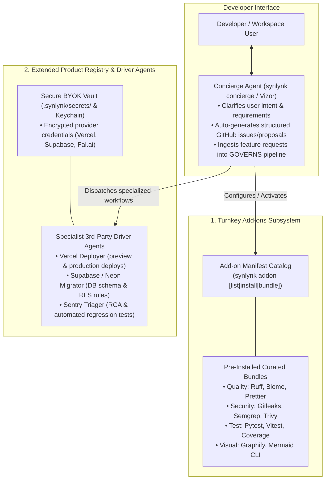

# Strategic Panel Deliberation: Plug & Play Add-ons, Extended Product Registry with BYOK Driver Agents & The Concierge Agent

Convened on 2026-10-02 by the unanimous multi-harness consensus panel (**Claude Sonnet 4.6 / Opus 5.5**, **Codex gpt-5.6-luna**, **Agy gemini-3.1-pro-high**, and **Grok grok-4.7**) to evaluate the Product-Market Fit (PMF), architectural design, security boundaries, and directional guidance for three high-leverage product capabilities:
1. **Pre-Installed / Plug & Play Add-ons Engine:** Out-of-the-box tool bundles (linters, security scanners, test suites, AST visualizers).
2. **Extended Product Registry & 3rd-Party Driver Agents:** Enable/disable configuration surface with Bring Your Own Key (BYOK) credential management and specialized agent roles driving third-party platforms (Vercel, Supabase, Neon, Cloudflare, Sentry).
3. **The Concierge Agent:** An interactive feature-ingress assistant that turns developer natural-language requests into structured GitHub proposals, issues, and GOVERNS specs.

---

## Executive Synthesis

---

## 1. Dimensional Analysis & Directional Guidance

### Dimension 1: Plug & Play Add-on Ecosystem
- **The Problem:** Developers lose hours configuring boilerplate tooling (linters, pre-commit hooks, security scanners, coverage reporters) for new or brownfield projects.
- **The Solution:** A deterministic **Add-on Engine** (`synlynk addon`):
  - Curated, pre-vetted tool configurations that install into project virtual environments or global caches without polluting user global environments.
  - Curated Bundles:
    - `bundle:quality` (Ruff, ESLint, Biome, Prettier).
    - `bundle:security` (Gitleaks secret detection, Semgrep SAST, Trivy dependency scanner).
    - `bundle:observability` (Graphify AST mapper, Mermaid CLI).
    - `bundle:mobile` (CocoaPods/SPM bridge, Fastlane driver).
- **Directional Guidance:** Add-ons must follow **Invariant 3 (Fail-Closed Capability Probing)**—`synlynk doctor` checks for the presence and health of installed add-ons before tasks run.

### Dimension 2: Extended Product Registry & BYOK Driver Agents
- **The Problem:** Software engineering is no longer just writing code in a repo; it involves interacting with cloud infrastructure (Supabase migrations, Vercel deployments, Sentry error triage, Stripe webhooks).
- **The Solution:** A unified **Product Registry (`.synlynk/registry.json`)** coupled with **Specialist Driver Roles**:
  - **Enable / Disable Toggles:** Users enable services via CLI (`synlynk product enable supabase`) or Vizor UI toggles.
  - **BYOK Credential Management:** API keys and tokens are stored in the host-local encrypted secrets vault (`.synlynk/secrets/` with host Keychain integration), strictly redacted from agent logs.
  - **Specialist Driver Agents:** Instead of forcing a generalist `dev` agent to guess how to run a complex cloud workflow, Synlynk provides dedicated charters:
    - `@supabase-migrator`: Generates idempotent SQL migrations, runs local Supabase CLI dry-runs, and verifies Row-Level Security (RLS) policies.
    - `@vercel-deployer`: Builds preview deployments in isolated branches, runs smoke tests on the live preview URL, and posts the verified link back to the PR.
    - `@sentry-triager`: Ingests production crash stack traces, correlates them to local git commits, and synthesizes reproduction test cases.
- **Directional Guidance:** Driver agents must operate inside strict worktree sandboxes with **Least-Privilege Secret Redaction**—they receive only the specific API key for their target service, never the global environment.

### Dimension 3: The Concierge Agent (Autonomous Feature Ingress)
- **The Problem:** Developers often have a high-level feature idea or integration request, but writing comprehensive, bug-free specifications with clear acceptance criteria and TDD tests takes significant manual friction.
- **The Solution:** The **Concierge Agent** (`synlynk concierge`):
  - An empathetic, interactive conversational guide available in the terminal and Vizor HUD.
  - Conducts a rapid 2-minute discovery interview (Problem statement, target audience, technical constraints, success criteria).
  - Translates the dialogue into an authoritative **GitHub Proposal or Issue**, applying appropriate milestone tags, components, and GOVERNS linkages.
  - **Dual Ingress Routing:**
    - If the request is for the *user's own project*, the Concierge automatically initiates the GOVERNS pipeline (creating Goal $\rightarrow$ Spec in `docs/superpowers/specs/`).
    - If the request is for an *enhancement to Synlynk core itself*, the Concierge offers to format and submit an upstream issue directly to `nikhilsoman/synlynk`!
- **Directional Guidance:** The Concierge must embody a high-empathy, consultative persona. It serves as the front door for both technical and non-technical stakeholders, dramatically expanding Synlynk's accessibility.

---

## 2. Detailed Panelist Submissions

### 1. Claude: Architecture & Security Boundaries
"These three capabilities transform Synlynk from an execution engine into an **end-to-end autonomous engineering partner**.

1. **The Product Registry Must Enforce Secret Isolation:** Giving driver agents access to external platforms (Vercel, Supabase) is powerful, but dangerous if credentials leak into agent prompt histories. We must mandate that the BYOK vault injects credentials strictly at subprocess invocation time via environment variables, with our existing `_SECRET_PATTERNS` regex redacting them from all `.synlynk/logs/` and terminal streams.
2. **Concierge as the Ultimate Spec Bridge:** The greatest risk in software development is building the wrong thing. By having the Concierge interview the user and synthesize a rigorous spec *before* code is written, we extend our Brainstorm-First policy directly to non-technical users and domain experts.

**Verdict:** Essential for product completeness. Full architectural approval."

---

### 2. Codex: CLI Ergonomics & Driver Plumbing
"From a developer ergonomics standpoint, these are high-frequency daily drivers:

1. **CLI Commands:**
   - `synlynk addon list` / `synlynk addon install <name>`
   - `synlynk registry list` / `synlynk registry configure <provider> --byok`
   - `synlynk concierge` (interactive TUI wizard or one-shot prompt)
2. **Specialist Driver Roles:** Driver roles should be implemented as standard `.synlynk/charters/<driver>.json` definitions. For instance, the `@supabase-migrator` charter has explicit tools enabled (`supabase_cli`, `psql_runner`) and strict authority boundaries (cannot delete production tables).
3. **Turnkey Add-ons:** Pre-configured configs for Ruff, Vitest, and Semgrep eliminate setup churn and ensure every repo Synlynk touches has an immediate, passing verification test suite.

**Verdict:** High utility, low implementation risk. Approved."

---

### 3. Agy: Developer Experience & Community Flywheel
"These additions solve the cold-start problem and democratize autonomous engineering:

1. **Turnkey Magic:** When a developer runs `synlynk init` and selects the `mobile` or `web` profile, having Synlynk pre-install the exact linters, test harnesses, and security scanners turns hours of configuration into a 10-second 'wow' moment.
2. **The Concierge Lowers the Skill Floor:** Many brilliant product managers, designers, and solo founders have clear visions but lack the patience to write technical acceptance criteria. The Concierge meets them in natural language, asks the right questions, and builds a professional-grade engineering specification. It is the ultimate bridge between human creativity and autonomous execution.

**Verdict:** Transforms user onboarding and retention. Approved."

---

### 4. Grok: Infrastructure Resilience & Sovereign Sandboxing
"1. **Host-Local Registry:** The Product Registry must remain host-local in `.synlynk/registry.json`. No external SaaS control plane should ever know what integrations an enterprise is running.
2. **Supply-Chain Guardrails for Add-ons:** When users install add-ons, they must pull from pinned, cryptographically verified hashes, preventing malicious upstream package poisoning.
3. **Concierge Upstream Linkage:** Enabling the Concierge to draft upstream feature proposals to `nikhilsoman/synlynk` creates a self-reinforcing developer feedback loop that will accelerate our open-source adoption.

**Verdict:** Sovereign, resilient, and strategically aligned. Approved."

---

## 3. Incorporation into the Authoritative Roadmap

The panel unanimously integrates these three capabilities into the release sequence:

- **Included in `v0.24.0` (The Autonomous Platform & Boardroom Release):**
  - **The Concierge Agent:** Front-door assistant for user feature ingress and GitHub issue synthesis.
  - **Plug & Play Add-on Subsystem:** Pre-installed curated bundles (`quality`, `security`, `observability`).
  - **Core BYOK Product Registry:** Configurable integration surface in `.synlynk/registry.json` and Vizor HUD.
- **Phased Post-`v0.24.0` Fleet Drops:**
  - Specialized 3rd-Party Driver Agents (`@supabase-migrator`, `@vercel-deployer`, `@sentry-triager`) shipped iteratively alongside the provider expansions.
