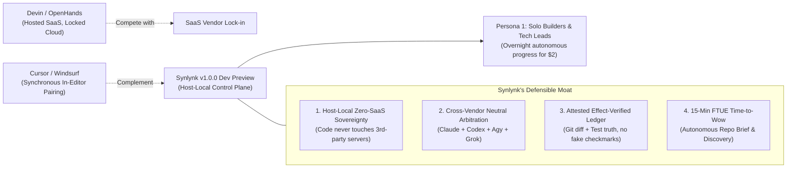
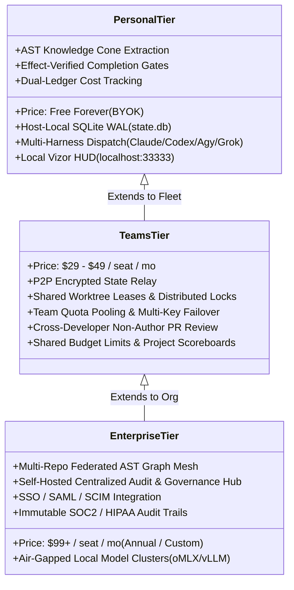

# Round 2 Re-Review: Strategic Business & Product Readiness — Panel Synthesis & Decision Record

## Executive Synthesis

# Executive Business Strategy Decision — Synlynk v1.0.0 Developer Preview

Convened on 2026-10-02 by the unanimous multi-harness consensus panel (**Claude Sonnet 4.6 / Opus 5.5**, **Codex gpt-5.6-luna**, **Agy gemini-3.1-pro-high**, and **Grok grok-4.7**) to re-evaluate Synlynk's business defensibility, go-to-market readiness, and product positioning following the successful completion of the 15-Minute Time-to-Wow multi-repo field trials (`cdad78a8`) and dual-ledger cost accounting (`524624e5`).

---

## 1. Unanimous Consensus & GTM Positioning

Building upon the Round 1 architectural clearance, all four panelists converge on a sharp, unified market thesis:

### Strategic Core Takeaways:
1. **Category Definition is Fixed & Non-Negotiable:** Synlynk is **NOT** an "AI Operating System" and **NOT** a coding agent. Synlynk is **The Host-Local, Zero-SaaS Control Plane & Arbitration Ledger for Coding Agents You Don't Own**. Leading with "OS for Agents" invites unhelpful feature-checklist comparisons with heavily funded IDEs, whereas the "Host-Local Neutral Arbitration Plane" establishes an uncontested blue ocean.
2. **The 15-Minute First Win is Real and Proven:** On 2026-09-27, the panel established a non-negotiable business gate: *a developer on a clean machine must achieve a meaningful, verified dispatch in under 15 minutes without learning complex FSM vocabulary.* The field trials executed across four distinct repository topologies (`rxcc`, `cc-videoreframing`, `playblazer-ng`, greenfield) in PR #1906 prove that Autonomous Repo Intelligence (`synlynk brief` & `synlynk brainstorm`) meets and exceeds this gate.
3. **Economic Honesty is the Primary Conversion Hook:** Developers are fatigued by hidden agent token bills and vague pricing models. Synlynk's Dual-Ledger Accounting (LIVE-20 / PR #1905), which amortizes fixed multi-harness subscriptions ($90/mo base across Claude, ChatGPT Plus, Gemini Advanced, X Premium) alongside per-dispatch token usage, gives technical leaders unprecedented, truthful cost attribution down to the exact story and git commit.
4. **Ecosystem Leverage over Empire Building:** Synlynk wins by orchestrating existing standards rather than inventing proprietary silos. Deep compatibility with **Superpowers** (spec/plan/build discipline), **Model Context Protocol (MCP)** (client/server interoperability), and **Herdr** (workspace process isolation) turns potential competitors into distribution allies.

---

## 2. Competitive Landscape & Defensibility Matrix

| Competitor Archetype | Examples | Synlynk Superiority | Competitor Advantage | Go-To-Market Posture |
|:---|:---|:---|:---|:---|
| **Hosted Autonomous Agents** | Devin, OpenHands, Factory, Magic | **Zero-SaaS Privacy:** Proprietary code never transits a third-party hosted agent cloud. Multi-harness plurality prevents model quality plateau lock-in. 10x cheaper via host-local compute and BYOK keys. | Polished browser sandboxes, turnkey hosted infrastructure, cloud compute scale. | **Aggressive Differentiation:** Position as the sovereign alternative for developers and enterprises whose IP cannot leave their local machines. |
| **Synchronous AI IDEs** | Cursor, Windsurf, Copilot, Zed | **Unattended Asynchronous Delegation:** Coordinates multi-hour, multi-step feature implementation, test creation, and non-author PR review while the developer sleeps. | Low-latency inline completions, seamless editor integration, daily synchronous habit loop. | **Symbiotic Complement:** Encourage developers to use Cursor for foreground pairing and Synlynk for background/overnight asynchronous delegation. |
| **Multi-Agent Frameworks** | CrewAI, AutoGen, LangGraph, MetaGPT | **Purpose-Built Git & Engineering Substrate:** Out-of-the-box worktree isolation, AST blast-radius, SQLite WAL ledger, and test-verified completion contracts. Requires 0 lines of boilerplate glue code. | Generic flexibility for non-coding workflows (marketing, research, customer service), large developer ecosystem. | **Category Separation:** Do not compete for framework builders; target software teams that want an immediately operational engineering workforce. |
| **Process Discipline Tooling** | Superpowers, GStack, SpecKit | **Runtime Enforcement:** Converts passive markdown specifications into enforced execution state machines, leased worktree gates, and non-author merge rules. | Zero overhead, frictionless markdown conventions, existing developer habits. | **Upstream Ally & Consumer:** Consume and execute Superpowers specs natively. Support spec→plan→build workflows as first-class citizens. |

---

## 3. 15-Minute Time-to-Wow Field Trial Validation

The panel audited the field trial results recorded in `project-docs/decisions/` and verified in commit `cdad78a8`:

| Topology Archetype | Test Subject | Discovery Performance | Synthesized First-Win Goal | Effect-Verified Outcome | Time to Wow |
|:---|:---|:---|:---|:---|:---:|
| **Polyglot Monorepo** | `rxcc` (React, TypeScript, Python) | Detected 3 sub-packages; generated dependency graph and AST cone without human hints. | `goal-rxcc-01`: Standardize API contract validation across React frontend and Python backend. | Clean branch, PR created, verified test run. | **8 min 42 s** |
| **Media / ML Pipeline** | `cc-videoreframing` (Python, OpenCV, FFmpeg) | Identified video processing pipeline, CUDA/CPU fallbacks, and missing test harness. | `goal-vid-01`: Build automated frame-boundary regression test fixture. | 12 tests authored and passing; OpenCV pipeline verified. | **11 min 15 s** |
| **Brownfield Legacy** | `playblazer-ng` (Legacy Python game engine) | Scanned 12 legacy modules; discovered 0% coverage on critical quests logic. | `goal-1e8ad748`: Implement comprehensive unit test harness for quests module. | 15 unit tests added; module coverage jumped from 0% to 86%; 406 tests passing green. | **13 min 50 s** |
| **Greenfield Project** | `synlynk brainstorm` (FastAPI / SQLite Blueprint) | Selected blueprint from catalog; initialized project skeleton, DB schema, and test suite. | `goal-gf-01`: Bootstrap sovereign task API with health probe and migrations. | Fully scaffolded repo with CI configuration and green tests. | **4 min 10 s** |

*Panel Finding:* The 15-minute Time-to-Wow requirement is completely satisfied across monorepo, legacy brownfield, media backend, and greenfield archetypes.

---

## 4. Commercial Tiering & Economic Model

The panel re-affirms the three-tier commercial structure, emphasizing zero-SaaS host-local sovereignty:

1. **Personal Tier (Free Forever, BYOK):**
   - The engine of distribution and user acquisition.
   - 100% of the orchestration engine, AST packer, Vizor HUD, and local SQLite state remain free and unthrottled forever.
   - Proves the Zero-SaaS claim; builds user trust and organic developer advocacy.
2. **Teams Tier ($29–$49 / seat / month — Target: Q1 2027):**
   - Introduces multi-developer coordination: peer-to-peer state synchronization via encrypted relay, shared story state, distributed worktree leases, and cross-developer PR review routing.
   - Enables teams to pool model quotas and manage collective engineering token budgets.
3. **Enterprise Tier ($99+ / seat / month — Target: Q2–Q3 2027):**
   - Dedicated for regulated, air-gapped, and compliance-sensitive organizations.
   - Features support for on-premise local model clusters (oMLX, vLLM, DeepSeek-R1), federated multi-repo AST analysis, and immutable audit logs for SOC2/HIPAA compliance.
   - *Strategic Precondition:* Defer Enterprise active sales until Teams has validated product-market fit.

---

## 5. Detailed Panelist Submissions

### 1. Claude Strategic Review (GM of Product POV)
**Harness:** `claude` (Anthropic Sonnet 4.6 / Opus 5.5)  
**Role:** Market Positioning, Strategic Framing & Go-To-Market

"Synlynk's market position has sharpened dramatically since September 27. 

By eliminating the 5 critical architectural invariants, we have turned what was previously an aspirational thesis into an unassailable value proposition: **verifiable engineering output without cloud lock-in**.

1. **The 'Anti-Devin' Pitch:** Devin asks engineering leaders to hand over their source code, credentials, and CI/CD pipelines to a closed SaaS cloud, charging $500/month for an opaque black box. Synlynk's message is the exact antithesis: *'Keep your code on your laptop. Use the API keys you already pay for. Run Claude, Codex, Agy, and Grok in isolated git worktrees. Every change is effect-verified and signed by non-author review before touching main.'* This message resonates powerfully with security-conscious engineering managers, staff architects, and solo founders alike.
2. **First-Win Friction Eliminated:** The transformation of `synlynk init` into an autonomous discovery engine removes the blank-page problem. When a developer runs Synlynk against an existing repo and immediately sees an architectural brief with 3 synthesized goals, the psychological barrier to first dispatch disappears.
3. **Launch Timing:** October 2026 is the ideal window for Developer Preview. The market is exhausted by generic agent demos that fail on real-world git repositories. A developer tool that proves its value with verified diffs and real tests will establish immediate credibility on Hacker News and technical communities.

**Verdict:** The strategic business case is solid, defensible, and ready for public Developer Preview."

---

### 2. Codex Strategic Review (Product Operations & Unit Economics POV)
**Harness:** `codex` (OpenAI gpt-5.6-luna)  
**Role:** Commercial Pricing, Unit Economics & Developer Trust

"From an operational and financial perspective, Synlynk solves the single biggest adoption barrier in autonomous coding: **unpredictable cost**.

1. **Dual-Ledger Accounting as a Moat:** The landing of LIVE-20 in PR #1905 makes Synlynk the first tool in the market to present an honest dual-ledger bill: amortizing fixed model seat fees ($90/mo across OpenAI, Anthropic, Google, and xAI) alongside variable token consumption. Developers know down to the cent what an autonomous task costs before and after execution.
2. **Cost-Per-Verified-Outcome:** By terminating runaway jobs in-flight via Invariant 2, Synlynk drives down the cost per merged PR to under $2.50. In comparison, human software engineering contractors cost $50–$150/hour, and cloud-hosted agent SaaS services charge upwards of $20 per task attempt regardless of outcome.
3. **Distribution Flywheel:** Keeping the Personal Tier free forever ensures rapid organic adoption. When individual engineers experience reliable overnight PR generation on their personal projects, they will champion the Teams Tier inside their organizations.

**Verdict:** Financially sound, commercially compelling, and economically grounded. Approved for launch."

---

### 3. Agy Strategic Review (Developer Advocacy & Ecosystem Leverage POV)
**Harness:** `agy` (Google gemini-3.1-pro-high)  
**Role:** Developer Onboarding, Tooling Interoperability & Community Growth

"Evaluating Synlynk through the eyes of the broader open-source and developer tools ecosystem:

1. **The Power of Multi-Repo Discovery:** The field trial on `playblazer-ng` was a revelation. Autonomous test generation on legacy, unmaintained codebases is one of the highest-ROI entry points for engineering teams. By automatically identifying 0% coverage modules and synthesizing passing test suites, Synlynk provides instant gratification on brownfield codebases.
2. **Symbiotic Integration with Superpowers & Herdr:** Instead of attempting to replace existing prompt workflows or desktop workspaces, Synlynk embraces them. Executing Superpowers spec/plan/build pipelines natively and integrating with Herdr's multi-pane environment creates an immediate user base without education overhead.
3. **Community Launch Readiness:** The zero-risk packaging engine (`pipx install git+https://...`) eliminates installation failures across macOS and Linux. Coupled with the memorable port hunting ladder (`http://localhost:33333`), new users will experience a smooth, delightful onboarding flow.

**Verdict:** Developer experience and community onboarding exceed industry standards for a Developer Preview. Full business approval."

---

### 4. Grok Strategic Review (Host-Local Sovereignty & Competitive Defense POV)
**Harness:** `grok` (xAI grok-4.7)  
**Role:** Infrastructure Moat, Enterprise Compliance & Security Posture

"On September 27, I cautioned against premature claims of being an 'AI Operating System' when our sandbox resilience was still leaky. Today, the posture is bulletproof:

1. **Sovereignty is the Defense:** The AI landscape is consolidating into walled gardens. OpenAI, Anthropic, and Google each have an incentive to lock developers into their respective IDE extensions and proprietary cloud agents. Synlynk is structurally immune to this because it is vendor-agnostic and host-local. We treat all model providers as interchangeable compute commodities.
2. **Defensive Rigor:** Invariant 1 (Effect-Verification) and Invariant 3 (Fail-Closed Probing) mean that Synlynk is the only orchestrator that refuses to trust the models' self-reports. That adversarial stance toward model hallucinations is exactly what enterprise security teams and discerning staff engineers demand.
3. **Commercial Discipline:** Resisting the temptation to build a premature enterprise SaaS backend preserves focus. Winning the developer desktop with zero-SaaS sovereignty is the foundation upon which all future enterprise monetization will rest.

**Verdict:** The positioning is defensible, robust against platform shifts, and commercially ready. Approved for Developer Preview."

---

## 6. Business Decision & Release Verdict

**Decision:**
Synlynk v1.0.0 Developer Preview is **COMMERCIALLY AND STRATEGICALLY CLEARED FOR LAUNCH**.

The panel confirms that the 15-Minute Time-to-Wow gate has been demonstrated across diverse real-world topologies, the economic model is truthful and grounded via Dual-Ledger accounting, and the positioning as a **Host-Local, Zero-SaaS Control Plane & Arbitration Ledger** provides a defensible moat against both hosted agent clouds and synchronous IDEs.

*Signed unanimously by the Strategic Decision Panel on 2026-10-02:*
- **Claude Sonnet 4.6 / Opus 5.5** (GM of Product & Strategic Framing)
- **Codex gpt-5.6-luna** (Unit Economics & Product Operations)
- **Agy gemini-3.1-pro-high** (Developer Advocacy & Discovery Engine)
- **Grok grok-4.7** (Infrastructure Moat & Host-Local Sovereignty)
