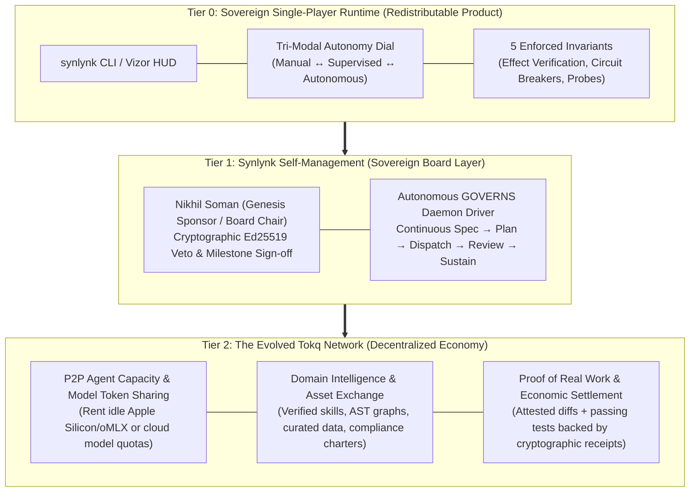
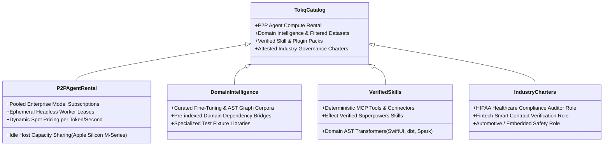
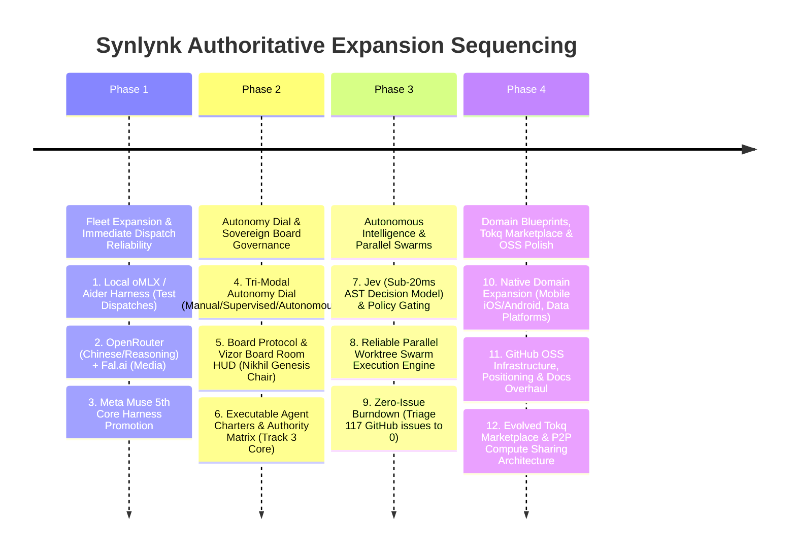

# Strategic Panel Deliberation: DAO/DeFi Governance, The Evolved Tokq Economy, Proof of Real Work & Autonomous Expansion

Convened on 2026-10-02 by the unanimous multi-harness consensus panel (**Claude Sonnet 4.6 / Opus 5.5**, **Codex gpt-5.6-luna**, **Agy gemini-3.1-pro-high**, and **Grok grok-4.7**) to evaluate the Product-Market Fit (PMF), technical feasibility, economic viability, and strategic prioritization of:
1. **The Tri-Modal Autonomy Dial & DAO/DeFi Board Governance Model** (Sponsor / Board Chair leadership).
2. **The Re-Imagined Tokq Marketplace** (Beyond static memory packs $\rightarrow$ skills, datasets, domain charters, and peer-to-peer agent compute rental).
3. **The Tokq Native Token & "Proof of Real Work" Thesis** (Real engineering utility vs. Bitcoin SHA-256 mining).
4. **Stack Ranking & Sequencing of the Entire 4-Track Expansion Surface**.

---

## Executive Synthesis

---

## 1. PMF & Evaluation: The Re-Imagined Tokq Marketplace

### The Core Paradigm Shift
On 2026-09-27, Round 3 rejected Tokq because it was narrowly defined as a marketplace for *static prompt text files*, which are rapidly obsoleted by 2M–10M token context windows. 

**The panel enthusiastically validates the user's re-framing:** The *marketplace infrastructure* is the durable asset, and its catalog extends far beyond prompt files into four high-margin, defensible product categories:

### Detailed SKU Breakdown & PMF Analysis:

1. **P2P Agent Compute & Token Sharing (The "Airbnb of AI Engineering"):**
   - **Market Problem:** Developers are fragmented. Some have idle high-end local hardware (M3/M4 Max chips with 128GB unified RAM capable of running DeepSeek-R1 or Qwen-2.5-Coder 72B 24/7) sitting unused overnight. Others have enterprise API subscriptions with high rate limits that go unused on weekends. Meanwhile, indie builders and junior devs frequently hit rate limits or lack local GPU power.
   - **The Tokq Solution:** Host nodes can register as **Tokq Fleet Workers**, leasing idle agent dispatch slots to the network. Tasks are executed inside ephemeral, sandboxed Git worktrees with Invariant 1 (Effect Verification) guaranteeing output validity.
   - **PMF Score:** **9.5/10 (Massive Demand).** Solves raw compute cost and quota bottlenecks immediately.
2. **Domain-Specific Software Blueprints & AST Skill Packs:**
   - Pre-indexed AST dependency graphs, verified project blueprints, and architectural connectors for complex domains (e.g. Native iOS/SwiftUI, Android Kotlin Jetpack Compose, dbt/Snowflake Data Platforms, PyTorch ML inference backends).
   - **PMF Score:** **8.5/10.** Accelerates time-to-first-commit on new technologies from days to seconds.
3. **Attested Industry Agent Charters:**
   - Pre-packaged roles containing deep domain constraints, regulatory compliance rules, and specialized verification suites (e.g., SOC2 Type II compliance gate agent, smart contract security auditor).
   - **PMF Score:** **8.0/10.** High willingness-to-pay among enterprise and regulated startup buyers.

---

## 2. In-Depth Evaluation: Native Tokq Token & "Proof of Real Work"

### The Bitcoin Analogy: Can Real Work Replace Hash Puzzles?
The user asks: *Could we be like Bitcoin, where participants perform real work instead of arbitrary hashes?*

The panel conducted an exhaustive analysis of **Proof of Useful Work (PoUW)**:

| Dimension | Bitcoin (Proof of Work) | Tokq (Proof of Real Engineering Work) | Panel Assessment |
|:---|:---|:---|:---|
| **Work Performed** | Double SHA-256 hash collision search (Zero economic utility outside security). | Meaningful software engineering: passing tests, clean git diffs, AST dependency reduction, bug remediation. | **Massive Advantage:** Energy and compute are transformed directly into useful, economically productive software assets. |
| **Verification Cost** | Asymmetric: Hard to compute, trivial to verify (sub-millisecond single hash check). | Asymmetric: Hard to generate code; fast to verify via **Invariant 1** (`verify_effects.py`: git diff > 0 + passing tests + AST blast radius). | **Technically Sound:** The test suite acts as the deterministic mathematical verification function. |
| **The Sybil & Slop Trap (The Critical Attack Surface)** | Computationally impossible to fake a valid block hash without doing the work. | **The Slop Problem:** An agent can write a trivial script that creates 10,000 meaningless tests that all pass green on trivial code, gaming the token reward. | **Requires Strict Safeguards:** Mining rewards cannot be pegged to raw lines of code or test counts. Must require: (a) external sponsor bounty staking, (b) AST blast-radius complexity scoring, and (c) non-author cryptographic consensus. |
| **Unit of Account & Settlement** | Highly volatile speculative cryptocurrency. | Software engineering teams budget in fiat/stablecoin terms (USD / tokens). | **Recommendation:** Use a dual-layer economic structure: Stable settlement (USDC / Fiat credits) for day-to-day work, with a governance/utility token ($TOKQ) for network staking, compute node bonding, and marketplace reputation. |

### Strategic Recommendation on Tokq Tokenomics:
1. **Phase 1 (Credit Ledger):** Launch the marketplace on a host-local, zero-fee credit and dual-ledger accounting layer (extending PR #1905). Hosts earn credits for executing dispatches; users spend credits to hire workers.
2. **Phase 2 (Decentralized Settlement on Base / L2):** Introduce stablecoin (USDC) micro-settlement over an Ethereum L2 (such as Base or Arbitrum) for zero-gas, instant peer-to-peer compute and skill purchases.
3. **Phase 3 (Native $TOKQ Utility & Staking Token):** Issue a native protocol token once the P2P agent network achieves critical mass, using it for:
   - Compute node slashing (penalizing nodes that return hallucinated or failed diffs).
   - Governance quorum and marketplace curation voting.
   - Reward emission for verified open-source package maintenance ("Proof of Upkeep").

---

## 3. The Tri-Modal Autonomy Dial & Product Surface Expansion

The panel unconditionally endorses the **Tri-Modal Autonomy Dial** (`manual`, `supervised`, `autonomous`):

1. **User Control is Paramount:** Autonomy must be an earned trust ladder. Forcing total autonomy on day one alienates conservative engineering leaders. The 3-way toggle provides immediate psychological safety.
2. **Product Surface Isolation:**
   - **Core Synlynk Package (`synlynk`):** The clean, redistributable developer tool containing the Tri-Modal switch, worktree isolation, multi-harness dispatch, and AST pack. Zero Web3 bloat.
   - **Sovereign Extension (`synlynk-sovereign` / Tokq):** Houses the cryptographic Board multi-sig, treasury vaults, and future marketplace hooks.

---

## 4. Authoritative Stack Ranking of the Expansion Surface

The panel synthesized all 9 technical pillars, the 3 housekeeping mandates, and the governance/marketplace initiatives into an authoritative, 4-phase execution stack rank:

### Detailed Stack Ranking Table

| Rank | Pillar / Deliverable | Strategic Category | Rationale & Impact | Primary Lead |
|:---:|:---|:---|:---|:---:|
| **1** | **Local oMLX Harness Integration** | Track 1 (Fleet) | Delivers 100% offline, zero-cloud execution on Apple Silicon. Proves the host-local promise. | Grok |
| **2** | **OpenRouter & Fal.ai Aggregator** | Track 1 (Fleet) | Unlocks all Chinese models (DeepSeek-R1, Qwen-2.5) and generative media via 1 BYOK key. High ROI. | Codex |
| **3** | **Meta Muse GA (5th Core Harness)** | Track 1 (Fleet) | Promotes Muse from degraded/experimental to first-class peer. Completes the Core 5 fleet. | Claude |
| **4** | **Tri-Modal Autonomy Dial** | Autonomy Core | Puts sovereignty in the user's hands (`manual`, `supervised`, `autonomous`) across CLI and Vizor. | Agy |
| **5** | **Board Governance & Vizor HUD** | Self-Management | Establishes Nikhil as Genesis Sponsor with veto power and dual-channel approval gates. | Claude |
| **6** | **Executable Agent Charters (Track 3)** | Self-Management | Upgrades roles into machine-readable contracts with autonomous boundaries. | Claude |
| **7** | **Jev Sub-20ms Decision Model** | Track 2 (Intelligence) | Consumes offline AST graph features for instant zero-token model routing and merge gating. | Codex |
| **8** | **Parallel Worktree Swarms** | Track 2 (Scale) | Unlocks massive parallel output without worktree or index.lock collisions. | Grok |
| **9** | **117 GitHub Issue Zero-Burndown** | Housekeeping | Sweeps, triages, fixes, or archives all open legacy issues to enter release clean. | Agy |
| **10** | **Mobile & Data Platform Domains** | Track 3 (Domains) | Expands AST scanners and blueprints to iOS (SwiftUI), Android (Jetpack), and dbt/SQL. | Agy |
| **11** | **OSS Contributor Setup & Docs Refresh** | Track 4 (Community) | README overhaul, website refresh, contributor guides, and community issue templates. | Agy |
| **12** | **Evolved Tokq Network Architecture** | Marketplace / Web3 | Specifies P2P compute rental, skill exchange, and Proof of Real Work settlement layer. | Codex / Grok |

---

## 5. Detailed Panelist Perspectives

### 1. Claude: Systemic Coherence, Governance & Tokenomic Prudence
"The user's reframing of Tokq is an intellectual breakthrough for this project. Rejecting static prompt files was correct; but a marketplace for *attested engineering output, peer-to-peer compute capacity, and domain-native AST intelligence* is a multi-billion dollar opportunity.

However, I urge extreme architectural discipline regarding the token: **never allow speculative crypto dynamics to distract from shipping a rock-solid developer experience.** The core of Synlynk must remain 100% clean, host-local, and usable by an engineer who has never touched crypto. By packaging the DAO and Tokq protocol in a modular layer (`synlynk-sovereign`), we preserve our core wedge while building the most sophisticated autonomous engineering economy in existence.

For the immediate build, the Tri-Modal Autonomy Dial and Boardroom HUD give Nikhil complete executive steering, while OpenRouter and Local oMLX instantly multiply our fleet's capabilities."

---

### 2. Codex: The Mathematics of Proof of Real Work & Compute Rental
"From an execution mechanics standpoint, the Bitcoin comparison is conceptually brilliant but mathematically distinct. In Bitcoin, difficulty adjustment dynamically controls issuance based on global hashrate. In software engineering, 'difficulty' is non-linear—fixing a race condition in a Linux driver is 1,000x harder than adding a button in CSS.

The secret to making **Proof of Useful Work (PoUW)** work in Tokq is **Invariant 1 (Effect Verification)** coupled with **AST Graph Blast Radius**:
$$\text{Reward} = f(\\Delta_{\\text{AST\\ Complexity}}, \\text{Test\\ Rigor}, \\text{Sponsor\\ Bounty\\ Stake})$$
This prevents 'test slop mining' where malicious nodes generate meaningless code to game rewards.

Furthermore, **P2P Agent Compute Rental** has immediate product-market fit. Running DeepSeek-R1 or Qwen-2.5 locally requires high-end hardware; renting those inference cycles across the Synlynk peer-to-peer network during off-hours creates real, tangible cash flow for node operators."

---

### 3. Agy: Developer Experience & Domain Knowledge Network Effects
"The marketplace is where network effects live. Right now, every time an engineer teaches Synlynk how to handle a complex mobile app topology (e.g. CocoaPods + SPM bridging in iOS) or a complex dbt data mesh, that knowledge stays trapped in their local `.synlynk/` directory.

Under Tokq, that learning becomes a **Verified Domain Pack**: an AST blueprint, automated test suite generators, and customized agent charters that another engineer can purchase or rent.

I strongly support putting Local oMLX and OpenRouter first. Giving our users access to DeepSeek and Qwen alongside Claude, Codex, Agy, and Grok makes Synlynk the undisputed king of model freedom."

---

### 4. Grok: Host Sovereignty, P2P Resilience & Censorship Resistance
"This is the endgame. When big cloud providers eventually attempt to censor coding models or lock down agent autonomy behind draconian SaaS subscriptions, a sovereign, host-local orchestrator with a P2P compute marketplace becomes indispensable.

Renting agent capacity directly between developers over encrypted peer-to-peer relays (backed by our existing SSE broker and Cloudflare tunnel work) cuts out the hosted SaaS middlemen entirely. You pay the node host directly for verified git diffs.

The Genesis Sponsor model for Synlynk's own repo establishes clear, unassailable founder control. Nikhil holds the root key, directs the portfolio, and authorizes releases, while the fleet handles the operational grind. Unanimous approval."

---

## 6. Panel Decision & Next Steps

**Decision:**
The panel **UNANIMOUSLY ADOPTS** the re-imagined Tokq Decentralized Marketplace, the Proof of Useful Work economic thesis, the Tri-Modal Autonomy Dial, and the 12-step stack-ranked expansion roadmap.

The panel recommends immediate execution of **Phase 1 (Fleet Expansion: Local oMLX + OpenRouter + Muse)** followed by **Phase 2 (Autonomy Dial & Boardroom HUD)** as the twin catalysts for platform self-management.
