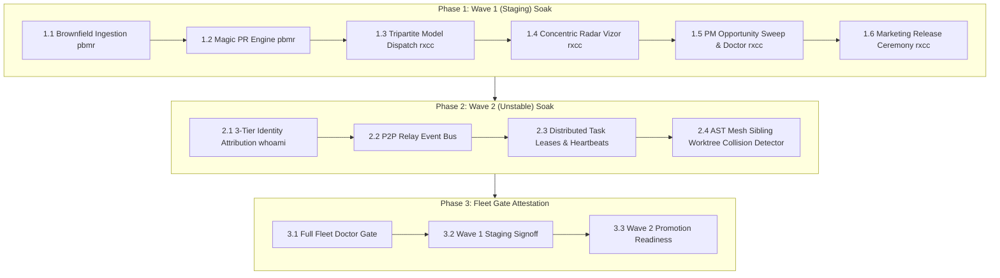

# 🧪 Synlynk Wave 1 & Wave 2 Fleet Soak Test & Upgrade Plan

> **Release Topology Alignment:**  
> • **`staging` Track (Wave 1 v1.0.0 Dev Preview):** Commit `19fcd5ba`  
> • **`unstable` Track (Wave 2 v1.1.0-dev P2P Relay Mesh):** Commit `0efc4527`  
> • **Soak Gate Policy:** All Wave 3 & 4 new feature work is on hold until Wave 1 (Staging) and Wave 2 (Dev) are validated across real workspaces.

---

## 🎯 Target Workspace Allocations

| Workspace Path | Project Type | Soak Test Objectives |
| :--- | :--- | :--- |
| **`/Users/nikhilsoman/dev/pbmr`** | Unmanaged Brownfield | **Wave 1 Validation:** `synlynk init --brownfield` reverse-engineering & `synlynk heal --magic` first-win PR |
| **`/Users/nikhilsoman/dev/rxcc`** | Large Monorepo (Next.js/Turborepo) | **Wave 1 & 2 Validation:** Concentric Radar SVG (W4 Vizor), PM Sweeps, 3-Tier Identity Attribution, AST Mesh conflict detector |
| **`/Users/nikhilsoman/dev/synlynk`** | Platform Orchestrator | **Wave 2 Validation:** P2P Relay Event Bus (WS/NATS), Distributed Task Leases, Sibling Worktree AST Preemption |

---

## 📋 Step-by-Step Soak Test Protocol



---

### 🧪 Phase 1: Wave 1 (Staging v1.0.0) Soak Protocol

#### Step 1.1: Deep Brownfield Ingestion on `pbmr`
Run inside `/Users/nikhilsoman/dev/pbmr`:
```bash
cd /Users/nikhilsoman/dev/pbmr
synlynk init --brownfield --json
```
**Verification Points:**
- [ ] Automatically detects package manager (`pnpm` / `npm`), test runners, and linters.
- [ ] Generates living directive files (`GEMINI.md`, `CLAUDE.md`, `AGENTS.md`) and `/project-docs/`.
- [ ] Synthesizes initial `state.db` without crashing or manual prompt requirements.

#### Step 1.2: Magic PR Engine on `pbmr`
Run inside `/Users/nikhilsoman/dev/pbmr`:
```bash
synlynk heal --magic --dry-run
synlynk heal --magic
```
**Verification Points:**
- [ ] Discovers first high-confidence parity gap in < 5 minutes.
- [ ] Generates an isolated worktree branch (`fix/magic-...`).
- [ ] Creates reproduction test, implements surgical fix, and prepares green PR.

#### Step 1.3: Tripartite Model Dispatch & AST Impact on `rxcc`
Run inside `/Users/nikhilsoman/dev/rxcc`:
```bash
cd /Users/nikhilsoman/dev/rxcc
synlynk impact <core_symbol_or_file> --depth 5
synlynk dispatch --model-tier reasoning --dry-run
synlynk dispatch --model-tier fast --dry-run
```
**Verification Points:**
- [ ] `synlynk impact` traverses upstream callers, downstream callees, and associated test files.
- [ ] `--model-tier reasoning` selects high-reasoning models (Claude Sonnet / GPT-4o / Pro) for high blast-radius symbols.
- [ ] `--model-tier fast` selects low-latency models (Gemini Flash / Flash-Lite / Codex) for leaf-node edits.

#### Step 1.4: Concentric Radar UI & World View on `rxcc`
Run inside `/Users/nikhilsoman/dev/rxcc`:
```bash
synlynk viz --export-svg .synlynk/radar_view.svg
open http://localhost:8765 # or view exported SVG
```
**Verification Points:**
- [ ] Concentric Radar displays 4 concentric layers: Ring 0 (Core), Ring 1 (Product), Ring 2 (Fleet), Ring 3 (Ecosystem).
- [ ] Dual-view toggle switches seamlessly between Circular Radar and Horizontal Sequence Flow.

#### Step 1.5: PM Opportunity Sweep & Fleet Doctor on `rxcc`
Run inside `/Users/nikhilsoman/dev/rxcc`:
```bash
synlynk pm sweep --ecosystem
synlynk doctor --readiness
```
**Verification Points:**
- [ ] `synlynk pm sweep` extracts market/competitor gaps and appends structured opportunities to `project-docs/decisions/`.
- [ ] `synlynk doctor --readiness` validates 4-point readiness checklist (State DB, zero Sev1 alerts, doc links, test matrix).

---

### 🧪 Phase 2: Wave 2 (Unstable/Dev v1.1.0-dev) Soak Protocol

#### Step 2.1: 3-Tier Identity Attribution Protocol
Run inside `/Users/nikhilsoman/dev/rxcc` and `/Users/nikhilsoman/dev/synlynk`:
```bash
synlynk whoami
synlynk whoami --json
synlynk identity whoami --role architect --harness codex
```
**Verification Points:**
- [ ] Outputs canonical triplet tag `<@nikhilsoman, dev, agy>` (or overridden role/harness).
- [ ] Generates compliant git trailers:
  - `Co-Authored-By: AGY <noreply@antigravity.dev>`
  - `Attributed-To: @nikhilsoman <dev/agy>`

#### Step 2.2: P2P Relay Event Bus (WebSocket / NATS)
Run inside `/Users/nikhilsoman/dev/synlynk`:
```bash
# Check Relay Broker Status
synlynk relay status

# Register P2P Mesh Peer
synlynk relay peer add ws://localhost:8765

# Broadcast Event
synlynk relay send --type story.claimed --payload '{"story_id": "story-soak-001", "operator": "nikhil"}'

# Tail Event Stream
synlynk relay tail --limit 5
```
**Verification Points:**
- [ ] RFC 6455 framing and NATS protocol formatting execute cleanly without network deadlocks.
- [ ] Event deduplication and loop suppression drop duplicate envelopes across peers.

#### Step 2.3: Distributed Task Leases & Heartbeat Un-stranding
Run inside `/Users/nikhilsoman/dev/synlynk`:
```bash
# Verify Task Leases Schema & Heartbeats
python3 -c "
from synlynk.jobs import acquire_task_lease, renew_task_lease, get_active_lease, release_task_lease
lease = acquire_task_lease('story-soak-test', 'nikhil', duration_seconds=5)
print('Acquired lease:', lease)
assert get_active_lease('story-soak-test') is not None
release_task_lease(lease['lease_id'])
print('Released lease cleanly.')
"
synlynk story reclaim
```
**Verification Points:**
- [ ] `task_leases` table in `state.db` handles concurrent lock acquisition without SQLite locks contention.
- [ ] `synlynk story reclaim` safely detects and frees expired leases without manual state corruption.

#### Step 2.4: AST Mesh Sibling Worktree Conflict Preemption
Run inside `/Users/nikhilsoman/dev/synlynk` (across active worktrees):
```bash
synlynk mesh --conflicts
synlynk mesh --conflicts --json
```
**Verification Points:**
- [ ] Inspects all active sibling worktrees in parallel.
- [ ] Parses unified diff line ranges and maps changes to fine-grained AST functions, classes, and methods (`Class.method`).
- [ ] Correctly flags `CRITICAL` when two worktrees modify the same AST symbol vs `INFO` when edits are in disjoint symbols of the same file.

---

## 🚦 Exit Criteria for Soak Gate

1. **Phase 1 (Wave 1) Green Attestation:** Zero regressions on `pbmr` and `rxcc`.
2. **Phase 2 (Wave 2) Green Attestation:** Zero deadlocks or race conditions on P2P Relay, Leases, and AST Mesh preemption.
3. **Multi-Track Promotion:**
   - Once Phase 1 is verified: `staging` -> tagged `v1.0.0-rc1` / promoted to `main`.
   - Once Phase 2 is verified: `unstable` -> promoted to `staging` as `v1.1.0-preview`.
